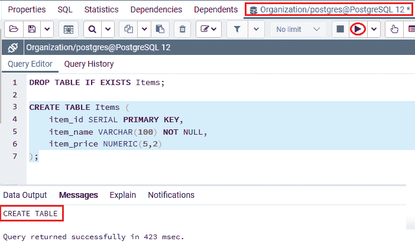
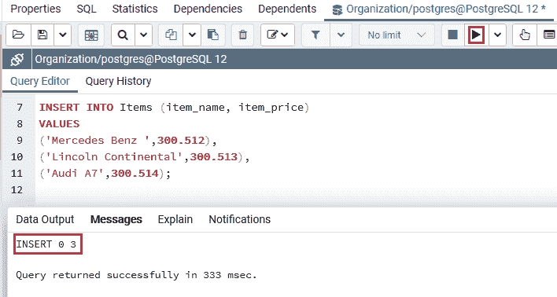
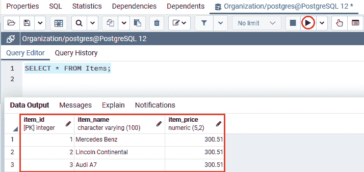
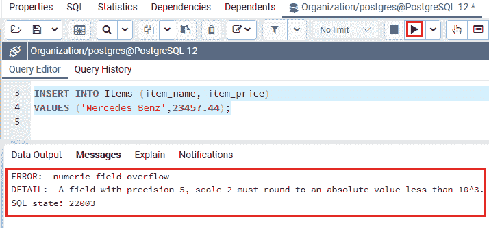
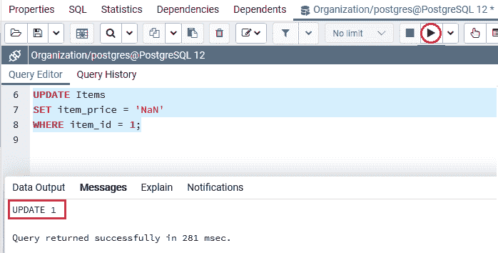
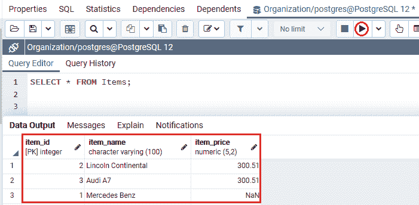
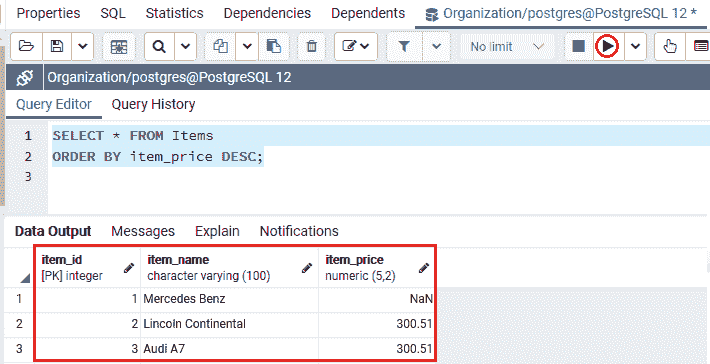

# 后缀 SQL 数字

> 原文：<https://www.javatpoint.com/postgresql-numeric>

在这一节中，我们将了解 **PostgreSQL 数值数据类型的工作方式，**允许我们存储数值数据。我们也可以看到**数字数据类型**的**示例**。

## 什么是 PostgreSQL 数值数据类型？

在 [PostgreSQL](https://www.javatpoint.com/postgresql-tutorial) 中，**数字数据类型**用于**存储各种有效位数的数字**。换句话说，我们可以说 PostgreSQL Numeric [数据类型](https://www.javatpoint.com/postgresql-datatypes)用于将数值数据指定到表中，表中需要数量或货币金额的地方需要精度。

数字数据类型包含以下内容:

*   **四字节和八字节浮点数**
*   **两字节、四字节和八字节整数**
*   **可选精度小数**。

下表包含 PostgreSQL 中支持的所有**数值数据类型**:

| 名字 | 存储大小 | 范围 | 描述 |
| 斯莫列特 | 2 字节 | -32768 至+32767 | 存储整数，小范围。 |
| 整数 | 4 字节 | -2147483648 到+2147483647 | 存储整数当您想要存储典型的整数时，可以使用它。 |
| 比吉斯本 | 8 字节 | -922337203685 . 4775808 到 922337 . 477788861 | 存储整数，大范围。 |
| 小数 | 可变的 | 小数点前最多 131072 位数字；小数点后最多 16383 位。 | 用户指定的精确精度 |
| 数字的 | 可变的 | 小数点前最多 131072 位数字；小数点后最多 16383 位。 | 用户指定的精确精度 |
| 真实的 | 4 字节 | 6 位小数精度。 | 可变精度，不精确 |
| 双倍精密度 | 8 字节 | 15 位小数精度 | 可变精度，不精确 |
| 连续的 | 4 字节 | 1 至 2147483647 | 自动递增整数 |
| 大系列 | 8 字节 | 1 到 92233720368547758 . 8888888886 | 大型自动递增整数 |

### PostgreSQL 数值数据类型的语法

PostgreSQL 数值数据类型的语法如下:

```sql

NUMERIC (precision, scale)

```

在上面的语法中，我们使用了以下参数:

| 参数 | 描述 |
| 数字的 | 它是一个关键字，用于存储数字。 |
| 精确 | 它是数字的总数 |
| 规模 | 就分数部分而言，它是几位数。 |

我们可以通过下面的例子来理解精度和规模的概念:

假设我们有数字 **2356.78。**在这个数字中，**精度为 6** ，而**刻度**为 2。

#### 注意:在 PostgreSQL 中，数值数据类型在小数点前最多可以有 131，072 位的值，在小数点后最多可以有 16，383 位的值。数字数据类型的刻度可以是正(+)或零(0)。

以下语法显示了带有**刻度零**的数值数据类型:

```sql

NUMERIC (precision)

```

如果我们同时忽略**精度和刻度**，我们可以有任何精度和刻度，直到上面提到的精度和刻度的极限。

```sql

NUMERIC

```

#### 注意:在 PostgreSQL 中，Numeric 和 Decimal 类型是相互对应的，两者也都遵循 SQL 标准。

如果我们不需要**精度**，我们就不能使用数值数据类型，因为对**数值**的计算通常比**双精度、浮点、**和**整数慢。**

## PostgreSQL 数值数据类型示例

让我们看不同的例子来理解 **PostgreSQL 数值数据类型**是如何工作的。

### 存储数值的示例

如果我们想存储一个比**数值列**的声明范围更大的值，PostgreSQL 会将该值舍入到一个定义的小数位数。

为此，我们将借助 **CREATE** 命令创建一个新的表名**项**表，并使用**T5【插入】T6**命令插入一些值。

这里，我们还使用**删除命令**删除特定数据库中存在的表。

```sql

DROP TABLE IF EXISTS Items;

```

我们将使用 **CREATE** 命令创建 ***项*** 表，进入**组织数据库**:

```sql

CREATE TABLE Items (
    item_id SERIAL PRIMARY KEY,
    item_name VARCHAR(100) NOT NULL,
    item_price NUMERIC(5,2)
);

```

**输出**

执行以上命令后 ***项*** 表已创建成功，如下图截图所示:



一旦 ***物品*** 表格已经生成，我们准备使用 **INSERT** 命令将一些物品插入其中，它们的价格超出了**物品 _ 价格**栏中声明的价格:

```sql

INSERT INTO Items (item_name, item_price)
VALUES 
('Mercedes Benz ',300.512), 
 ('Lincoln Continental',300.513),
 ('Audi A7',300.514);

```

**输出**

执行上述命令后，我们将获得以下输出，显示该值已成功插入 ***项*** 表。



由于**物品 _ 价格**栏的刻度为 **2** ，PostgreSQL 将数值**四舍五入为 300.512，300.513。300.514** 至 **300.51** 。

创建并插入**项**表的值后，我们将使用 **[选择](https://www.javatpoint.com/postgresql-select)** 命令返回**项**表的所有行:

```sql

SELECT * FROM Items;

```

**输出**

执行上述命令后，我们将得到以下结果:



如果我们想要存储一个精度超过声明精度的值，那么 PostgreSQL 将显示一个错误，如下例所示:

```sql

INSERT INTO Items (item_name, item_price)
VALUES ('Mercedes Benz',23457.44);

```

**输出**

在执行上述命令时，我们会得到以下错误:**数值字段溢出**,这意味着精度为**5 且刻度为**的字段必须舍入到绝对值，该绝对值小于 **10^3** 。



### PostgreSQL NUMERIC 数据类型和 NaN 的示例

让我们看看 PostgreSQL 数值数据类型和 NaN 的示例。

如果我们想要获取数值，那么 PostgreSQL NUMERIC 数据类型也可以有一个特殊的值叫做 NaN，而 **NaN** 代表**不是一个数字**

在下面的例子中，我们将**物品 _id 1** 的**物品 _ 价格**更新为 **NaN** :

```sql

UPDATE Items
SET item_price = 'NaN'
WHERE item_id = 1;

```

**输出**

一旦我们执行了上面的命令，我们将得到下面的消息窗口，显示特定值已经成功更新到 ***项*** 表中。



#### 注意:在上面的 Update 语句中，我们使用了单引号(')来括起 NaN。

现在我们使用 **SELECT** 命令从 ***物品*** 表中获取所有记录:

```sql

SELECT * FROM Items;

```

**输出**

执行上述语句后，我们将得到以下结果:



一般来说，NaN 不等于任何数字，包括它本身，这意味着下面的表达式 **NaN = NaN** 将返回 **FALSE** 。

但是，两个 NaN 值可以相等，NaN 比其他数字更有意义。此执行允许 **PostgreSQL** 对数值进行分类，并在**基于树的索引**中使用它们。

要根据项目的**项目价格**对项目进行分类，我们将使用以下命令:

```sql

SELECT * FROM Items
ORDER BY item_price DESC;

```

**输出**

在执行上述命令时，我们将获得以下输出:



从上面的截图中我们可以看到 **NaN** 大于值 **300.51** 。

## 概观

在 **PostgreSQL 数值数据类型**部分，我们学习了以下主题:

*   PostgreSQL **数值数据**类型可以使用数值列来存储数字。
*   PostgreSQL **数字数据**类型可以与 NaN(非数字)一起使用。

* * *