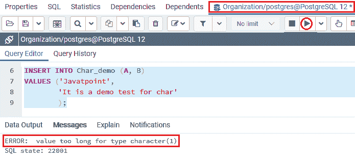
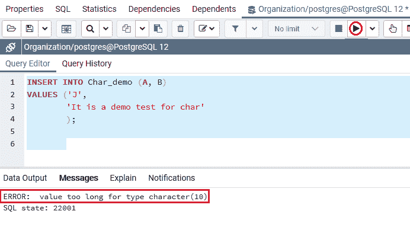
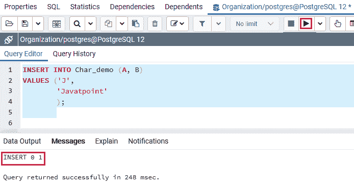
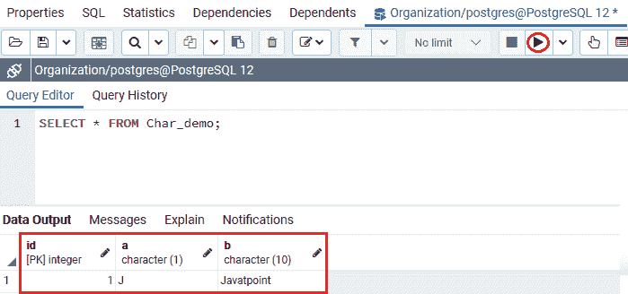

# PostgreSQL 字符

> 原文：<https://www.javatpoint.com/postgresql-character>

在本节中，我们将了解 **PostgreSQL 字符数据类型**的工作原理，它允许我们为表选择正确的字符类型。我们也可以看到**字符数据类型**的**示例**。

## 什么是 PostgreSQL 字符数据类型？

在 **PostgreSQL** 中，字符数据表示字符类型值，也称为 **CHAR** 。换句话说，我们可以说 PostgreSQL 字符数据类型用于存储有限长度的字符。

我们有以下表格，其中包含所有 **PostgreSQL** 支持的**字符**数据类型:

| 数据类型 | 说明 |
| 字符(n) | 这里 **n** 代表**存储 f** 固定长度字符串的字符数。右边填充的空格等于字符的大小。 |
| 字符(n) | 这里 **n** 是存储 f 固定长度字符串的**字符数。右边填充的空格等于字符的大小。** |
| varchar(n) | 这里 **n** 是**要存储的字符数**。可变长度字符串。 |
| 字符变化 | 这里 **n** 是**要存储的字符数**。可变长度字符串。 |
| 文本 | 可变长度字符串。 |

在上表中， **CHAR(n)和 VARCHAR(n)** 最多可以存储 **n** 个字符，其中 **n** 表示字符长度的限制。如果未定义 **n** ，则默认为**字符(1)** 或**字符(1)。**

如果我们试图在列中获得一个更长的字符串，该字符串由 **char(n)** 指定，则 [PostgreSQL](https://www.javatpoint.com/postgresql-tutorial) 会在输出中显示一个错误。

尽管如此，如果附加字符都是空格，那么 PostgreSQL 将**将**空格修剪到最大长度(n)并存储字符串。

如果一个字符串被转换为一个**字符(n)或一个**字符，PostgreSQL 会在将该字符串插入到表中之前将其缩短为 **n** 个字符。

### PostgreSQL 字符数据类型的语法

PostgreSQL 字符数据类型的语法如下:

```

variable_name CHAR(n)

```

### PostgreSQL 字符数据类型示例

让我们看不同的例子来理解 **PostgreSQL** **字符数据类型**是如何工作的。

为此，我们将借助 **CREATE** 命令创建一个新的表名 **Char_demo** 表，并使用 **INSERT** 命令插入一些值。

我们将使用 **CREATE** 命令在**组织数据库**中创建 **Char_demo** 表:

```

CREATE TABLE Char_demo (
    Id serial PRIMARY KEY,
    A CHAR (1),
    B CHAR (10)
);

```

**输出**

执行以上命令后 **Char_demo** 表已经创建成功，如下图截图所示:


一旦生成了 ***Char_demo*** 表，我们就可以使用 **INSERT** 命令向其中插入一些值。

```

INSERT INTO Char_demo (A, B)
VALUES ('Javatpoint',
        'It is a demo test for char'
        );

```

**输出**

实现上述命令后，我们将获得以下输出，PostgreSQL 将发出错误消息“**值对于类型 Character (1)** 来说太长了”。

这意味着 **A** 列的数据类型是**字符(1)**，我们试图将一个包含三个字符的字符串插入到一个特定的列中，如下图所示:



要解决上述错误，我们将使用以下命令:

```

INSERT INTO Char_demo (A, B)
VALUES ('J',
        'It is a demo test for char'
        );	

```

**输出**

在执行上述命令时，我们将获得以下输出，PostgreSQL 将再次发出一个错误，即“**值对于类型 Character (10)** 来说太长了”。

这意味着 **B** 列的数据类型是**字符(10)**，而输入的字符数大于**10，**如下图所示:



因此，为了解决上述两个错误，我们将使用下面的命令:

```

INSERT INTO Char_demo (A, B)
VALUES ('J',
        'Javatpoint'
        );

```

**输出**

执行上述命令后，我们会得到如下结果，显示该值已成功插入 ***Char_demo*** 表中。



正如我们在上面的截图中看到的，我们可以为两列 **A 和 b**成功地将值插入到字符数据类型中

创建并插入 **Char_demo** 表的值后，我们将使用 [**选择**命令](https://www.javatpoint.com/postgresql-select)，该命令返回 **Char_demo** 表的所有行:

```

SELECT * FROM Char_demo;

```

**输出**

成功执行上述命令后，我们将获得以下结果，其中我们可以看到**列 A 和**列 B 的值都已成功输入。



## 概观

在 **PostgreSQL 字符数据类型**部分，我们了解到**字符数据**类型可用于定长字符。

* * *