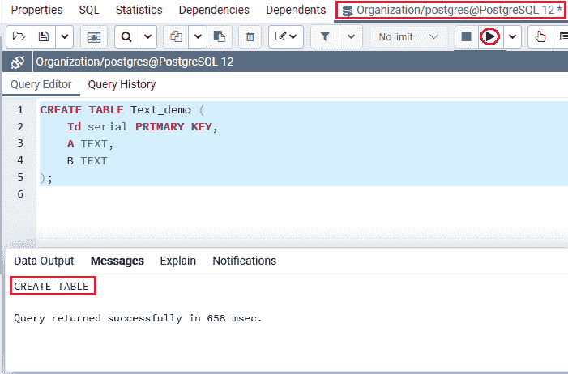
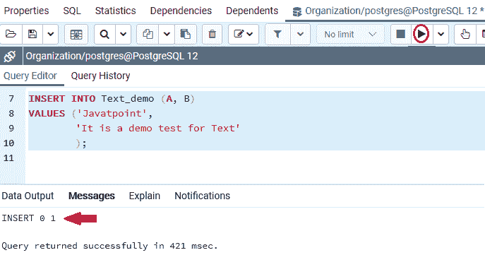
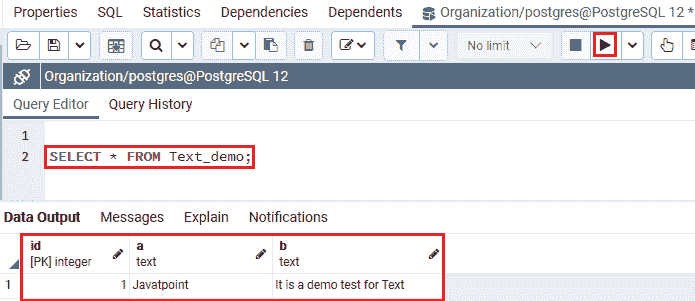
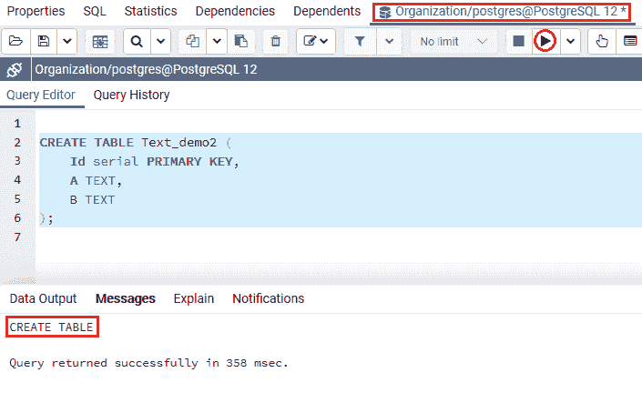
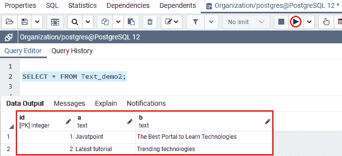

# PostgreSQL 文本

> 原文：<https://www.javatpoint.com/postgresql-text>

在本节中，我们将了解 **PostgreSQL 文本数据类型**的工作原理，它允许我们存储无限长的字符。我们也可以看到**文本数据类型**的**示例**。

## 什么是 PostgreSQL 文本数据类型？

在 [PostgreSQL](https://www.javatpoint.com/postgresql-tutorial) 中，文本数据类型用于保持字符的无限长。文本数据类型可以保存最大长度为 **65，535** 字节的字符串。

换句话说，我们可以说 **PostgreSQL Text 数据类型**使用字符数据类型，表示为文本，并且 **Varchar 无大小 n** 和 **Text** 的表示是等价的。

### PostgreSQL 文本数据类型的语法

PostgreSQL 文本[数据类型](https://www.javatpoint.com/postgresql-datatypes)的语法如下:

```sql

variable_name TEXT

```

## PostgreSQL TEXT 数据类型示例

让我们看不同的例子来理解 **PostgreSQL 文本数据类型**是如何工作的。

### 示例 1

为此，我们将借助 create 命令创建一个新的表名 **Text_demo** 表，并使用 [INSERT 命令](https://www.javatpoint.com/postgresql-insert)插入一些值。

我们将使用**创建**命令在**组织**数据库中创建**文本 _ 演示**表格:

```sql

CREATE TABLE Text_demo (
    Id serial PRIMARY KEY,
    A TEXT,
    B TEXT
);

```

**输出**

成功执行上述命令后，创建了 **Text_demo** 表，如下图所示:



一旦 ***文本 _ 演示*** 表已经生成，我们将使用 insert 命令向其中插入一些值。

```sql

INSERT INTO Text_demo (A, B)
VALUES ('Javatpoint',
        'It is a demo test for Text'
        );

```

**输出**

在执行上述命令时，我们将获得以下结果，显示该值已成功插入到 ***Text_demo*** 表中。



正如我们在上面的截图中看到的，我们成功地为文本数据类型插入了列 **A 和列**的值。

创建并插入 **Text_demo** 表的值后，我们将使用 [**SELECT** 命令](https://www.javatpoint.com/postgresql-select)返回 **Text_demo** 表的所有行:

```sql

SELECT * FROM Text_demo;

```

**输出**

执行上述命令后，我们将得到以下结果，其中我们可以看到**列 A 和**列 B 的值都已成功输入到 **Text_demo** 表中。



### 示例 2

让我们再看一个例子，详细学习文本数据类型。因此，我们在 CREATE 命令的帮助下创建了一个名为 **Text_demo2** 的新表，并使用 INSERT 命令插入了一些值。

我们将使用 **CREATE** 命令将 **Text_demo2** 创建到与上面类似的**数据库**中，即**组织**:

```sql

CREATE TABLE Text_demo2 (
    Id serial PRIMARY KEY,
    A TEXT,
    B TEXT
);

```

**输出**

执行上述命令后 **Text_demo2** 表已经创建成功，如下图截图所示:



一旦生成了 ***Text_demo2*** 表，我们就可以使用 insert 命令向其中插入一些值。

```sql

INSERT INTO Text_demo2 (A, B)
VALUES 
('Javatpoint', 'The Best Portal to Learn Technologies'), 
('Latest tutorial', 'Trending technologies');

```

**输出**

执行上述命令后，我们将得到如下结果，显示该值已成功插入 **Text_demo2** 表中。


从上面的截图中我们可以看到， **A 列和**B 列的多个值已经成功插入到 ***Text_demo2*** 表中。

创建并插入 **Text_demo2** 表的值后，我们将使用 **SELECT** 命令返回 **Text_demo2** 表的所有行:

```sql

SELECT * FROM Text_demo2;

```

**输出**

成功执行上述命令后，我们将获得以下结果，其中我们可以看到**列 A 和**列 B 的值都已成功输入。



## 概观

在 **PostgreSQL 文本数据类型**部分，我们了解到**文本数据**类型可以用于无限长度。

* * *