# PostgreSQL Varchar

> 原文：<https://www.javatpoint.com/postgresql-varchar>

在本节中，我们将了解 **PostgreSQL varchar 数据类型**的工作原理，它允许我们存储无限长的字符。我们也可以看到 **Varchar 数据类型**和空格的**示例**。

## 什么是 PostgreSQL Varchar 数据类型？

在 [PostgreSQL](https://www.javatpoint.com/postgresql-tutorial) 中，使用 Varchar 数据类型来保持字符的无限长度。它可以容纳最大长度为 **65，535** 字节的字符串。

换句话说，我们可以说 **PostgreSQL Varchar 数据类型**使用了字符数据类型，表示为 **VARCHAR** 。

*   大多数情况下，我们应该使用 **Varchar 和【Text 数据类型。如果我们想让 PostgreSQL 检查长度，那么我们使用 **VARCHAR(n)** 。**
*   在 PostgreSQL 中，varchar 插图表示为 **Varchar (n)** ，其中 **n** 用于表示字符长度的限制。如果 **n** 没有描述，默认为无限长的 Varchar。
*   如果我们试图在用 **Varchar(n)** 指定的列中获得更长的字符串，PostgreSQL 会在输出中出现错误。
*   但是，如果附加字符都是空格，我们有一个例外，那么 PostgreSQL 将**把**的空格修剪到**最大长度(n)** 和**存储字符串**。
*   如果我们为 **Varchar** 数据类型定义长度说明符，或者如果我们试图在 **Varchar(n)** 列中插入超过 **n 个字符**，PostgreSQL 将检查并引发错误。

#### 注意:varchar 数据类型是一个可变长度的字符串，可以携带特殊的字符、数字和字母。n 存储长度最大为 0 到 65535 个字符的文本。

## PostgreSQL Varchar 数据类型的语法

PostgreSQL Varchar 数据类型的语法如下:

```sql

variable_name VARCHAR(n)

```

## PostgreSQL Varchar 数据类型示例

让我们看不同的例子来理解 **PostgreSQL Varchar 数据类型**是如何工作的。

为此，我们将借助 create 命令创建一个新的表名 **Varchar_demo** 表，并使用 [INSERT 命令](https://www.javatpoint.com/postgresql-insert)插入一些值。

我们将使用**创建**命令在**组织**数据库中创建 **Varchar_demo** 表:

```sql

CREATE TABLE Varchar_demo (
    Id serial PRIMARY KEY,
    P VARCHAR(1),
    Q VARCHAR(10)
);

```

**输出**

成功执行上述命令后，创建了 **Varchar_demo** 表，如下图所示:

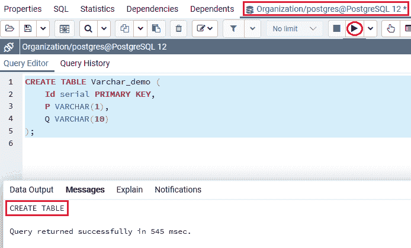

一旦生成了 ***Varchar_demo*** 表，我们将使用 insert 命令向其中插入一些值。

```sql

INSERT INTO Varchar_demo (P, Q)
VALUES ('Javatpoint',
        'It is a demo for Varchar'
        );

```

**输出**

执行上述命令后，我们将获得以下输出，PostgreSQL 将发出错误消息“**值对于类型字符 variable(1)**来说太长了”。

这意味着 **P** 列的数据类型是 **VARCHAR (1)** ，在这里我们试图将一个包含三个字符的字符串插入到一个特定的列中，如下图所示:

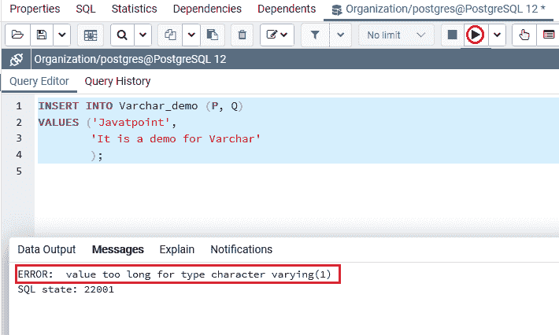

要解决上述错误，我们将使用以下命令:

```sql

INSERT INTO Varchar_demo (P, Q)
VALUES ('J',
        'It is a demo for Varchar'
        );

```

**输出**

在执行上述命令时，PostgreSQL 会为 **Q** 列重新发布一个类似的错误，这意味着 **Q** 列的数据类型是 **VARCHAR (10)** 。相比之下，输入的字符数更多的是**而不是 10** ，我们可以在下面的截图中观察到:

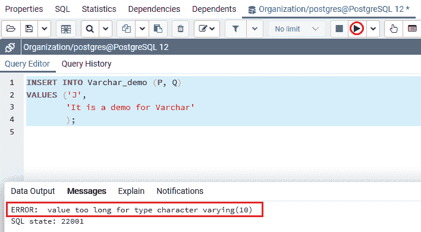

因此，为了解决上述两个错误，我们将使用下面的命令:

```sql

INSERT INTO Varchar_demo (P, Q)
VALUES ('J',
        'Javatpoint'
        );

```

**输出**

执行以上命令后，我们会得到如下结果:值已经成功插入到 ***Varchar_demo*** 表中。

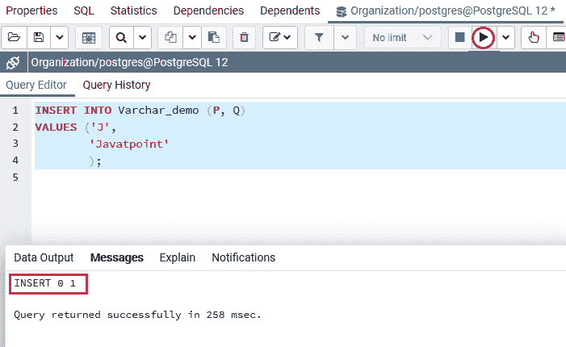

从上面的截图中我们可以看到，我们成功地插入了 **P 和 Q** 列的值。

创建并插入 **Varchar_demo** 表的值后，我们将使用 [**选择**命令](https://www.javatpoint.com/postgresql-select)返回 **Varchar_demo** 表的所有行:

```sql

SELECT * FROM Varchar_demo;

```

**输出**

执行上述命令后，我们将获得以下结果，其中我们可以看到**列 P 和**列 Q 的值都已成功输入到 ***Varchar_demo*** 表中。

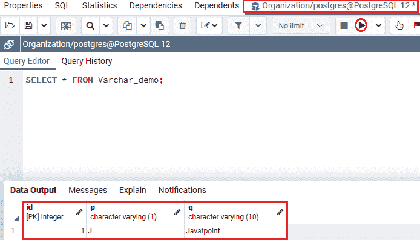

## 例 2

让我们再看一个详细学习 Varchar 数据类型的例子。在 CREATE 命令的帮助下，我们创建了一个新表 **Varchar_demo2** ，并使用 INSERT 命令插入了一些值。

我们将使用 **CREATE** 命令将 **Varchar_demo2** 创建到与上面类似的**数据库**中，即**组织**:

```sql

CREATE TABLE Varchar_demo2 (  
   Id SERIAL PRIMARY KEY,  
   Name VARCHAR(5) NOT NULL  
);  

```

**输出**

执行上述命令后 **Varchar_demo2** 表已经创建成功，如下图截图所示:

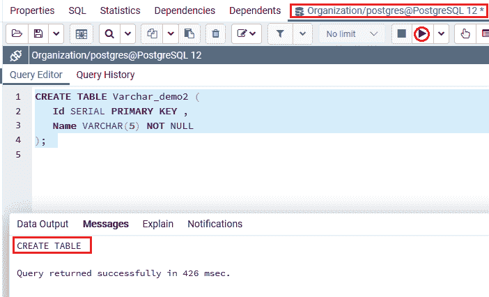

一旦生成了 ***Varchar_demo2*** 表，我们就可以使用 insert 命令向其中插入一些值。

```sql

INSERT INTO 
Varchar_demo2(Name) 
VALUES ('Mike Ross');  

```

**输出**

执行上述命令后。PostgreSQL 给出错误消息“**对于字符(1)** 类型，该值太长”。输出解释得更清楚。

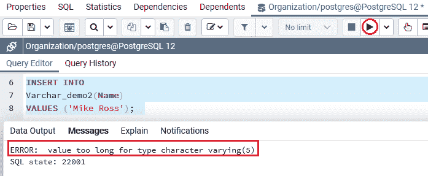

## PostgreSQL VARCHAR 和空格示例

PostgreSQL 在存储时不会扩展 varchar 值的空间，PostgreSQL 在存储或恢复 Varchar 值时也会采用尾随空格。

为此，我们将看到下面的示例来理解它，其中**插入**命令，我们在 ***Varchar_demo2*** 表的**名称**列中添加值，我们在上面的示例中创建了该表:

```sql

INSERT INTO 
Varchar_demo2(Name) 
VALUES ('Noah ');  

```

**输出**

执行以上命令后，我们会得到如下结果:值已经成功插入到 ***Varchar_demo2*** 表中。

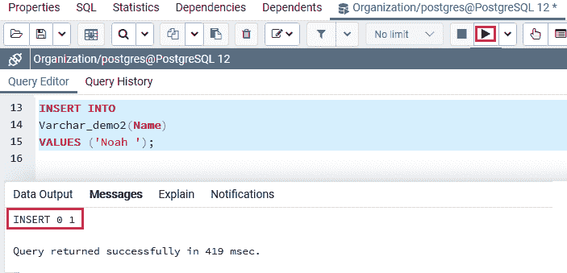

创建并插入 **Varchar_demo2** 表的值后，我们将使用 **SELECT** 命令从 Varchar_demo2 表中检索**值:**

```sql

SELECT Id, Name, length(Name) 
FROM Varchar_demo2; 

```

**输出**

执行上述命令后，我们将得到以下结果，其中 **PostgreSQL** 包含长度计数中的尾随空格，因为它不会增加列长度。

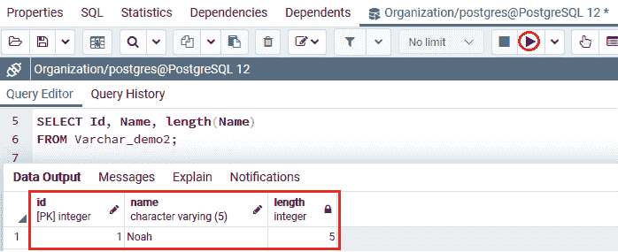

如果我们试图插入一个尾部空格超过列长度的 Varchar 值，PostgreSQL 将**截断**尾部空格。此外，PostgreSQL 还会发出**警告**。如下例所示:

```sql

INSERT INTO 
Varchar_demo2(Name) 
VALUES ('Emily ');

```

**输出**

执行上述命令后，我们将得到以下结果:

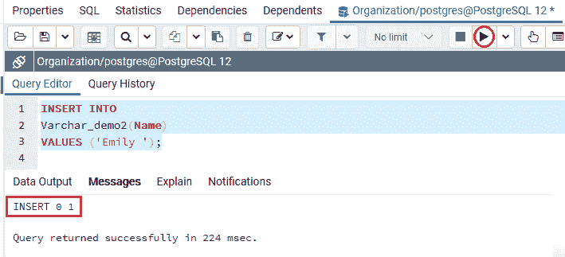

在上面的命令中，插入到**名称**列中的值长度为**六**。并且该值仍然被插入到列中。但是，PostgreSQL 在添加值之前会减少尾随空格。

我们可以在以下命令的帮助下检查它，其中插入命令已成功添加。

```sql

SELECT Id, Name, length(Name) 
FROM Varchar_demo2; 

```

**输出**

执行上述命令后，我们将得到下面的输出，仍然带有警告:第 1 行的列“名称”的数据被截断:

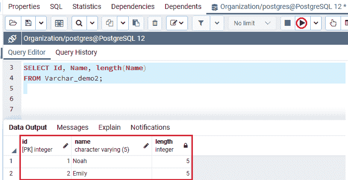

## PostgreSQL CHAR 和 PostgreSQL VARCHAR 数据类型的区别

PostgreSQL CHAR 和 VARCHAR 数据类型都遵循 **ASCII 字符**。它们实际上相似，但在存储和从数据库获取数据方面有所不同。

下表强调了 **CHAR 和 VARCHAR 数据类型**之间的本质区别:

| PostgreSQL CHAR 数据类型 | PostgreSQL VARCHAR 数据类型 |
| PostgreSQL 支持 **Char** 数据类型的静态内存分配。 | PostgreSQL 支持对 Varchar 数据类型进行动态内存分配。 |
| **字符**数据类型也称为**字符**。 | **Varchar** 数据类型也称为**变量**字符。 |
| 字符数据类型不能超过 **255** 个字符。 | **Varchar** 数据类型最多可容纳 **65535** 个字符。 |
| **Char** 数据类型以固定长度存储值，我们在创建表格时表示这些值。 | **Varchar** 数据类型将值存储在一个带有**一个或两个字节**长度前缀的可变长度字符串中。 |
| 它可以用尾随空格填充，以包含指定的长度。 | 存储时，不能用任何字符或空格填充。 |

## 概观

在 **PostgreSQL Varchar 数据类型**部分，我们学习了以下主题:

*   **可变字符数据类型**用于可变长度字符类型。
*   如果我们想在将字符串(n)插入或更新到列中之前检查它的长度，我们可以使用 **Varchar(n)** 数据类型。
*   我们使用 PostgreSQL Varchar 数据类型和空格。

* * *