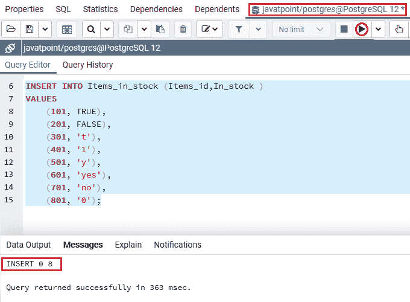
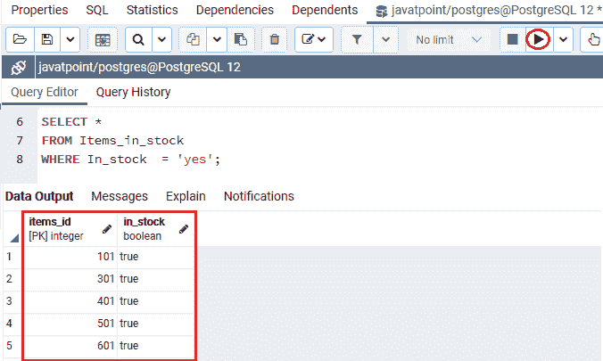
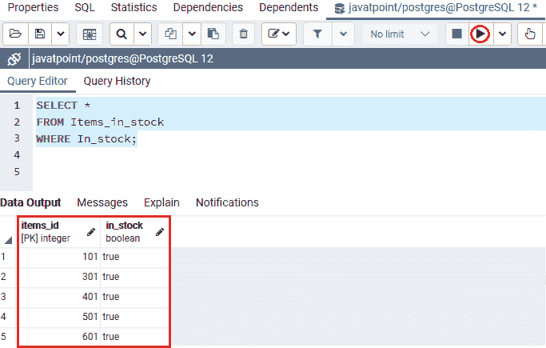
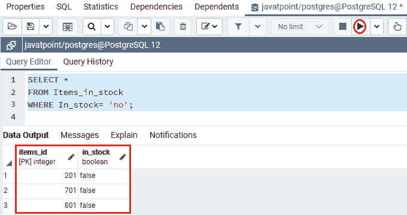
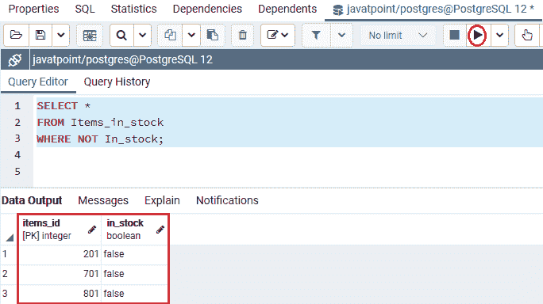
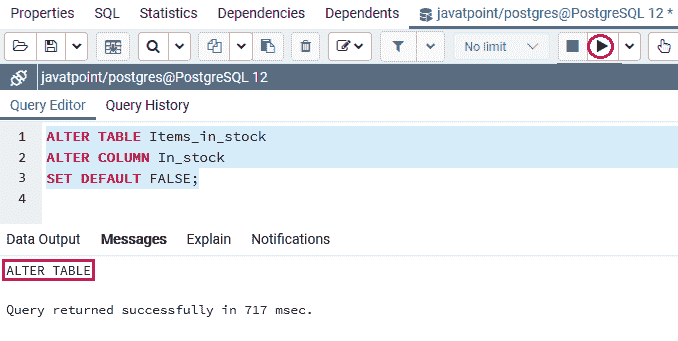
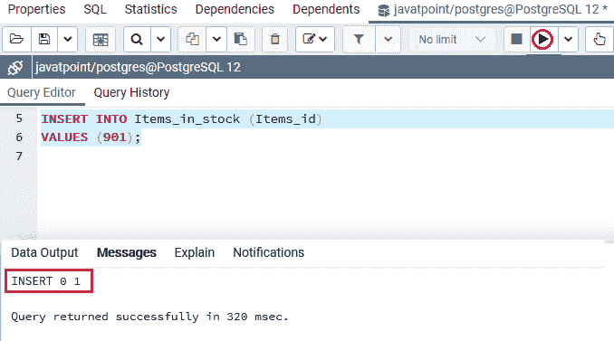
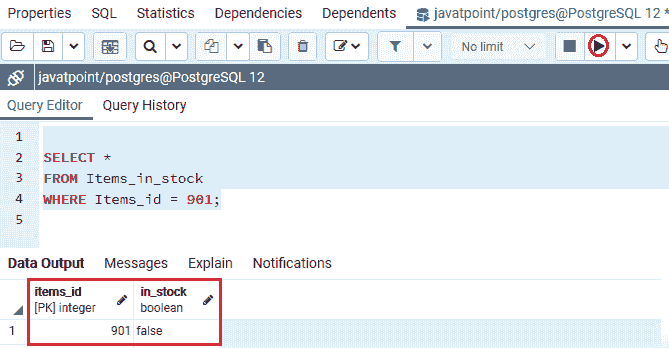
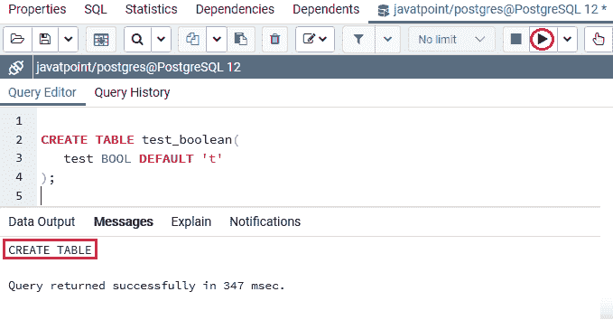

# PostgreSQL 布尔值

> 原文：<https://www.javatpoint.com/postgresql-boolean>

在本节中，我们将了解 **PostgreSQL 布尔数据类型**的工作原理，它允许我们设计数据库表。我们也可以看到**布尔数据类型**的**示例**。

## 什么是 PostgreSQL 布尔数据类型？

布尔型是 PostgreSQL 中常用的[数据类型，它总是返回两个可能的值，如**真和**假。布尔数据类型可以缩写为**布尔**。](https://www.javatpoint.com/postgresql-datatypes)


换句话说，我们可以说 PostgreSQL 布尔数据类型使用一个字节在数据库中存储一个布尔值。并且它总是可以用来以**是或否**值的形式获得批准。

**PostgreSQL** 允许我们使用单个布尔数据类型，称为**布尔**，包含三个不同的**真值、假值和空值**。

#### 注意:SQL 支持布尔数据类型的真、假和空值。但是 [PostgreSQL](https://www.javatpoint.com/postgresql-tutorial) 只灵活使用真值和假值。

我们有下表，其中包含 **PostgreSQL** 支持的**真和**假的有效文字值:

| 真实的 | 错误的 |
| 真实的 | 错误的 |
| ' t ' | f′ |
| 真的 | 假的 |
| 你好 | 不 |
| “是的” | 没有 |
| '1' | '0' |

#### 注意:从上表中我们可以看到，除了“真”和“假”之外，所有常量值都必须用单引号括起来。在上表中，前导或尾随空格并不重要。

## PostgreSQL 布尔数据类型的示例

让我们看不同的例子来理解 **PostgreSQL 布尔数据类型**是如何工作的。

为此，我们将借助 **CREATE** 命令创建一个新表，并使用 [**INSERT** 命令](https://www.javatpoint.com/postgresql-insert)插入一些值。

我们将通过使用**创建**命令进入**javapoint**数据库来创建表格**库存物品**:

```

CREATE TABLE Items_in_stock  (
   Items_id INT PRIMARY KEY,
   In_stock BOOLEAN NOT NULL
);

```

**输出**

执行上述命令后 **Items_in_storck** 表已成功创建，如下图截图所示:


一旦生成了 **Items_in_storck** 表，我们就可以在 **INSERT** 命令的帮助下为布尔值使用几个文字值。

```

INSERT INTO Items_in_stock (Items_id,In_stock )
VALUES
	(101, TRUE),
	(201, FALSE),
	(301, 't'),
	(401, '1'),
	(501, 'y'),
	(601, 'yes'),
	(701, 'no'),
	(801, '0');

```

**输出**

执行上述命令后，我们会得到如下消息:该值已成功插入 ***Items_in_stock*** 表。



在创建并插入**库存物品**表的值后，我们将使用命令下的**来查找那些**库存物品****:****

 **```

SELECT *
FROM Items_in_stock     
WHERE In_stock  = 'yes';

```

**输出**

成功执行上述命令后，我们将获得以下结果:**物品**可用于特定的**物品 _id** 进入**物品 _ 库存**表。



我们还可以在不使用任何运算符的情况下，借助**布尔列**检索**真值**。

如下例所示，以下语句用于检索库存中所有**项****:**

```

SELECT * 
FROM Items_in_stock     
WHERE In_stock;

```

**输出**

在执行上面的命令时，与上面的命令相比，我们将得到类似的输出:



同样，如果我们检查假值，我们可以将**布尔列**的值与任何有效的**布尔常数**进行比较。

以下命令用于退回库存中**而非**的**物品**:

```

SELECT * 
FROM Items_in_stock     
WHERE In_stock= 'no';

```

**输出**

成功执行上述命令后，我们将得到以下结果:**物品**是**不是**可用于特定的**物品 _id** 进入**物品 _ 库存**表。



或者我们可以使用 [**NOT 运算符**](https://www.javatpoint.com/postgresql-not-condition) 来确定**布尔列**中的值是否为**假**，如下命令所示:

```

SELECT * 
FROM Items_in_stock     
WHERE NOT In_stock;

```

**输出**

在执行上面的命令时，与上面的命令相比，我们将得到类似的输出:



## 设置布尔列默认值的示例

我们使用[](https://www.javatpoint.com/postgresql-alter-table)**中的**设置默认子句**为现有布尔列设置默认值。**

 **在下面的例子中，我们使用下面的 ALTER TABLE 命令来设置**库存物品**表中**库存**列的默认值:

```

ALTER TABLE Items_in_stock
ALTER COLUMN In_stock
SET DEFAULT FALSE;

```

**输出**

执行以上命令后，我们会得到如下消息: ***Items_in_stock*** 表修改成功。



如果我们插入一行而没有描述 **In_stock** 列的值，PostgreSQL 将使用 FALSE 值:

```

INSERT INTO Items_in_stock (Items_id)
VALUES (901);

```

**输出**

在执行上述命令时，我们将获得以下消息:特定值已成功插入 ***库存物品*** 表中。



在下面的命令中，我们将使用 [**选择**](https://www.javatpoint.com/postgresql-select) 语句来检索**项目 _id 901:** 的值

```

SELECT *
FROM Items_in_stock
WHERE Items_id = 901;

```

**输出**

执行上述命令后，我们将获得以下输出:



同样，当我们在**创建**命令的帮助下创建表格时，我们也可以为布尔列设置默认值。

我们将在列定义中使用 **DEFAULT** 约束，如下命令所示:

```

CREATE TABLE test_boolean(
   test BOOL DEFAULT 't'
);

```

**输出**

执行上述命令后，我们会得到如下消息: ***test_ boolean*** 表已经创建成功。



## 概观

在 **PostgreSQL 布尔数据类型**部分，我们学习了以下主题:

*   **布尔数据**类型用于存储布尔数据。
*   我们使用 PostgreSQL 布尔数据类型来设置布尔列的默认值。

* * *****