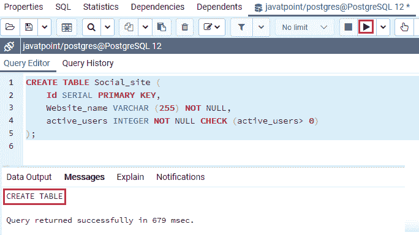
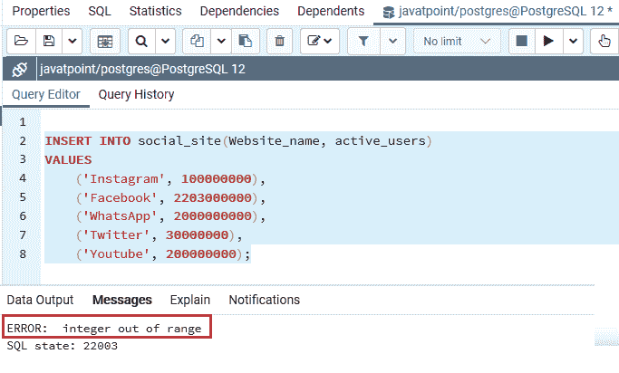
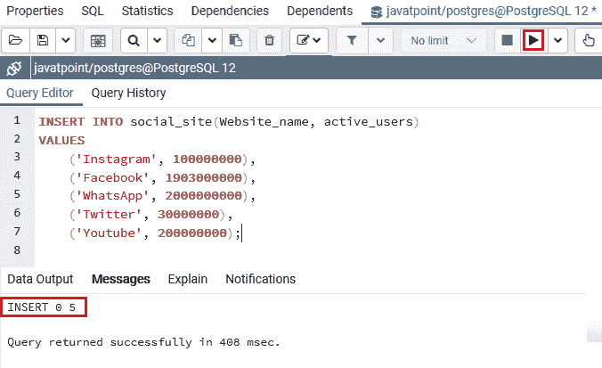
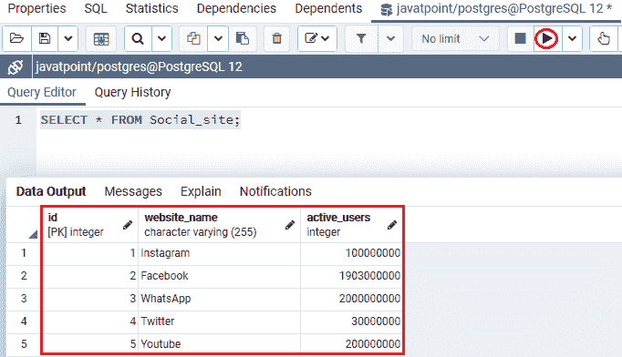
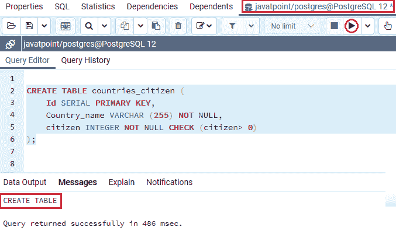
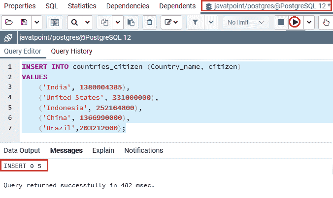
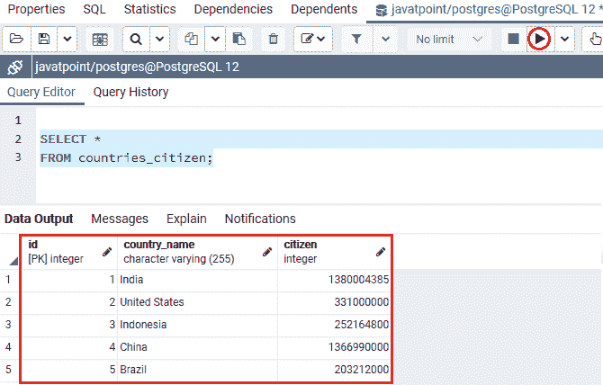

# PostgreSQL INTEGER

> 原文：<https://www.javatpoint.com/postgresql-integer>

在本节中，我们将了解 **PostgreSQL Integer 数据类型**的工作原理。我们还可以看到**整数数据类型**的**示例**。

## 什么是 PostgreSQL 整数数据类型？

在 **PostgreSQL** 中，INTEGER 数据类型也被称为 **INT** 。PostgreSQL 整数数据类型分为以下三种类型:

*   整数
*   斯莫列特
*   比吉斯本

在本节中，我们将通过示例了解**整数数据类型**。我们将在 [PostgreSQL 教程](https://www.javatpoint.com/postgresql-tutorial)中介绍 **SMALLINT 和 BIGINT** 数据类型。

PostgreSQL 整数数据类型涉及 **4 字节**的存储大小，并将整数存储在**有符号**和**无符号范围**中。

**签约区间**从 **-2147483648 至 2147483647** 开始。**无符号范围**从 **0 到 4294967295** 开始。**尺寸**参数用于定义最大显示宽度 **255** 。

#### 注意:PostgreSQL 不允许我们使用无符号整数类型。

与其他整数类型( **smallint、bigint** )相比， **INTEGER 数据类型**最常用于**范围、性能和大小存储**。


当我们在像(脸书、Instagram 等)这样的社交媒体应用程序上存储诸如**活跃用户数量等数据时，整数数据类型是有益的。)，还有一个城市的**人口，或者是全国的**等等。**

我们有以下表格，其中包含了 **PostgreSQL** 支持的所有整数[数据类型](https://www.javatpoint.com/postgresql-datatypes)规范:

| 名字 | 存储大小 | 最低限度 | 最高的 |
| **INTEGER** | 4 字节 | -2147483648 | Two billion one hundred and forty-seven million four hundred and eighty-three thousand six hundred and forty-seven |
| **模型化** | 2 字节 | -32768 | Thirty-two thousand seven hundred and sixty-seven |
| **重印** | 8 字节 | -9223372036854775808 | 9223372036854775807 |

#### 注意:如果我们试图存储给定范围之外的值，PostgreSQL 将会引发错误。

### PostgreSQL 整数数据类型的语法

PostgreSQL 整数数据类型的语法如下:

```

variable_name INTEGER

```

## PostgreSQL 整数数据类型示例

让我们看不同的例子来理解 **PostgreSQL Integer 数据类型**是如何工作的。

在 **CREATE** 命令的帮助下，我们正在创建一个新的表作为 ***社交网站*** ，并使用 **INSERT** 命令插入一些值。

我们将使用 **CREATE** 命令将多个社交媒体应用程序上的活跃用户数量存储到一个 **javatpoint 数据库**中，从而创建 ***社交网站*** 。

```

CREATE TABLE Social_site (
    Id SERIAL PRIMARY KEY,
    Website_name VARCHAR (255) NOT NULL,
    active_users INTEGER NOT NULL CHECK (active_users> 0)
);

```

**输出**

执行以上命令后 ***Social_site*** 表已经创建成功，如下图截图所示:



一旦生成了 ***Social_site*** 表，我们就可以使用 **INSERT** 命令向其中插入一些值。

```

INSERT INTO social_site(Website_name, active_users)
VALUES
   	 ('Instagram', 100000000), 
	('Facebook', 2203000000),
    	('WhatsApp', 2000000000),
	('Twitter', 30000000), 
    	('Youtube', 200000000);

```

**输出**

执行上述命令后，我们将获得以下消息:

如果该值超出整数数据类型(2147483647)的范围，那么 PostgreSQL 将显示一个错误为**整数超出范围**。



因此，现在我们将在整数数据类型范围下插入脸书活动用户的值，如以下命令所示:

```

INSERT INTO social_site(Website_name, active_users)
VALUES
   	 ('Instagram', 100000000), 
	('Facebook', 1903000000),
    	('WhatsApp', 2000000000),
	('Twitter', 30000000), 
    	('Youtube', 200000000);

```

**输出**

执行上述命令后，我们会得到如下结果，显示该值已成功插入 ***Social_site*** 表中。



从上面的截图中我们可以看到，多个值已经成功插入到 ***Social_site*** 表中。

创建并插入 ***社交 _ 站点*** 表的值后，我们将使用**选择**命令返回**社交 _ 站点**表的所有行:

```

SELECT * FROM Social_site;

```

**输出**

成功实现上述命令后，我们将获得以下结果:



### 示例 2

让我们再看一个详细学习整数数据类型的例子。因此，我们将使用 **CREATE** 命令创建另一个新表作为***country _ citizen***表，并将其放入一个类似的**数据库**中，即 **javatpoint** 来存储几个国家的公民:

```

CREATE TABLE countries_citizen (
    Id SERIAL PRIMARY KEY,
    Country_name VARCHAR (255) NOT NULL,
    citizen INTEGER NOT NULL CHECK (citizen> 0)
);

```

#### 注意:我们也可以用 INT 代替 INTEGER 作为彼此的替代词。

**输出**

执行上述命令后，已成功创建 ***国家 _ 公民*** 表，如下图截图所示:



一旦生成了 ***国家 _ 公民*** 表，我们将使用 [**INSERT** 命令](https://www.javatpoint.com/postgresql-insert)向其中插入一些值，如下命令所示:

```

INSERT INTO countries_citizen (Country_name, citizen)
VALUES
('India', 1380004385),
('United States', 331000000), 
 	('Indonesia', 252164800),  
 	('China', 1366990000),
('Brazil',203212000);

```

**输出**

在执行上述命令时，我们将获得以下消息:该值已成功插入***country _ citizen***表中。



创建并插入***country _ citizen***表的值后，我们将使用 [**SELECT** 命令](https://www.javatpoint.com/postgresql-select)返回***country _ citizen***表的所有行:

```

SELECT * 
FROM countries_citizen;

```

**输出**

执行上述命令后，我们将获得以下输出:



## 概观

在 **PostgreSQL Integer 数据类型**部分，我们了解到它可以是存储**范围、性能和大小**之间的最佳平衡。

* * *