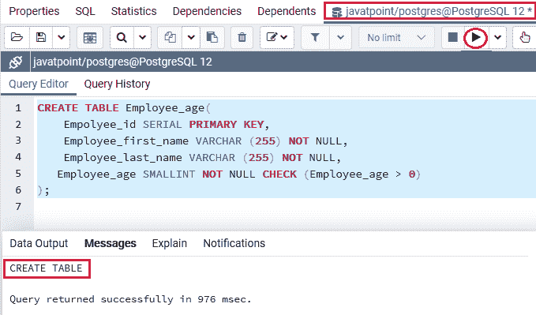
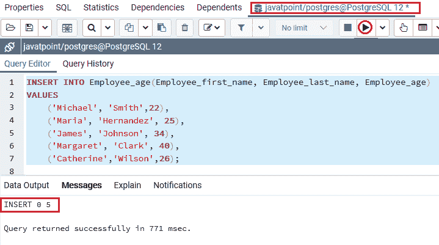
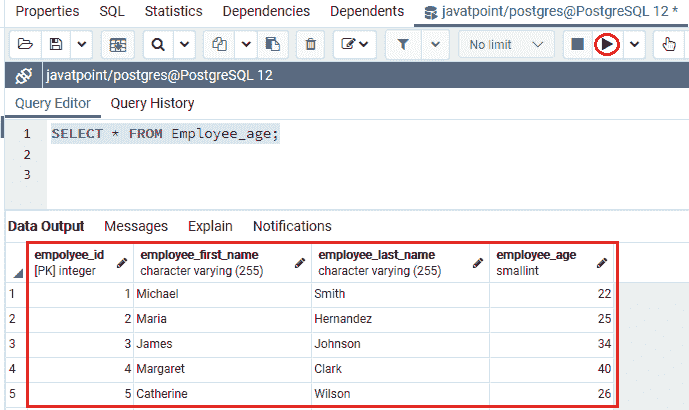
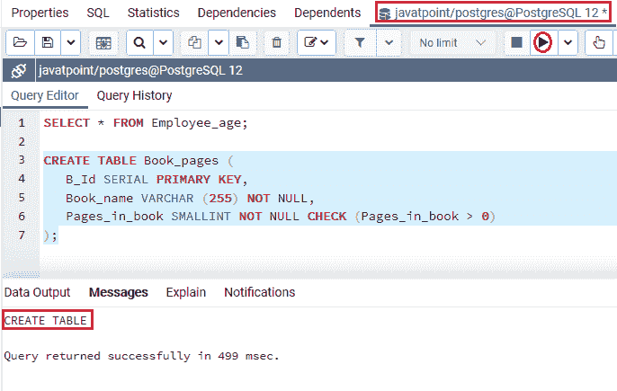
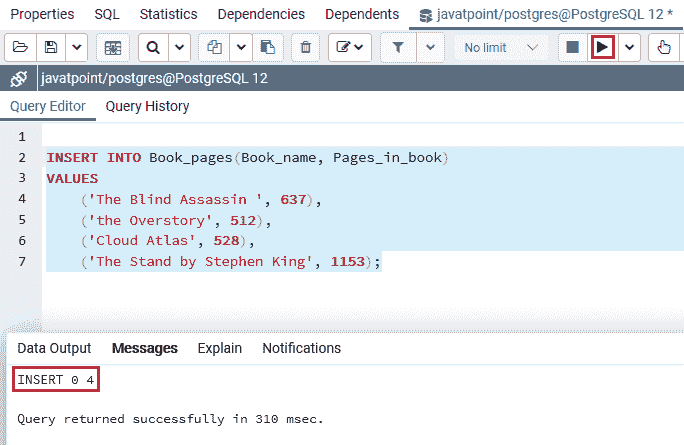
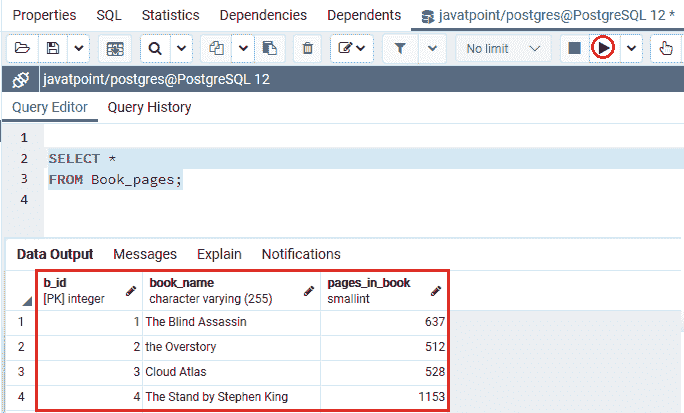

# postgresql smallint 的特征

> 哎哎哎:# t0]https://www . javatppoint . com/PostgreSQL-small lint

在本节中，我们将了解**Postgresql Smalint 数据类型**的工作原理。我们也可以看到**小数据类型**的**示例**。

## 什么是 PostgreSQL 小数据类型？

在 [PostgreSQL](https://www.javatpoint.com/postgresql-tutorial) 中，我们要理解的下一个整数数据类型是 SMALLINT。

SMALLINT 数据类型小范围整数涉及存储大小的 **2 字节**，并将整数存储在**有符号范围**和**无符号范围**中。

**签约区间**从 **-32768 到 32767** 开始。**无符号范围**从 **0 到 65535** 开始。**尺寸**参数用于定义最大显示宽度 **255** 。

#### 注意:PostgreSQL 不允许我们使用无符号整数类型。

通常， **SMALLINT 数据类型**仅用于存储部分范围的记录，例如**一本书的页数、一个人的年龄**等等，与其他内置的数字数据类型相比。

假设一个数字超出了**最大值和最小值**小数值的范围。数据库服务器不存储数据值，但作为替代，会出现一条错误消息。

### PostgreSQL SMALLINT 数据类型的语法

PostgreSQL SMALLINT 数据类型的语法如下:

```sql

variable_name SMALLINT

```

## PostgreSQL Smallint 数据类型示例

让我们看不同的例子来理解 **PostgreSQL Smallint 数据类型**是如何工作的。

我们在 CREATE 命令的帮助下创建了一个新表，并使用 [INSERT 命令](https://www.javatpoint.com/postgresql-insert)插入了一些值。

在下面的例子中，我们将通过使用 **CREATE** 命令来存储员工的年龄，从而将 ***Employee_age*** 创建到 **javatpoint 数据库**中。

```sql

CREATE TABLE Employee_age(
    Empolyee_id SERIAL PRIMARY KEY,
    Employee_first_name VARCHAR (255) NOT NULL,
    Employee_last_name VARCHAR (255) NOT NULL,
   Employee_age SMALLINT NOT NULL CHECK (Employee_age > 0)
);

```

**输出**

执行上述命令后，我们会得到如下消息: ***Employee_age*** 表已经创建成功，如下图截图所示:



一旦生成了 ***【雇员 _ 年龄】*** 表，我们就可以使用 insert 命令向其中插入一些值。

```sql

INSERT INTO Employee_age(Employee_first_name, Employee_last_name, Employee_age)
VALUES
('Michael', 'Smith',22),
('Maria', 'Hernandez', 25), 
   	('James', 'Johnson', 34),  
   	('Margaret', 'Clark', 40),
('Catherine','Wilson',26);

```

**输出**

执行上述命令后，我们将获得以下消息:特定值已成功插入 ***Employee_age*** 表中。



从上面的截图中我们可以看到，多个值已经成功插入到 ***Employee_age*** 表中。

创建并插入 ***员工 _ 年龄*** 表的值后，我们将使用**选择**命令返回 ***员工 _ 年龄*** 表的所有行:

```sql

SELECT * 
FROM Employee_age;

```

**输出**

成功实现上述命令后，我们将获得以下输出:



### 示例 2

让我们再看一个例子来详细学习 Smallint 数据类型。

因此，我们将在 create 命令的帮助下创建另一个新表作为 ***Book_pages*** 表，并将其放入类似的**数据库**即 **javatpoint** 中，以将页数存储在 ***Book_pages*** 表中:

```sql

CREATE TABLE Book_pages (
   B_Id SERIAL PRIMARY KEY,
   Book_name VARCHAR (255) NOT NULL,
   Pages_in_book SMALLINT NOT NULL CHECK (Pages_in_book > 0)
);

```

**输出**

执行上述命令后 ***Book_pages*** 表已成功创建，如下图截图所示:



#### 注意:在上面的命令中，我们添加了一个 CHECK 约束来实现一本书的页数必须是正数，因为 pages_in_book 列是一个 SMALLINT 列。

一旦 ***Book_pages*** 表格已经生成，我们将使用如下命令所示的 insert 命令向其中插入一些值:

```sql

INSERT INTO Book_pages(Book_name, Pages_in_book)
VALUES
    ('The Blind Assassin ', 637),
    ('the Overstory', 512), 
    ('Cloud Atlas', 528),  
    ('The Stand by Stephen King', 1153);

```

**输出**

在执行上述命令时，我们将获得以下消息:该值已成功插入 ***Book_pages*** 表中。



创建并插入 ***Book_pages*** 表的值后，我们将使用 [SELECT 命令](https://www.javatpoint.com/postgresql-select)返回 ***Book_pages*** 表的所有行:

```sql

SELECT * 
FROM Book_pages;

```

**输出**

实现上述命令后，我们将获得如下截图所示的输出:



## 概观

在 **PostgreSQL Smallint 数据类型**部分，我们了解到它只存储有限范围的记录，例如一本书的**页数、人的年龄**。

* * *