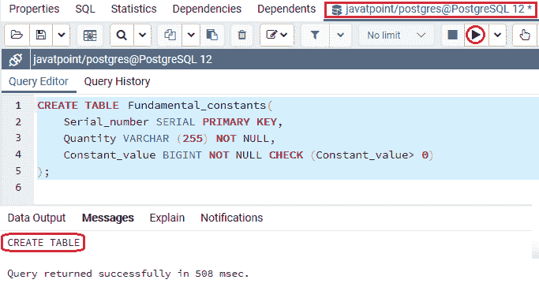
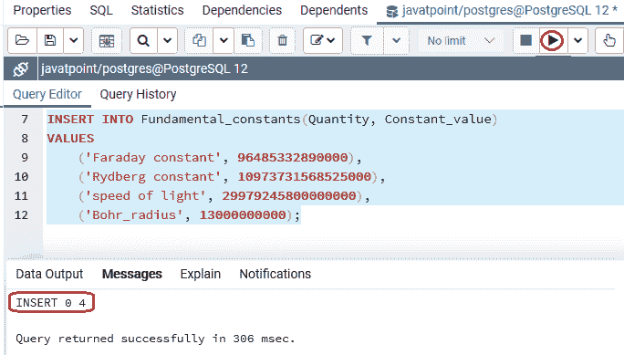
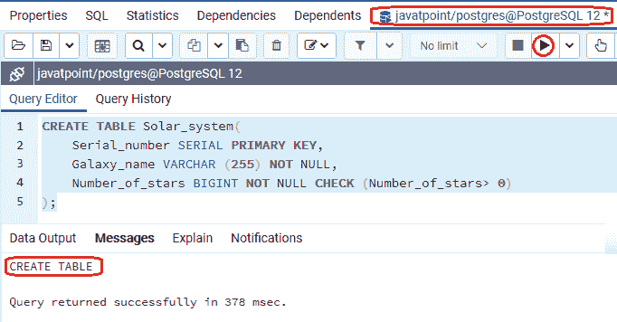
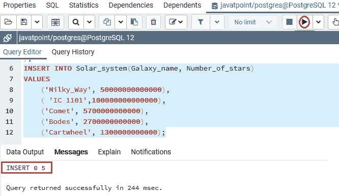
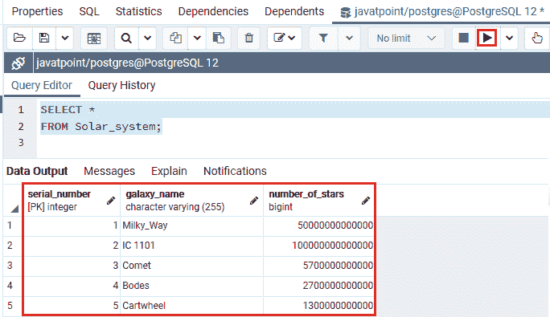

# PostgreSQL BIGINT

> 哎哎哎:# t0]https://www . javatppoint . com/PostgreSQL-bigint

在本节中，我们将了解 **PostgreSQL Bigint 数据类型**的工作原理。我们也可以看到**大数据类型**的**示例**。

## 什么是 PostgreSQL Bigint 数据类型？

在 [PostgreSQL](https://www.javatpoint.com/postgresql-tutorial) 中，我们要理解的下一个整数数据类型是 **BIGINT。**

BIGINT 数据类型为大范围整数，涉及 **8 字节**的存储大小，将整数存储在**有符号范围**和**无符号范围**内。

**签约区间**从 **-9223372036854775808 到 9223372036854775807** 开始。**无符号范围**从 **0 到 18446744073709551615** 开始。**尺寸**参数用于定义最大显示宽度 **255** 。

#### 注意:PostgreSQL 不允许我们使用无符号整数类型。

一般来说， **BIGINT 数据类型**用于存储大量的记录，如**科学常数、星系中的恒星数量**等。

**注:**

*   一般来说，我们不喜欢使用 **Bigint 数据类型**，因为它占用大量存储空间，降低了数据库服务器的性能。
*   但是，如果整数值可能超过 int 或整数数据类型给定的范围，那么我们只选择 **PostgreSQL bigint 数据**类型，因为它是一个大范围的整数。

### PostgreSQL BIGINT 数据类型的语法

PostgreSQL BIGINT 数据类型的语法如下:

```

variable_name BIGINT

```

## PostgreSQL BIGINT 数据类型示例

让我们看不同的例子来理解 **PostgreSQL BIGINT 数据类型**是如何工作的。

我们在 CREATE 命令的帮助下创建了一个新表，并使用 [INSERT 命令](https://www.javatpoint.com/postgresql-insert)插入了一些值。

在下面的例子中，我们将通过使用 **CREATE** 命令存储一些科学基础常数的值，将**基础常数**创建到 **javatpoint 数据库**中。

```

CREATE TABLE Fundamental_constants(
    Serial_number SERIAL PRIMARY KEY,
    Quantity VARCHAR (255) NOT NULL,
    Constant_value BIGINT NOT NULL CHECK (Constant_value> 0)
);

```

**输出**

执行以上命令后，我们会得到如下消息:**基本面 _ 常量**表已经创建成功，如下图截图所示:



一旦生成了表**基波常数**，我们就可以使用 insert 命令向其中插入一些值。

```

INSERT INTO Fundamental_constants(Quantity, Constant_value)
VALUES
	('Faraday constant', 96485332890000),
    	('Rydberg constant', 10973731568525000),
	('speed of light', 29979245800000000),
    	('Bohr_radius', 13000000000);

```

**输出**

执行上述命令后，我们将获得以下消息:特定值已成功插入**基波 _ 常量**表中。



从上面的截图中我们可以看到，多个值已经成功插入到**基波 _ 常量**表中。

创建并插入**基本常数**表的值后，我们将使用**选择**命令返回**基本常数**表的所有行:

```

SELECT * 
FROM Fundamental_constants;

```

**输出**

成功实现上述命令后，我们将获得以下输出:


### 示例 2

让我们再看一个详细学习 Bigint 数据类型的例子。

因此，我们将在 create 命令的帮助下创建另一个新表作为 ***太阳系*** 表，并将其放入一个类似的**数据库**中，即 **javatpoint** 来存储几个太阳系或星系中的恒星数量:

```

CREATE TABLE Solar_system(
    Serial_number SERIAL PRIMARY KEY,
    Galaxy_name VARCHAR (255) NOT NULL,
    Number_of_stars BIGINT NOT NULL CHECK (Number_of_stars> 0)
);

```

**输出**

执行以上命令后 ***太阳系*** 表已经创建成功，如下图截图所示:



一旦生成了 ***太阳系*** 表，我们将使用如下命令所示的 insert 命令向其中插入一些值:

```

INSERT INTO Solar_system(Galaxy_name, Number_of_stars)
VALUES
    	('Milky_Way', 50000000000000),
    	('IC 1101',100000000000000),
	('Comet', 5700000000000),
	('Bodes', 2700000000000), 
   	 ('Cartwheel', 1300000000000);

```

**输出**

在执行上述命令时，我们将获得以下消息:该值已成功插入 ***太阳系*** 表中。



创建并插入强>*太阳系*表的值后，我们将使用 SELECT 命令返回强【】T4*太阳系*表的所有行:

```

SELECT * 
FROM Solar_system;

```

**输出**

实现上述命令后，我们将获得如下截图所示的输出:



## 概观

在 **PostgreSQL Bigint 数据类型**部分，我们了解到它只存储了大量的记录，例如太阳系中的恒星数量**，常数**。

* * *