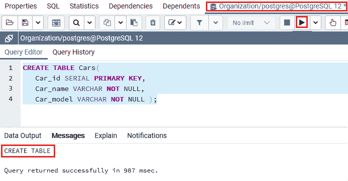
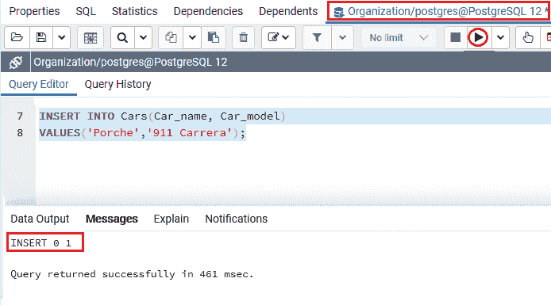
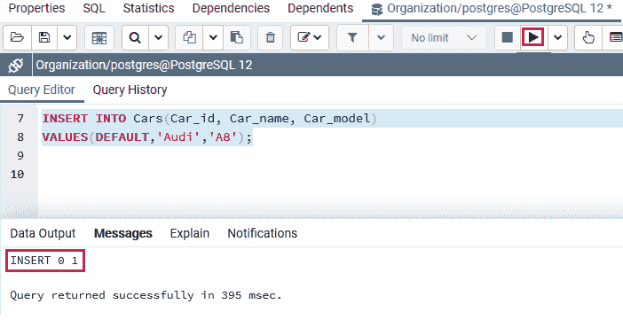
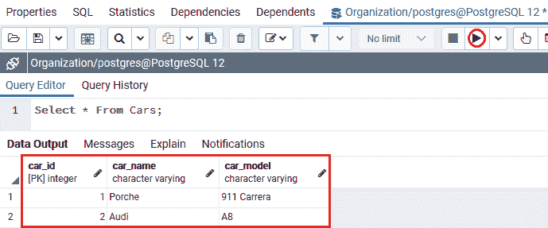
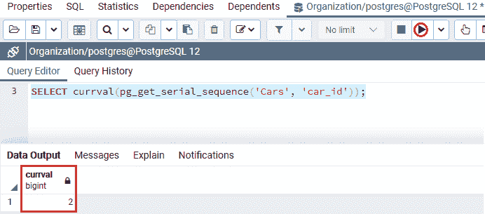
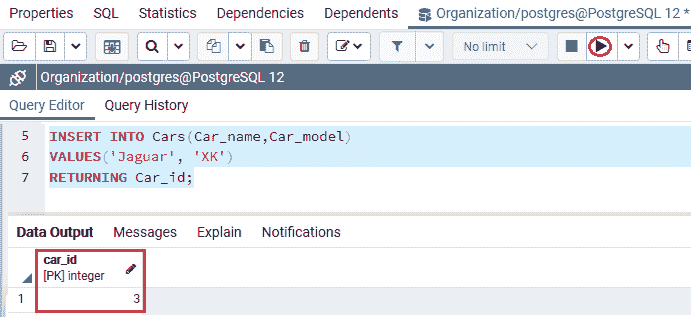
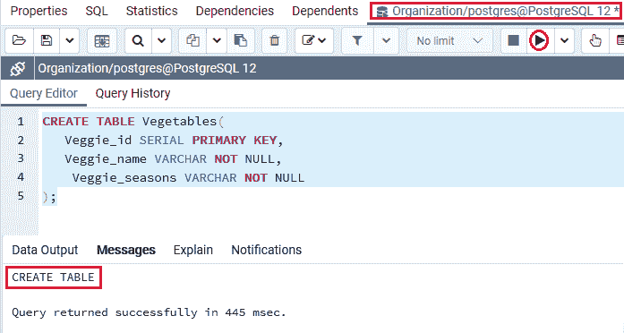
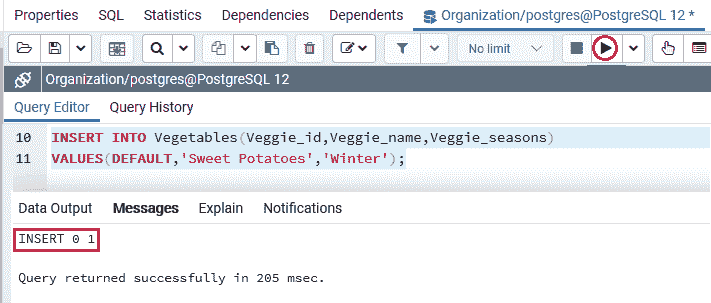
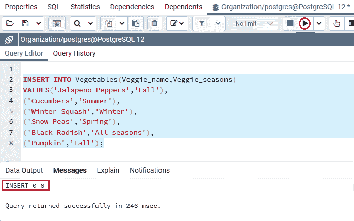
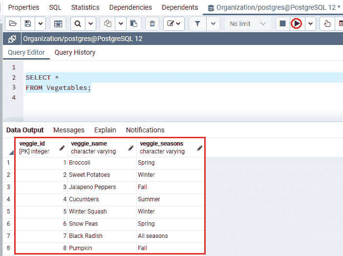

# PostgreSQL 串行

> 原文：<https://www.javatpoint.com/postgresql-serial>

在本节中，我们将了解 **PostgreSQL Serial** 伪类型的工作原理，它允许我们在表中定义**自动递增列**。我们也看到**例子**的 **PostgreSQL Serial 伪类型**。

## 什么是 PostgreSQL Serial 伪类型？

在 [PostgreSQL](https://www.javatpoint.com/postgresql-tutorial) 中，我们有一种特殊的数据库对象生成器，称为**序列**，用于**创建一个整数序列**，该序列经常用作表中的**主键**。

当我们创建一个新的表时，可以在 **SERIAL 伪类型**的帮助下生成序列，如下面的命令所示:

```sql

CREATE TABLE table_name(
    ID SERIAL
);

```

如果我们将**串行伪类型**提供给**标识**列，PostgreSQL 会执行以下操作:

*   首先，PostgreSQL 将创建一个序列对象，然后将序列创建的下一个值建立为特定列的预定义值。
*   之后，PostgreSQL 将增强对**标识列**的**非空约束**，因为序列总是产生一个整数，该整数是**非空值**。
*   最后，PostgreSQL 会将序列的所有者提供给 **ID 列；**作为输出，当表或**标识列**被删除时，序列对象被删除。

#### 注意:我们可以使用这两个命令来指定串行伪类型，因为下面的两个命令彼此相似。

```sql

CREATE TABLE table_name(
    ID SERIAL
);

```

```sql

CREATE SEQUENCE table_name_ID_seq;
CREATE TABLE table_name (
   ID integer NOT NULL DEFAULT nextval('table_name_ID_seq')
);

ALTER SEQUENCE table_name_ID_seq
OWNED BY table_name.ID;

```

**PostgreSQL 串行伪类型**分为以下三种类型:

*   **小串行**
*   **串行**
*   **【big serial】**

我们有下表，其中包含 PostgreSQL 支持的所有**串行伪类型**规范:

| 名字 | 存储大小 | 范围 |
| SMALLSERIAL | 2 字节 | 1 至 32767 |
| 连续的 | 4 字节 | 1 至 2147483647 |
| BIGSERIAL | 8 字节 | 1 到 92233720368547758 . 8888888886 |

### 串行伪类型的语法

PostgreSQL **串行伪类型**的语法如下:

```sql

variable_name SERIAL

```

## PostgreSQL SERIAL 类型的示例

让我们看不同的例子来理解 **PostgreSQL Serial 伪类型是如何工作的**。

#### 注意:我们可以为 SERIAL 列定义主键约束，因为 SERIAL 类型不会间接在列上创建索引，也不会将列作为主键列。

我们在 CREATE 命令的帮助下创建了一个新表，并使用 [INSERT 命令](https://www.javatpoint.com/postgresql-insert)插入了一些值。

在下面的例子中，我们使用 **CREATE** 命令生成一个 ***Cars*** 表进入**组织数据库:**

```sql

CREATE TABLE Cars(
   Car_id SERIAL PRIMARY KEY,
   Car_name VARCHAR NOT NULL,
   Car_model VARCHAR NOT NULL 
);

```

**输出**

执行以上命令后 **Cars** 表已经创建成功，如下图截图所示:



一旦生成了 ***【汽车】*** 表，我们就可以使用 insert 命令向其中插入一些值。我们可以在 INSERT 命令中使用 **DEFAULT** 关键字或者省略列名 **(Car_id)** 。

```sql

INSERT INTO Cars(Car_name, Car_model) 
VALUES('Porche','911 Carrera');

```

**输出**

执行上述命令后，我们将获得以下消息，该值已成功插入 ***Cars*** 表中:



**或**使用**默认关键字**，列名为 **(Car_id):**

```sql

INSERT INTO Cars(Car_id, Car_name, Car_model) 
VALUES(DEFAULT,'Audi','A8');

```

**输出**

在执行上述命令时，我们将获得以下消息；该值已成功插入 ***汽车*** 表格:



从上面的截图中我们可以看到，PostgreSQL 在 ***Cars*** 表中插入了两行，其中 **Car_id** 列值为 **1 和 2** 。

创建并插入**车**表的值后，我们将使用 [**选择**命令](https://www.javatpoint.com/postgresql-select)返回**车**表的所有行:

```sql

SELECT * FROM Cars;

```

**输出**

成功实现上述命令后，我们将获得以下结果:



我们可以使用 **pg_get_serial_sequence()** 函数来获取指定表中 **SERIAL** 列的序列名称，如下语法所示:

```sql

pg_get_serial_sequence('table_name','column_name')

```

要获取序列创建的**当前值**，我们可以向 currval()函数传递一个序列名称。

在下面的例子中，我们使用**currval()**函数返回由 ***Cars*** 表 **Car_id_seq** 对象产生的当前值:

```sql

SELECT currval(pg_get_serial_sequence('Cars', 'car_id'));

```

**输出**

执行上述命令后，我们将获得以下输出:



如果我们想在表中插入一个新行时得到序列创建的那些值，我们可以在 INSERT 命令中使用 **RETURNING Car_id** 子句。

以下命令用于在 **Cars** 表中插入一个新行，并返回为 **Car_id** 列生成的那些记录。

```sql

INSERT INTO Cars(Car_name,Car_model) 
VALUES('Jaguar', 'XK')
RETURNING Car_id;

```

**输出**

执行上述命令后，我们将得到如下输出，该输出将 **Car_id** 返回为 **3** :



**注:**

*   正如我们上面理解的那样，**序列生成器**操作不是事务安全的，这意味着如果两个并行数据库连接试图从一个序列中获取下一个值，每个用户将获得不同的值**。**
*   并且如果**一个用户可以回滚事务**，该用户的序列号将处于空闲状态，并在序列中创建一个间隙。

### 示例 2

让我们再看一个例子来详细学习**串行伪型**。

因此，我们将在 create 命令的帮助下创建另一个新表作为 ***蔬菜*** 表，并将其放入类似的**数据库**中，即**组织**，其中 **Veg_id** 列作为 **SERIAL** 伪类型。

```sql

CREATE TABLE Vegetables(
  	 Veggie_id SERIAL PRIMARY KEY,
   	Veggie_name VARCHAR NOT NULL,
Veggie_seasons VARCHAR NOT NULL
);

```

**输出**

执行以上命令后 ***【蔬菜】*** 表已成功创建，如下图截图所示:



一旦生成了 ***【蔬菜】*** 表，我们将使用 insert 命令向其中插入一些值，并省略 **Veggies_id** 列，如下命令所示:

```sql

INSERT INTO Vegetables(Veggie_name,Veggie_seasons) 
VALUES('Broccoli','Spring');

```

**输出**

在执行上述命令时，我们将获得以下消息:该值已成功插入到 ***【蔬菜】*** 表中。


或者，我们也可以使用 **Default** 关键字并使用 **Veggie_id** 列，如下命令所示:

```sql

INSERT INTO Vegetables (Veggie_id,Veggie_seasons, Veggie_seasons) 
VALUES(DEFAULT, 'Sweet Potatoes','Winter');

```

**输出**

执行上述命令后，我们会得到下面的消息，它说要么我们可以使用**默认关键字**要么**忽略列名**，我们会得到类似的输出:



因此，我们将在以下命令的帮助下向*表添加更多的值:*

```sql

INSERT INTO Vegetables(Veggie_name,Veggie_seasons) 
VALUES('Jalapeno Peppers','Fall'),
('Cucumbers','Summer'),
('Winter Squash','Winter'),
('Snow Peas','Spring'),
('Black Radish','All seasons'),
('Pumpkin','Fall');

```

**输出**

执行上述命令后，我们会得到如下消息，显示该值已成功插入 ***【蔬菜】*** 表中。



创建并插入**蔬菜**表的值后，我们将使用**选择**命令返回**蔬菜**表的所有行:

```sql

SELECT * 
FROM Vegetables;

```

**输出**

成功实现上述命令后，我们将获得以下输出:



## 概观

在 **PostgreSQL Serial 伪类型**部分，我们学习了 Serial 伪类型功能，该功能主要用于为特定的表创建**自动增加**列值。

* * **