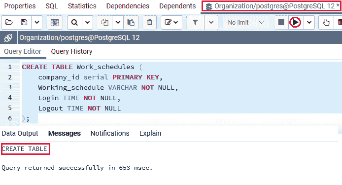
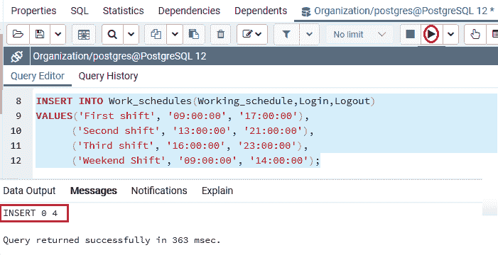
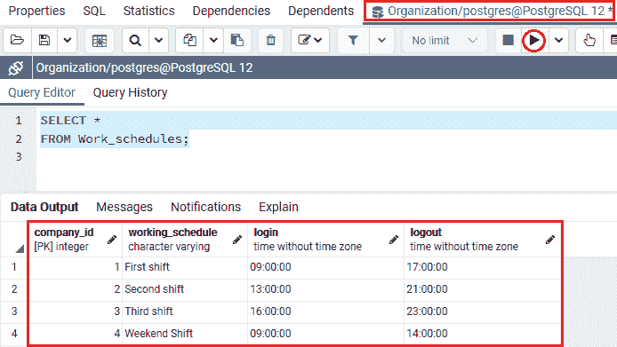
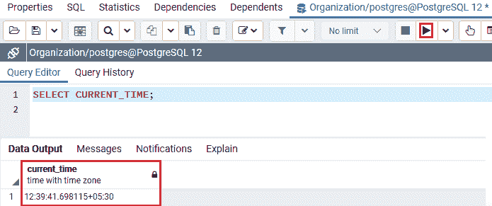
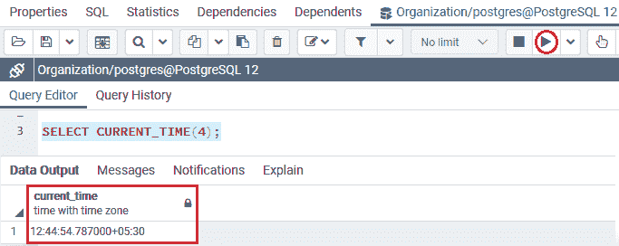
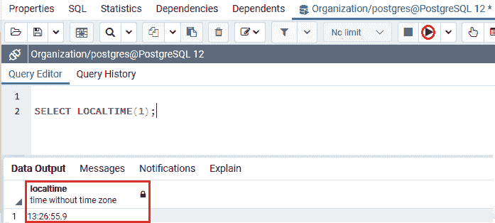
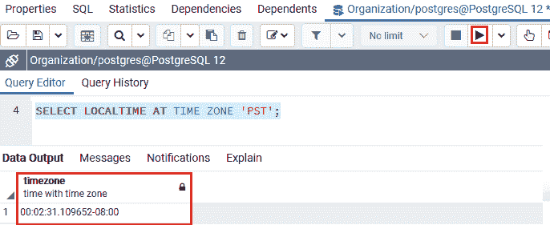
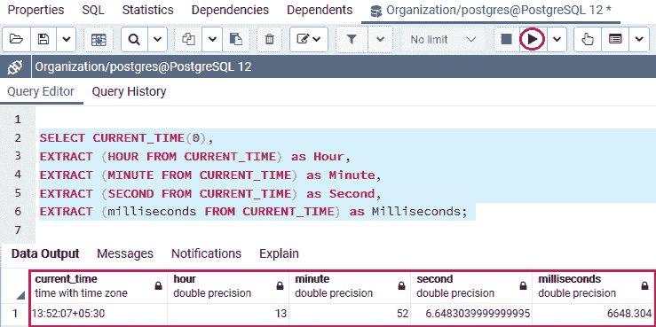
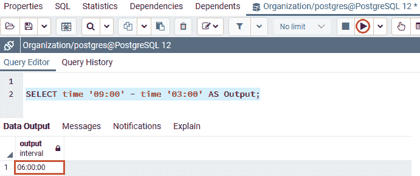
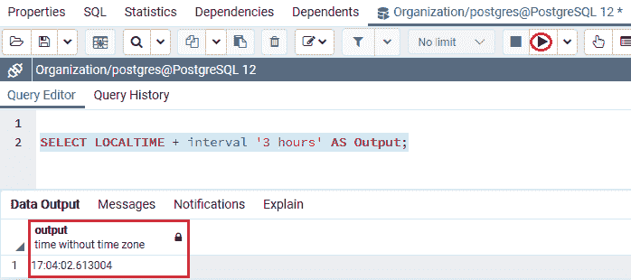

# PostgreSQL 时间

> 原文：<https://www.javatpoint.com/postgresql-time>

在本节中，我们将了解 **PostgreSQL 时间数据类型**的工作原理。我们还看到了**时间数据类型**的**示例**，我们还看到了一些可访问的时间函数，它们帮助我们更有效地处理时间值。

## 什么是 PostgreSQL 时间数据类型？

在 [PostgreSQL](https://www.javatpoint.com/postgresql-tutorial) 中，下一个数据类型是**时间**，它存储了**一天中的时间值**。

PostgreSQL 时间数据类型涉及 **8 字节的存储**和高达 **6 位数的精度**，时间数据类型的范围从 00:00:00 到 24:00:00。

#### 注意:这里，精度用于定义第二个字段中的小数位数。

### PostgreSQL 时间数据类型的语法

PostgreSQL 时间数据类型语法如下:

```sql

column_name TIME(precision);

```

一般我们会使用如下**时间格式，**如下所示:

```sql

HH:MM   
HH:MM:SS
HHMMSS

```

或者如果我们想使用精度，那么我们将使用下面的**时间格式:**

```sql

MM:SS.pppppp    
HH:MM:SS.pppppp
HHMMSS.pppppp

```

#### 注意:在上面的格式中，P 用于精度值。

让我们看一些**时间值格式**的例子，以便我们更好地理解:

首先，我们将看到没有精确时间格式值的**示例:**

```sql

06:05
06:05:04
060504

```

现在，我们将看到带有精确时间格式值的**示例:**

```sql

06:59.999999
06:05:04.333333
060504.3333333

```

#### 注意:通常，PostgreSQL 采用几乎任何合理的时间格式以及与 SQL 兼容的 ISO 8601 等。

## PostgreSQL 时间数据类型示例

让我们看一个示例来理解 **PostgreSQL 时间数据类型**是如何工作的。

在 CREATE 命令的帮助下，我们正在创建一个新的表作为 ***工作日程*** ，并使用[插入命令](https://www.javatpoint.com/postgresql-insert)插入一些值。

要将 ***工作日程*** 创建到**组织数据库**中，我们使用 **CREATE** 命令。

***工作日程*** 表包含 **Comapny_id、工作日程、登录**和**注销**等各列，对于**登录和注销**列，我们使用**时间数据类型**，如下命令所示:

```sql

CREATE TABLE Work_schedules (
    company_id serial PRIMARY KEY,
    Working_schedule VARCHAR NOT NULL,
    Login TIME NOT NULL,
    Logout TIME NOT NULL
);  

```

**输出**

在执行上述命令时，我们将获得以下消息: ***【工作日程】*** 表已成功创建。



当 ***Work_schedules*** 表创建成功后，我们将在 **INSERT** 命令的帮助下向其中插入一些值。

```sql

INSERT INTO Work_schedules(Working_schedule,Login,Logout)
VALUES
('First shift', '09:00:00', '17:00:00'),
 ('Second shift', '13:00:00', '21:00:00'),
 ('Third shift', '16:00:00', '23:00:00'),
 ('Weekend Shift', '09:00:00', '14:00:00');

```

**输出**

执行上述命令后，我们将获得以下消息窗口，该窗口显示特定值已成功插入 ***Work_schedules*** 表。



创建并插入 ***工作日程*** 表的值后，我们将使用**选择**命令返回 ***工作日程*** 表的所有行:

```sql

SELECT * 
FROM Work_schedules;

```

**输出**

成功执行上述命令后，我们将获得以下输出，其中显示了 ***Work_schedules*** 表中的所有数据:



## 时区类型的 PostgreSQL TIME

PostgreSQL 允许我们使用时区数据类型和**时间数据类型**来部署**时间，这允许我们通过时区来部署和检索一天中的时间。**

要用时区声明数据类型为 **TIME 的列，我们将使用以下语法:**

```sql

column TIME with time zone

```

**带时区的时间数据类型**包含 **12 字节**，允许我们存储从 **00:00:00+1459 到 24:00:00-1459** 范围的带时区的时间值。

以下示例用于显示带有时区值的**时间:**

```sql

06:05:04 IST    
06:05:04.123-2   

```

## 后置 SQL 时间函数示例

我们有以下**时间函数**，如 **CURRENT_TIME、CURRENT_TIME(精度)、LOCAL_TIME、LOCALTIME(精度)、EXTRACT()，将时间值转换为不同的时区，并对 PostgreSQL 中可用的时间值使用算术运算符**，这有助于我们在使用 **ime 数据类型时提高性能。**

让我们看不同的例子来理解 **PostgreSQL 时间函数**是如何工作的。

*   **获取当前时间**

我们可以使用 **CURRENT_TIME** 功能通过时区检索**当前时间。**

要返回数据库服务器的当前时间，我们可以使用以下命令:

```sql

SELECT CURRENT_TIME;

```

**输出**

执行上述命令后，我们将在输出中借助 **CURRENT_TIME 功能**得到**当前时间**，如下图:



我们可以使用 **CURRENT_TIME(精度)**功能以**特定精度**检索**当前**时间。

让我们看一个例子，以便更好地理解。

以下命令用于以指定精度获取**当前时间**:

```sql

SELECT CURRENT_TIME(4);

```

**输出**

执行上述命令后，我们会得到如下输出，精确显示**存在的时间:**



#### 注意:正如我们在两个语句中看到的，如果我们定义 CURRENT_TIME 函数没有精度，那么它将返回一个具有完全可访问精度的时间值。

*   **获取当地时间**

我们可以使用 **LOCALTIME 功能**来检索本地时间，如下命令所示:

```sql

SELECT LOCALTIME;

```

**输出**

在执行上述命令时，我们将获得以下输出，其中显示了本地时间:


在 PostgreSQL 中，我们有 **LOCALTIME(精度)函数**，它用于检索具有特定精度的本地时间，就像我们在 **CURRENT_TIME(精度)函数**的帮助下找到**当前时间精度**一样。

在下面的例子中，我们使用 **LOCALTIME(精度)**函数来获得指定精度的本地时间。

```sql

 SELECT LOCALTIME(1);

```

**输出**

执行上述命令后，我们将得到如下输出，精确显示**当地时间:**



*   **将时间更改为不同的时区**

以下语法用于将时间更改为不同的时区:

```sql

[TIME with time zone] AT TIME ZONE time_zone

```

**让我们看一个样例来详细了解:**

在下面的示例中，我们将尝试将本地时间更改为时区 **PST(太平洋标准时间)**的时间，如下命令所示:

```sql

SELECT LOCALTIME AT TIME ZONE 'PST';

```

**输出**

成功执行上述命令后，我们将获得以下输出，显示本地时间已转换为 PST 时区。



*   **从时间值中提取小时、分钟、秒**

我们可以使用**提取功能**从时间值中提取小时、分钟、秒。

下面的语法用于为 PostgreSQL 时间数据类型提取**小时、分钟、秒**:

```sql

EXTRACT(field FROM time_value);

```

#### 注意:在上面的语法中，字段可以是小时、分钟、秒、毫秒。

让我们看一个示例，我们尝试使用 **EXTRACT()** 功能和 **CURRENT_TIME(精度)功能**进入 [SELECT 命令](https://www.javatpoint.com/postgresql-select):

```sql

SELECT CURRENT_TIME(0),
EXTRACT (HOUR FROM CURRENT_TIME) as Hour,
EXTRACT (MINUTE FROM CURRENT_TIME) as Minute, 
EXTRACT (SECOND FROM CURRENT_TIME) as Second,
EXTRACT (milliseconds FROM CURRENT_TIME) as Milliseconds;

```

**输出**

执行上述命令后，我们将获得以下输出，该输出将 **CURRENT_TIME(0)提取为小时、分钟、秒和毫秒:**



*   **时间值的算术运算**

在 PostgreSQL 中，我们可以在时间值上以及在**时间和间隔**值之间使用**算术运算符**，如 **+、-、*** 。

在下面的示例中，它用于返回两个时间值之间的间隔:

```sql

SELECT time '09:00' - time '03:00' AS result;

```

**输出**

执行下面的命令会得到下面的结果，显示 **09:00- 03:00** 之间的时间间隔。



如果我们想将本地时间增加 3 小时，我们将使用以下命令:

```sql

SELECT LOCALTIME + interval '3 hours' AS Output;

```

**输出**

执行上述命令后，我们将得到以下结果:



#### 注意:在上面的例子中，时间值是时间值和间隔值的总和。

## 概观

在 **PostgreSQL 时间数据类型** e 部分，我们学习了以下主题:

*   **PostgreSQL 时间数据类型**用于存储指定列的时间值。
*   我们使用了不同的**时间函数**，例如，**当前时间，当前时间(精度)，本地时间，本地时间(精度)，提取()**，来增强和处理特定表格中的时间值。
*   我们可以将**时间值**转换成**不同的时区**。
*   我们使用时间值上的**算术运算符来寻找时间间隔和时间值的总和。**

* * *