# PostgreSQL 时间戳

> 原文：<https://www.javatpoint.com/postgresql-timestamp>

在本节中，我们将了解 **PostgreSQL 时间戳数据类型**的工作原理。我们还看到了**时间戳数据类型**的**示例**，我们还看到了一些可访问的时间戳函数，如 **NOW()、CURRENT_TIMESTAMP、CURRENT_TIME、TIMEOFDAY()，以及时区(zone，timestamp)** ，它们帮助我们更有效地处理时间值。

## 什么是 PostgreSQL 时间戳数据类型？

在 PostgreSQL 中，下一个数据类型是**时间戳**，它可以存储**时间**和**日期**值。但不支持任何**时区数据**。这意味着当我们转换数据库服务器的**时区**时，**时间戳值**将存储在数据库中，不能重复修改。

在 PostgreSQL 中，时间戳数据类型分为**两种时态数据类型，**如下:

*   **时间戳**
*   **timpstamptz**

**时间戳**:使用时间戳数据类型**无时区一**。

**Timestamptz**:Timestamptz 数据类型使用**带时区**。

**注:**

*   **timestamptz 数据类型**是与时区相关的**日期和时间**数据类型，是带有时区的**时间戳。**
*   **时间戳和 timestamptz** 存储**时间戳值的 8 字节存储**，如以下命令所示:

```sql

SELECT typname, typlen
FROM pg_type
WHERE typname ~ '^timestamp'; 

```

**输出**

激发上面的命令后，我们将得到下面的输出，其中我们可以看到**时间戳和 timestamptz** 数据类型都存储了 **8 字节**的时间戳值。

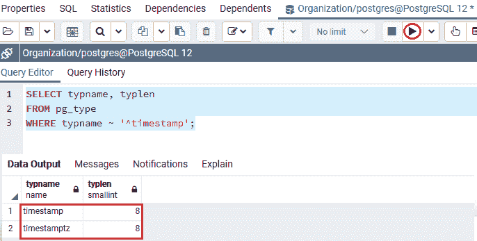

在 PostgreSQL 中，**time tamptz**数据类型存储在 **UTC 值**中:

*   如果我们在 timestamptz 列中插入一个值，PostgreSQL 会将 timestamptz 值更改为 **UTC 值**，并将 UTC 值存储在表中。
*   PostgreSQL 将 **UTC 值**更改回由数据库服务器、当前数据库连接或用户(如果我们从数据库请求**timestampz**)建立的**时区**。
*   PostgreSQL 不包含任何带有**时间标签**的**时区**数据

### PostgreSQL 时间戳数据类型的语法

PostgreSQL 时间戳数据类型的语法如下:

```sql

TIMESTAMP; 

```

**或**

```sql

TIMESTAMPTZ;

```

### PostgreSQL 时间戳数据类型示例

让我们看一个示例来理解 **PostgreSQL 时间戳和 timestamptz 数据类型**是如何工作的。

我们正在创建一个新表作为 ***ts_demo，*** ，该表在 CREATE 命令的帮助下包含**时间戳**和 **timestamptz** 数据类型，并使用 INSERT 命令插入一些值。

要将 ***ts_demo*** 创建到 **Javatpoint 数据库**中，我们使用 **CREATE** 命令。

***ts_demo*** 表包含 **ts1 TIMESTAMP** 和**ts2**T8】TIMESTAMPTZ、两列，如下命令所示:

```sql

CREATE TABLE ts_demo (
	ts1 TIMESTAMP, 
	ts2 TIMESTAMPTZ
);

```

**输出**

在执行上述命令时，我们将获得以下消息: ***ts_demo*** 表已成功创建。

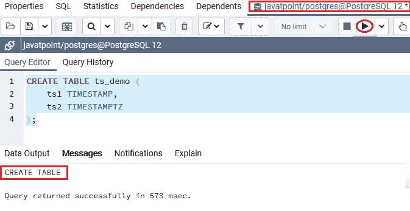

当 ***ts_demo*** 表创建成功后，我们将数据库服务器的**时区**设置为**澳洲/达尔文**，如下命令所示:

```sql

SET TIMEZONE ='Australia/Darwin';

```

**输出**

执行上述命令后，我们将获得下面的消息窗口，其中显示时区已成功设置。

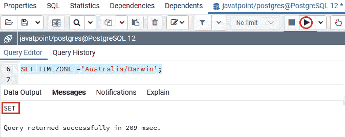

如果要查看**当前时区**，可以使用如下命令，如下图:

```sql

SHOW TIMEZONE;

```

**输出**

执行上述命令后，我们将获得以下输出:

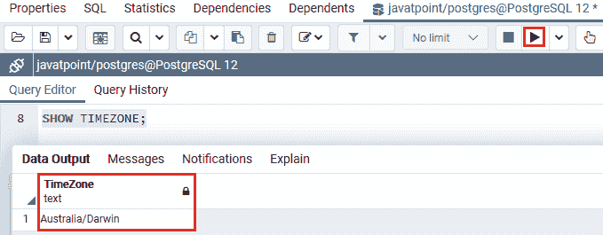

将时区设置为**澳洲/达尔文**成功后，我们将在 **INSERT** 命令的帮助下向其中插入一些值。

```sql

INSERT INTO ts_demo (ts1, ts2)
VALUES('2020-10-05 14:01:10-08',
	   '2020-10-05 14:01:10-08');

```

**输出**

执行上述命令后，我们将获得以下消息窗口，显示特定值已成功插入 ***ts_demo*** 表。

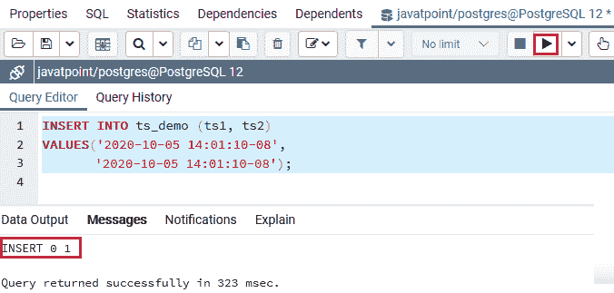

创建并插入 ***ts_demo 表的*** 值后，我们将使用 **SELECT** 命令返回 ***ts_demo*** 表的所有行:

```sql

SELECT ts1, ts2
FROM ts_demo;

```

**输出**

成功执行上述命令后，我们将获得以下输出，该输出显示了 ***ts_demo*** 表中的时间戳值:

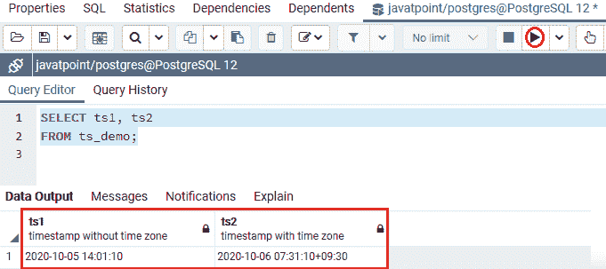

之后，我们将再次将当前会话的时区修改为**亚洲/加尔各答**，如下命令所示。

```sql

SET TIMEZONE = 'Asia/Calcutta';

```

**输出**

在执行上述命令时，我们将获得下面的消息窗口，显示新时区已成功设置。

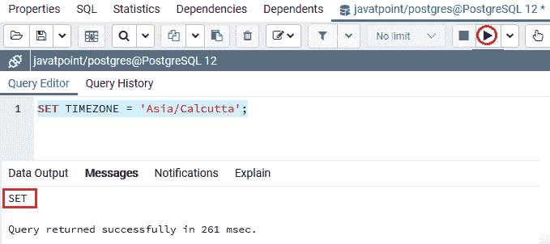

然后，我们将使用 **SELECT** 命令查看 ***ts_demo*** 表中的现有数据:

```sql

SELECT ts1, ts2
FROM ts_demo;

```

**输出**

成功执行上述命令后，我们将检索以下结果:

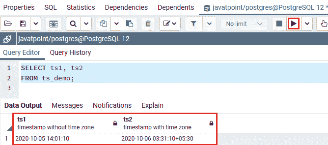

如我们所见，**时间戳**列中的两个输出值都不会修改，但是**时间戳列**中的值可以根据**“亚洲/加尔各答”**的新时区进行更改。

#### 注意:通常，我们将使用 timestamptz 数据类型来存储时间戳数据值，因为它总是一个很好的练习。

## PostgreSQL 时间戳函数

我们有以下**时间戳函数**，如 **NOW()，CURRENT_TIMESTAMP，CURRENT_TIME，TIMEOFDAY()，使用时区(区域，时间戳)** **函数**将时间值转换为不同的时区**，这有助于我们在使用**时间戳数据类型**时提高性能。**

让我们看不同的例子来理解 **PostgreSQL 时间戳函数**是如何工作的。

### 获取当前时间

我们可以使用 **NOW()** 功能来检索**当前时间戳**。

要返回数据库服务器的当前时间戳，我们可以使用以下命令:

```sql

SELECT NOW();

```

**输出**

执行上述命令后，我们将在输出中借助 **NOW()函数**得到**当前时间戳**，如下图:

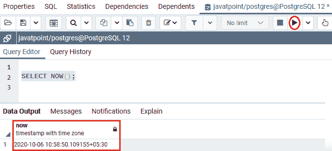

或者我们也可以使用 **CURRENT_TIMESTAMP** 函数来获取带有时区的当前时间戳:

```sql

SELECT CURRENT_TIMESTAMP;

```

**输出**

执行上述命令后，我们将在输出中使用 **CURRENT_TIMESTAMP 函数**获得带有时区的**当前时间戳**，如下所示:

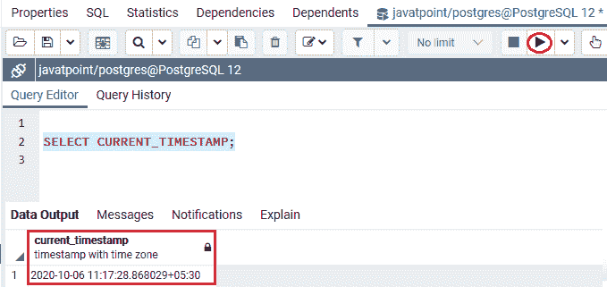

并且我们可以使用 **CURRENT_TIME** 功能，该功能可以帮助我们检索没有日期的当前时间。

#### 注意:CURRENT_TIMESTAMP 和 CURRENT_TIME 这两个函数都用于返回带有时区的当前时间。

在 PostgreSQL 中，我们还可以借助 **timeofday()** 函数检索**字符串格式**中的**时刻**，如下命令所示:

```sql

SELECT TIMEOFDAY();

```

**输出**

成功执行上述命令后，我们将在输出中使用 **TIMEOFDAY()函数**获得字符串格式的时间，如下所示:

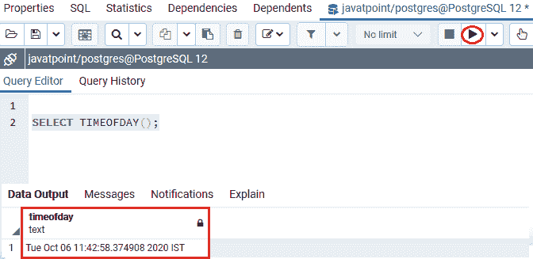

### 时区之间的修改

我们可以使用**时区(区域，时间戳)**功能将时间戳更改为另一个时区。

以下语法用于将时间更改为不同的时区:

```sql

SELECT timezone(zone, timestamp) ;

```

首先，借助以下命令，我们会看到**当前时区**，如下图:

```sql

SHOW TIMEZONE;

```

**输出**

执行上述命令后，我们会得到如下输出，显示数据库服务器中**当前时区**为**亚洲/加尔各答**:

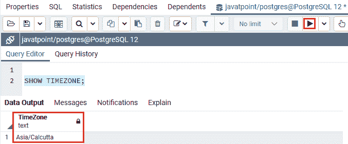

让我们看一个例子，以便更好地理解。

现在，我们使用**时区()**功能将**当前时区**修改为 **2020-10-06 00:00** 至**澳洲/悉尼**时区，如下命令所示:

```sql

SELECT timezone('Australia/Sydney','2020-10-06 02:14');

```

**输出**

在执行上述命令时，我们将获得以下输出，该输出显示基于**澳大利亚/悉尼**时区的修改时间:

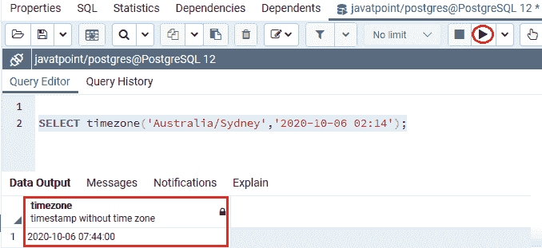

#### 注意:如果我们将时间戳作为字符串提供给 timezone()函数，PostgreSQL 会间接执行 timestamptz。

将**时间戳**值直接转换为**时间戳**数据类型，因为这始终是一种很好的方法，如下命令所示:

```sql

SELECT timezone('America/New_York','2016-06-01 00:00'::timestamptz);

```

**输出**

成功执行上述命令后，我们会得到下面的输出，其中显示了转换后的时间，没有带有 **timestamptz 数据**类型的时间。

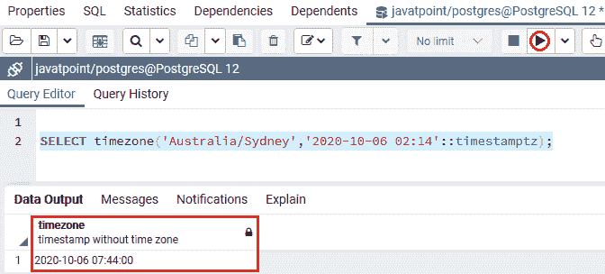

## 概观

在 **PostgreSQL 时间戳数据类型**部分，我们学习了以下主题:

*   **PostgreSQL 时间戳数据**类型用于存储指定列的时间和日期值。
*   我们使用了不同的**时间戳函数**，例如， **NOW()，CURRENT_TIMESTAMP，CURRENT_TIME，TIMEOFDAY()，以及时区(区域，时间戳)**来增强和处理特定表中的时间和日期值。
*   我们可以使用时区(区域，时间戳)功能将**时间戳值**更改为**不同的时区。**

* * *