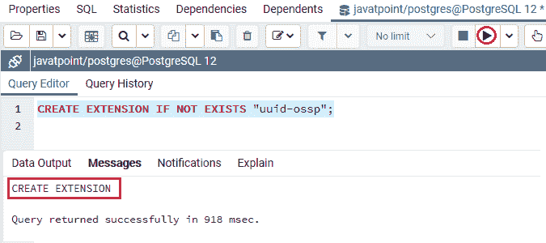
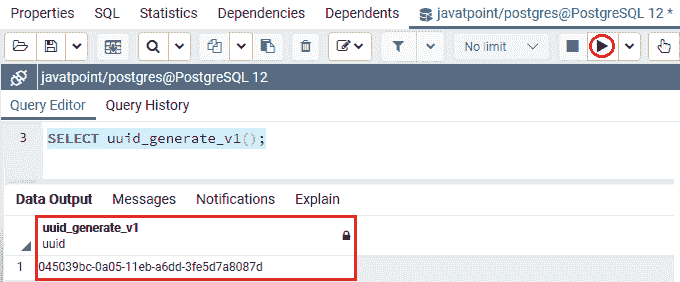
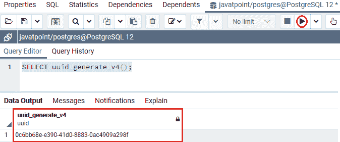
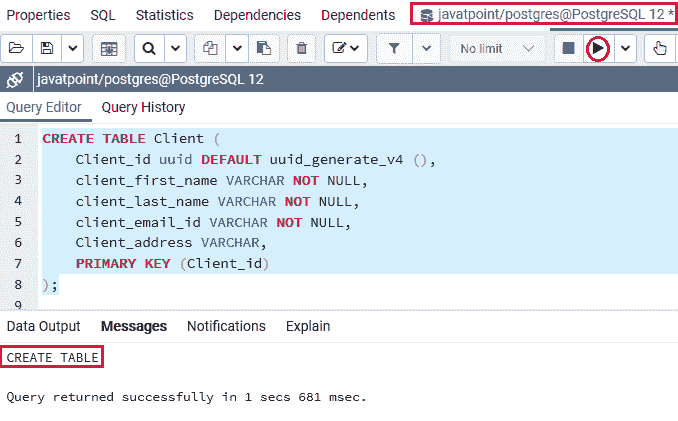
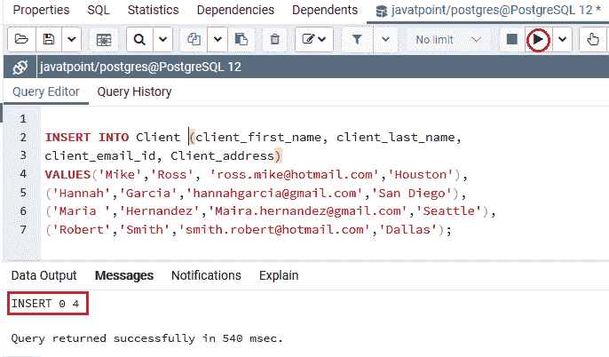
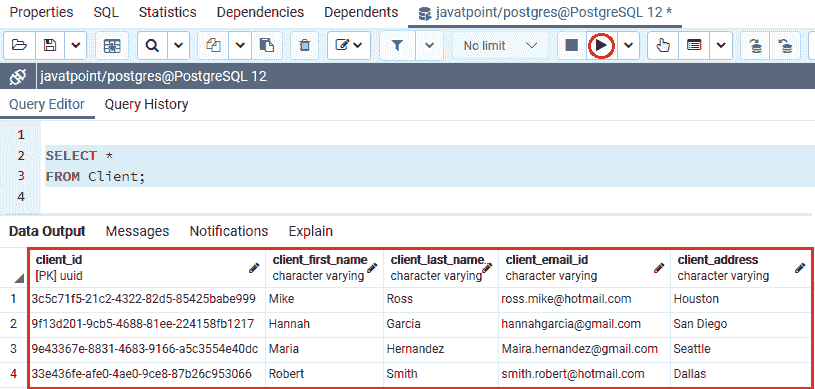

# PostgreSQL UUID

> 原文：<https://www.javatpoint.com/postgresql-uuid>

在本节中，我们将了解 **PostgreSQL UUID 数据类型**的工作原理。我们也看到了 **UUID 数据类型**的**示例**，我们也看到了一些如何在提供的模块的帮助下创建 UUID 值。

## 什么是 PostgreSQL UUID 数据类型？

在 PostgreSQL 中，下一个数据类型是**通用唯一标识符**，也称为 **RFC 4122** 指定的 **UUID** 和另一个连接标准。

**UUID** 值是一个由算法创建的 128 位长值，借助类似的算法识别信息，使其在已知的**宇宙**中独一无二。

让我们看一些 UUID 值的示例，如下图所示:

```

6ecd8c99-4036-403d-bf84-cf8400f67836
c81d4e2e-bcf2-11e6-869b-7df92533d2db
237e9877-e79b-12d4-a765-321741963000 

```

从上面的例子中我们可以看到，UUID 是由**十六进制数字**的 **32 位数字**以及**四个连字符(-)组成的排列。**UUID 可能是**零**，其中所有位都设置为**零**。

我们经常在分布式系统中发现 UUID 的独特之处。与 PostgreSQL SERIAL 数据类型相比，它还确保了更好的个性，后者在单个数据库中创建唯一的值。

#### 注意:在 PostgreSQL 数据库中，我们可以使用 UUID 数据类型来存储 UUID 值，并提供生成这些值的模块。

## 如何在 PostgreSQL 中创建 UUID 值

PostgreSQL 使我们能够存储和等同 UUID 值，但它不包含函数，并在其核心创建 UUID 值。

而不是依赖于**第三方模块**传递特定的算法来创建 uuid，例如 **uuid-ossp** 模块包含一些可访问的功能，这些功能执行创建 uuid 的标准算法。

我们将使用以下 **CREATE EXTENSION** 命令在 **Javatpoint** 数据库中安装 **uuid-ossp** 模块。

```

CREATE EXTENSION IF NOT EXISTS "uuid-ossp";

```

**输出**

执行上述命令后，我们将获得以下消息: **uuid_ossp** 已通过**创建扩展**命令成功安装。



我们在上面的命令中使用了 **IF NOT EXISTS** 子句，它为我们提供了避免重新安装模块的方法。

我们可以使用 **uuid_generate_v1()函数**根据当前时间戳、计算机的 MAC 地址分组和随机值来创建 uuid 值:

```

SELECT uuid_generate_v1();

```

**输出**

我们将在执行上面的命令时得到以下结果，它显示了由 **uuid_generate_v1()函数创建的 UUID 值。**



在下面的命令中，我们将使用 **uuid_generate_v4()** 函数来创建唯一依赖于随机数的 uuid 值:

```

SELECT uuid_generate_v4();

```

**输出**

成功执行上述命令后，我们将得到以下结果，显示由 **uuid_generate_v1()函数创建的 UUID 值。**



### PostgreSQL UUID 数据类型示例

让我们看一个示例来理解 **PostgreSQL UUID 数据类型**是如何工作的。

在 CREATE 命令的帮助下，我们正在创建一个新表作为客户端 和 **UUID 列**，并使用 INSERT 命令插入一些值。

***【客户端】*** 表包含**客户端 _id、客户端 _ 名字、客户端 _ 姓氏、客户端 _ 电子邮件 _id、客户端 _ 地址等各种列。**

对于 **client_id** 列，我们使用 **UUID 数据类型，**也是**主键。**此外，**主基本列值**将通过 **uuid_generate_v4()** 功能自动创建。

要创建一个 ***客户端*** 表到一个类似的**数据库中，该数据库是 Javatpoint，**我们在其中安装 **uuid_ossp 模块，**我们使用 **CREATE** 命令，如以下命令所示:

```

CREATE TABLE Client (
    Client_id uuid DEFAULT uuid_generate_v4 (),
    client_first_name VARCHAR NOT NULL,
    client_last_name VARCHAR NOT NULL,
    client_email_id VARCHAR NOT NULL,
    Client_address VARCHAR,
    PRIMARY KEY (Client_id)
);

```

**输出**

执行上述命令时，我们会得到如下消息，显示 ***客户端*** 表已经创建成功。



在上面的命令中，我们为 **Client_id** 列使用了 UUID 数据类型，其中 **Client_id** 列具有由 **uuid_generate_v4()** 函数给出的默认值。

因此，如果我们插入一个新行而没有定义**客户端 _id** 列的值，PostgreSQL 将调用 **uuid_generate_v4()** 函数来创建**客户端 _id** 值。

当 ***客户端*** 表创建成功后，我们将在 **INSERT** 命令的帮助下向其中插入一些值。

```

INSERT INTO Client (client_first_name, client_last_name, 
client_email_id, Client_address)
VALUES('Mike','Ross', 'ross.mike@hotmail.com','Houston'),
('Hannah','Garcia','hannahgarcia@gmail.com','San Diego'),
('Maria ','Hernandez','Maira.hernandez@gmail.com','Seattle'),
('Robert','Smith','smith.robert@hotmail.com','Dallas');

```

**输出**

执行上述命令后，我们会得到如下消息窗口，显示指定值已成功插入 ***客户端*** 表。



创建并插入 ***客户端*** 表的值后，我们将使用**选择**命令返回**客户端**表的所有行:

```

SELECT *
FROM Client;

```

**输出**

成功执行上述命令后，我们将获得以下输出，其中显示了 ***客户端*** 表中存在的所有数据:



从上面的截图中我们可以看到 **Client_id** 列已经被 **uuid_generate_v4()函数**创建的 **UUID 值**填充。

## 概观

在 **PostgreSQL UUID 数据类型**部分，我们学习了以下主题:

*   **PostgreSQL UUID 数据**类型用于存储指定列的 UUID 值。
*   我们可以使用 **CREATE Extension** 命令安装 uuid-ossp 模块来创建 uuid 值。
*   我们可以使用 **uuid_generate_v4()函数**来自动检索表中特定列的 uuid 值。

* * *