# PostgreSQL JSON

> 原文：<https://www.javatpoint.com/postgresql-json>

在这一节中，我们将了解 **PostgreSQL JSON 数据类型的工作方式、 **JSON 数据类型**的示例**，以及一些可访问的函数 **json_each()，json_object_keys()，json_typeof()，等等。**

我们还看到 **JSON 运算符的例子**带有 **WHERE** 子句，帮助我们更有资源地处理 **JSON 数据值**，我们将使用一些**聚合函数** (SUM，MIN，AVG，MAX)来获取 JSON 数据。

## 什么是 PostgreSQL JSON 数据类型？

[PostgreSQL](https://www.javatpoint.com/postgresql-tutorial) 中的另一种数据类型是 **JSON** ，代表 **JavaScript 对象标注**。这是一种包含键值对的开放标准格式。

使用 JSON 数据类型的主要目的是在**服务器**和**网络应用程序**之间传输数据。JSON 是不同于其他格式的**人类可读文本**。

由于 9.2 版本的 PostgreSQL 支持 **JSON 数据类型**，其中包含多个操作 JSON 数据值的运算符和函数。

### PostgreSQL JSON 数据类型的语法

PostgreSQL JSON 数据类型的语法如下:

```sql

variable_name JSON

```

## PostgreSQL JSON 数据类型示例

让我们看一个示例来理解 **PostgreSQL JSON 数据类型**是如何工作的。

在 CREATE 命令的帮助下，我们创建了一个新表 ***购买*** ，并使用 [INSERT 命令](https://www.javatpoint.com/postgresql-insert)插入一些值。

要创建一个 ***购买*** 到一个**组织数据库**中，我们使用 **CREATE** 命令。

***采购*** 表包含**采购 _id** 和**采购 _ 描述两列。**

这里 **Purchase_id** 列是**主键**列，对采购**、**进行分类，对于 **Puchase_description** 列，我们使用 **JSON 数据类型**，以 JSON 的形式存储数据。

```sql

CREATE TABLE Purchase (
	Purchase_id serial NOT NULL PRIMARY KEY,
	Purchase_description json NOT NULL
);

```

**输出**

执行上述命令时，我们会收到以下消息，显示*采购表已成功创建到**组织**数据库中。*

*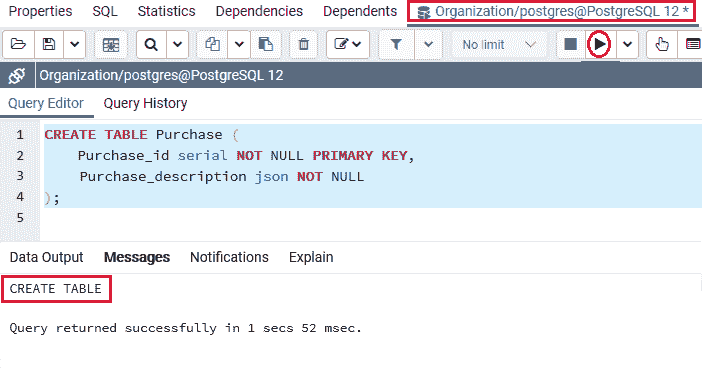

成功创建 ***购买*** 表后，我们将在 **INSERT** 命令的帮助下将值插入到一个 JSON 列中。我们还确保数据是有效的 JSON 格式。

下面的 INSERT 命令用于在 ***采购*** 表中插入新的一行。

```sql

INSERT INTO Purchase (Purchase_description)
VALUES('{ "purchaser": "Olivia Smith", "items": {"product": "iphone11 pro max","qty": 1}}');

```

**输出**

执行上述命令后，我们将获得以下消息窗口，显示值已成功插入 ***【购买】*** 表。

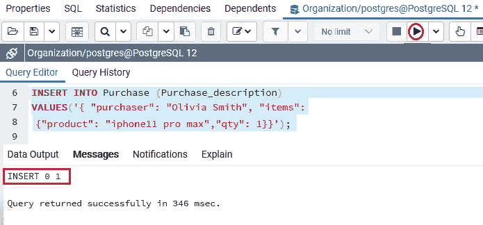

以上命令暗示**奥利维亚·史密斯**购买了**一部 iPhone 11 pro max** 。

现在，我们将在以下命令的帮助下，在采购表中插入各种行:

```sql

INSERT INTO Purchase (Purchase_description)
VALUES('{ "purchaser": "Maria Rodriguez", "items": {"product": "Hair shampoo","qty": 2}}'),
('{ "purchaser": "Thomas Jones", "items": {"product": "Belgium chocolate ice cream","qty": 7}}'),
('{ "purchaser": "Margaret Davis", "items": {"product": "Barbie doll","qty": 3}}'),
 ('{ "purchaser": "Elizabeth Brown", "items": {"product": "puzzle set","qty": 10}}');

```

**输出**

执行上述命令后，我们会得到如下消息窗口，显示多个值已成功插入 ***【购买】*** 表。

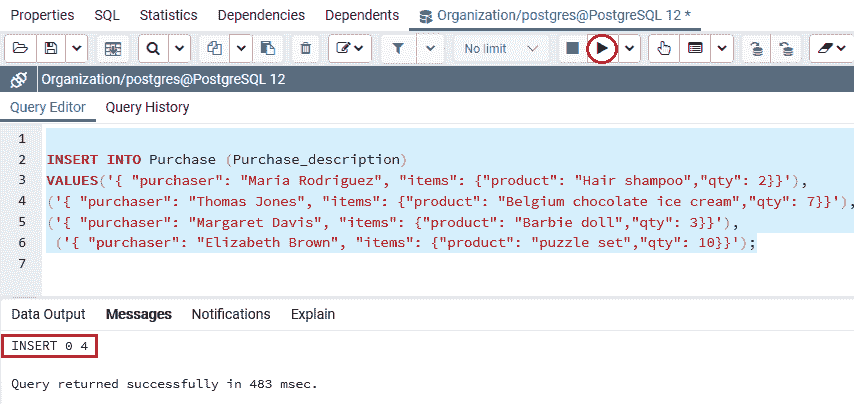

### 正在检索 JSON 数据

创建并插入 ***采购*** 表的值后，我们将使用 [**选择**命令](https://www.javatpoint.com/postgresql-select)检索 ***采购*** 表的 JSON 数据:

```sql

SELECT Puchase_description 
FROM Purchase;

```

**输出**

成功实现上述命令后，我们会得到如下结果，显示 PostgreSQL 以 JSON 的形式返回 ***Purchase*** 表中存在的输出:

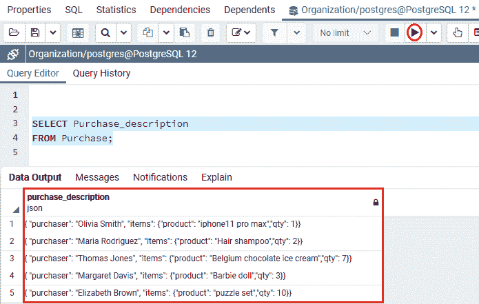

### 获取 JSON 数据的后置运算符

为了获取 JSON 数据，PostgreSQL 允许我们**两个原生运算符**，如下所示

*   **- >**
*   **- > >**

这里 **- >运算符**通过键检索 **JSON 对象字段， **- > >运算符**通过文本**检索 **JSON 对象字段。**

为了以 JSON 的形式获得所有买方，我们将在下面的命令中使用 **- >运算符**:

```sql

SELECT Purchase_description  -> 'purchaser' AS pruchaser
FROM Purchase;

```

**输出**

执行上述命令后，我们会得到如下结果，显示所有**购买者**在 **- >操作员**的帮助下以 JSON 的形式出现，如下所示:

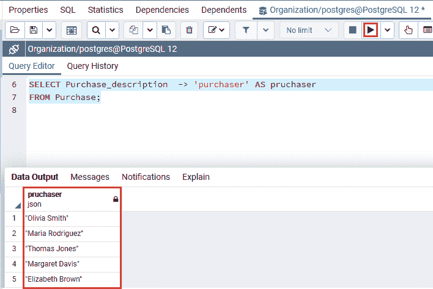

要以文本形式检索所有购买者，我们将使用 **- > >运算符**，如下图所示:

```sql

SELECT Purchase_description  ->> 'purchaser' AS pruchaser
FROM Purchase;

```

**输出**

成功执行上述命令后，我们将在输出中借助 **- > >操作符**获得所有**文本形式的**购买者**，如下图:**

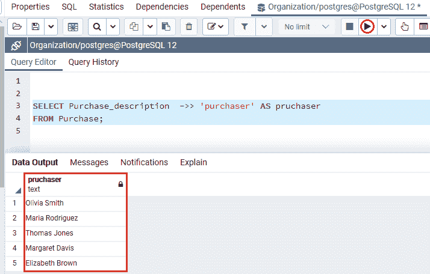

如上所述， **- >运算符**检索一个 **JSON 对象**，将其与 **- > >运算符**组合，以返回一个特定的节点。

**让我们看一个示例，以便更好地理解:**

要销售所有产品，我们将使用以下命令:

```sql

SELECT Purchase_description -> 'items' ->> 'product' as Product
FROM Purchase
ORDER BY Product;

```

**输出**

在执行上述命令时，我们将获得以下输出，其中第一个**Purchase _ description->“items”**将根据 **JSON 对象**检索**项目**。

而第二条 **Purchase_description - >【物品】- > >【产品】语句**会以文字形式检索所有产品。

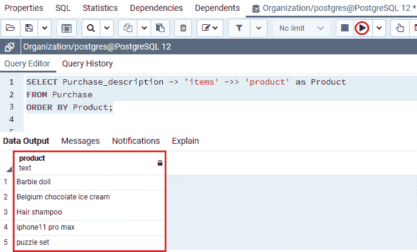

### 使用聚合函数获取 JSON 数据

在 PostgreSQL 中，我们有以下聚合函数，如 **MAX、MIN、AVERAGE、SUM 等**。我们将检索 JSON 数据。

**让我们看看如下所示的示例:**

在下面的命令中，我们将尝试获取在 ***【采购】*** 表中采购的**产品**的**最大值、最小值、平均值和总数量**。

```sql

SELECT 
   MAX (CAST (Purchase_description-> 'items' ->> 'qty' AS INTEGER)),
   MIN (CAST (Purchase_description -> 'items' ->> 'qty' AS INTEGER)),
   AVG (CAST (Purchase_description -> 'items' ->> 'qty' AS INTEGER)),
   SUM (CAST (Purchase_description -> 'items' ->> 'qty' AS INTEGER))
FROM Purchase;

```

**输出**

成功执行上述命令后，我们将获得以下输出，其中显示了*表中所有采购**产品的最大、最小、平均和总数量**:*

*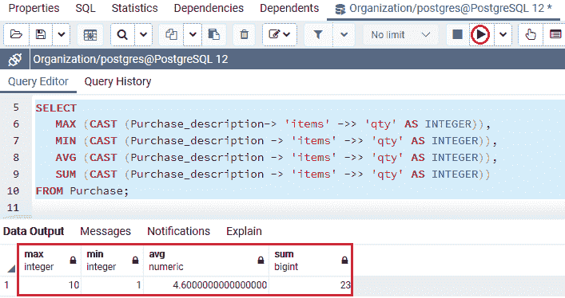

## 在 WHERE 子句中使用 JSON 运算符

为了过滤检索行，我们将使用[**子句**](https://www.javatpoint.com/postgresql-where-clause)**中的 **JSON 运算符**。**

 **在下面的例子中，我们将借助下面的命令来识别谁购买了**比利时巧克力冰淇淋**:

```sql

SELECT Purchase_description ->> 'purchaser' AS Purchaser
FROM Purchase
WHERE Purchase_description-> 'items' ->> 'product' = 'Belgium chocolate ice cream';

```

**输出**

执行上述命令后，我们会得到如下结果，显示**托马斯·琼斯**从 ***购买表*** 购买了**比利时巧克力冰淇淋**。

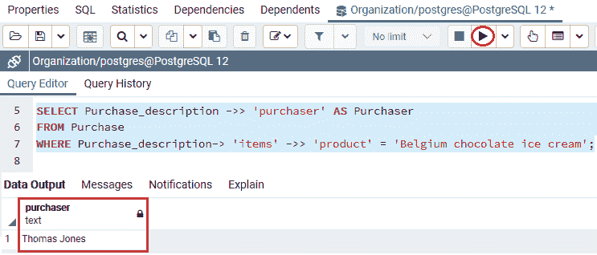

在下面的例子中，我们将使用下面的命令来识别**一次购买了三个产品**:

```sql

SELECT Purchase_description  ->> 'purchaser' AS Purchaser,
Purchase_description -> 'items' ->> 'product' AS product
FROM Purchase
WHERE CAST ( Purchase_description-> 'items' ->> 'qty' AS INTEGER) = 3

```

**输出**

执行上面的命令，我们会得到下面的结果，显示 **Margaret Davis** 从 ***购买表中购买了三个产品。***

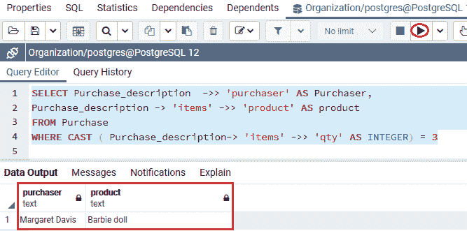

#### 注意:在上面的命令中，我们使用类型转换将数量字段修改为 INTEGER 类型，并将其与两个相关联。

## PostgreSQL JSON 函数

我们有如下 **JSON 函数**如 **json_each()，json_object_keys()，json _ typeof()，等。，在 PostgreSQL 中提供了**，这有助于我们在使用 **JSON 数据类型**时提高性能。

让我们一个一个来看，了解 **PostgreSQL JSON 函数**是如何工作的。

为此，我们使用 **CREATE** 命令将上面的 **Purchase** 表(我们在本教程前面创建的)导入到**组织数据库**中。

### json_object_keys 函数

我们可以使用 **json_object_keys()** 函数来检索最外层 json 对象中的一组键。

例如:在下面的命令中，我们使用 **json_object_keys()** **功能**从 ***Purchase*** 表中获取 **Purchase_description** 列中嵌套物品对象的所有**键。**

```sql

SELECT json_object_keys (Purchase_description->'items')
FROM Purchase;

```

**输出**

执行上述命令后，我们将得到如下输出，借助 **json_object_keys()** 功能，显示嵌套项对象的所有**键。**

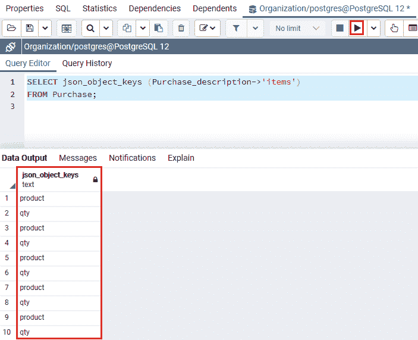

### json _ 每个函数

如果我们想将**最外层的 JSON 对象**增加到一组**键值对**中，我们可以使用 **json_each()函数**。

**让我们看一个样例来详细了解:**

在下面的例子中，我们将尝试从 ***采购*表**中的**采购 _ 描述**列中检索最外面的 JSON 对象到一组键值对中，如下命令所示:

```sql

SELECT json_each (Purchase_description)
FROM Purchase;

```

**输出**

成功执行上述命令后，我们将得到如下输出，该输出将所有最外层的 JSON 对象显示为**采购表中 **Purchase_description** 列中的一组键值对。**

**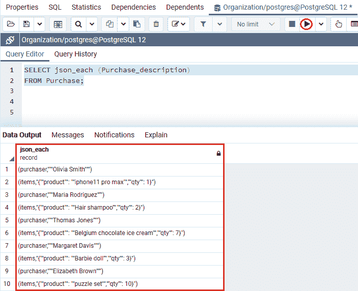

如果我们需要检索一组键值对作为文本，我们也可以使用 **json_each_text()** 函数代替 **json_each()** 函数。

**例如**

在下面的命令中，我们将使用 **json_each_text()** 函数代替 **json_each()** 函数:

```sql

SELECT json_each_text(Purchase_description)
FROM Purchase;

```

**输出**

在实现上面的命令时，我们将获得与上面的 **json_each()** 函数类似的输出。

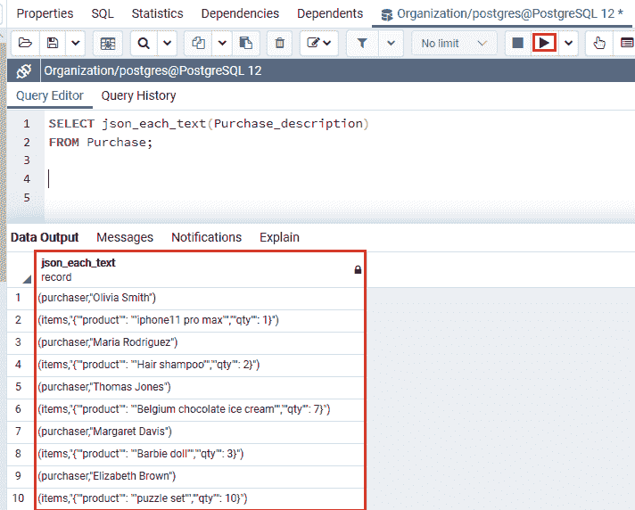

### json_typeof 函数

要将**最外层 JSON 值的类型检索为字符串，**我们可以使用 **json_typeof()** 函数。并且**JSON _ typoof()**可以接受**布尔、数字、对象、空值、字符串和数组**数据值。

**例如:**在下面的命令中，我们将尝试获取 ***采购*** 表中存在的项目的数据类型:

```sql

SELECT json_typeof(Purchase_description->'items')
FROM Purchase;

```

**输出**

执行上述命令后，我们将获得以下结果，该结果将最外层的 json 值显示为字符串:

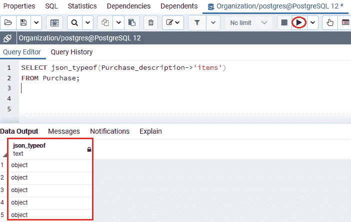

以下命令用于检索嵌套项 **JSON 对象**的**数量字段数据**类型。

```sql

SELECT json_typeof(Purchase_description->'items'->'qty')
FROM Purchase;

```

**输出**

执行上述命令后，我们将获得以下输出，显示嵌套项 JSON 对象的数量字段数据类型。

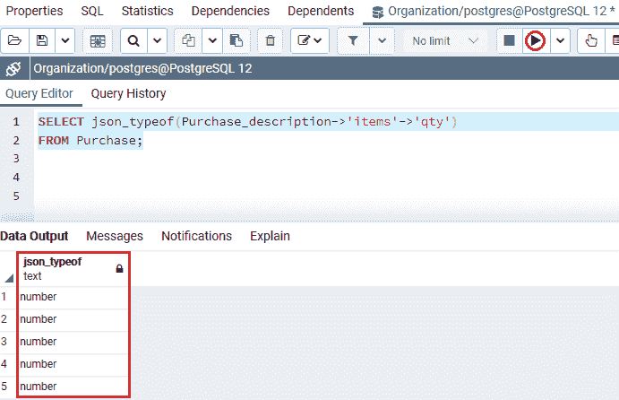

## 概观

在 **PostgreSQL JSON 数据类型**部分，我们学习了以下主题:

*   **PostgreSQL JSON 数据**类型用于存储指定列的 JSON 值。
*   我们已经在 **WHERE 子句**中使用了 SON 运算符来过滤指定表中的检索行。
*   我们还使用了诸如**平均值、总和、最小值、最大值**等聚合函数来获取 JSON 数据。
*   我们使用了不同的 J **SON** 函数，例如， **json_each()，json_object_keys()，json _ typeof()，等等。，以增强和处理特定表中的 **JSON** 值。**
*   我们使用了 JSON 操作符来更成功地为表的特定列获取 JSON 数据。

* * *******