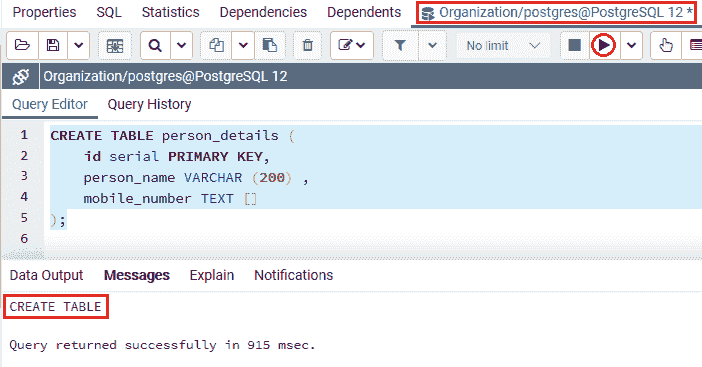
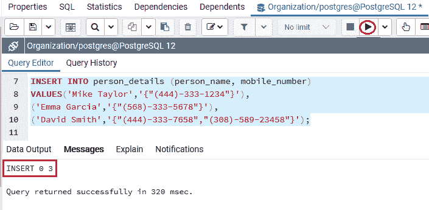
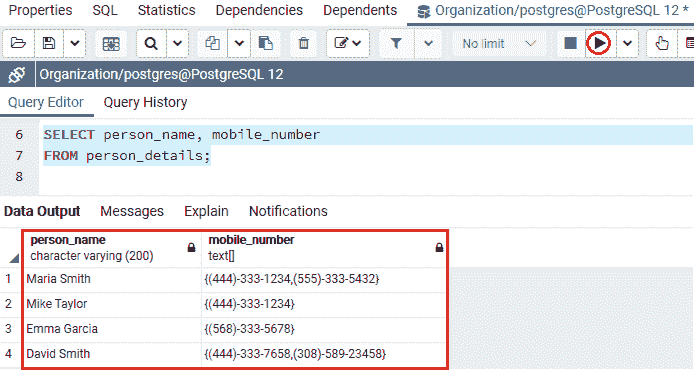
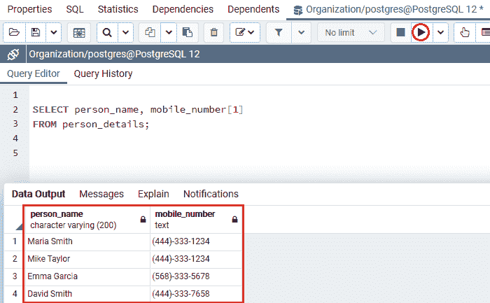
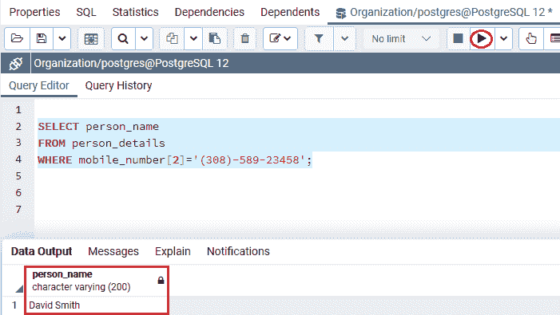
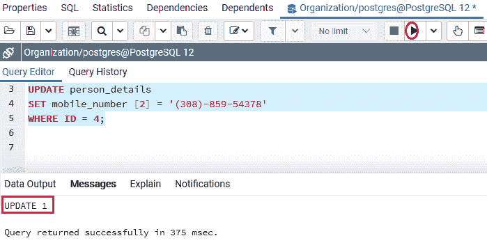
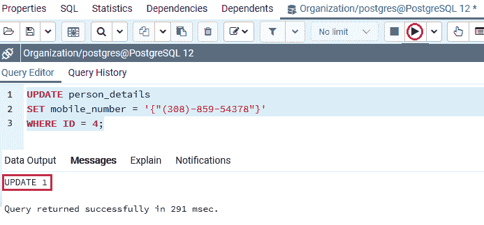
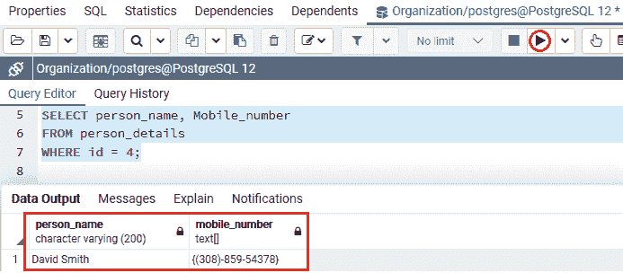
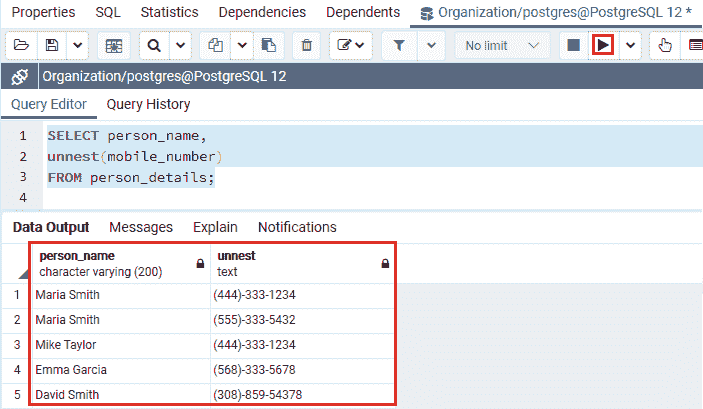

# PostgreSQL 数组

> 原文：<https://www.javatpoint.com/postgresql-array>

在本节中，我们将了解 **PostgreSQL Array 数据类型的工作方式、 **array 数据类型**的示例**，以及一些可访问的 Array 函数，如**unnst()，ANY()，**，这些函数帮助我们更有效地处理**数组值**。我们也看到了在 **WHERE** 子句中使用数组元素的例子。

## 什么是 PostgreSQL 数组数据类型？

在 [PostgreSQL](https://www.javatpoint.com/postgresql-tutorial) 中，数组数据类型发挥了重要作用。我们知道，每个数据类型都有它的伴生数组类型，比如一个**字符**有**字符【】**数组类型，**整数**有一个**整数【】**数组类型等等。

PostgreSQL 允许我们将一列指定为任何有效的**数据类型**的数组，这涉及到**用户定义的数据类型、枚举的数据类型和内置的数据类型**。

#### 注意:PostgreSQL 会在后台生成一个一致的数组类型，供我们描述数据类型。

### PostgreSQL 数组数据类型的语法

PostgreSQL 数组数据类型的语法如下:

```

variable_name DATA TYPE[];

```

### PostgreSQL 数组数据类型示例

让我们看一些示例来理解 **PostgreSQL 数组数据类型**是如何工作的。

在 CREATE 命令的帮助下，我们创建了一个名为 ***person_details*** 的新表，并使用 [INSERT 命令](https://www.javatpoint.com/postgresql-insert)插入了一些值。

### 创建 PostgreSQL 数组表

***person_details*** 表包含各种列，如 **id、person_name 和 Mobile_numbers，**对于 **Mobile_number** 列，我们使用包含一个人可能拥有的多个 Mobile 号码的**一维数组**。

```

CREATE TABLE person_details (
	id serial PRIMARY KEY,
	person_name VARCHAR (200) ,
	mobile_numbers TEXT []
);

```

**输出**

在执行上述命令时，我们将获得以下消息窗口，其中显示 ***person_details*** 表已成功创建到 **Organization** 数据库中。



### 插入 PostgreSQL 数组值

当 ***person_details*** 表创建成功后，我们将在 **INSERT** 命令的帮助下向其中插入一些值。

```

INSERT INTO person_details (person_name, mobile_number)
VALUES('Maria Smith',ARRAY [ '(444)-333-1234','(555)-333-5432' ]);

```

**输出**

执行上述命令后，我们会得到如下消息窗口，显示值已成功插入 ***person_details*** 表。


在上面的 insert 命令中，我们使用了 **ARRAY 构造函数**来创建一个数组，并将其添加到 ***Person_details*** 表中。

我们也可以使用**大括号** {}来代替方括号【】，如下图所示:

```

INSERT INTO person_details (person_name, mobile_number)
VALUES('Mike Taylor','{"(444)-333-1234"}'),
('Emma Garcia','{"(568)-333-5678"}'),
('David Smith','{"(444)-333-7658","(308)-589-23458"}');

```

**输出**

执行上述命令后，我们会得到如下消息窗口，显示三个值已成功插入 ***person_details*** 表。



#### 注意:正如我们在上面的命令中看到的，当我们使用大括号{}时，我们使用了单引号“”来括住数组，双引号“”来括住文本数组项。

### 选择 PostgreSQL 数组数据值

创建并插入 ***person_details*** 表的值后，我们将使用 [**SELECT** 命令](https://www.javatpoint.com/postgresql-select)返回 **person_details** 表的所有行:

```

SELECT person_name, mobile_number
FROM person_details;

```

**输出**

成功执行上述命令后，我们将得到如下输出，其中显示了 ***person_details*** 表中存在的所有数据:



默认情况下，如果我们借助方括号[]内的下标来访问数组元素， PostgreSQL 对数组元素使用**基于 1 的编号，**这意味着第一个数组元素以**数字 1** 开头。

让我们假设如果我们需要返回**人的名字**和第一个**手机号**，正如我们在下面的命令中看到的:

```

SELECT person_name, mobile_number[1]
FROM person_details;

```

**输出**

执行上述命令后，我们会得到如下结果，该结果显示了来自 ***person_details*** 表的一个人的第一个**手机号**。



### 使用 where 子句查找 PostgreSQL 数组元素

为了筛选行，我们可以使用[**【WHERE 子句】**](https://www.javatpoint.com/postgresql-where-clause) 中的数组元素作为条件。

在下面的例子中，我们将使用下面的命令来识别那些将**手机号码(308)-589-23458** 作为第二个手机号码的人:

```

SELECT person_name
FROM person_details
WHERE mobile_number[2]='(308)-589-23458';

```

**输出**

成功执行上述命令后，我们会得到如下输出，显示两个以上手机号的 **person_name** 。



### 更改 PostgreSQL 数组

PostgreSQL 提供我们更新整个数组或数组的所有元素。

以下命令用于更新**大卫·史密斯**的**第二个电话号码**。

```

UPDATE person_details
SET mobile_number [2] = '(308)-859-54378'
WHERE ID = 4;

```

**输出**

执行上述命令后，我们将看到下面的消息窗口，显示特定值已成功更新。



要整体更新阵列，我们可以使用以下命令:

```

UPDATE person_details
SET mobile_number = '{"(308)-859-54378"}'
WHERE ID = 4;

```

**输出**

执行上述命令后，我们将获得下面的消息窗口，它将数组表示为一个整体:



之后，我们将使用下面的命令；我们将借助**选择**命令检查更新值:

```

SELECT person_name, Mobile_number
FROM person_details
WHERE id = 4;

```

**输出**

成功实现上述命令后，我们将获得以下输出，其中显示了指定的更新值。



### 展开 PostgreSQL 数组数据类型

为了将一个数组扩展为一个行列表，PostgreSQL 提供了 **unnest()** 函数。

让我们看一个例子，了解如何使用 **unnest()** 函数扩展数组:

在下面的示例中，下面的命令扩展了 mobile_number 数组中的所有移动号码。

```

SELECT person_name,
unnest(mobile_number)
FROM person_details;

```

**输出**

我们将在执行上述命令时获得以下输出，该命令将展开的数组显示为行列表。



### 在 PostgreSQL 数组中搜索

我们可以使用 **ANY()** 功能来识别谁拥有以下**手机号** (555)-333-5432，而不考虑手机号数组的位置，如下命令所示:

```

SELECT person_name, mobile_number
FROM person_details
WHERE '(555)-333-5432' = ANY (mobile_number);

```

**输出**

执行上述命令后，我们将得到以下结果:


## 概观

在 **PostgreSQL 数组数据类型**部分，我们学习了以下主题:

*   **PostgreSQL 数组数据**类型用于存储指定列的数组值。
*   我们使用了 **WHERE 子句**中的**数组元素**来过滤指定表中的检索行。
*   我们使用了不同的数组函数；例如 **ANY()函数**用于在 PostgreSQL 数组中进行**搜索。**
*   **unnst()函数**用于将一个数组扩展到处理特定表的数组值的行列表中。

* * *