# 创建模式

> 原文：<https://www.javatpoint.com/postgresql-create-schema>

在本节中，我们将学习如何**在 pgAdmin 4 和 [SQL](https://www.javatpoint.com/sql-tutorial) shell(psql)** 的模式命令中创建一个模式和一个表。

在 PostgreSQL 中，Schema 是一个提供各种对象的命名空间，例如**数据类型、索引、表、运算符、视图、序列和函数**。create 语句提供了确切的对象名，这有助于我们在现有模式中创建对象。

## 在 PostgreSQL 中创建架构

**CREATE SCHEMA** 语句用于在现有数据库中创建一个新的模式。该语句可以包含在新模式中创建对象的子命令。并且**模式名称**应该不同于现有数据库中任何当前模式的名称。

在 [PostgreSQL](https://www.javatpoint.com/postgresql-tutorial) 中，我们可以用两种不同的方式创建模式:

*   **在 pgAdmin 4 中创建模式**
*   **在 psql 中创建模式**

#### 注意:CREATE SCHEMA 命令用于创建一个模式，它不能嵌套。

### 创建模式的语法

```

CREATE SCHEMA schema_name;  
Or
CREATE SCHEMA [IF NOT EXISTS] schema_name;

```

我们在上面的语法中使用了以下参数:

| 因素 | 描述 |
| 创建架构 | Create schema 是一个关键字，用于在数据库中创建新的模式。 |
| 架构名称 | 此参数用于描述模式的名称，并且模式名称在现有数据库中应该是独占的。 |
| 如果不存在 | 这是一个可选参数，仅当它没有出现时，才用于创建新模式。
**或**
如果我们试图在不使用已经存在的 **IF NOT EXISTS 选项**的情况下创建一个新的模式，它将产生一个错误。 |

#### 注意:要实现 create schema 命令，我们应该在现有数据库中拥有 create 权限。

## 在 pgAdmin 4 中创建模式[图形用户界面]

在本文中，我们将在最新版本的 pgAdmin 中创建一个模式。我们需要按照以下步骤创建一个模式:

**第一步**

*   首先，在我们的本地系统中打开 **pgAdmin** ，并将 **PostgreSQL** 连接到本地主机服务器。

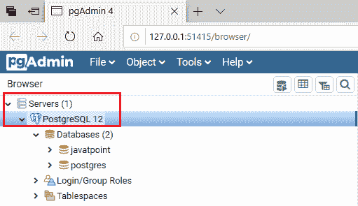

**第二步**

*   之后，我们将通过单击向下箭头图标展开数据库，如下图所示:

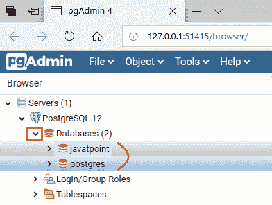

*   在上图中，我们可以看到 PostgreSQL 中有两个可用的数据库。这里，我们取第一个数据库，也就是 **javatpoint** 。

**第三步**

*   现在，我们将扩展数据库 **javatpoint** 。

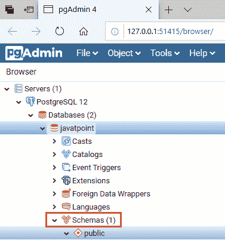

**第四步**

*   一旦我们展开 javatpoint 数据库，我们就可以看到**模式**。
*   之后，为了创建模式，我们将右键单击**模式**选项，然后选择**创建、**然后从列表中单击**模式**选项。


**第五步**

*   一旦我们点击了模式，**创建-模式**窗口将出现在屏幕上，我们将提供所有必要的细节，如**名称**等。，并点击**保存**

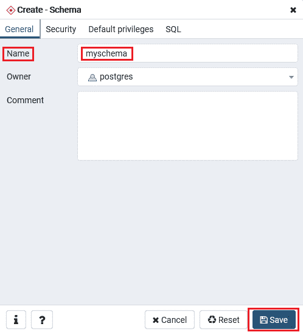

**第六步**

*   点击【保存】按钮，就创建了 **myschema** ，如下图截图所示:

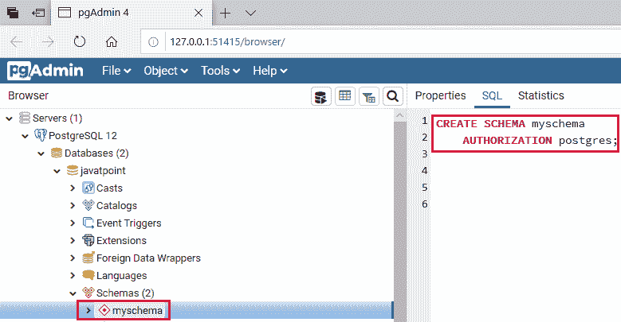

## 在 psql 中创建模式

*   首先，我们将连接到 **javatpoint** 数据库，并在以下命令的帮助下创建一个新的 Jtp 模式:

```

javatpoint=# create schema jtp;
CREATE SCHEMA

```

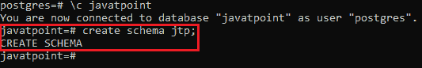

*   消息**创建模式**表示模式创建成功。
*   要检查模式是否已创建，我们可以执行以下命令:

```

Javatpoint=#\dn

```

*   执行上述命令后，我们可以在下面的截图中看到模式列表:

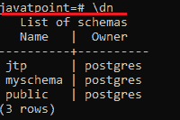

## PostgreSQL 在架构中创建表

在这里，我们将在特定的模式中创建一个表(我们在本节前面已经创建了这个表)。在 PostgreSQL 中，我们可以用两种不同的方式在模式中创建一个表:

*   **在 pgAdmin 模式中创建一个表**
*   **在 psql 模式中创建一个表**

## 在 pgAdmin 架构中创建一个表

一旦我们在 pgAdmin 中创建完模式，我们将在特定的模式中创建一个表。为此，我们将遵循以下步骤:

**第一步**

*   首先，我们正在扩展新创建的模式 **myschema，**，我们可以看到 myschema 包含以下内容:
    *   **整理**
    *   **表格**
    *   **序列**
    *   **功能**
    *   **程序**
    *   **类型**
    *   **查看等等。**

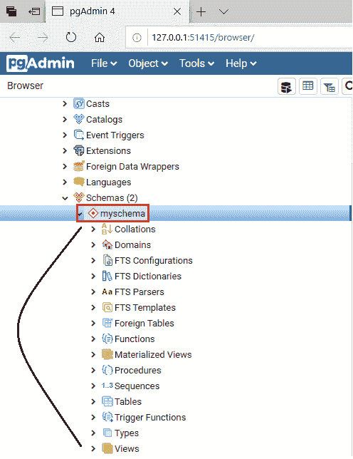

**第二步**

*   现在，我们将右键单击 **myschema** 下的 **Tables** 选项，并从给定的下拉列表中选择 **Create** 选项，然后单击 **Table** ，如下图所示:

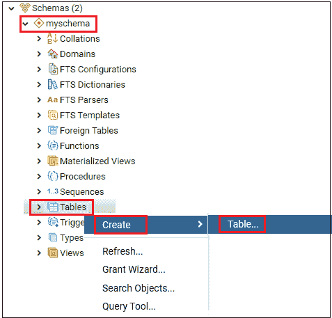

**第三步**

*   一旦我们点击表格选项，屏幕上将出现**创建-表格**窗口，我们将在其中输入所有必要的细节，如**表格名称**。在我们的案例中，我们将创建一个名为**学生**的表格。

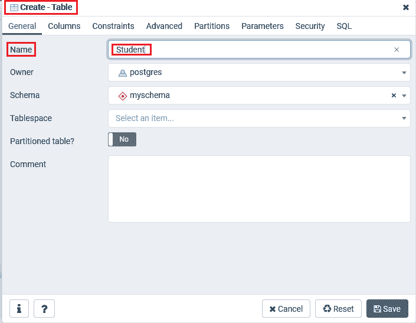

**第四步**

*   之后，我们将移动到同一窗口中的**列**选项卡，然后单击 **+** 号在特定表格中添加列。
*   我们可以从给定的下拉列表中选择**数据类型**，也可以更改列**非空**首选项，还可以设置**主键**。
*   然后点击**保存**完成创建表格的过程，如下图截图所示:

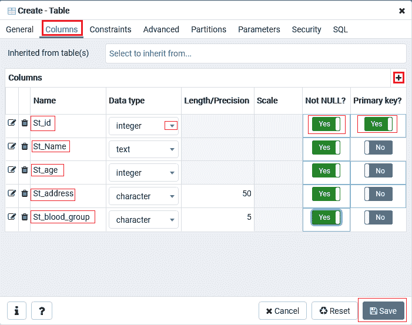

*   我们可以看到**学生**表是在**表**下创建的

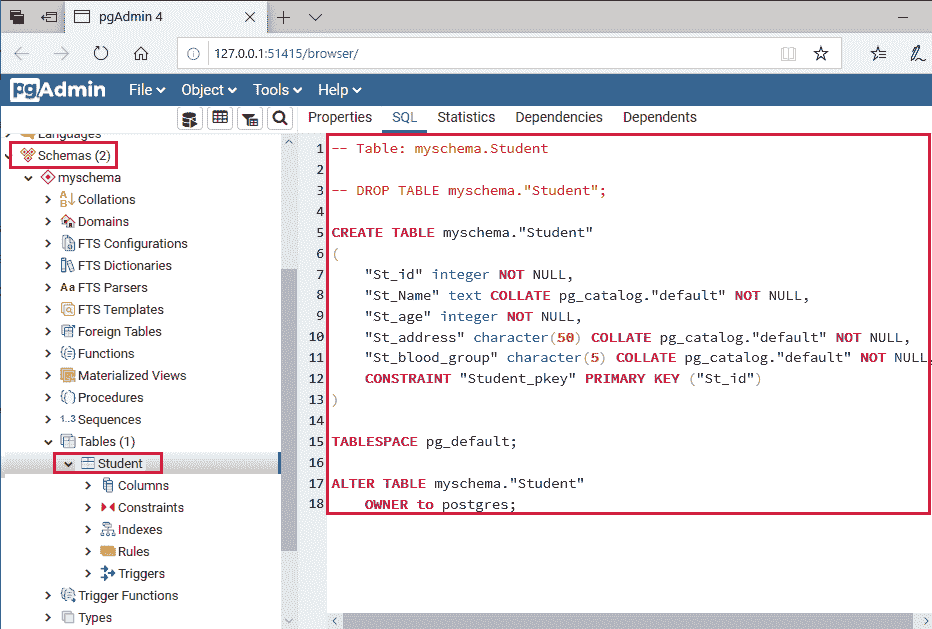

## 在 psql 模式中创建一个表

现在，我们将在上面创建的 psql 模式中创建一个表。但是首先，我们将看到在 psql 模式中创建表的语法。

### 在模式中创建表的语法

在模式中创建表的一般语法如下:

```

CREATE TABLE Schema_name.Table_name (
);

```

上述语法中使用了以下参数:

| 因素 | 描述 |
| 创建表格 | Create table 是一个关键字，用于在现有架构中创建表。 |
| 架构名称 | 它用于指定当前模式名。 |
| 表名 | 它用于描述表的名称，表名在现有模式中应该是唯一的。 |

*   以下命令用于在 psql 模式中创建一个表:

```

javatpoint=# create table jtp.Employee( 
Emp_ID  INT NOT NULL, 
Emp_NAME VARCHAR (25)  NOT NULL, 
Emp_AGE  INT NOT NULL, 
Emp_ADDRESS  CHAR (30), 
Emp_SALARY   Real, 
PRIMARY KEY (Emp_ID)
);

```

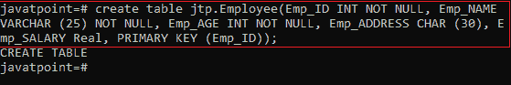

*   上面的命令将创建一个空表。我们可以在下面命令的帮助下检查创建的表:

```

javatpoint=# select * from jtp.Employee;

```

**输出**

下面的截图将显示上面创建的表格的结果:

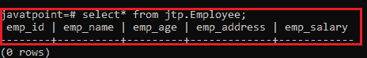

* * *