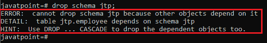
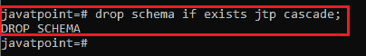
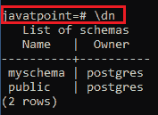
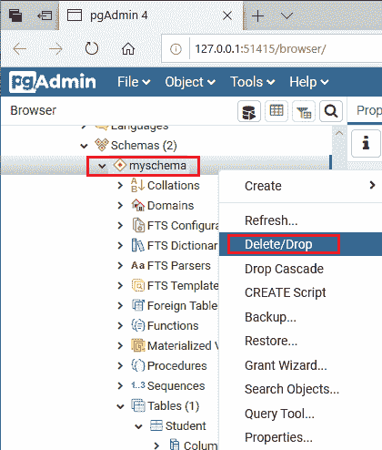
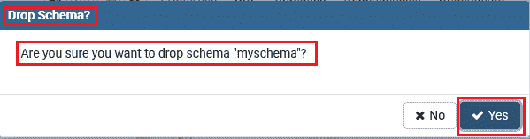
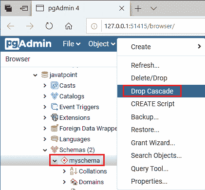
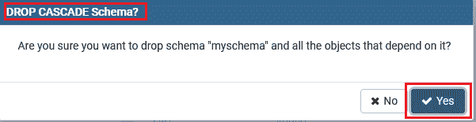

# PostgreSQL 删除架构

> 原文：<https://www.javatpoint.com/postgresql-drop-schema>

在本章中，我们将学习如何借助**的一个删除模式命令**来**删除一个模式及其相关对象**，如果我们不再需要它的话。

借助**DROP schema**语句，我们可以轻松地删除或删除或移除 PostgreSQL 模式。如果模式不存在，它会抛出一个错误；这就是为什么我们可以使用 **IF EXISTS** 选项和 DROP [Schema 命令](https://www.javatpoint.com/postgresql-schema)的原因。我们在删除任何模式时都应该小心，因为我们将删除特定模式中所有可用的数据和对象。

在 [PostgreSQL](https://www.javatpoint.com/postgresql-tutorial) 中，我们可以通过两种不同的方式**删除模式**:

*   **PostgreSQL 使用 psql 删除模式**
*   **使用 pgAdmin 4 的 PostgreSQL 模式**

## 使用 psql 删除模式

在 [PostgreSQL](https://www.javatpoint.com/postgresql-tutorial) 中，**删除模式**命令用于从数据库中删除模式及其相关对象。

### 删除模式的语法

DROP SCHEMA 命令的语法如下:

```

DROP SCHEMA schema_name;
or
DROP SCHEMA [IF EXISTS] schema_name [ CASCADE | RESTRICT ];

```

这里，我们有不同的参数用于删除模式。让我们一个一个来看:

| 因素 | 描述 |
| 删除架构 | 它是一个关键字，用于删除模式。 |
| 如果存在 | 只有当模式存在时，它才会移除模式。 |
| 架构名称 | 架构名称用于指定架构的名称。 |
| 串联 | 它用于移除模式和依赖于这些对象的所有对象。 |
| 限制 | PostgreSQL 默认情况下使用 RESTRICT 选项，它仅在架构为空时用于移除。 |

#### 注意:要执行 DROP SCHEMA 命令，我们必须是模式的所有者或超级用户，我们需要删除该模式。

在 PostgreSQL 中，如果不需要，我们可以删除模式和对象。

*   在 psql 中，以下命令用于**删除模式**:

```

Drop schema jtp;

```

*   一旦我们执行了上面的查询，我们可能会遇到错误。该错误指出我们不能删除模式 jtp，因为其他一些对象依赖于它。



*   因此，首先我们有**借助下面的命令删除从属对象**:

```

Drop schema if exist jtp cascade;

```



**输出**

要查看**模式是否被删除**，我们将执行以下命令:

```

javatpoint=# \dn

```

上述命令将显示 PostgreSQL 中存在的**模式**，只有**两个模式(myschema，public)** 可用，这意味着 **jtp 模式**被成功删除。



#### 注意:PostgreSQL 通过一个 DROP SCHEMA 命令，让我们可以同时删除多个模式。

**例如**

借助以下命令，我们可以删除存在于 **javatpoint** 数据库中的多个模式:

```

Drop Schema if exist myschema, public;

```

## 使用 pgAdmin4 删除模式

为此，我们将按照以下流程**删除 pgAdmin4** 中的模式:

**第一步**

*   首先，我们将右键单击我们之前创建的**我的架构**(我们不再需要的架构)，并从给定的下拉列表中选择**删除/删除**选项:



**第二步**

*   一旦我们点击删除\删除选项，屏幕上将出现**删除模式**弹出窗口，我们点击**是**按钮删除模式。



**第三步**

*   点击“是”按钮后，屏幕上将出现以下错误信息弹出窗口，点击**确定**按钮，如下图所示:


**第四步**

*   要删除模式，我们将**首先删除依赖对象**，为此，我们将右键单击**我的模式**，并从给定的下拉列表中选择**删除级联**选项。



**第五步**

*   屏幕上将出现**下拉级联模式**弹出窗口，我们点击**是**按钮删除相关对象。



*   删除依赖对象后 **myschema** 会自动删除。

* * *