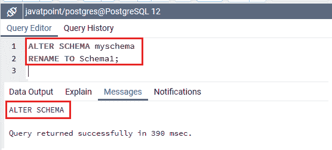
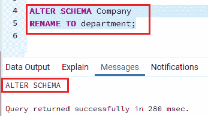
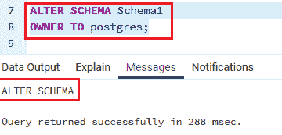
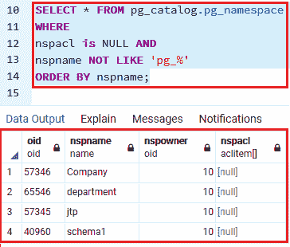

# PostgreSQL ALTER 架构

> 原文：<https://www.javatpoint.com/postgresql-alter-schema>

在本节中，我们将学习 **PostgreSQL ALTER SCHEMA 命令，**，该命令用于**更改一个模式的描述**。

### ALTER SCHEMA 命令

**更改模式命令**将允许我们修改模式的定义。**例如，**我们也可以借助下面的 alter schema 命令来重命名模式。

更改模式命令的**语法**如下:

```sql

ALTER SCHEMA schema_name 
RENAME TO new_name;

```

我们在上面的语法中使用了以下参数:

| 因素 | 描述 |
| 旧模式 | 这是一个用于更改模式描述的关键字 |
| **模式 _ 名称** | 它用于描述模式的名称，我们需要将其重命名。 |
| **新 _ 名称** | 该参数用于定义模式的新名称，我们不能以 **pg_、**作为新名称的开头，因为在 PostgreSQL 中，这样的名称是为系统模式保留的。 |

#### 注意:为了执行上面的命令，我们必须是模式的所有者，并且我们还拥有数据库的 CREATE 特权。

除了在 ALTER SCHEMA 中**重命名模式**之外，我们还可以在下面命令的帮助下**为新模式**修改模式的所有者:

```sql

ALTER SCHEMA schema_name 
OWNER TO { new_owner | CURRENT_USER | SESSION_USER};

```

我们在上面的语法中使用了以下参数:

| 因素 | 描述 |
| 架构名称 | 为了在 ALTER SCHEMA 条件中修改所有者，我们将描述模式的名称。 |
| 新所有者 | 它用于在“所有者到”条件中定义新所有者。 |

## PostgreSQL ALTER SCHEMA 命令示例

让我们看几个例子来理解如何在 PostgreSQL 中使用 **ALTER SCHEMA 命令。以下示例基于我们在[PostgreSQL](https://www.javatpoint.com/postgresql-tutorial)**CREATE SCHEMA 部分**创建的模式。**

### 使用 ALTER SCHEMA 命令重命名架构

下面的例子解释了如何使用帮助改变模式命令来重命名模式。

在这里，我们将把 **myschema 模式**重命名为 **Schema1** 模式:

```sql

ALTER SCHEMA myschema
RENAME TO Schema1;

```

**输出**

一旦我们执行了上面的命令，我们将得到下面的**输出**窗口:



同样，以下示例用于将**公司模式**的**重命名为**部门:****

```sql

ALTER SCHEMA Company
RENAME TO department;

```

**输出**

执行以上命令后，我们会得到下面的**输出:**



### 使用 alter schema 命令修改架构的所有者

在此特定示例中，我们将借助 Alter schema 将 **Schema1** 的所有者从 **myschema** 修改为 **Postgres** :

```sql

ALTER SCHEMA Schema1
OWNER TO postgres;

```



然后，我们将执行**用户创建的模式**命令:

```sql

SELECT * FROM pg_catalog.pg_namespace
WHERE nspname NOT LIKE 'pg_%' AND
nspacl is NULL
ORDER BY nspname;

```

#### 注意:在 PostgreSQL 中，pg_catalog 是 Postgres 用来在内部完成事情的典型元数据和核心模式。

**pg_namespace 是一个目录**，用来**存储命名空间**。命名空间是基本的 SQL 模式的结构，每个命名空间可以有不同的类型、关系等集合。没有任何名称冲突。

**输出**

执行上述查询后，我们将得到下面的**输出**，其中包含一个表，我们可以看到 **Schema1** 模式由**所有者 id 10** 维护，这是 **Postgres** id。



* * *