# PostgreSQL 插入

> 原文：<https://www.javatpoint.com/postgresql-insert>

在本节中，我们将学习 **PostgreSQL insert 命令和示例，使用默认关键字插入日期，并在 PostgreSQL **pgAdmin 和 SQL shell (psql)** 中将数据从一个表插入到另一个表中。**

在 PostgreSQL 中，INSERT 命令用于向表中插入新行。我们可以一次将一个**单行或多行**值插入到特定的表格中。

### PostgreSQL 插入命令的语法

```

INSERT INTO TABLE_NAME 
(column1, 
column2, 
column3, ……columnN)  
VALUES (value1, value2, value3, ….. valueN);  

```

### 使用默认值关键字插入单个记录

如果我们使用默认值关键字插入一条记录， **INSERT 命令的语法**如下:

```

INSERT INTO table
(column1, column2, ... )
DEFAULT VALUES;

```

### 使用子选择插入多个记录

如果我们使用子选择插入多个记录，则**插入命令语法**如下:

```

INSERT INTO table_name
(column1, column2, ... )
SELECT expression1, expression2, ...
FROM source_table
[WHERE conditions];

```

下表显示了插入表语法中使用的**参数或参数**:

| 参数 | 描述 |
| 表名 | 它用于表示现有的表名。 |
| 第 1 列，第 2 列…第 n 列 | 这些是表中要插入数据的列的名称。 |
| 哪里的条件 | 它是一个可选参数，用于第三种语法。这些是插入记录必须满足的条件。 |
| 默认值 | 所有列都将使用默认值进行定义。它用在第二种语法中。 |
| 源表 | 当我们想从另一个表中插入数据时，使用它。它用在第三种语法中。 |
| 表达式 1 &#124; DEFAULT，表达式 2 &#124; DEFAULT | 这些是分配给表中各列的值。
如果指定了**表达式 1** ，那么**列 1** 将被赋予**表达式 1 的值，列 2** 将被赋予表达式 2 的值，以此类推。
如果指定了 **DEFAULT** ，则一致列将被其默认值占据。它用在第一个语法中。 |

**注**

*   如果使用 **PostgreSQL insert** 命令将记录插入表中，我们必须提供每个**非空**列值。
*   如果该列允许空值，我们可以忽略 PostgreSQL 插入命令中的一列。

**输出**

下表显示了输出消息及其含义:

| 输出信息 | 描述 |
| **插入 Oid 1** | 如果只插入了一行，Oid 是插入行的数字 OID。 |
| **插入 0 #** | 如果插入了多行，并且 **#** 是插入的行数，则会出现此消息。 |

## PostgreSQL 插入命令

我们可以通过两种方式执行 PostgreSQL 插入命令:

*   **使用 UI (pgAdmin)的 PostgreSQL Insert 语句**
*   **使用 SQL shell 的 PostgreSQL Insert 语句**

### 使用用户界面的 PostgreSQL 插入语句

让我们举个例子来看看如何在表中插入值。在这里，我们有一个名为**学生**的表格。

### 示例 1: VALUES 关键字

为了创建一个 **PostgreSQL INSERT** 命令来列出这些值，我们将使用 **VALUES** 关键字。

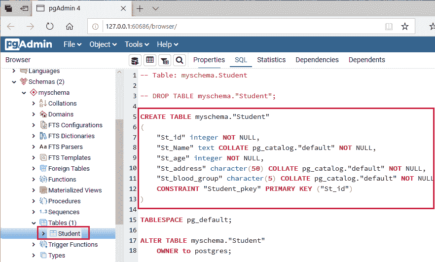

要在 ***【学生】*** 表中插入值，我们将遵循以下步骤:

**第一步**

*   首先，我们将选择**学生表**，然后右键单击该表，然后从给定列表中选择**脚本**选项，并从另一个列表中单击**插入脚本**选项，如下图所示:

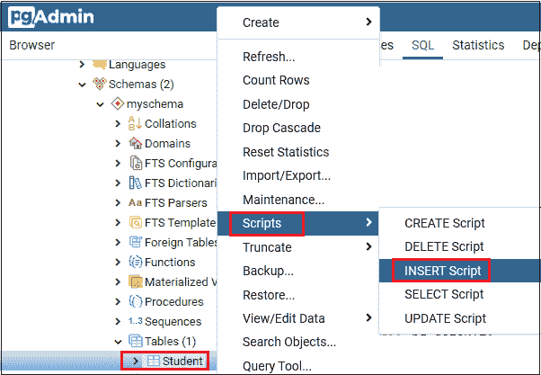

**第二步**

*   一旦我们点击**插入脚本**，屏幕上将出现以下窗口:

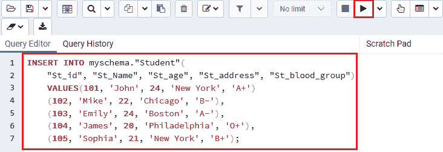

**第三步**

*   现在，我们将值插入到**'？'的位置**然后点击**执行/刷新按钮**执行特定命令，并将记录添加到**T5【学生】T6**表中。

```

INSERT INTO myschema."Student"(
"St_id", "St_Name", "St_age", "St_address", "St_blood_group")
VALUES(101, 'John', 24, 'New York', 'A+')
(102, 'Mike', 22, 'Chicago', 'B-'),
(103, 'Emily', 24, 'Boston', 'A-'),
(104, 'James', 20, 'Philadelphia', 'O+'),
(105, 'Sophia', 21, 'New York', 'B+');

```

### PgAdmin4 中的 SQL 查询

在下面的截图中，我们可以在 pgAdmin4 中看到上面的命令:


### 表格结构/输出

执行**插入命令**后，点击**查看表格**选项，可以看到 ***学生*** 表格的输出，如下图截图所示:

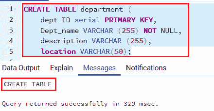

### 示例 2

首先，我们将创建一个新表来理解 PostgreSQL 中 insert 命令的用法。

#### 注意:我们也可以参考下面的链接在 PostgreSQL 中创建新表。

[https://www.javatpoint.com/postgresql-create-table](https://www.javatpoint.com/postgresql-create-table)

现在，我们将借助下面的命令创建一个**部门**表:

```

CREATE TABLE department (
dept_ID serial PRIMARY KEY,
Dept_name VARCHAR (255) NOT NULL,
description VARCHAR (255),
location VARCHAR(50)
);

```

执行上述命令后，我们会得到如下消息:**部门表**已经创建:

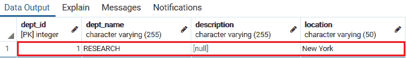

## 示例:在表格中插入单行值

以下命令用于将**部门名称、位置**值插入到**部门**表中:

```

INSERT INTO department (dept_name, location)
VALUES ('RESEARCH', 'Newyork');

```

我们可以使用 SELECT 命令检查特定表中插入的行:

```

SELECT * FROM department;

```

**输出**

一旦我们执行了上面的**选择**命令，我们将得到下面的输出:

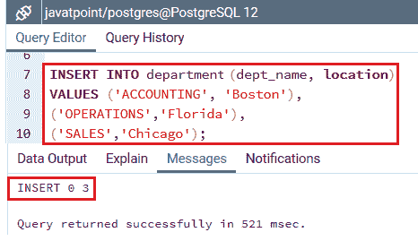

如果要插入**字符数据，**必须用**单引号(‘)**括起来。

**例如，“RESEARCH”**。

PostgreSQL 反复为**序列列**提供值；因此，不需要在**序列列**中插入值。

## 示例:使用子选择插入多行

这里，我们将使用子选择将不同的行值插入到特定的表中。

**例如:**在下面的命令中，我们将在**部门**表的 dept_name、location 列中插入**多行:**

```

INSERT INTO department (dept_name, location)
VALUES ('ACCOUNTING', 'Boston'),
('OPERATIONS','Florida'),
('SALES','Chicago');

```

一旦我们执行了上面的命令，我们将会得到下面的消息:在**部门名称**和**部门**表的位置列中已经插入了**三个值**:

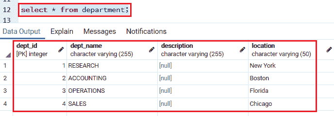

借助**选择**命令，我们可以检查特定表格中插入的行:

```

SELECT * FROM department;

```

**输出**

一旦我们实现了上面的 select 命令，我们将得到下面的输出:

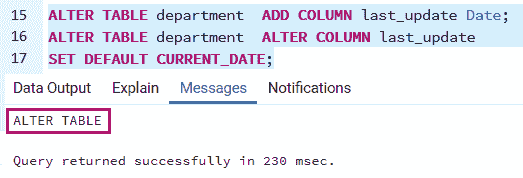

## 示例:使用默认关键字在表格中插入日期

首先，我们将在**部门表**中添加一个名为 **last_update** 的新列，并将其默认值设置为 **current_date** ，如下命令所示:

```

ALTER TABLE department ADD COLUMN last_update Date;
ALTER TABLE department ALTER COLUMN last_update
SET DEFAULT CURRENT_DATE;

```

执行上述命令后， ***部门*** 表被修改，**最后 _ 列**被创建。

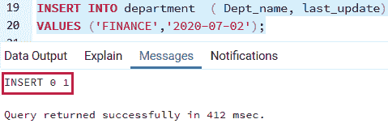

下面的命令用于在 ***部门*** 表格中插入一个新的行来定义日期。

#### 注意:在 PostgreSQL 中，日期格式是 YYYY-MM-DD。

```

INSERT INTO department ( Dept_name, last_update)
VALUES ('FINANCE','2020-07-02');

```

**输出**

执行上述命令后，我们将获得消息窗口:

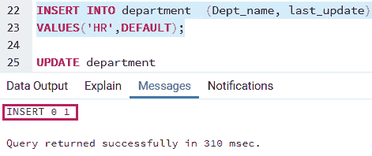

要设置日期栏或任何其他栏的**默认值，我们还可以使用 **DEFAULT 关键字**，如下命令所示:**

```

INSERT INTO department (Dept_name, last_update)
VALUES('HR',DEFAULT);

```

**输出**

执行上述命令后，我们将获得如下消息窗口:特定值已插入 ***部门*** 表:

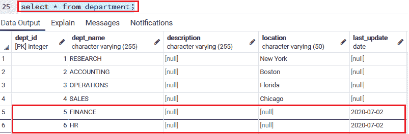

要检查 ***部门*** 表格中插入的记录，我们将使用 SELECT 命令:

```

Select * from department;

```

**输出**

执行上述命令后，我们将得到以下结果:

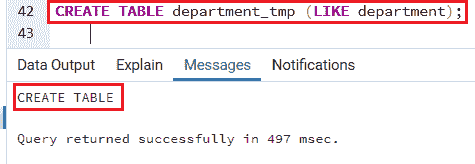

## 示例:从另一个表中插入数据

要从另一个表插入数据，我们将遵循以下步骤:

**第一步**

首先，我们创建另一个名为 **department_tmp** 的表，它具有类似于 **department** 表的表结构:

```

CREATE TABLE department_tmp (LIKE department);

```

执行上述命令后，已经创建了 ***部门 _tmp*** :

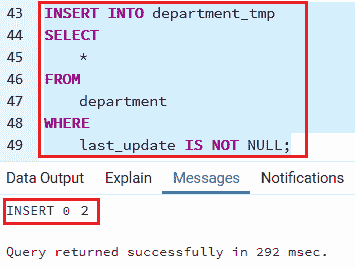

**第二步**

创建表格后，我们将插入**部门**表格中的行，这些行的**日期列**的值不是**空值:**

```

INSERT INTO department_tmp 
SELECT *
FROM
department
WHERE
last_update IS NOT NULL;

```

**输出**

执行上述命令后，我们将获得下面的消息窗口，显示特定值已成功插入。

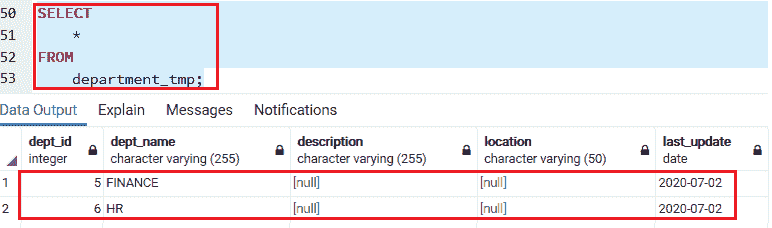

**第三步**

之后，我们将使用 **department_tmp** 表中的 SELECT 命令检查插入操作:

```

SELECT * FROM department_tmp;

```

**输出**

执行上述命令后，我们将获得以下输出:

如果我们想从**部门**表中**获取最后插入的部门 _id** ，我们将遵循以下流程:

一旦我们在**插入命令**中插入新行，我们将使用 **RETURNING 子句**，一个 SQL 的 PostgreSQL 扩展。

以下命令在**部门**表格中插入一个新行，并返回最后插入的**部门 _id:**

```

INSERT INTO department (dept_name, last_update)
VALUES('IT',DEFAULT)
RETURNING Dept_id;

```

**输出**

一旦我们实现了上面的命令，我们将得到 Dept_id=7。

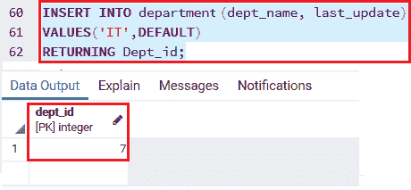

之后，我们将使用选择命令检查 **dept_id** 是否正确。

```

Select * from department;

```

**输出**

一旦我们执行了选择命令，我们可以看到，一旦我们创建了客户表，我们将借助下面的命令在客户表中插入一行:Dept_id 匹配**部门**表中最后插入的**Dept _ id**。

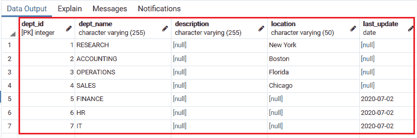

## 使用 psql 的 PostgreSQL 插入命令

在 SQL shell(psql)中，我们将首先在 **javatpoint 数据库**中借助以下命令创建一个名为**客户表**的表:

```

CREATE TABLE Customer(
Cust_Id INT PRIMARY KEY NOT NULL,
Cust_Name TEXT NOT NULL,  
Cust_Address CHAR(30), 
Cust_Age INT NOT NULL Unique
);

```

一旦我们创建了**客户**表，我们将在下面命令的帮助下向 ***客户*** 表中插入一行:

```

insert into customer (Cust_Id ,cust_name, Cust_address,Cust_age)  
values(101, 'john', 'boston',22);

```

之后，我们将在特定表格中插入**多行**，如下图所示:

```

INSERT INTO Customer
(Cust_Id ,cust_name, Cust_address,Cust_age) 
VALUES (102, 'mike', 'newyork',24),
(103,'emily', 'newyork',23), 
 (104, 'harvey', 'florida',26);

```

我们将使用 SELECT 命令检查上述值是否插入到**客户表**中。

```

Select* from customer;

```

**输出**

执行上述命令后，我们将获得以下输出:

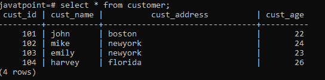

* * *