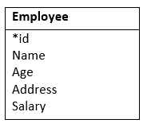
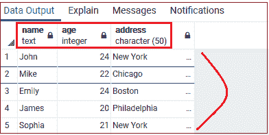
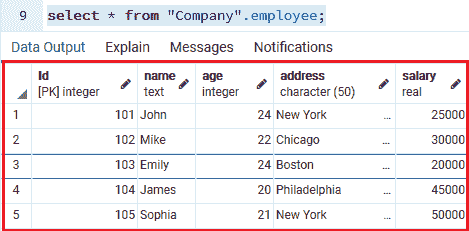
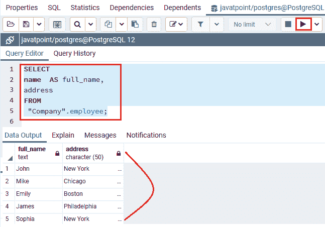
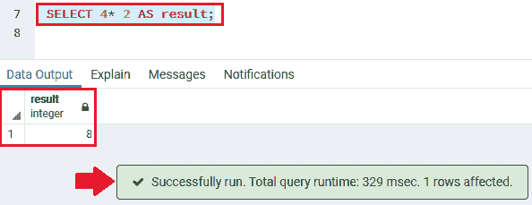

# PostgreSQL 选择

> 原文：<https://www.javatpoint.com/postgresql-select>

在 PostgreSQL 中，SELECT 命令是用于从数据库表中检索数据的核心命令，数据以结果表的形式返回，称为**结果集**。

**选择**命令包含几个子句，我们可以使用它们轻松编写查询。执行 select 命令时的基本任务是从数据库中的表中查询数据。

SELECT 命令的各种子句如下:

*   借助子句对行进行排序。
*   使用**分组依据**子句将行分组
*   借助**WHERE**子句过滤行。
*   借助**HAVING**子句过滤组。
*   借助于不同的操作符选择不同的行。
*   借助 **UNION、INTERSECT 和 EXCEPT** 执行设置操作。
*   使用诸如**左连接、内连接、交叉连接、全外连接**条件等连接来连接其他表。

在这里，我们将讨论 **SELECT 和 FROM** 子句以及我们将在 [PostgreSQL](https://www.javatpoint.com/postgresql-tutorial) 教程的后续章节中讨论的其他子句。

## PostgreSQL 选择命令的语法

**选择命令**用于从单个表中恢复数据。

[选择](https://www.javatpoint.com/postgresql-select)命令的语法如下:

```sql

SELECT select_list
FROM table_name;

```

以下是上述语法中使用的参数:

| 因素 | 描述 |
| 选择列表 | 它用于定义一个选择列表，该列表可以是我们要从中检索数据的表中的一列或一列列表 |
| 表名 | 在本文中，我们将定义要从中查询数据的表的名称。 |

#### 注意:如果我们描述一个列列表，我们可以使用逗号来分隔两列。如果我们不需要从表中的所有列中选择数据，我们可以使用星号(*)，而不是描述所有的列名，因为选择列表可以有确切的值或表达式。

SQL 语言不区分大小写，也就是说**选择或**选择的结果是一样的。

## PostgreSQL select 命令的其他语法

```sql

SELECT column1, column2,
……
columnN 
FROM table_name;  

```

这里我们使用以下参数:

| 因素 | 描述 |
| 第 1 列，第 2 列，…列 n | 这些用于描述我们从中检索数据的列。 |

如果我们想从表中检索所有字段，我们必须使用以下语法:

```sql

SELECT * FROM table_name;  

```

## PostgreSQL 中的 Select 命令示例

在这里，我们将通过下面的例子来理解 **Select 命令**在 PostgreSQL 中的使用。

我们将使用**员工**表，该表是我们之前在 **javatpoint 数据库的公司模式**中创建的，以便更好地理解。



*   **使用选择命令**从一列中查询数据

在本例中，我们将通过 **SELECT 命令的帮助从**员工表**中找到所有**员工的**姓名:**

```sql

Select 
name 
from "Company".employee;

```

**输出**

执行上述查询后，我们将得到以下结果:


**注:**

*   为了分隔两个 SQL 语句，我们将使用分号(；).
*   在上面的查询中，在 select 命令的末尾，我们添加了一个分号(；).此时，分号不是 SQL 声明的一部分，因为它用于指示 PostgreSQL 是一个 SQL 命令的结尾。

*   **使用选择命令**查询多列数据

如果我们想要查看特定表的多列数据，我们可以执行下面的查询。

**例如，**让我们假设我们需要得到**员工的姓名、年龄和地址。**因此，我们可以在 SELECT 命令中定义这些列名，如下查询所示:

```sql

select 
name, 
age, 
address 
from "Company".employee;

```

**输出**

执行上述命令后，我们将获得以下结果:



*   **使用选择命令**查询表格中所有列的数据

如果我们想要获取特定表中的所有列数据，我们可以执行下面的查询。

在这里，我们在下面查询的帮助下，从**公司**模式下的**员工**表中选择所有的列和行:

```sql

SELECT
   *
FROM
"Company".employee;

```

**输出**

执行上述查询后，我们将得到以下结果:



在上面的示例中，我们使用了(*)星号符号，而不是在 select 命令中写入所有列的名称。有时我们在表中有 n 个列，写所有的列名变成了一个乏味的过程。

但是有时在 SELECT 命令中使用星号(*)并不是一个好的过程。

如果我们在代码中使用嵌入式 SQL 语句是因为以下原因:

*   我们有一个包含多列的表，不需要使用带星号(*)的 SELECT 命令来简化从表的所有列中恢复数据。
*   此外，如果我们检索数据库中不重要的数据，将会增加数据库和应用层之间的负载。我们的应用程序的输出将变得不那么容易访问和考虑。因此，在 SELECT 子句中公开描述列名是最好的方法，因为每次都可能只从表中获取所需的数据。

*   **使用带有表达式的选择命令**

在下面的示例中，我们将在 select 命令的帮助下返回所有员工的全名和地址:

```sql

SELECT 
name  AS full_name,
address
FROM 
 "Company".employee;

```

在上面的查询中，我们将使用列别名 AS full _ name 为名称表达式分配一个列标题。

**输出**

执行上述查询后，我们将得到以下结果:



*   **使用带有表达式的选择命令**

这里，我们将使用一个表达式来执行选择命令，其中我们将 **From 子句**跳过到选择命令中，因为该命令不引用任何表。

```sql

SELECT 4* 2 AS result;

```

**输出**

执行上述命令后，我们将获得以下输出:



* * *