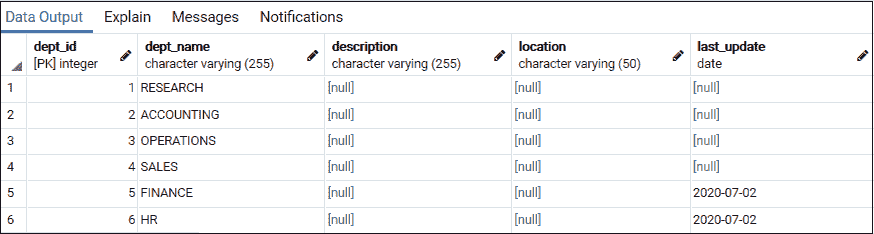
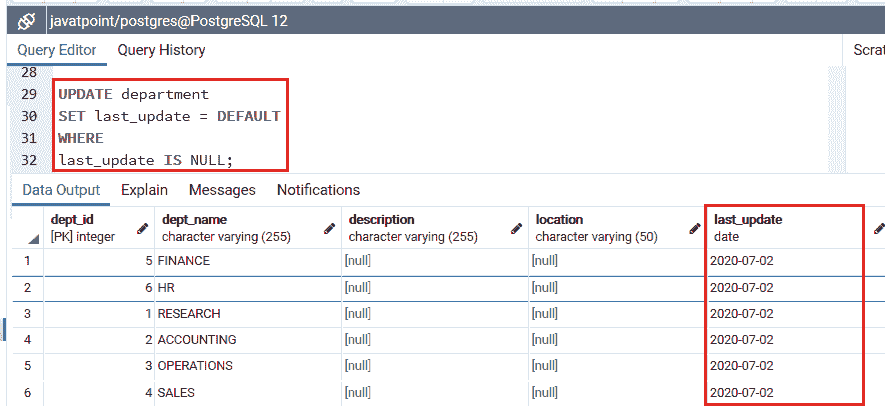
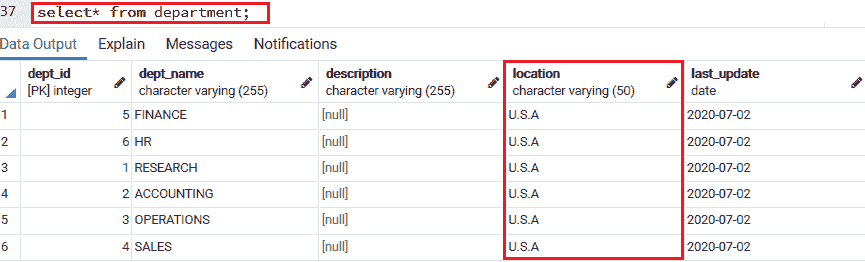
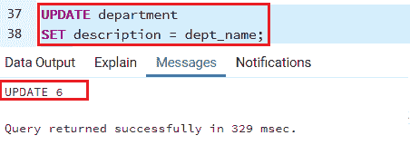
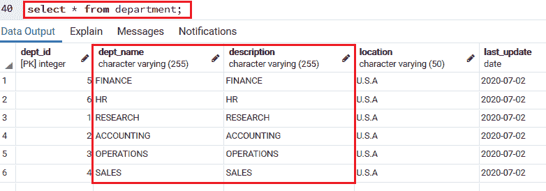
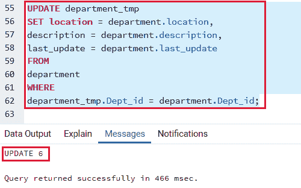
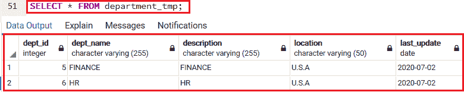
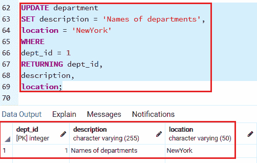
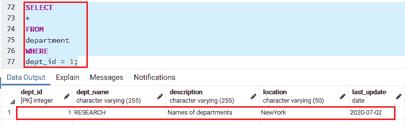

# PostgreSQL 更新

> 原文：<https://www.javatpoint.com/postgresql-update>

在本教程中，我们将学习 **PostgreSQL UPDATE** 命令来更新表中的当前数据。

在 [PostgreSQL](https://www.javatpoint.com/postgresql-tutorial) 中，更新命令用于**更改表**中的当前记录。要更新所选行，我们必须使用 [WHERE 子句](https://www.javatpoint.com/postgresql-where-clause)；否则，所有行都将被更新。

### 更新命令的语法

更新命令的语法如下:

```sql

UPDATE table_name  
SET column1 = value1, 
column2 = value2...., 
columnN = valueN  
WHERE 
condition;  

```

我们有以下参数，它们用在上面的语法中:

| 因素 | 描述 |
| 更新 | 它是一个关键字，用于更新表的行。 |
| 表名 | 在 UPDATE 子句之后，我们将使用该参数定义**表名**来更新数据。 |
| 第 1 列=值 1，
第 2 列=值 2，
......
列=值 | 用于描述表中**列的名称**，其值需要在 **SET** 子句中修改。我们可以使用**逗号(，**来分隔每对**列和值**。 |
| 在哪里 | 我们将使用 **WHERE 子句**来过滤记录，并且只获取必要的记录。 |
| 情况 | 它是一个表达式，用于返回类型为**布尔**的值。此表达式仅对行返回**真**。 |

## PostgreSQL 更新命令示例

为了更好的理解，我们将看到 **PostgreSQL [更新](https://www.javatpoint.com/postgresql-update)命令**的例子。

我们将采用我们在**插入命令部分**中创建的**部门表**。

首先，借助下面的命令，我们将看到**部门表**的结构:

```sql

SELECT * FROM department;

```

执行 select 命令后，我们将得到以下结果:



## PostgreSQL UPDATE 表示例

在这里，我们将在以下命令的帮助下，将**最后 _ 更新**列的**空值**修改为**当前日期**:

```sql

UPDATE department
SET last_update = DEFAULT
WHERE
last_update IS NULL;

```

执行上述命令后，我们将获得以下结果:



在上面的查询中，我们将 **DEFAULT 关键字**应用于 **last_update** 列，该列根据默认值采用**当前日期**。而 **WHERE 子句**只更新那些 **last_update** 列值为 **NULL** 的行。

## 使用“更新”命令升级表中所有行的示例

要将**部门**表中所有行的**位置列**中的值更新为**美国**，我们使用以下命令:

#### 注意:在下面的更新命令中，我们忽略了 WHERE 子句:

```sql

UPDATE department
SET location = 'U.S.A';

```

执行上述查询后，将更新**部门表中的**位置列**:**


我们将使用**选择命令**在**部门表中验证上述命令的输出:**

```sql

select* from department;

```



在同一个表中，我们还可以从一个额外的列更新一个列的数据。

以下命令用于将**部门名称**列的值复制到**部门**表的**描述列**:

```sql

UPDATE department
SET description = dept_name;

```

执行上述查询后，将更新**部门表中的**描述栏**:**



之后，我们将使用选择命令查看**部门**表中的**更新列(描述)**:



## PostgreSQL 更新连接命令示例

这里我们就拿**部门 _tmp 表**来说，它的结构和**部门**表一样:

以下命令用于更新值，这些值来自**部门 _tmp** 表中各列的**部门表**:

```sql

UPDATE department_tmp
SET location = department.location,
description = department.description,
last_update = department.last_update
FROM
department
WHERE
department_tmp.Dept_id = department.Dept_id;

```

一旦我们执行上述查询，它将更新**部门 _tmp 表:**



要验证**部门 _tmp** 表，我们将使用**选择**命令:

```sql

SELECT * FROM department_tmp; 

```

我们将获得以下输出:



#### 注意:在上面的更新命令中，我们使用了 FROM 子句来描述更新中包含的第二个表(部门)。

这里我们使用了 **WHERE 子句**中的连接条件。有时这个更新命令被称为**更新内部连接或更新连接**，因为在**更新**命令中涉及两个或多个表。

### 通过返回条件更新命令

默认情况下，**更新命令**可以返回受影响的行数，并且还会借助**返回部分**返回有效数据。

以下命令用于更新**部门表**中 **Dept_id 1** 的行，并返回**更新数据**。

```sql

UPDATE department
SET description = 'Names of departments',
location = 'NewYork'
WHERE
dept_id = 1 
RETURNING dept_id,
description,
location;

```

执行上述命令后，我们将得到下表结构:



之后，我们将使用 select 命令检查**部门表中的更新数据:**

```sql

SELECT
*
FROM
department
WHERE
dept_id = 1;

```

一旦我们运行了上面的选择查询，我们会得到下面的输出:



* * *