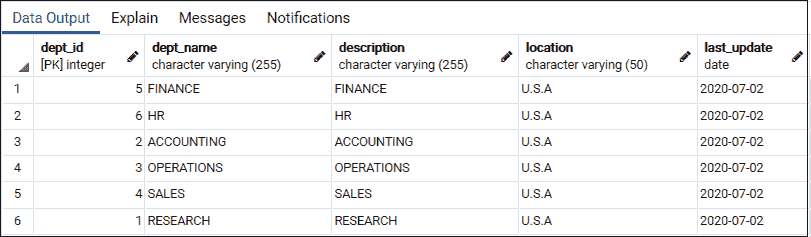
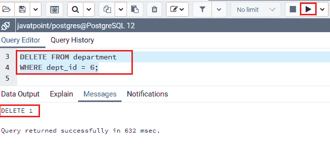
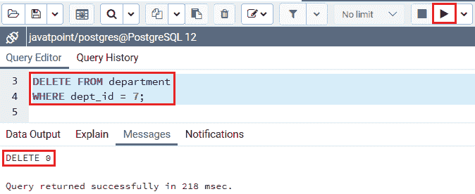
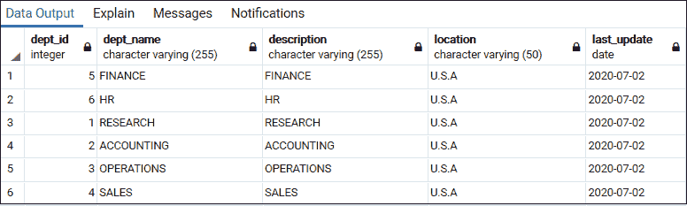
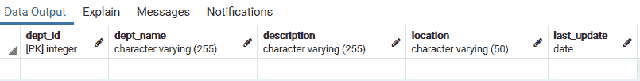

# PostgreSQL 删除

> 原文：<https://www.javatpoint.com/postgresql-delete>

在本节中，我们将学习如何使用 PostgreSQL 中的 delete 命令从特定的表中删除数据。

DELETE 命令用于从表中删除所有现有记录。而[**子句**](https://www.javatpoint.com/postgresql-where-clause)**用于**删除选中的记录**，否则所有数据都将被删除。**

 **#### 注意:TRUNCATE 命令提供了一种从表中删除所有行的更快的技术。

### 句法

DELETE 命令的基本语法如下:

```

DELETE FROM table_name  
WHERE [condition];  

```

以上**语法中使用了以下参数:**

| 因素 | 描述 |
| **表 _ 名称** | 它用于在 DELETE FROM 子句中定义要从中删除数据的表。 |
| **凡子句** | WHERE 子句用于描述应该删除哪些记录。如果我们忽略 WHERE 子句，表中的所有记录都将被删除。这是一个可选参数。 |

**删除命令**返回删除的行数。如果没有删除行，删除命令将返回**零**。有时它可能与 WHERE 子句中的条件所标识的行数不相似，因为该表可能有一个 BEFORE DELETE 触发器。在使用命令删除表中的记录时，我们应该谨慎。

在这种情况下，我们需要验证引用另一个表中的一列或多列的条件，为此，我们可以使用如下的 **USING 子句**:

```

DELETE FROM table
USING another_table
WHERE table.id = another_table.id AND

```

如果我们不需要使用 **USING 子句**，我们可以使用子查询，如下面的命令所示:

```

DELETE FROM table
WHERE table.id = (SELECT id FROM another_table);

```

## PostgreSQL 删除命令示例

这里我们将采用我们在 **[PostgreSQL](https://www.javatpoint.com/postgresql-tutorial) 教程**的 **PostgreSQL 插入命令部分**中创建的**部门和 department_tmp** 表格。

以下命令将帮助我们显示**部门**表的记录:

```

SELECT * FROM department;

```



## 带有 WHERE 子句的 PostgreSQL DELETE 示例

以下命令用于删除 **dept_id** 列中值为 6 的行:

```

DELETE FROM department
WHERE dept_id = 6;

```



执行上述命令后，会返回 **DELETE 1** 的消息，表示部门表中已经删除了一行。

#### 注意:如果我们不使用 WHERE 子句，整个记录将被删除。

如果**部门表**没有与 **dept_id 7** 的任何一行，那么 DELETE 命令起作用，返回为 **DELETE 0** 。

**例如**



## PostgreSQL DELETE USING 命令示例

如果我们想删除**部门 _tmp** 表中所有具有**部门 _id** 列值的**部门表**中的行，我们需要遵循以下过程:

**第一步**

首先借助下面的命令，我们会看到**部门 _tmp** 表数据:

```

SELECT  * FROM department_tmp;

```

执行上述命令后，我们将看到 **department_tmp** 的表结构。



**第二步**

然后，我们将使用下面的[删除命令](https://www.javatpoint.com/postgresql-delete)借助**使用**条件删除**部门**表中的行:

```

DELETE FROM department 
USING department_tmp
WHERE
department.dept_id = department_tmp.dept_id;

```

**第三步**

最后查询**部门表**检查删除操作是否正常。

## PostgreSQL 从表中删除所有行

在这种情况下，我们不使用下面 DELETE 命令中的 WHERE 条件来删除部门表中的所有行:

```

DELETE FROM department;

```

如下图所示，部门表现在是空的。



之后，我们将使用 DELETE 命令的返回条件删除 **department_tmp** 表中的所有行，并返回删除的行:

```

DELETE FROM department_tmp 
RETURNING *;

```


* * ***