# PostgreSQL Order by 子句

> 原文：<https://www.javatpoint.com/postgresql-order-by-clause>

在本节中，我们将学习 PostgreSQL **ORDER BY 条件**，该条件用于按照**升序或降序**对数据进行排序。并且记录是基于一列或多列获取的。

从表中提取记录时，SELECT 命令以不确定的顺序返回行。为此，我们将使用 SELECT 语句中的 ORDER BY 子句对结果集的行进行排序。

**ORDER BY** 子句允许我们按照升序或降序对由 [SELECT](https://www.javatpoint.com/postgresql-select) 条件返回的行进行排序，这取决于排序表达式。

### PostgreSQL Order by 子句的语法

PostgreSQL ORDER BY 条件的语法如下:

```

SELECT column-list  
FROM table_name  
[WHERE condition]  
[ORDER BY column1, column2, .. columnN] [ASC | DESC];  

```

以下是上述命令中使用的参数:

| 参数 | 描述 |
| **列 _ 列表** | 它用于定义我们要检索的列或计算。 |
| **表 _ 名称** | 它用于描述我们要从中检索记录的表。并且 **FROM** 子句中必须至少有一个表。 |
| **条件** | 它是一个可选参数，用于定义检索记录必须满足的条件。 |
| **ASC** | 它也是一个可选参数，用于按表达式对结果集进行升序排序(默认情况下，如果没有修饰符是提供者)。 |
| 描述 | 它也是一个可选参数，用于按表达式降序对结果集进行排序。 |

按子句的[订单按以下格式工作:](https://www.javatpoint.com/postgresql-group-by-clause)

从 **From 子句→** 开始，之后将**选择**特定列→然后按子句的**顺序执行。**

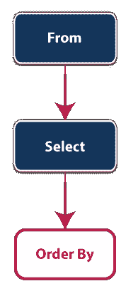

#### 注意:在 ORDER BY 子句中，由于顺序评估，我们可以在 SELECT 命令中使用列别名。

## PostgreSQL ORDER BY 子句示例

在这里，我们将借助下面的例子来理解 **PostgreSQL ORDER BY** 子句的工作原理:

为此，我们将采用*员工表，该表是我们在 [PostgreSQL 教程](https://www.javatpoint.com/postgresql-tutorial)的前面部分中创建的。*

 *下面的截图定义了 ***员工*** 表格中的不同列:

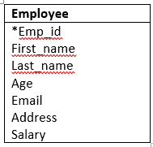

在上表中，我们将使用**订单依据子句**执行**不同类型的操作员**。

*   **使用 PostgreSQL ORDER BY 子句**按一列对行进行排序

在下面的示例中，我们将使用 ORDER BY 条件按员工的名字升序排列:

```

SELECT first_name, last_name
FROM employee
ORDER BY first_name ASC;

```

**输出**

执行上述命令后，我们将得到下面的输出，它以升序获取所有的**名字**。

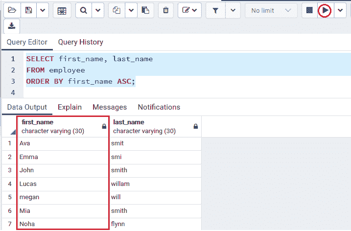

我们也可以忽略 **ORDER BY** 子句中的 **ASC** 选项，因为 **ASC 选项**是默认的，如下面的命令所示:

```

SELECT first_name, last_name
FROM employee
ORDER BY first_name ;

```

**输出**

正如我们在下面的截图中看到的，我们得到了与上面类似的输出:

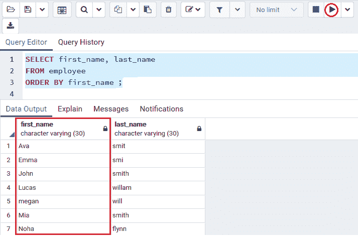

### 使用 PostgreSQL ORDER BY 子句按降序按一列对行进行排序

以下命令从 ***【员工】*** 表中选择**名**和**姓**，并按**降序**中姓氏列的值获取行:

```

SELECT first_name, last_name
FROM employee
ORDER BY first_name desc ;

```

**输出**

执行上述命令后，我们将得到下面的输出，它按照**递减**的顺序获取所有的**名字**。

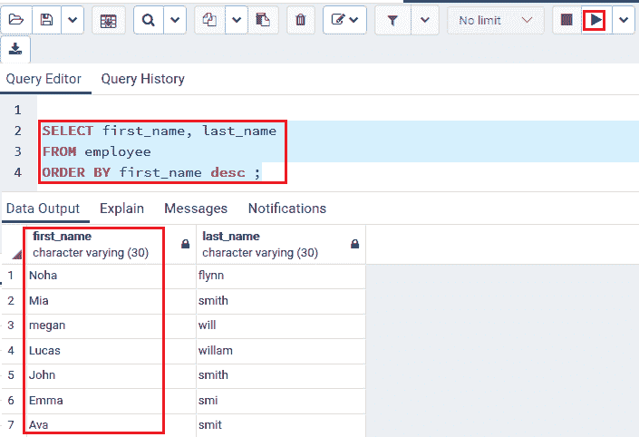

### 使用 PostgreSQL ORDER BY 子句按多列对行进行排序

以下命令用于从 ***员工*** 表中选择**名和姓**，并对多列行进行排序:

```

SELECT address, email
FROM employee
ORDER BY address ASC, email DESC;

```

**输出**

执行上述命令后， **ORDER BY 子句**首先通过**名字**列中的值获取行。然后它通过**姓氏**列中的值获取行。

在下图中，我们还可以看到我们有两名员工，他们有着相似的**名**(约翰)和**姓**，按降序排列。

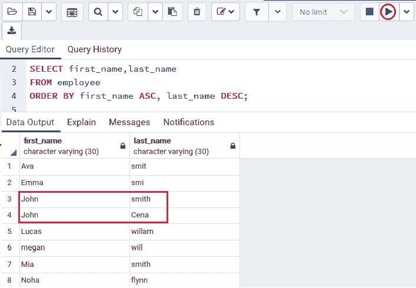

### 使用 PostgreSQL ORDER BY 子句按表达式对行进行排序

在下面的示例中，我们将选择地址及其长度，这将通过地址在 ***员工*** 表中的长度来获取行:

注意:在 PostgreSQL 中，列别名 **len** 是可访问的，并且在 **ORDER BY** 子句中使用，因为 ORDER BY 子句是在 SELECT 条件之后完成的。而 **LENGTH()** 函数用来取一个字符串，得到特定字符串的长度。

```

SELECT address,
LENGTH (address) len
FROM employee 
ORDER BY len DESC;

```

**输出**

执行上述命令后，我们将得到如下结果，该结果描述了 ***员工*** 表中**地址**列的长度值。

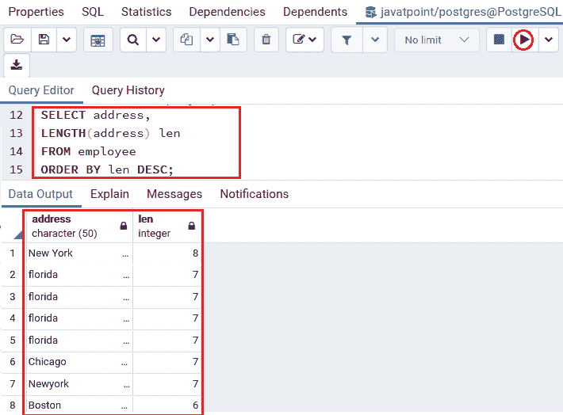

### 按条件和空值排序

当我们获取具有空值的行时，我们可以通过 **ORDER BY** 子句的进一步 **LAST** 选项来定义空值的顺序。

在数据库中，**空**是定义缺失记录或记录时未指定记录的表示。

```

ORDER BY sort_expresssion [ASC | DESC] [NULLS FIRST | NULLS LAST]

```

在上面的语法中，我们有两个最重要的选项:

| 选择 | 描述 |
| 先为空 | 它将空值放在其他非空值之前。 |
| 最后为空 | 它将空值放在另一个非空值之后。 |

为了更好地理解，我们将创建如下表格:

```

CREATE TABLE demo(
	num varchar
);

```

执行以上命令后，我们会得到下面的消息窗口； ***演示*** 表已经创建成功。

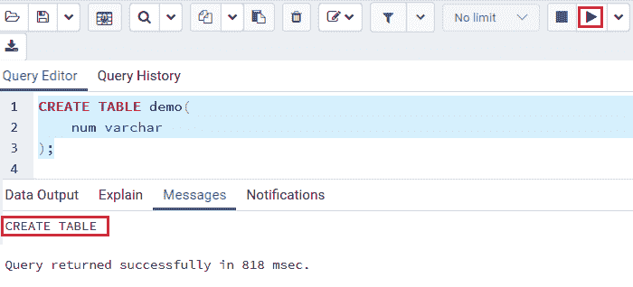

一旦我们创建了一个表，我们将在 ***演示*** 表中插入一些值，如下所示:

```

INSERT INTO demo(num)
VALUES(1),(2),(null),(3),(4);

```

**输出**

执行以上命令后，我们会得到下面的消息窗口；**值**已成功插入到 ***演示*** 表中。

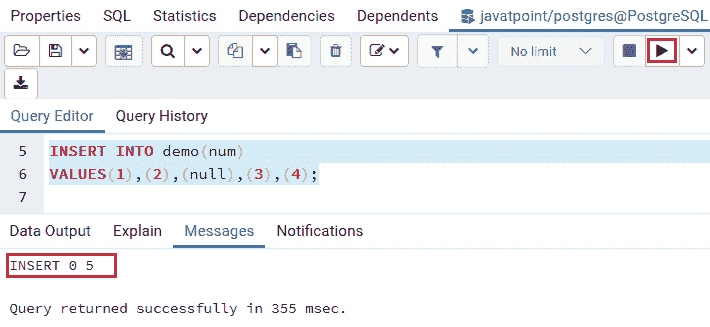

#### 注意:在这里，我们不需要理解 CREATE TABLE 和 INSERT 命令，因为我们希望在 pgAdmin 或 psql 中执行该命令来创建*演示*表并将值插入其中。

以下命令用于从演示表中获取记录:

```

SELECT num
FROM demo
ORDER BY num;

```

**输出**

执行上述命令后，我们将得到输出:

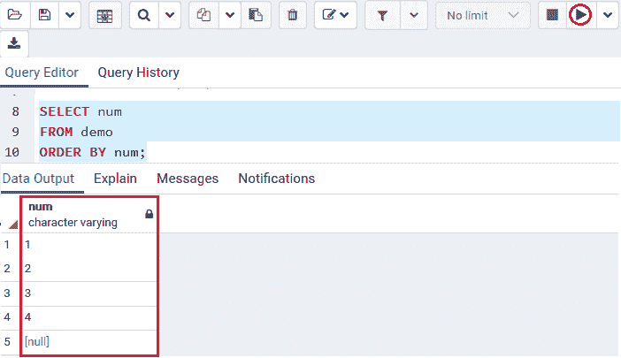

在本例中，我们使用 **ORDER BY** 条件在 ***演示*** 表的 **num** 列中获取值，该列将空值放在另一个值之后。因此，如果我们使用 **ASC** 选项，默认情况下 **ORDER BY** 子句采用 **NULLS LAST** 选项。

因此，下面的命令用于获取类似的结果:

```

SELECT num
FROM demo
ORDER BY num NULLS LAST;

```

**输出**

执行上述命令后，我们将获得以下结果:

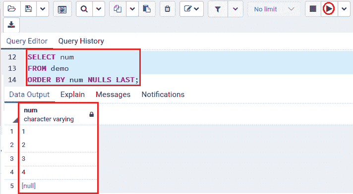

我们将使用**先为空**选项将**置为空**放在其他非空值之前，如下所示:

```

SELECT num
FROM demo
ORDER BY num NULLS FIRST;

```

**输出**

执行上述命令后，我们将得到以下结果:

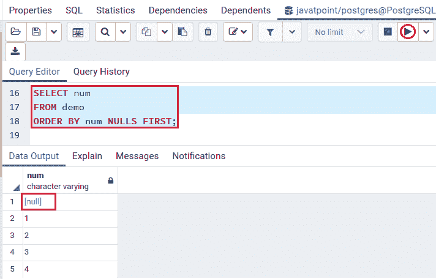

然后，在下面命令的帮助下，我们将在 **num** 列中按照**演示**表的降序获取值:

```

SELECT num
FROM demo
ORDER BY num DESC;

```

**输出**

一旦我们实现了上面的命令，我们将得到下面的输出:

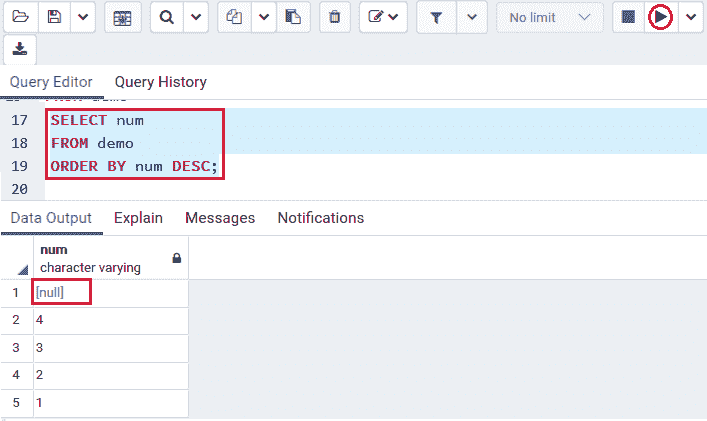

执行完 **ASC 和 DESC** 命令后，我们可以看到**输出**，默认情况下，带有 **DESC** 选项的 **ORDER BY 条件**使用 **NULLS FIRST** 选项。

### 颠倒顺序

我们将使用 **NULLS LAST 选项**来反转特定表格中的顺序。

```

SELECT num
FROM demo
ORDER BY num DESC NULLS LAST;

```

**输出**

执行上述命令后，我们将获得以下结果:

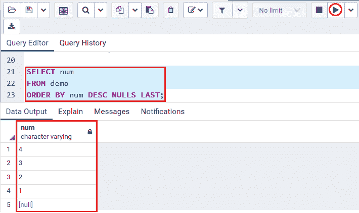

### 概观

*   我们使用 **SELECT** 命令中的 **ORDER BY** 子句来获取特定表中的行。
*   我们使用 **ASC 选项**以**升序**获取行，使用 **DESC** 选项以**降序**获取行。
*   默认情况下，订单依据条件使用 **ASC** 功能。
*   我们使用**第一个空值和最后一个空值**选项来描述另一个非空值的空值顺序。

* * **