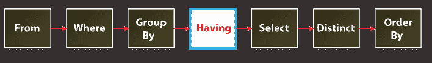
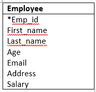
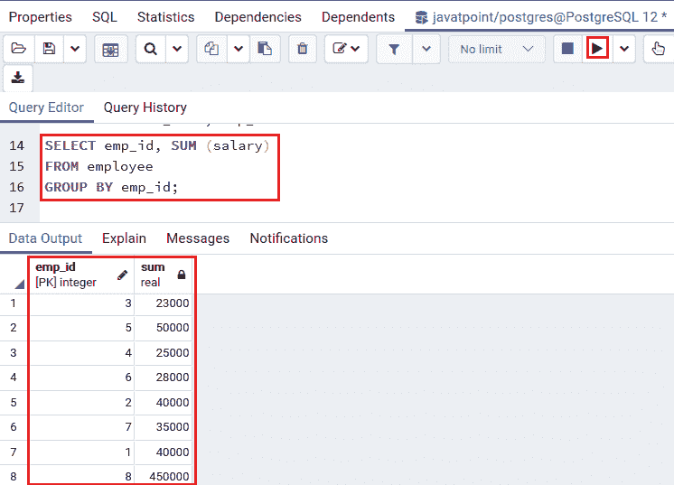
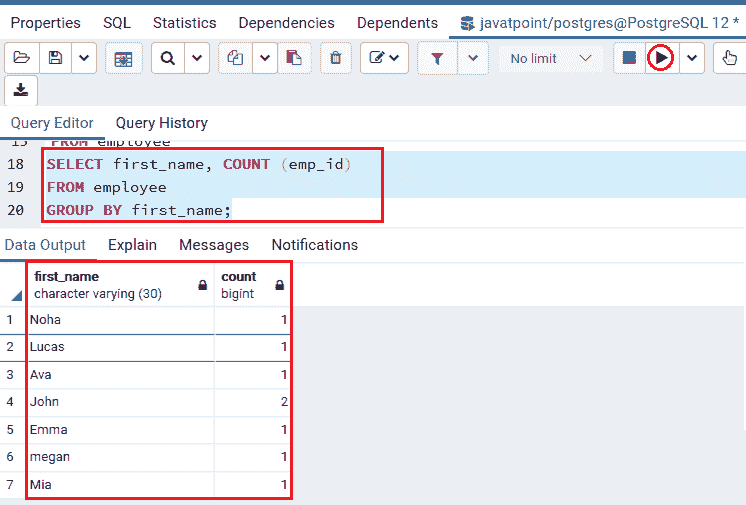
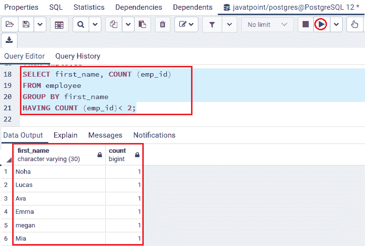

# PostgreSQL Having 子句

> 原文：<https://www.javatpoint.com/postgresql-having-clause>

在本节中，我们将了解 PostgreSQL 中 **HAVING 子句**的工作原理。

having 子句用于指定组或聚合的搜索条件。它通常与 GROUP BY 子句一起使用，根据详细条件筛选组或聚合。

### PostgreSQL having 子句的语法

PostgreSQL HAVING 子句的基本语法如下:

```

SELECT column1, aggregate_function (column2)
FROM table1, table2  
WHERE [ conditions ]  
GROUP BY column1, column2  
HAVING [ conditions ]  
ORDER BY column1, column2  

```

在上面的语法中，我们使用了以下参数:

| 因素 | 描述 |
| **分组依据条款** | 它用于返回按列 1 分组的行。 |
| **有条款** | 它用于定义过滤集合的条件。 |

#### 注意:在 PostgreSQL 中，我们可以添加 SELECT 命令的其他子句，如 LIMIT、JOIN 和 FETCH。随后，HAVING 子句在 SELECT 子句之前工作。

在 [PostgreSQL](https://www.javatpoint.com/postgresql-tutorial) 中，HAVING 子句的工作格式如下:



我们不能在 **HAVING 子句**中使用列别名，因为在评估 HAVING 子句时， [SELECT](https://www.javatpoint.com/postgresql-select) 子句中定义的列别名不可访问。

### having 子句和 where 子句的区别

让我们看看 **HAVING 子句**和 WHERE 子句之间的区别:

| 有条款 | Where 子句 |
| HAVING 子句允许我们根据定义的条件过滤多组行。 | WHERE 子句允许我们根据定义的条件筛选行。 |
| HAVING 子句对多组行很有用。 | WHERE 子句仅适用于行。 |

## PostgreSQL HAVING 子句的示例

让我们看一些 PostgreSQL 中 having 子句的例子。因此，这里我们将采用**员工**表，它是我们在 PostgreSQL 教程的早期主题中创建的。



### 使用 PostgreSQL HAVING 子句的 SUM()函数示例

在下面的示例中，我们使用 GROUP BY 子句和 SUM()函数来确定每个员工的总工资:

```

SELECT emp_id, SUM (salary)
FROM employee
GROUP BY emp_id;

```

**输出**

在下面的例子中，我们使用 [**GROUP BY** 子句](https://www.javatpoint.com/postgresql-group-by-clause)和 **SUM()** 函数来识别每个员工的总**工资:**

```

SELECT emp_id, SUM (salary)
FROM employee
GROUP BY emp_id;

```

**输出**

执行上述命令后，我们将获得以下输出，该输出显示了每个员工基于其 **emp_id** 的工资总和。


之后，我们将在上面的命令中添加 HAVING 子句，用于选择工资超过 25000 英镑的员工:

```

SELECT emp_id, first_name, SUM (salary)
FROM employee
GROUP BY first_name, emp_id
HAVING SUM (salary) > 25000
order by first_name DESC;

```

**输出**

执行上述命令后，我们将得到下面的结果，显示那些工资超过 25000 的员工:



### 使用 PostgreSQL HAVING 子句的 COUNT()函数示例

下面的命令用于在 GROUP BY 子句的帮助下识别员工人数:

```

SELECT first_name, COUNT (emp_id)
FROM employee
GROUP BY first_name;

```

**输出**

一旦我们实现了上面的命令，我们将得到下面的输出；显示员工人数:



之后，我们将在上面的命令中添加 HAVING 子句，以选择少于两个员工的**名字**:

```

SELECT first_name, COUNT (emp_id)
FROM employee
GROUP BY first_name
HAVING COUNT (emp_id)< 2;

```

**输出**

执行上述命令后，我们将得到以下结果:



* * *