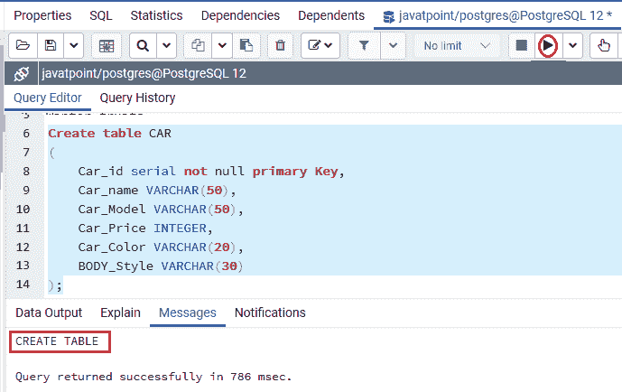
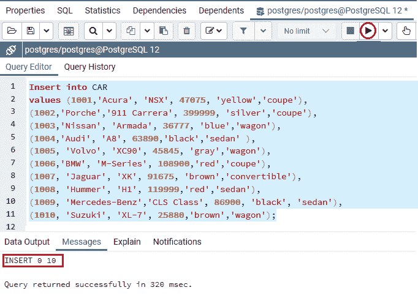
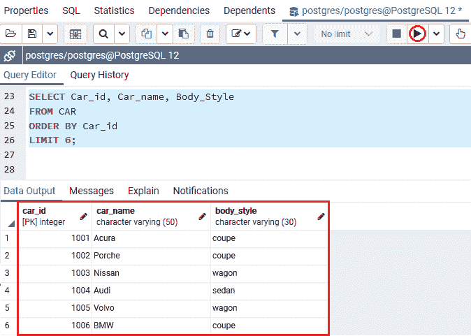
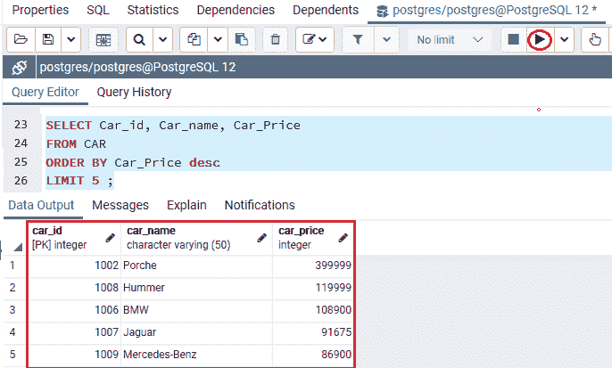
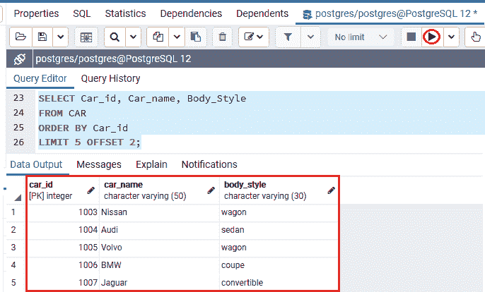

# PostgreSQL LIMIT

> 原文：<https://www.javatpoint.com/postgresql-limit>

在本节中，我们将了解 **PostgreSQL** LIMIT 子句的工作原理，该子句用于获取命令生成的行子集。

### PostgreSQL LIMIT 子句的语法

PostgreSQL LIMIT 子句的基本语法如下:

```

SELECT select_list 
FROM table_name
ORDER BY sort_expression
LIMIT row_count

```

在上面的语法中，Limit 子句返回由命令创建的**行计数**行。

*   如果 **row_count** 值为 **NULL** ，那么查询将产生类似的结果，因为它不包含 **LIMIT** 子句。
*   或者如果**行数**为**零**，该语句将返回一个空集。
*   如果我们想在获得**行计数**行之前遗漏各种行，我们可以使用 **OFFSET 子句**。

并且**偏移条款**在**限制条款**之后，我们可以在下面的命令中看到:

```

SELECT select_list
FROM table_name
LIMIT row_count OFFSET row_to_skip;

```

#### 注意:这是 SELECT 命令的一个可选子句，它使查询返回的几行。

如果我们使用 ORDER BY 子句将行顺序与 **LIMIT** 子句联系起来。或者，如果我们不使用 ORDER BY 子句，我们可能会得到一个未命名的行顺序的输出。

### PostgreSQL LIMIT 示例

让我们看一些例子来理解 [PostgreSQL](https://www.javatpoint.com/postgresql-tutorial) LIMIT 子句的工作原理。

在这里，我们借助**[CREATE table](https://www.javatpoint.com/postgresql-create-table)命令创建了一个名为 ***CAR*** 的新表，并使用**INSERT 命令将一些值插入到 ***CAR*** 表中。****

 ****```

Create table CAR
(
	Car_id serial not null primary Key,
	Car_name VARCHAR(50), 
	Car_Model VARCHAR(50),
	Car_Price INTEGER,
	Car_Color VARCHAR(20),
	BODY_Style VARCHAR(30)
);

```

**输出**

执行以上命令后，我们会得到下面的消息窗口，并且***【CAR】***表已经创建成功。



之后，我们将借助下面的命令在*表中插入的一些值:*

 *```

Insert into CAR 
values (1001,'Acura', 'NSX', 47075, 'yellow','coupe'),
(1002,'Porche','911 Carrera', 399999, 'silver','coupe'),
(1003,'Nissan', 'Armada', 36777, 'blue','wagon'),
(1004,'Audi', 'A8', 63890,'black','sedan' ),
(1005, 'Volvo', 'XC90', 45845, 'gray','wagon'),
(1006,'BMW', 'M-Series', 108900,'red','coupe'),
(1007, 'Jaguar', 'XK', 91675, 'brown','convertible'),
(1008, 'Hummer', 'H1', 119999,'red','sedan'),
(1009, 'Mercedes-Benz','CLS Class', 86900, 'black', 'sedan'),
(1010, 'Suzuki', 'XL-7', 25880,'brown','wagon');

```

**输出**

执行上述命令后，我们将得到如下消息窗口，值**已经成功插入到 ***CAR*** 表中。**



### 使用 PostgreSQL LIMIT 约束返回行数的示例

在下面的例子中，我们将借助 **LIMIT 子句**获取按 **Car_id** 排序的第一个 **SIX CAR** 细节。

```

SELECT Car_id, Car_name, Body_Style
FROM CAR
ORDER BY Car_id
LIMIT 6;

```

执行上述命令后，我们将得到如下输出，该输出将前六辆车的详细信息显示到 ***CAR*** 表中。



### 使用 PostgreSQL LIMIT 子句获取顶行和底行的示例

为了从表中选择具有最大值或最小值的行，我们经常使用 **LIMIT** 子句。

例如，如果我们想根据最贵的五辆车的**价格**对它们进行排序，我们可以按照它们的**汽车价格**按照**递减**的顺序对它们进行排序。

在下面的命令中，我们使用 **LIMIT 子句**将最贵的汽车放入 ***CAR*** 表:

```

SELECT Car_id, Car_name, Car_Price
FROM CAR
ORDER BY Car_Price desc
LIMIT 5 ;

```

**输出**

执行上述命令后，我们将获得以下输出:



### 使用 PostgreSQL LIMIT 子句的偏移量示例

在本例中，我们将使用 **LIMIT 和 OFFSET** 子句，在以下命令的帮助下，从 **Car_id** 订购的第五辆车开始获得五辆车:

```

SELECT Car_id, Car_name, Body_Style
FROM CAR
ORDER BY Car_id
LIMIT 5 OFFSET 2;

```

**输出**

执行上述命令后，我们将获得以下输出，显示来自 **Car_id =1003** 的汽车，因为我们将**偏移**值为 **2** ，将**极限**值为 **5** 放入 ***CAR*** 表中。



* * ******