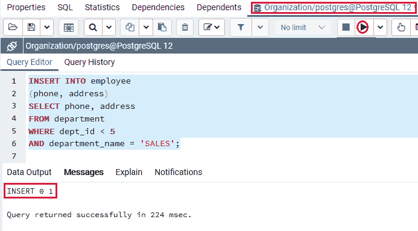
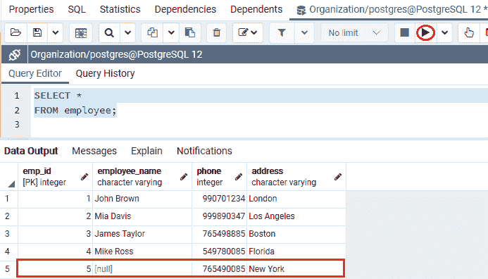
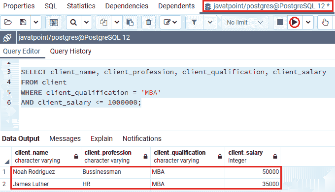
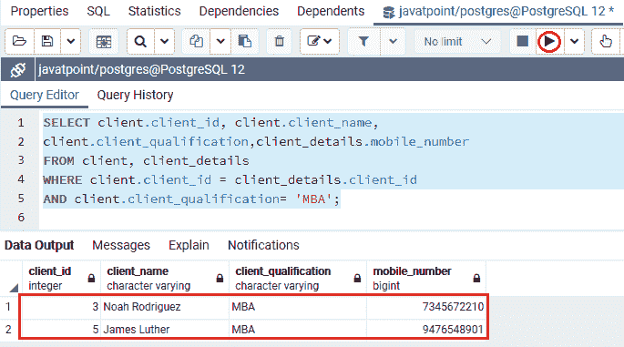
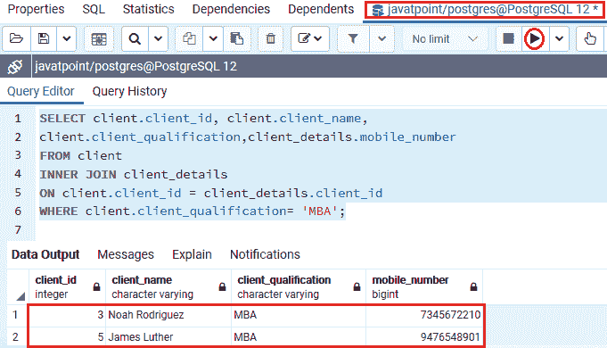
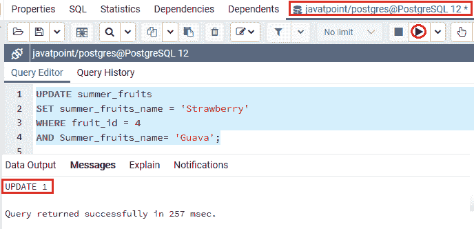
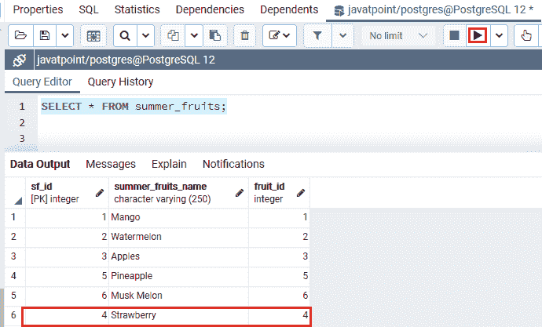
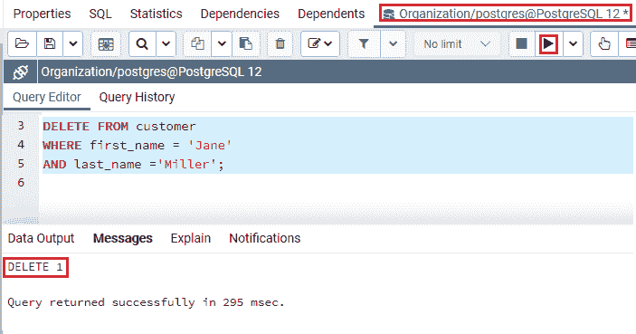
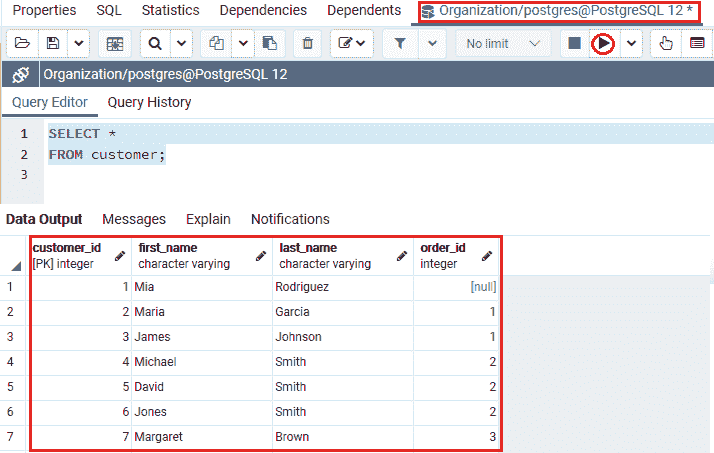

# 后置 SQL 和条件

> 原文：<https://www.javatpoint.com/postgresql-and-condition>

在本节中，我们将了解 **PostgreSQL AND Condition** 的工作原理，它与 **WHERE 子句**一起使用，从表中的多个列中选择唯一的数据。

我们也可以看到**和**的**例子**和**不同的查询，如插入、选择、更新和删除**。

## PostgreSQL 及条件介绍

在 [PostgreSQL](https://www.javatpoint.com/postgresql-tutorial) 中，**和**条件可以与[选择](https://www.javatpoint.com/postgresql-select)、[插入](https://www.javatpoint.com/postgresql-insert)、[更新](https://www.javatpoint.com/postgresql-update)和[删除命令](https://www.javatpoint.com/postgresql-delete)相结合。换句话说，如果**和**分隔的所有条件都是**真**，我们可以说**和条件**用于指定数据。

#### 注意:PostgreSQL AND 条件允许我们返回两个或多个条件。PostgreSQL AND 条件需要任何条件，可以是条件 1、条件 2，...条件必须出现在数据中并包含在输出中。

## 后置 SQL 和条件语法

PostgreSQL AND 条件的语法如下:

```sql

WHERE condition1  
AND condition2  
...  
AND condition_n;  

```

在上面的语法中，我们使用了以下参数:

| 参数 | 描述 |
| 条件 1，条件 2，...条件 _N | 它指定了评估的条件，以确定是否将选择记录。 |

## 后置条件和条件的例子

让我们看不同的例子来理解**后置 SQL 和条件**是如何工作的。

## 带有插入命令的后置条件示例

我们将显示如何使用插入命令来使用**和条件**。

为此，我们从**组织数据库**中取出 ***员工*** 和 ***部门*** 表，将记录从一个表插入到另一个表中。

在下面的例子中，我们将记录从 ***部门*** 表插入到 ***员工*** 表中。我们从 ***部门*** 表中取**电话**和**地址**栏目记录，**部门 _id** 小于 **5，部门 _ 名称**为**销售部**。

```sql

INSERT INTO employee
(phone, address)
SELECT phone, address
FROM department
WHERE dept_id < 5
AND department_name = 'SALES';

```

**输出**

执行上述命令后，我们将获得如下消息窗口，显示该值已成功插入 ***员工*** 表中。



为了检查记录是否已经插入到 ***员工*** 表中，我们将使用如下的 SELECT 命令:

```sql

Select * from employee;

```

**输出**



从下面的截图中我们可以看到 **PostgreSQL AND 条件**在 ***员工*** 表中插入了一条记录。

## 带有选择命令的后置条件示例

在下面的例子中，我们将使用**和条件**显示，选择命令有两个条件。

为此，我们从**javapoint**数据库中取出 ***客户端*** 表，从表中获取记录。

我们将**和条件**与 [WHERE 子句](https://www.javatpoint.com/postgresql-where-clause)一起使用，可以看到以下命令:

```sql

SELECT client_name, client_profession, client_qualification, client_salary
FROM client
WHERE client_qualification = 'MBA'
AND client_salary <= 1000000;

```

**输出**

执行上述命令后，我们将获得以下输出:



从上面的截图中我们可以看到， **PostgreSQL AND** 条件将返回那些**客户 _ 资质**为**【MBA】**且**客户 _ 薪资**小于等于 **1000000** 的客户信息。

## 连接两个或多个表的 PostgreSQL AND 条件示例

为了用**选择命令**连接使用 **PostgreSQL 和条件**的各种表，我们从**Javapoint**数据库中获取 ***客户端和客户端 _details*** 表。

与上面的语句相比，以下命令是一个更复杂的查询:

```sql

SELECT client.client_id, client.client_name, 
client.client_qualification,client_details.mobile_number
FROM client, client_details
WHERE client.client_id = client_details.client_id
AND client.client_qualification= 'MBA';

```

**输出**

成功执行上述命令后，我们将获得以下输出:



我们可以看到，上面的命令现在工作正常；如果我们想更精确地做到这一点，我们可以借助 PostgreSQL INNER Join 条件编写上述语句。

```sql

SELECT client.client_id, client.client_name, 
client.client_qualification,client_details.mobile_number
FROM client
INNER JOIN client_details
ON client.client_id = client_details.client_id
WHERE client.client_qualification= 'MBA';

```

**输出**

在执行上述命令时，我们将得到以下结果:



从上面的截图中我们可以看到， **PostgreSQL AND 条件**将返回那些**client _ quality**为 **MBA** 的行。 ***客户端*** 和 ***客户端 _ 详细信息*** 表连接在**客户端 _id** 上。

#### 注意:

*   所有的列都以类似 **client.client_id** 的表名开始。
*   有必要消除关于引用哪一列的任何不确定性，因为有时，我们在两个表中有相似的列名。
*   如上图所示， ***客户端*** 和 ***客户端 _ 详细信息*** 表与**客户端 _id** 具有相似的列。
*   在这种情况下，输出将只显示**选择**命令中提到的**客户端标识、客户端名称、客户端资格和移动号码**列。

## 带有更新命令的后置 SQL AND 条件示例

在下面的例子中，我们将显示如何将**和条件**与更新命令一起使用。

为此，我们从 **Javatpoint** 数据库中获取 ***夏果*** 表。

在以下命令中，**后置条件**用于更新以下值:

**夏 _ 果 _ 名**取值为**草莓**，在**T5【夏 _ 果** 表中**果 _id** 等于**4****夏 _ 果 _ 名**为**番石榴**。

```sql

UPDATE summer_fruits
SET summer_fruits_name = 'Strawberry'
WHERE fruit_id = 4
AND summer_fruits_name= 'Guava';

```

**输出**

执行完上面的命令后，我们会得到下面的输出，在这里我们可以看到 ***【夏 _ 果】*** 表已经更新成功。



我们现在将使用**选择**命令来检查在 ***夏季水果*** 表中的特定记录是否已经更新:

```sql

SELECT * FROM summer_fruits;

```

**输出**

执行上述命令后，我们将得到以下结果:



## 带有删除命令的后置条件示例

在下面的例子中，我们将显示如何使用删除命令来使用**和条件**。

在下面的例子中，我们从**组织**数据库中获取 ***客户*** 表，从该表中删除特定记录。

在以下命令中， **PostgreSQL AND** 条件用于删除 ***客户*** 表中的所有记录，其中**名**为**【珍】**，**姓为【米勒】**。

```sql

DELETE FROM customer
WHERE first_name = 'Jane' 
AND last_name ='Miller';

```

**输出**

执行上述命令后，我们将获得如下消息窗口，显示记录已从 ***客户*** 表中成功删除。



我们现在将使用**选择**命令来检查在 ***客户*** 表中的特定记录是否已被删除:

```sql

SELECT * 
FROM customer;

```

**输出**

成功执行上述命令后，我们将获得以下输出:



### 概观

*   PostgreSQL **和条件**的使用在单个命令中提供了 AND 条件的优点。
*   我们使用**和**条件以及**插入命令**将记录从一个表插入到另一个表。
*   我们使用**和**条件以及**选择**命令来获取特定的表记录。
*   我们使用**和**条件以及**选择**命令来连接两个或多个表。
*   我们使用**和条件**以及**更新**语句来**更新**特定表的记录。
*   我们使用**和条件**以及**删除**语句来**删除**特定表的记录。

* * *