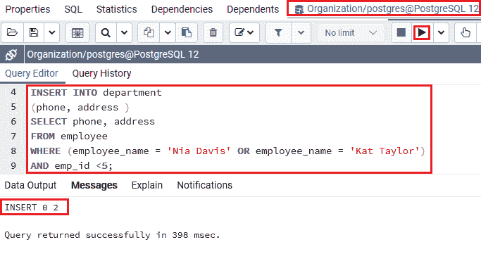
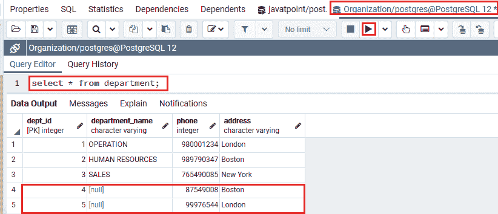
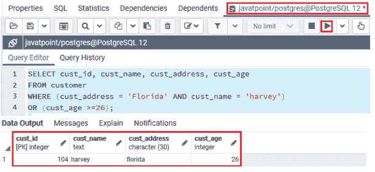
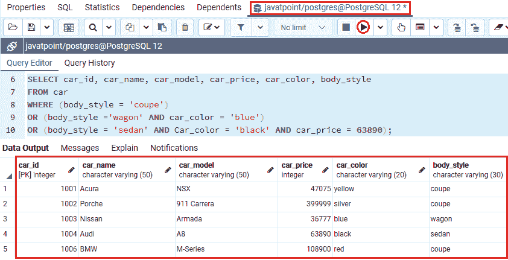
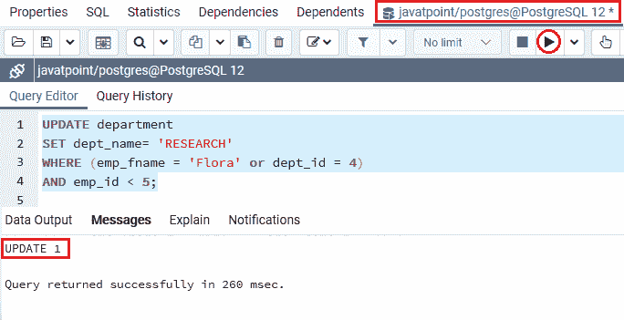
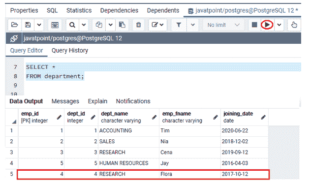
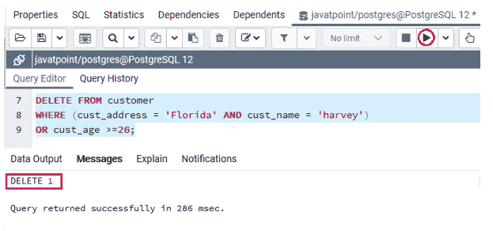
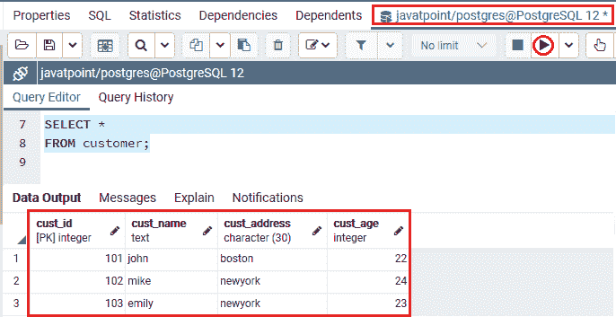

# PostgreSQL AND & OR 条件

> 原文：<https://www.javatpoint.com/postgresql-and-or-condition>

在本节中，我们将了解 **PostgreSQL 和& OR 条件**的工作原理，它们在一个命令中提供了 AND & OR 条件的优点。在这里，我们还将看到**和& OR 运算符****的**示例**具有不同的语句，如插入、选择、更新和删除**。

## PostgreSQL AND & OR 条件介绍

在[后缀](https://www.javatpoint.com/postgresql-tutorial)中，**和&或**条件可以与[插入](https://www.javatpoint.com/postgresql-insert)、[选择](https://www.javatpoint.com/postgresql-select)、[更新](https://www.javatpoint.com/postgresql-update)和[删除](https://www.javatpoint.com/postgresql-delete)命令组合使用。在组合这些条件时，我们必须注意在哪里使用括号，以便数据库知道评估每个条件的顺序。

**后置条件和&或条件**允许我们测试几个条件。我们永远不会忘记圆括号操作的顺序。

## 后置 SQL AND & OR 条件语法

PostgreSQL AND & OR 条件的语法如下:

```sql

WHERE condition1  
AND condition2  
...  
OR condition_n;  

```

在上面的语法中，我们使用了以下参数:

| 参数 | 描述 |
| 条件 1，条件 2，...条件 _n: | 这些条件用于定义对它们进行评估，以确定是否将选择记录。 |

## 后置条件的例子

让我们看不同的例子来理解**后置 SQL 和& OR 条件**是如何工作的。

## 带有插入命令的后置 SQL AND & OR 示例

在下面的例子中，我们将显示如何使用 **INSERT** 命令来使用 AND & OR 条件。

为此，我们从**组织数据库**中取出 ***员工*** 和 ***部门*** 表，将记录从一个表插入到另一个表中。

```sql

INSERT INTO department
(phone, address)
SELECT phone, address
FROM employee 
WHERE (employee_name = 'Nia Davis' OR employee_name = 'Kat Taylor')
AND emp_id <5;

```

**输出**

执行上述命令后，我们将获得如下消息窗口，显示该值已成功插入 ***部门*** 表格。



要检查记录是否已经插入到 ***部门*** 表中，我们需要使用如下 SELECT 命令:

```sql

Select * from department;

```

**输出**

如下图所示， **PostgreSQL 和& OR** 条件将记录插入到 ***部门*** 表中。

所有**电话**和**地址**记录来自**员工**表，该表的**员工姓名**为**“Nia Davis 或 Kat Taylor”且**的 **emp_id** 小于 **5** 。



## 带有选择命令的后置 SQL AND & OR 示例

在下面的例子中，我们将显示如何使用**选择**命令来使用**和&或**条件。

为此，我们从**javapoint**数据库中取出 ***【客户】*** 表，从该表中取出所有记录。

我们将**和& OR 条件**与 [WHERE 子句](https://www.javatpoint.com/postgresql-where-clause)一起使用，我们可以看到以下命令:

```sql

SELECT cust_id, cust_name, cust_address, cust_age
FROM customer 
WHERE (cust_address = 'Florida' AND cust_name = 'harvey')
OR (cust_age >=26);

```

**输出**

执行上述命令后，我们将获得以下输出:



在上面的例子中，我们可以看到**和& OR 条件**将返回所有居住在**佛罗里达州的**客户**，Cust_name** 为**“Harvey”，OR** 为所有 ***cust_age*** 大于等于 26 的客户。

并且**括号()**用于指定**和&或条件**的分析顺序。

让我们再看一个带有**和&或**条件的**选择**命令的例子。为此，我们从**Javapoint**数据库中提取**T5【汽车】T6**表。

与上面的语句相比，以下命令是一个更复杂的查询:

```sql

SELECT car_id, car_name, car_model, car_price, car_color, body_style
FROM car
WHERE (body_style = 'coupe')
OR (body_style ='wagon' AND car_color = 'blue')
OR (body_style = 'sedan' AND Car_color = 'black' AND car_price = 63890);

```

**输出**

成功执行上述命令后，我们将获得以下输出:



从上面的截图中我们可以看到，AND & OR 条件将返回所有那些来自*表中 **car_id、car_name、car_model、car_price、car_color、body_style** 列值的记录，其中 **body_style** 为 **coupe OR** 为 **body_style** 为**wavel**，而 **car_color** 为*

 *## 带有更新命令的后置 SQL AND & OR 示例

在下面的例子中，我们将显示如何使用**更新命令**来使用**和&或条件**。

为此，我们从 **Javatpoint** 数据库中提取 ***部门*** 表格。

在以下命令中，PostgreSQL **和&或条件**更新以下值:

*部门表中**部门名称**值至**研究**，其中 **emp_fname** 为**“Flora”或部门 id** 为 **4** ， **emp_id** 小于 **5** 。*

```sql

UPDATE department
SET dept_name= 'RESEARCH'
WHERE (emp_fname = 'Flora' OR dept_id = 4)
AND emp_id < 5;

```

**输出**

执行完上面的命令后，我们会得到下面的输出，在这里我们可以看到 ***部门*** 表格已经更新成功。



我们现在将使用**选择**命令来检查在 ***部门*** 表中的特定记录是否已经更新:

```sql

SELECT * 
FROM department;

```

**输出**

执行上述命令后，我们将得到以下结果:



## 带有删除命令的 PostgreSQL AND & OR 示例

在下面的例子中，我们将显示如何使用**删除命令**来使用**和&或条件**。

在这里，我们将从 **Javatpoint** 数据库中获取 ***客户*** 表，我们将从该表中删除特定记录。

在下面的命令中， **PostgreSQL 和& OR** 条件用于从 ***客户*** 表中删除记录，其中我们有以下值。

**cust_address** 为**【佛罗里达州】**， **cust_name** 为**【哈维】**或 **cust_age** 大于或等于 **26** 。

```sql

DELETE FROM customer
WHERE (cust_address = 'Florida' AND cust_name = 'harvey')
OR cust_age >=26;

```

**输出**

执行上述命令后，我们将看到下面的消息窗口，显示记录已被成功删除。



我们现在将使用**选择**命令来检查在 ***客户*** 表中的特定记录是否已被删除:

```sql

SELECT * 
FROM customer;

```

**输出**

执行上述命令后，我们将得到以下结果:



### 概观

在 **PostgreSQL 和& OR 条件**部分，我们学习了以下主题:

*   PostgreSQL AND & OR 条件的使用在单个命令中提供了**和& OR 条件**的好处。
*   我们使用**和&或条件**以及**插入命令**将记录从一个表插入到另一个表。
*   我们使用**和&或条件**以及**选择**命令来获取特定的表记录。
*   我们使用**和&或条件**以及**更新**语句来**更新**特定表格的记录。
*   我们使用**和&或条件**以及**删除**语句来**删除**特定表格的记录。

* * ***