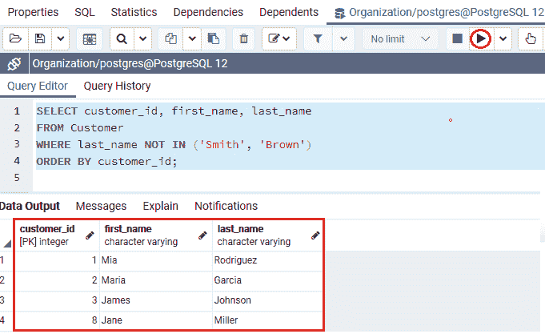
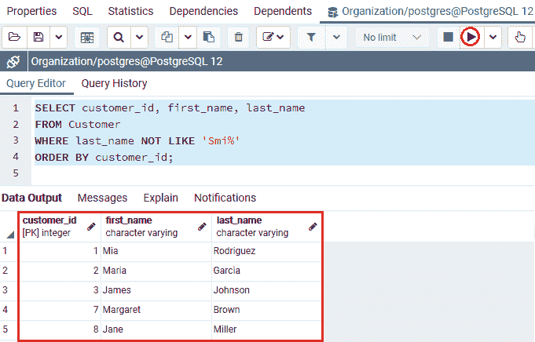
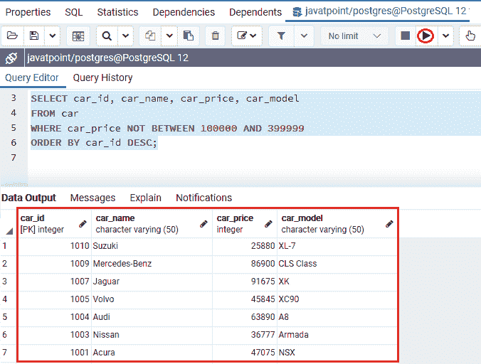
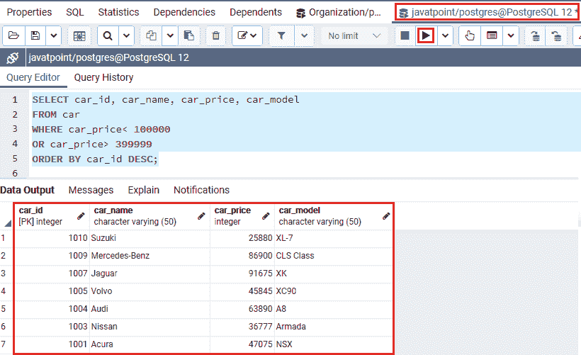
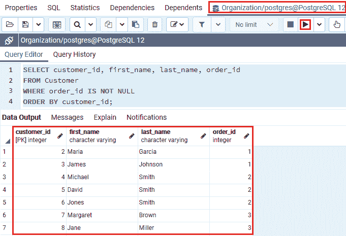
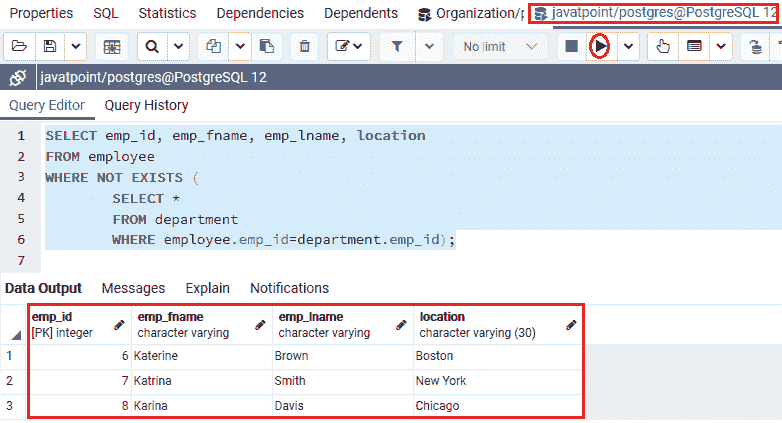

# PostgreSQL 非条件

> 原文：<https://www.javatpoint.com/postgresql-not-condition>

在本节中，我们将了解**后置非条件**的工作原理，并查看带有 In、LIKE、BETWEEN、IS NULL 和 EXISTS 条件的非条件的**示例。**

## PostgreSQL 非条件介绍

**PostgreSQL NOT 条件**与 WHERE 子句一起用于否定命令中的条件。**非条件**也称为**非操作员**。

## 后置 SQL 非条件语法

在 [PostgreSQL](https://www.javatpoint.com/postgresql-tutorial) 中，**非条件**可以与[选择](https://www.javatpoint.com/postgresql-select)、[插入](https://www.javatpoint.com/postgresql-insert)、[更新](https://www.javatpoint.com/postgresql-update)和[删除](https://www.javatpoint.com/postgresql-delete)命令一起使用。

```sql

NOT Condition

```

在上面的语法中，我们使用了下面的参数:

| 参数 | 描述 |
| 情况 | 条件参数用于定义我们想要否定的条件。 |

## 不同条件下的后置非条件示例

*   **在输入条件下使用后置非运算符的示例**

带有输入条件的 PostgreSQL **NOT 运算符用于获取那些值与列表值不匹配的行。**

为此，我们从**机构**数据库中提取 ***客户*** 表。

以下示例显示**非输入状态的操作员**，以识别其**姓氏**不是**【史密斯】或【布朗】**的客户信息:

```sql

SELECT customer_id, first_name, last_name
FROM Customer
WHERE last_name NOT IN ('Smith', 'Brown')
ORDER BY customer_id;

```

**输出**

在执行上述命令时，我们将获得下面的输出，显示那些其**姓氏**不是**史密斯或布朗**的记录。



*   **在类似条件下使用后置非运算符的示例**

在 PostgreSQL 中，我们还可以将 **NOT 运算符**与 **Like 条件**组合在一起。

在下面的例子中，我们将学习使用 **PostgreSQL NOT 运算符**和 **PostgreSQL LIKE** 条件。

以下命令用于识别那些**姓氏**不以字符串**开头的**客户信息【T1:****

```sql

SELECT customer_id, first_name, last_name
FROM Customer
WHERE last_name NOT LIKE 'Smi%'
ORDER BY customer_id;

```

**输出**

执行上述语句后，我们将得到以下输出，显示那些**姓氏**不像 **Smi** 的**客户**。



*   **在条件**之间使用后置非运算符的示例

在 **PostgreSQL** 中，我们还可以在 [WHERE 子句](https://www.javatpoint.com/postgresql-where-clause)中使用**非运算符**和**之间的条件**，从定义的条件与 **PostgreSQL 之间的条件**相矛盾的表中获取数据。

在下面的例子中，我们使用的是来自 **Javatpoint** 数据库的 ***Car*** 表，我们试图获取那些其 **car_price** 不在 **100000 到 399999:** 范围内的汽车详细信息

```sql

SELECT car_id, car_name, car_price, car_model
FROM car
WHERE car_price NOT BETWEEN 100000 AND 399999
ORDER BY car_id DESC;

```

**输出**

成功执行上述命令后，我们会得到如下输出，显示**价格**不在 **100000 到 399999 范围内的**车信息【T1:****



在下面的例子中，我们使用带有**或运算符**的**大于(>)和小于(< )** 运算符，而不是使用**非介于/和**运算符。下面的命令相当于上面的**选择**查询:

```sql

SELECT car_id, car_name, car_price, car_model
FROM car
WHERE car_price< 100000
OR car_price> 399999
ORDER BY car_id DESC;

```

**输出**

执行上述命令后，我们将得到以下结果:



*   **在为空条件下使用后置非运算符的示例**

在 PostgreSQL 中，**为空条件**可以与**非条件**组合使用。

我们使用的是**组织**数据库中的**客户**表。在以下示例中，我们将识别那些**客户**记录的**订单 _id** 不为空。

```sql

SELECT customer_id, first_name, last_name, order_id
FROM Customer
WHERE order_id IS NOT NULL
ORDER BY customer_id;

```

**输出**

执行上述命令后，我们将得到以下结果，显示那些**订单 id** 不为空的**客户详细信息**。



*   **在存在条件下使用 PostgreSQL NOT 运算符的示例**

在 PostgreSQL 中， **EXISTS 运算符**用于测试子查询中是否存在任何数据，EXISTS 条件也可以与 WHERE 子句中的 **NOT 运算符**组合使用。

让我们看一个例子来理解**非条件与存在条件**的工作。

在下面的命令中，我们将从 **Javatpoint** 数据库中获取**员工和部门表**。

借助 **emp_id** 列识别所有不存在于 ***部门*** 表中的 ***员工*** 记录。

```sql

SELECT emp_id, emp_fname, emp_lname, location
FROM employee
WHERE NOT EXISTS (
		SELECT *
		FROM department
		WHERE employee.emp_id= department.emp_id);

```

**输出**

执行以上命令后，我们会得到如下输出，返回所有 ***员工*** 表记录。对于给定的 **emp_id:** ，在 ***部门*** 表格中没有记录



### 概观

在 **PostgreSQL NOT Condition** 部分，我们学习了以下主题:

*   我们使用**非运算符**和 **IN 运算符**从特定的表中获取记录。
*   我们使用**非条件**和**相似条件**从特定表中获取记录。
*   我们使用**非运算符**和**条件**从表中获取记录。
*   我们使用**非运算符**和 IS **空条件**从特定表中获取记录。
*   我们使用了**非条件**和**存在条件**。

* * *