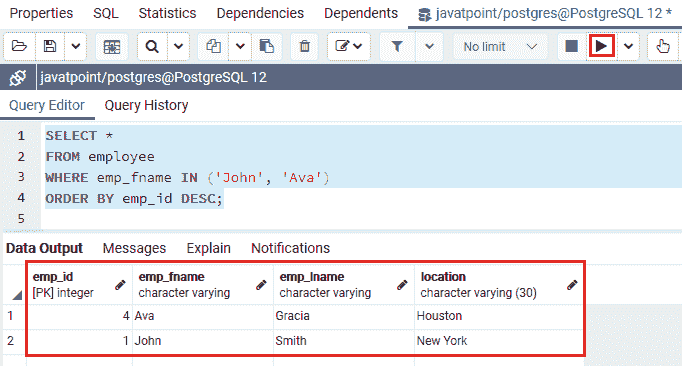
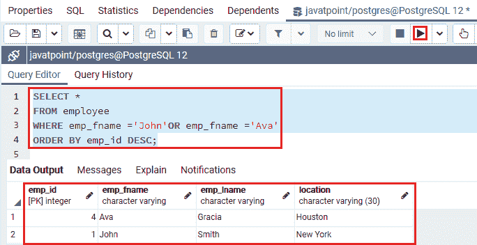
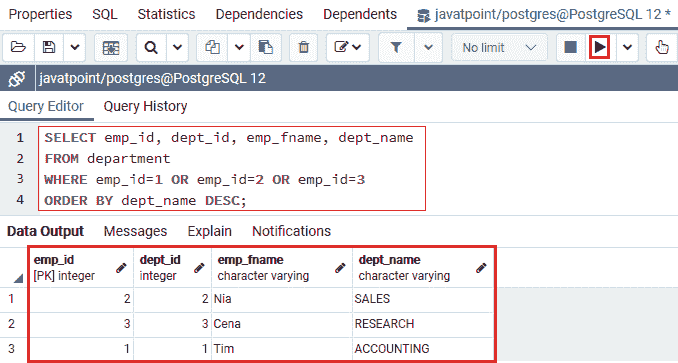
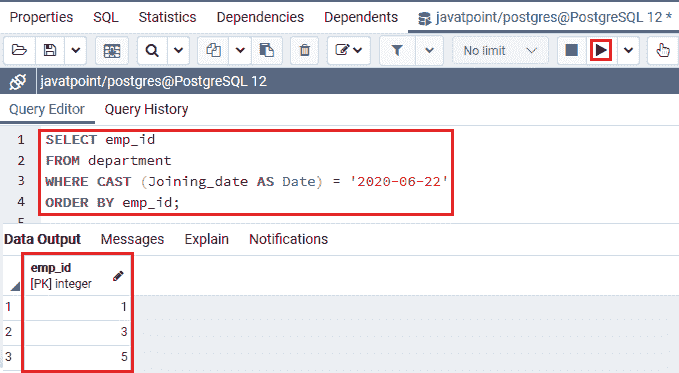
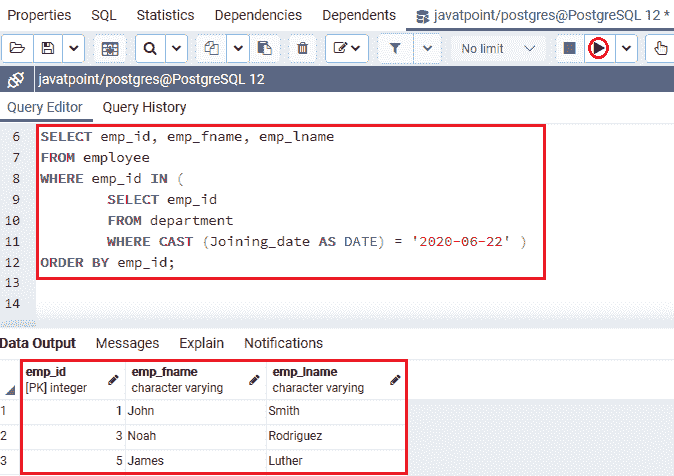

# 后置条件

> 原文：<https://www.javatpoint.com/postgresql-in-condition>

在本节中，我们将了解 **PostgreSQL In 条件**的工作原理，该条件与 **WHERE** 子句一起使用，从定义的条件满足 IN 条件的表中获取数据。**输入运算符的示例，以及带有子查询的输入运算符**。

## PostgreSQL IN 条件介绍

在 [WHERE 子句](https://www.javatpoint.com/postgresql-where-clause)中使用**后置条件**来获取与列表中任何数据匹配的数据。换句话说，我们可以说 **IN 条件**用于减少多个 [OR 条件](https://www.javatpoint.com/postgresql-or-condition)。

## 后置条件语法

在 [PostgreSQL](https://www.javatpoint.com/postgresql-tutorial) 中，输入条件可以与[选择](https://www.javatpoint.com/postgresql-select)、[插入](https://www.javatpoint.com/postgresql-insert)、[更新](https://www.javatpoint.com/postgresql-update)和[删除命令](https://www.javatpoint.com/postgresql-delete)一起使用。

```

Expression IN (SELECT column_name FROM table_name);

```

**或**

```

expression IN (value1, value2, .... valueN);  

```

我们可以将上面的语法写在下面，因为括号内的子查询称为**，这是嵌套在另一个语句内的**语句。****

```

Expression IN (subquery);

```

在上面的语法中，我们使用了以下参数:

| 参数 | 描述 |
| **表情/数值** | 它用于定义列或字段。 |
| **值 1，值 2，....价值**T2】**** | 如果这些值中的任何一个与表达式匹配，则**输入条件**将返回真。这是评估任何一个值是否与表达式匹配的快速方法。 |
| **子查询** | 这是一个 SELECT 命令，在该命令中，输出将在表达式矛盾的情况下被检查。 |

**注:**

*   如果值匹配给定列表中的任何值，即**值 1、值 2，....valueN、**，这些值列表可以是**文字值**的列表。例如，**字符串**、数字、**或选择命令**的输出。

## 后置条件示例

让我们看不同的例子来理解 PostgreSQL IN 条件是如何工作的:

### 后置条件示例:带字符值

为此，我们正在取 ***员工*** 表获取 **emp_fname** 有**约翰**和**艾娃**员工的**员工信息**。

我们在 WHERE 子句中使用 **IN 运算符**，可以看到以下命令:

```

SELECT *
FROM employee
WHERE emp_fname IN ('John', 'Ava')
ORDER BY emp_id DESC;

```

**输出**

在执行上述命令时，我们将得到以下结果:



在上例中，PostgreSQL IN 条件将返回来自 ***员工*** 表的所有行，其中 **emp_fname** 为**“约翰”和【艾娃】**。

在上面的命令中，我们在**选择**中使用了(*)，这意味着输出中将显示 ***员工*** 表中的所有字段。

在下面的命令中，我们使用 **OR 和等号(=)** 运算符代替 **IN 运算符**。该语句相当于上面的命令:

```

SELECT *
FROM employee
WHERE emp_fname ='John' OR emp_fname ='Ava'
ORDER BY emp_id DESC;

```

**输出**

成功执行上述命令后，我们将获得以下结果:



正如我们在上面的图片中看到的，两个输出都提供了相似的结果，但是使用 **PostgreSQL IN 条件**与 **OR 和 Equal (=)运算符**相比，该命令读起来更舒服，效率更高。

### 后置条件示例:带数值

要查看 **PostgreSQL IN 运算符**示例，我们将从 **Javatpoint** 数据库中获取 ***部门*** 表。

假设，我们想知道 **emp_id 1，2，3** 的**部门信息**。因此，为此，我们在 WHERE 子句中使用了 **IN 运算符**，可以看到以下命令:

```

SELECT emp_id, dept_id, emp_fname, dept_name
FROM department
WHERE emp_id IN (1, 2,3)
ORDER BY dept_name DESC;

```

**输出**

执行上述命令后，我们将获得以下输出:


在上面的命令中，我们也可以使用 **OR 和等号(=)** 运算符来代替 **IN 运算符**。该语句相当于上面的命令:

```

SELECT emp_id, dept_id, emp_fname, dept_name
FROM department
WHERE emp_id=1 OR emp_id=2 OR emp_id=3
ORDER BY dept_name DESC;

```

**输出**

实现上述语句后，我们将得到以下结果:



在实现了这两个命令之后，我们清楚地看到，与使用 **OR 和 Equal (=)运算符**的命令相比，使用 **IN 运算符**的命令可读性更好，也更短。

换句话说，我们可以说 **PostgreSQL** 用 **IN 运算符**实现命令比使用 **OR 运算符**的列表要快。

## 带有子查询的 PostgreSQL 实例

在下面的命令中，我们将使用 **CAST()** 函数，该函数将任何类型的值更改为指定的数据类型。

在下面的示例中， **CAST()** 用于将**加入日期转换为日期**数据类型从 ***部门*** 表中返回一列 **emp_id** ，其中**加入日期**为 **2020-06-22:**

```

SELECT emp_id
FROM department
WHERE CAST (Joining_date AS Date) = '2020-06-22'
ORDER BY emp_id;

```

**输出**

执行上述命令后，我们将得到以下结果:



在上面的截图中，我们可以看到该命令返回了一个值列表，我们可以将其用作输入运算符的输入，如下命令所示:

```

SELECT emp_id, emp_fname, emp_lname
FROM employee
WHERE emp_id IN (
		SELECT emp_id
		FROM department
		WHERE CAST (Joining_date AS DATE) = '2020-06-22'
)
ORDER BY emp_id;

```

**输出**

执行上述命令后，我们将得到以下结果:



### 概观

在 **PostgreSQL IN Condition** 部分，我们学习了以下主题:

*   使用 PostgreSQL IN 运算符查找值是否与值列表中的任何值匹配。
*   我们使用**输入条件从特定的表中获取字符**。
*   我们使用**输入条件从特定的表中获取数字**。
*   我们使用**子查询**概念和**后置 SQL IN 运算符**从两个表中获取值。

* * ***