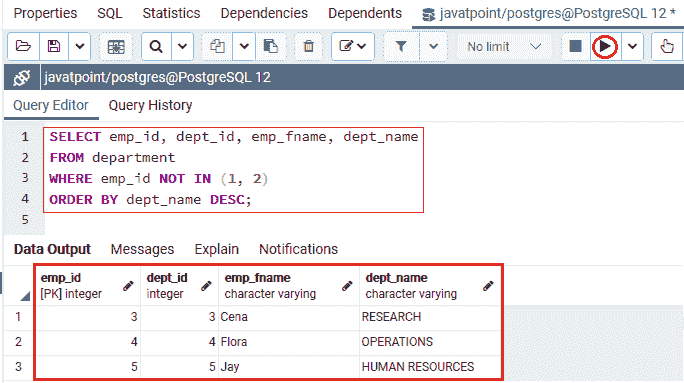
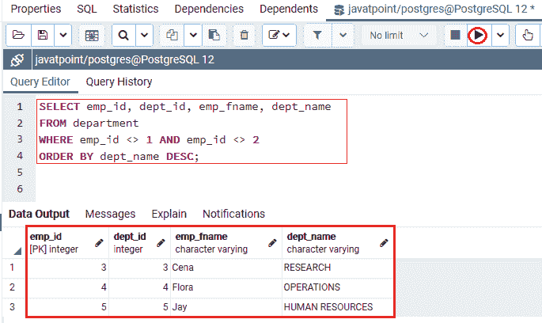
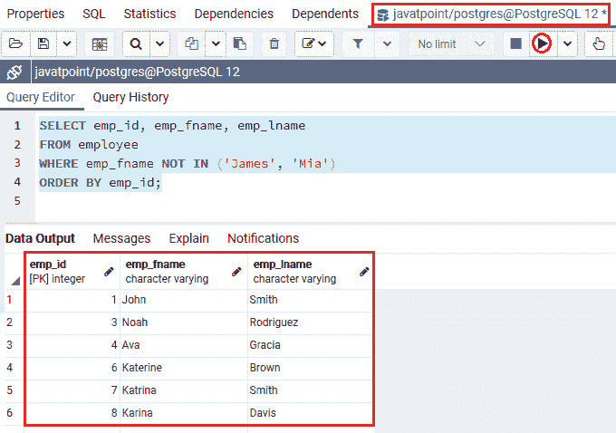

# PostgreSQL 不在状态

> 原文：<https://www.javatpoint.com/postgresql-not-in-condition>

在本节中，我们将了解带有数值和字符值的 **PostgreSQL NOT IN 条件、**和**NOT IN 条件示例的工作原理。**

## PostgreSQL 不在状态介绍

**PostgreSQL NOT IN 条件**与 [WHERE 子句](https://www.javatpoint.com/postgresql-where-clause)一起使用，从定义的条件与 [**PostgreSQL IN 条件**](https://www.javatpoint.com/postgresql-in-condition) 相矛盾的表中获取数据。

## 后置 SQL 不在条件语法中

在 [PostgreSQL](https://www.javatpoint.com/postgresql-tutorial) 中，不在状态可以与选择、插入、更新和删除命令一起使用。

```

expression NOT IN (value1, value2, .... valueN);  

```

## PostgreSQL 不在状态的示例:带有数值

PostgreSQL **NOT IN 运算符**用于获取那些值与列表值不匹配的行。

为此，我们从 **Javatpoint** 数据库中提取 ***部门*** 表格。

以下示例显示**非操作员使用**识别**部门**信息，其 **emp_id** 既不是 **1 也不是**

```

SELECT emp_id, dept_id, emp_fname, dept_name
FROM department
WHERE emp_id NOT IN (1, 2)
ORDER BY dept_name DESC;

```

**输出**

执行上述命令后，我们将获得如下输出，显示那些其 **emp_id** 既不是 **1 也不是**的记录。



同样，我们也可以使用运算符和 **NOT EQUAL ( < > )** 运算符来代替 **NOT IN** 运算符，如我们在以下语句中所见:

```

SELECT emp_id, dept_id, emp_fname, dept_name
FROM department
WHERE emp_id <> 1 AND emp_id <> 2
ORDER BY dept_name DESC;

```

**输出**

在实现上面的语句时，与上面的查询输出相比，我们将获得类似的输出:



### PostgreSQL 不在状态的示例:带有字符值

为此，我们采用如上的 ***员工*** 表格来获取其 **emp_fname** 与 **James，Mia** 员工无关的员工信息。

我们在 WHERE 子句中使用**非 IN 运算符**，因为我们可以看到以下命令:

```

SELECT emp_id, emp_fname, emp_lname
FROM employee
WHERE emp_fname NOT IN ('James', 'Mia')
ORDER BY emp_id;

```

**输出**

在执行上述命令时，我们将得到以下结果:



在上例中，PostgreSQL NOT IN 条件将返回来自 ***员工*** 表的所有行，其中 **emp_fname** 既不是**“詹姆斯”也不是【米娅】**。

### 概观

在 **PostgreSQL NOT IN Condition** 部分，我们学习了以下主题:

*   我们使用 **Not 运算符和 IN 运算符**从特定的表中获取记录。
*   我们使用**不在状态**从特定表格中获取**数字**。
*   我们使用**不在状态**从特定表格中获取**字符**。

* * *