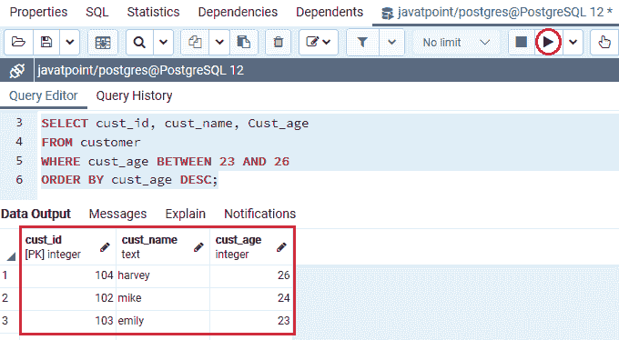
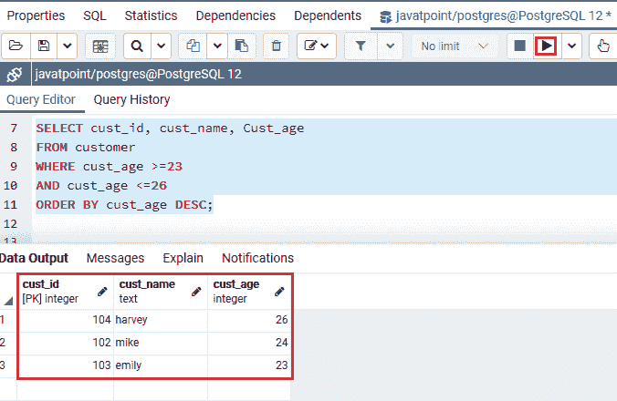
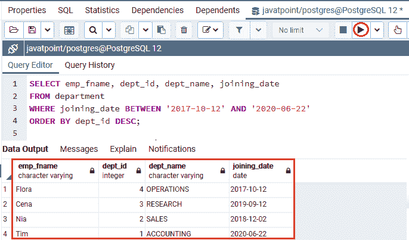
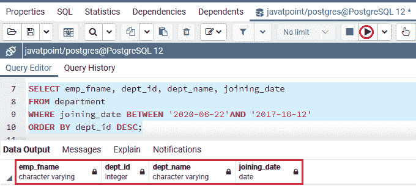
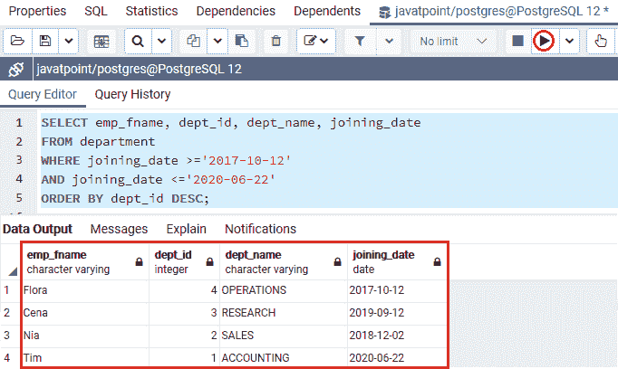
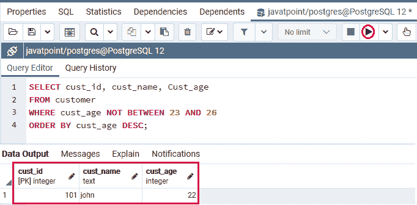
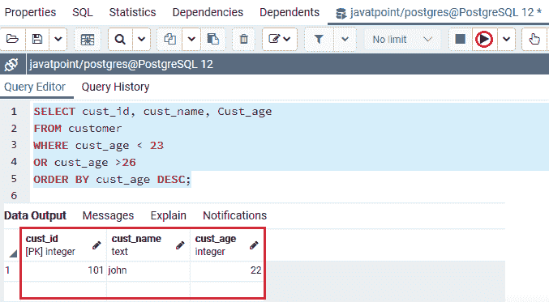

# 条件之间的后置 SQL

> 原文：<https://www.javatpoint.com/postgresql-between-condition>

在这一节中，我们将了解 **PostgreSQL 的工作条件**，它与 WHERE 子句一起使用，在两个定义的条件之间从表中选择数据。我们也将看到**的例子****之间的运算符**与**数字和日期值，以及运算符**与**非运算符**之间。

## 条件间后置 SQL 介绍

**后置条件**用于定义如何从特定范围内的表达式中检索值。换句话说，我们可以说**介于条件**用于将一个值与一系列值进行匹配。

**后置条件**也称为**后置条件**。

## 条件语法之间的后置 SQL

在 [PostgreSQL](https://www.javatpoint.com/postgresql-tutorial) 中，之间的**条件可以与[选择](https://www.javatpoint.com/postgresql-select)、[插入](https://www.javatpoint.com/postgresql-insert)、[更新](https://www.javatpoint.com/postgresql-update)和[删除](https://www.javatpoint.com/postgresql-delete)命令一起使用。**

```sql
expression BETWEEN value1 AND value2;    

```

**或**

```sql
expression BETWEEN low AND high;

```

如果值**大于或等于** ( > =)至**值 1 或低值**、**小于或等于** ( < =)至**值 2 或高值，则**表达式**返回**真值**；**否则，返回 false。

我们还可以通过使用大于或等于(> =) 或小于或等于(< =) 运算符来重写运算符之间的**，如下语法所示:**

```sql
expression >= value1 and value <= value2

```

假设我们想要找到超出范围的值。在这种情况下，我们可以将 **NOT 运算符**与 **BETWEEN 条件**结合起来，如以下语法所示:

```sql
Expression NOT BETWEEN low AND high;

```

下面的语法与上面的语法相同，它使用了“非”和“介于”运算符:

```sql
Expression < low OR value > high

```

在上面的语法中，我们使用了以下参数:

| 参数 | 描述 |
| 表示 | 它用于定义列或字段。 |
| 值 1 和值 2 | 这些值定义了表达式与之比较的包含范围。 |

## 条件之间的 PostgreSQL 示例

让我们看不同的例子来理解**后置条件**是如何工作的:

### 条件之间的后置 SQL 示例:带数值

在下面的例子中，我们将展示如何使用带有数值的 with 条件。

为此，我们从**javapoint**数据库中提取 ***客户*** 表，获取年龄在 **23 到 26** 之间的客户。

我们正在使用带有 [WHERE 子句](https://www.javatpoint.com/postgresql-where-clause)的**介于运算符**，如以下命令所示:

```sql
SELECT cust_id, cust_name, Cust_age
FROM customer
WHERE cust_age BETWEEN 23 AND 26
ORDER BY cust_age DESC;

```

**输出**

执行上述命令后，我们将获得以下输出:



在上面的命令中，我们还可以使用大于或等于(> =) 或小于或等于(< =) 的**运算符来代替**的**运算符。与上面的命令相比，该命令将给出类似的结果:**

```sql
SELECT cust_id, cust_name, Cust_age
FROM customer
WHERE cust_age >=23 
AND cust_age <=26
ORDER BY cust_age DESC;

```

**输出**

成功执行上述命令后，我们将获得以下结果:



正如我们在上面的图片中所看到的，两个输出都提供了相似的结果，但是使用**PostgreSQL better 条件**与大于或等于(> =) 或小于或等于(< =)运算符的**相比，命令读起来更舒服，效率更高。**

## 条件之间的 PostgreSQL 示例:带日期

我们将看到如何使用**运算符中的**日期**值来定义 **ISO 8601 格式的文字日期:YYYY-MM-DD** 。**

 **这里，我们从 **Javatpoint** 数据库中获取 ***部门*** 表。

在下面的例子中，我们使用**在操作员**之间获取那些在 **2017-10-12 到 2020-06-22** 之间加入特定**部门**的**员工的信息。**

```sql
SELECT emp_fname, dept_id, dept_name, joining_date
FROM department
WHERE joining_date BETWEEN '2017-10-12' AND '2020-06-22'
ORDER BY dept_id DESC;

```

**输出**

成功执行上述命令后，我们将获得以下结果:



#### 注意:确保范围总是以较低的值统计，因为如果我们从较高的值开始给出范围，它将给出空的结果集。

**例如:**如果我们在上面的命令中提供范围作为**较高值(2020-06-22)** 和**较低值(2017-10-12)** :

```sql
SELECT emp_fname, dept_id, dept_name, joining_date
FROM department
WHERE joining_date BETWEEN '2020-06-22' AND '2017-10-12'
ORDER BY dept_id DESC;

```

**输出**

在执行上述命令时，我们将得到空表:



在 PostgreSQL 中，我们也可以使用**大于或等于(> =)** 或**小于或等于(< =)** 运算符来代替**之间的运算符**。那么与上面的命令相比，该命令将给出类似的结果:

```sql
SELECT emp_fname, dept_id, dept_name, joining_date
FROM department
WHERE joining_date >='2017-10-12'
AND joining_date <='2020-06-22'
ORDER BY dept_id DESC;

```

**输出**

执行上述命令后，我们将得到以下结果:



实现这两个命令后，我们可以看到，与使用大于或等于(> =) 或小于或等于(< =) 运算符的**命令相比，使用 **Between 运算符**的命令更易读、更简短。**

换句话说，我们可以说 **PostgreSQL** 比使用其他**操作符**更快地用**操作符**实现命令。

## 在条件之间使用非运算符的示例

在 **PostgreSQL** 中，我们可以在 WHERE 子句中使用 **NOT 运算符和【之间】运算符，从定义的条件与**条件之间的 **PostgreSQL 相矛盾的表中获取数据。**

如果我们想得到那些年龄不在 **23 到 26** 范围内的**客户**，我们可以使用下面的命令:

```sql
SELECT cust_id, cust_name, Cust_age
FROM customer
WHERE cust_age NOT BETWEEN 23 AND 26
ORDER BY cust_age DESC;

```

**输出**

执行上述命令后，我们将获得以下输出:



在下面的例子中，我们使用带有**或运算符**的**大于(>)和小于(< )** 运算符，而不是使用**非介于/和**运算符。下面的命令相当于上面的**选择**查询:

```sql
SELECT cust_id, cust_name, Cust_age
FROM customer
WHERE cust_age < 23  
OR cust_age >26
ORDER BY cust_age DESC;

```

**输出**

执行上述命令后，我们将得到以下结果:



### 概观

在**条件之间的后置 SQL**部分，我们学习了以下主题:

*   使用 PostgreSQL 的“介于”运算符用于将一个值与一系列值进行匹配。
*   我们使用**间条件**从特定表格中获取**数值**。
*   我们使用**间条件**从特定表格中获取**数据值**。
*   我们使用**非运算符**和**后置运算符**来获取那些不满足介于条件的值。

* * ***