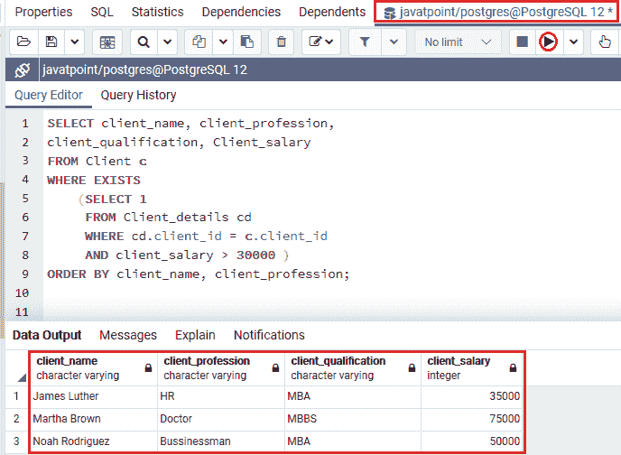
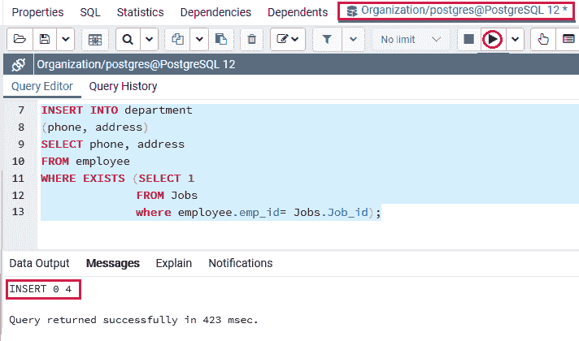
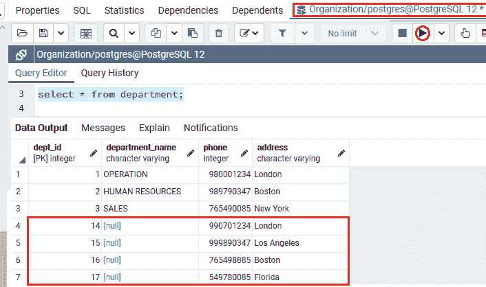
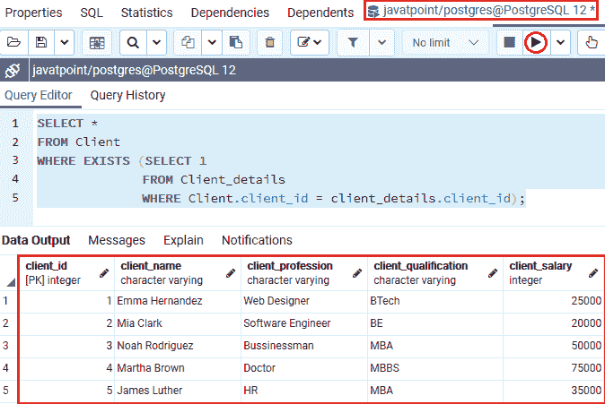
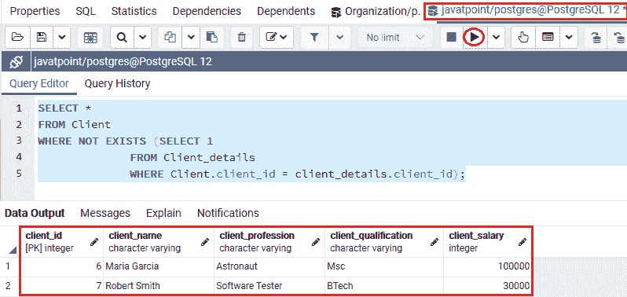
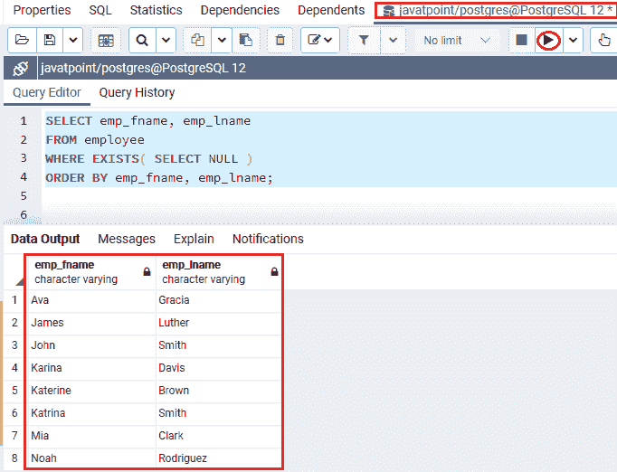
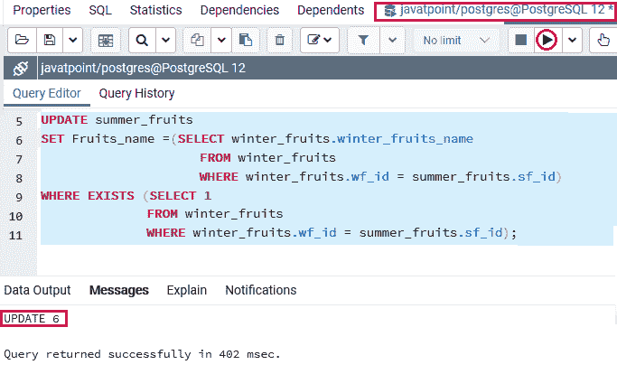
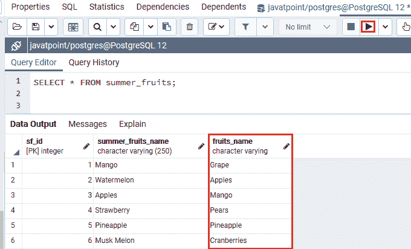
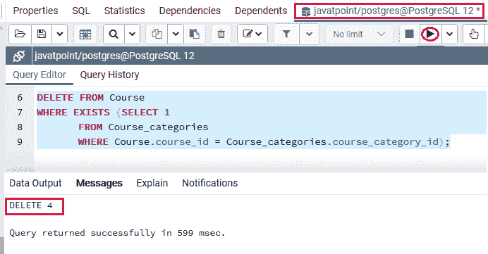
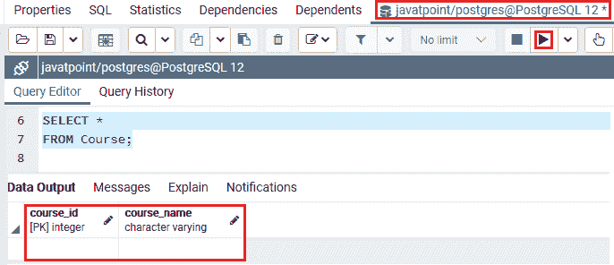

# 存在条件

> 原文：<https://www.javatpoint.com/postgresql-exists-condition>

在本节中，我们将了解 **PostgreSQL EXISTS Condition，**的工作原理，该条件与 **WHERE 子句**一起使用来评估子查询中的现有行。我们也可以看到**存在条件**的**示例**，以及**不同的查询**，例如**插入、选择、不存在、空、更新和删除。**

## PostgreSQL EXISTS 条件介绍

在 [PostgreSQL](https://www.javatpoint.com/postgresql-tutorial) 中， **EXISTS** 条件可以与 **[SELECT](https://www.javatpoint.com/postgresql-select) 、 [INSERT](https://www.javatpoint.com/postgresql-insert) 、 [UPDATE](https://www.javatpoint.com/postgresql-update) 和 [DELETE](https://www.javatpoint.com/postgresql-delete)** 命令组合使用。换句话说，我们可以说 **EXISTS** 条件用于检查子查询中是否存在任何数据，如果子查询返回多条记录，则返回 **true** 。

它用于与子查询分组，并测试子查询中记录的存在性。 **PostgreSQL EXISTS 条件**是一种类型的**布尔运算符**，它返回**真或假的**结果。换句话说，我们可以说:

*   如果子查询返回任何记录，**存在条件**将返回一个**真**值，否则将返回一个**假**
*   这里**真**值总是用**数值 1** 表示，而**假**值表示为**数值 0。**

### PostgreSQL EXISTS 条件语法

PostgreSQL **EXISTS** 条件的语法如下:

```

WHERE EXISTS (subquery);

```

“存在”条件接受一个名为**子查询**的参数。它经常与相关的子查询一起使用。

**EXISTS 条件的**输出取决于子查询是否提取了任何行，而不是行信息。因此，出现在子查询的**选择命令**上的列并不重要。

在这种情况下，我们将对 EXISTS 条件使用以下语法:

```

SELECT column1, column2…columnN
FROM table1  
WHERE [NOT] EXISTS (  
    SELECT 1
    FROM table2   
    WHERE column2= table1.column1
);  

```

在上面的语法中，我们还使用了 **NOT 运算符**，它帮助我们与 EXISTS 条件相矛盾。当子查询不返回任何行时，它将返回**真**，否则它将返回**假**。

在上面的语法中，我们使用了以下参数:

| 参数 | 描述 |
| 第 1 栏，第 2 栏……栏 | 它用于指定特定表中使用的列名。 |
| **表 _ 名称** | 该参数用于定义我们将从中执行 EXISTS 条件的表名。 |
| **条件** | 条件参数用于从表中搜索特定值。 |
| **子查询** | 通常，SELECT 命令以 SELECT *开头，但是 PostgreSQL 在子查询中忽略它。 |

**注:**

*   通常， **SELECT 命令**以 **SELECT *** 开头，而不是以**列名或表达式列表**开头。这里，我们使用 **SELECT 1** 代替 **SELECT *，**，这有助于我们提高 PostgreSQL 中的查询性能。
*   同时，子查询列结果不合适，因为在这里，只有返回的行才重要。
*   它将给出与 PostgreSQL 忽略子查询中的选择列表相同的输出。
*   识别匹配输出后， **EXISTS 条件**将直接停止进行附加处理。
*   在 PostgreSQL 中，我们将在 **EXISTS 条件**中使用的 SQL 命令非常无效。因此，预先为外部查询表中的每一行重新运行子查询。
*   我们有更有效的方法来编写所有的命令，不使用 EXISTS 条件。

### PostgreSQL EXISTS 条件的示例

让我们看不同的例子来理解 **PostgreSQL EXISTS 条件**是如何工作的。

首先，我们将在 **PostgreSQL** 中看到一个 EXISTS 条件的示例来学习工作的 EXISTS 运算符。

为此，我们从 **Javatpoint 数据库**中获取 ***客户端*** 和 ***客户端 _ 详细信息*** 表。

在下面的例子中，我们从**客户 _ 详细信息**表中识别出那些**客户信息**，其中**客户 _ 工资**大于 **30000。**

以下命令将返回那些**工资**高于 **30000** 的客户信息:

```

SELECT client_name, client_profession, 
client_qualification, Client_salary
FROM Client c
WHERE EXISTS
    (SELECT 1
     FROM Client_details cd
     WHERE cd.client_id = c.client_id
     AND client_salary > 30000 )
ORDER BY client_name, client_profession;

```

**输出**

成功执行上述命令后，我们将获得以下结果:



从上面的截图中我们可以看到，子查询分析了 ***Client_details*** 表来识别 ***Client*** 表中每个客户端的详细信息的以下场景。

*   如果 ***Client_details*** 表中的 **client_id** 和 ***Client*** 表中的 **client_id** 相等(cd.client_id = c.client_id) 。
*   且**客户 _ 工资**大于 **3 万**T4(客户 _ 工资> 3 万)。

### 带有 INSERT 命令的 PostgreSQL EXISTS 条件示例

我们将显示如何使用**插入**命令来使用**存在条件**。

为此，我们从**组织数据库**中取出 ***员工、部门、*** 和 ***工作*** 表，将记录从一个表插入到另一个表中。

在下面的例子中，我们将记录从 ***员工*** 表插入到 ***部门*** 表中。我们从 ***员工*** 表中获取**电话**和**地址**列记录，其中 **emp_id** 和 **job_id** 在两个表中相等。

```

INSERT INTO department
(phone, address)
SELECT phone, address
FROM employee
WHERE EXISTS (SELECT 1 
			 FROM Jobs
			 where employee.emp_id= Jobs.Job_id);

```

**输出**

执行上述命令后，我们将获得如下消息窗口，显示该值已成功插入 ***部门*** 表中。



为了检查记录是否已经插入到 ***部门*** 表中，我们将使用**选择**命令如下:

```

Select * from department;

```

**输出**

在执行上述命令时，我们将获得以下输出:



在上图截图中，我们可以看到 **PostgreSQL EXISTS 条件**将**四条记录**成功插入到**T5】部门 T7】表中。**

### 带有选择命令的 PostgreSQL EXISTS 条件示例

在下面的例子中，我们将显示如何使用带有两个条件的**选择**命令来使用 **EXISTS 条件**。

我们正在从 **Javatpoint** 数据库中的 ***客户端*** 和 ***客户端 _ 详细信息*** 表中选择一个表中的所有记录。

我们将 **EXISTS 条件**与 **WHERE 子句**一起使用，可以看到以下命令:

```

SELECT *
FROM Client
WHERE EXISTS (SELECT 1
              FROM Client_details
              WHERE Client.client_id = client_details.client_id);

```

**输出**

执行上述命令后，我们将获得以下输出:



在上面的**子查询**语句中，我们使用了 **SELECT 1** ，这有助于我们提高性能，因为在 **Exists 条件**中不需要列输出，因为只有返回行的存在才重要。

从上面的截图中我们可以看到， **PostgreSQL EXISTS** 条件将返回来自 ***客户端*** 表的所有记录，其中 ***Client_details*** 表中至少有一条记录具有类似的 **Client_id。**

### 使用不存在条件的 PostgreSQL 存在条件示例

在 PostgreSQL 中，我们还可以将 **NOT 条件**和 **EXISTS** 条件结合起来。

带有**存在条件**的后缀**非运算符**用于获取那些值与列表值不匹配的行。

#### 注意:“非”条件与“存在”条件的输出相矛盾。正如我们所知，“非”条件与“存在”条件完全相反，这意味着:

*   如果子查询没有返回任何行，**不存在**条件将返回**真**。
*   或者，如果子查询返回多行，则**不存在**条件将返回**假**。

为此，我们以类似的表格( ***Client 和 client_details*** )作为上面的例子。

下面的例子用 EXISTS 条件显示 **Not 条件来获取该客户端信息，该信息在 ***Client_details*** 表中是不存在的。**

```

SELECT *
FROM Client
WHERE NOT EXISTS (SELECT 1
              FROM Client_details
              WHERE Client.client_id = client_details.client_id);

```

**输出**

在执行上述命令时，我们将获得以下输出:



在上例中， **PostgreSQL EXISTS** 示例将返回来自 ***客户端*** 表的所有记录，其中对于给定的**客户端 _id，在 ***客户端 _details*** 表中没有记录。**

### 使用带有空值的 EXISTS 条件的示例

在 PostgreSQL 中，我们也可以使用 **EXISTS 条件**和 **NULL** 。

带有空值的 PostgreSQL **EXISTS 条件**用于获取子查询将返回**空值**的那些行，EXISTS 条件将返回**真值**。

为此，我们从 **Javatpoint** 数据库中提取 ***员工*** 表。

让我们看下面的例子来理解**存在条件**将如何与**空值一起工作。**

```

SELECT emp_fname, emp_lname
FROM employee
WHERE EXISTS (SELECT NULL)
ORDER BY emp_fname, emp_lname;

```

**输出**

在执行上述命令时，我们将获得以下输出:



在上例中，子查询语句返回了**空值**。因此，该命令将从 ***员工*** 表中返回所有行。

### 带有更新命令的 PostgreSQL EXISTS 条件示例

在下面的例子中，我们将显示如何使用**更新**命令来使用 **EXISTS 条件**。

为此，我们从 **Javatpoint** 数据库中获取 ***【夏季水果】*** 和 ***冬季水果*** 表格。

在下面的命令中， **PostgreSQL EXISTS 条件**用于更新从 ***冬季 _ 水果*** 表中 ***冬季 _ 水果‘*wf _ id**列等于 ***夏季 _ 水果的 ***夏季 _ 水果*** 表中的**水果 _ 名称**列值***

```

UPDATE summer_fruits
SET Fruits_name=(SELECT winter_fruits.winter_fruits_name
                     FROM winter_fruits
                     WHERE winter_fruits.wf_id = summer_fruits.sf_id)
WHERE EXISTS (SELECT 1
              FROM winter_fruits
              WHERE winter_fruits.wf_id = summer_fruits.sf_id);

```

**输出**

执行完上面的命令后，我们会得到下面的输出，在这里我们可以看到 ***【夏 _ 果】*** 表已经更新成功。



我们现在将使用**选择**命令来检查在 ***夏季水果*** 表中的特定记录是否已经更新:

```

SELECT * FROM summer_fruits;

```

**输出**

执行上述命令后，我们将得到以下结果:



### 带有 DELETE 命令的 PostgreSQL EXISTS 条件示例

在下面的例子中，我们将显示如何使用**删除**命令来使用**存在条件**。

在下面的例子中，我们将从**JavaPoint**数据库中的 ***课程*** 和 ***课程 _ 类别*** 表中删除该表中的特定记录。

在以下命令中， **PostgreSQL EXISTS** 条件用于删除 ***课程*** 表中的所有记录，其中**课程 _id** 来自 ***课程*** 表，而**课程 _ 类别 _id** 来自 ***课程 _ 类别*** 表。

```

DELETE FROM Course
WHERE EXISTS (SELECT 1
       FROM Course_categories
       WHERE Course.course_id = Course_categories.course_category_id);

```

**输出**

执行上述命令后，我们将获得如下消息窗口，显示记录已从 ***课程*** 表中成功删除。



我们现在将使用**选择**命令来检查在 ***课程*** 表格中特定记录是否已被删除:

```

SELECT * 
FROM Course;

```

**输出**

成功执行上述命令后，我们将获得以下输出:



## 概观

在**PostgreSQL EXISTS Condition**部分，我们学习了以下主题:

PostgreSQL **EXISTS 条件**的使用提供了 **EXISTS** 条件的优点，可以评估子查询中行的存在性。

*   我们已经看到了带有**子查询**的 **EXISTS 条件**的示例，一旦子查询返回至少一行，检查条件是否已经满足。
*   我们使用**存在条件**和**插入命令**将记录从一个表插入到另一个表。
*   我们使用**存在条件**和**选择**命令来获取特定的表记录。
*   我们使用**存在条件**和**非操作符**进入**选择**命令，从特定的表中获取不存在的记录。
*   我们使用**存在条件**和**空值**来获取特定的表记录。
*   我们使用**存在条件**和**更新**语句来**更新**表的记录。
*   我们使用**存在条件**和**删除**语句来**删除**特定表的记录。

* * *