# PostgreSQL 视图

> 原文：<https://www.javatpoint.com/postgresql-view>

在本节中，我们将了解 **PostgreSQL 视图**的工作方式，例如**如何创建 PostgreSQL 视图、更改 PostgreSQL 视图、更改 PostgreSQL 视图**、以及**如何删除 PostgreSQL 视图**。

### PostgreSQL 视图介绍

视图是 PostgreSQL 中的伪表；它不是一个实体表，而是作为一个普通的表来选择。视图也可以表示连接的表。它可以包含一个表的所有行，也可以包含一个或多个表中的选定行。

视图简化了用户执行以下方面的操作:

*   它自然而直观地构建数据，并使其易于查找。
*   我们可以授权用户查看某个视图，该视图有用户有权查看的完整记录。
*   它限制对数据的访问，这样用户只能看到有限的数据，而不能看到完整的数据。
*   视图提供了一个可靠的层，甚至包括必要的表修改列。
*   它汇总各种表格中的数据以生成报告。
*   视图帮助我们描述语句的难度，因为我们可以在 SELECT 命令的帮助下基于复杂的查询编写视图命令。

在 [PostgreSQL](https://www.javatpoint.com/postgresql-tutorial) 中，我们可以在 SQL shell(psql)中执行 view 的所有活动:

**使用 SQL shell (PSQL)的 PostgreSQL 视图**

在此，我们将使用 SQL shell(psql) 来**创建视图、更改视图和删除视图。因此，为此，我们需要遵循以下流程:**

### 创建 PostgreSQL 视图

要创建 PostgreSQL 视图，我们使用 **CREATE VIEW 命令**。

**语法**

**创建视图**命令的语法如下:

```sql
CREATE [OR REPLACE] VIEW view-name AS
 SELECT column(s)
 FROM table(s)
 [WHERE condition(s)];

```

在上面的语法中，我们有以下参数:

| 因素 | 描述 |
| **或更换** | “或替换”参数将替换已经存在的视图。 |
| 视图名称 | 这是我们想要创建的视图的名称。 |
| 哪里的条件 | 这些条件是选项，必须满足这些条件才能在视图中添加任何值。 |

要在 psql 中创建视图，我们将遵循以下步骤:

**第一步**

首先，我们将在本地系统中打开 **[psql](https://www.javatpoint.com/psql-commands)** ，我们将提供 psql 的密码和登录。

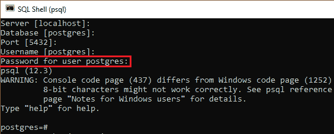

**第二步**

现在，我们将使用下面的命令来选择或连接所需的数据库(javatpoint)。

```sql
postgres-# \c javatpoint  

```

一旦我们执行上述命令，我们将连接到 **javatpoint** 数据库，如下图所示:

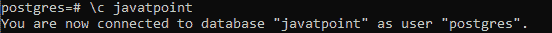

**第三步**

我们将使用 ***Book*** 表，该表是我们在 PostgreSQL 教程的前面部分中创建的。

要查看*表中的所有列，我们将使用**选择**命令，如下所示:*

```sql
Select * public."Book";

```

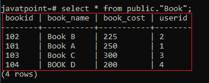

**第四步**

现在，我们准备使用 **CREATE VIEW 命令**在 ***Book*** 表的帮助下创建视图，如下所示:

```sql
CREATE VIEW book_View AS SELECT BookID, Book_cost 
FROM public."Book" 
where Book_cost > '200'; 

```

**输出**

一旦我们实现了上面的命令，我们将得到下面的消息 **book_view** 已经创建成功。

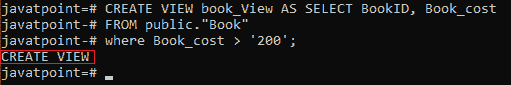

**第五步**

之后，我们将使用 Select 命令检查 **book_view** 中的记录，其值高于 200。

```sql
SELECT * FROM book_View;

```

**输出**

执行上述命令后，我们会得到那些**账面成本**大于 **200** 的记录。

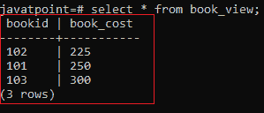

而 ***书*** 表有**四条**记录，在这里，我们将得到**三条记录**被添加到特定视图中。

我们正在创建一个视图，在下面命令的帮助下，该视图只包含*表中的一列:*

```sql
CREATE VIEW Book_View2 AS 
SELECT book_cost 
FROM public."Book" 
WHERE book_cost > '225';

```

**输出**

执行以上命令后，我们会得到如下消息: **book_ view2** 创建成功。

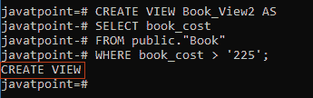

**book_view2** 仅包含 **Book** 表中的 **Book_cost** 列。这里我们将使用选择命令查看 **book_view2** 视图的数据:

```sql
SELECT * FROM book_view2;

```

**输出**

执行以上命令后，我们会得到那些成本大于 **225** 的记录。


### 更改 PostgreSQL 视图

要更改 psql 中的 PostgreSQL 视图，我们将使用 **CREATE 或 REPLACE VIEW** 命令，因为视图的定义可以修改，而不必删除它。

**更改 PostgreSQL 视图的语法**

在 PostgreSQL 中更改视图的语法如下:

```sql
CREATE OR REPLACE view_name 
AS 
query

```

#### 注意:PostgreSQL 9.4 之前的版本不支持删除视图中的剩余列。如果我们需要执行它，我们将获得以下错误消息“[Err] ERROR:无法从视图中删除列”。这就是为什么查询必须创建与创建视图时相似的列。

具体来说，新列需要相似的数据类型、相似的名称以及与生成时相似的顺序。但是 PostgreSQL 允许我们在列列表的末尾添加更多的列。

因此，为此，我们需要**三个表 Book、User1 和 book_view2** 来更改 PostgreSQL 视图。

我们将使用 SELECT 命令检查 ***Book、User1、*** 和 ***book_view2*** 表中的记录。

使用**选择**命令，如下所示 ***Book_view2*** 表格:

```sql
Select * from book_view2;

```

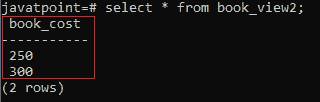

在**选择**命令的帮助下，*表如下:*

```sql
Select * from public."Book";

```


借助**选择**命令，我们可以在 ***用户 1*** 表中看到现有数据:

```sql
Select * from User1;

```

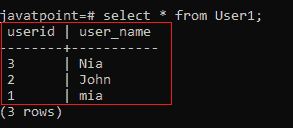

例如，在下面的命令中，我们将使用**创建或替换视图命令**来更新视图 **book_view2** :

```sql
CREATE or REPLACE VIEW book_view2 AS
SELECT book_cost, user_name
FROM public."Book"
INNER JOIN User1
ON public."Book".UserID = User1.UserID
WHERE book_cost > '225';

```

**输出**

执行以上命令后，我们会得到如下消息窗口，显示 **book_view2** 已创建成功。

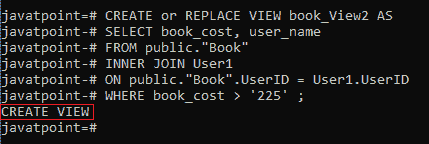

现在，在执行上述命令后，我们将使用 Select 命令检查操作是否正常:

```sql
Select * from book_view2;

```

**输出**

一旦我们执行了上面的命令，我们将得到下面的结果，在这里我们可以看到视图已经被改变了，因为我们使用了一个 JOIN 命令，现在我们有来自两个不同表的两列。

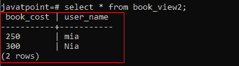

### 更改 PostgreSQL 视图

要更改视图的定义，我们使用**更改视图**命令。

例如，我们可以使用以下语句将视图名称从 **book_view2** 修改为 **book_info** :

```sql
ALTER VIEW book_view2 RENAME TO book_info;

```

**输出**

一旦我们执行了上面的命令，我们会得到下面的消息窗口，显示 **book_view2** 已经被成功修改。

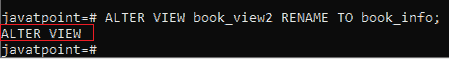

如果我们从 **book_view2** 中选择数据，我们会得到下面的**错误**，如下图截图所示:

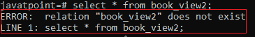

### 删除 PostgreSQL 视图

要删除一个 PostgreSQL 视图，我们可以使用 **DROP VIEW** 命令。

**语法**

**拖放视图**命令的语法如下:

```sql
DROP VIEW [IF EXISTS] view-name;

```

在上面的语法中，我们有以下参数:

| 因素 | 描述 |
| 视图名称 | **视图名称**参数用于指定我们想要删除的视图的名称。 |
| 如果存在 | 它是一个可选参数，只有当我们不定义它并试图删除一个不存在的视图时，它才是必要的，我们会得到一个错误。 |

这里我们正在删除 **book_info** ，它是我们在上面的部分中使用删除视图命令创建的:

```sql
DROP VIEW book_info;

```

**输出**

执行上述命令后，我们将获得下面的消息，显示特定视图已被成功删除。

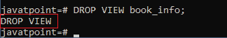

* * ****