# PostgreSQL JOIN

> 原文：<https://www.javatpoint.com/postgresql-join>

在本节中，我们将简要了解几种类型的 **PostgreSQL 连接**的工作方式，如**内部连接、左连接、右连接和完全外部连接**。

PostgreSQL JOINS 与 [SELECT 命令](https://www.javatpoint.com/postgresql-select)一起使用，帮助我们从各种表中检索数据。我们可以将**选择和**连接语句合并成一个命令。每当我们想要从两个或多个表中获取记录时，我们都会执行 joins 命令。

它用于根据连接的表之间的标准列的数据合并一个或多个表中的列。通常，**第一个表**的**标准列**是**主键列**，**第二个表**列是**外键**列。

在 [PostgreSQL](https://www.javatpoint.com/postgresql-tutorial) 中，我们有各种类型的连接，如下所示:

*   [内部连接](https://www.javatpoint.com/postgresql-inner-join)
*   [左连接](https://www.javatpoint.com/postgresql-left-join)
*   [右连接](https://www.javatpoint.com/postgresql-right-join)
*   [交叉连接](https://www.javatpoint.com/postgresql-cross-join)
*   [完全外部连接](https://www.javatpoint.com/postgresql-full-join)
*   自然连接
*   自我加入。

下图显示了最重要的 PostgreSQL 连接，我们将在 PostgreSQL 教程的这一部分对此进行解释。

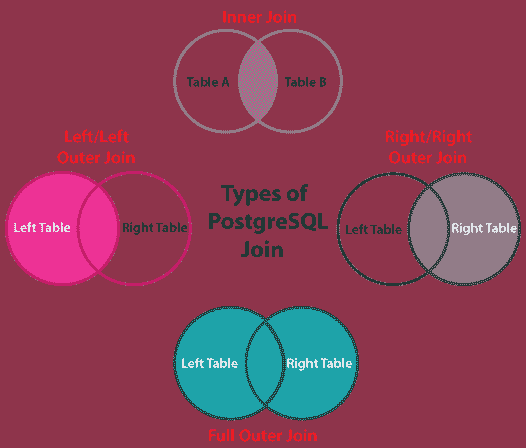

### PostgreSQL 连接示例

让我们看一些不同类型的 PostgreSQL 连接的例子:

在这里，我们将创建并插入**两个不同的表**，在这里我们对几种类型的连接执行操作:

在下面的示例中，我们将使用 Create 命令创建一个 ***【豪华 _ 汽车】*** 表。

```sql
CREATE TABLE Luxury_cars (
L_ID INT PRIMARY KEY,
luxury_car_names VARCHAR (250) NOT NULL);

```

**输出**

一旦我们执行了上面的命令，就会得到下面的消息，显示 ***豪华 _ 汽车*** 表已经创建成功。

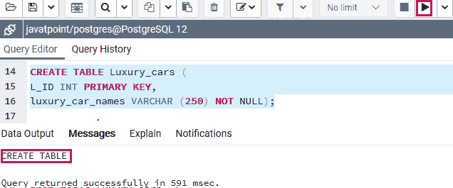

再次在这里，我们将使用 Create 命令创建一个 ***Sports_cars*** 表如下:

```sql
CREATE TABLE Sports_cars (
S_ID INT PRIMARY KEY,
sports_car_names VARCHAR (250) NOT NULL);

```

**输出**

一旦我们执行了上面的命令，我们会得到下面的消息，显示 ***【跑车】*** 表已经创建成功。

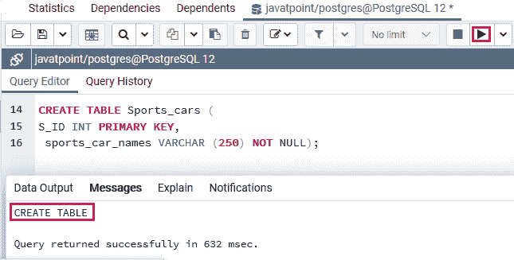

之后，我们将使用 insert 命令在 ***【豪华 _ 汽车】*** 表中插入一些值:

```sql
INSERT INTO Luxury_cars (L_ID, luxury_car_names)
VALUES
(1, 'Chevrolet Corvette'),
(2, 'Mercedes Benz SL Class'),
(3, 'Audi A7'),
(4, 'Genesis G90'),
(5,'Lincoln Continental');

```

**输出**

执行上述命令后，我们将获得以下消息:值已成功插入 ***【豪华 _ 汽车】*** 表。

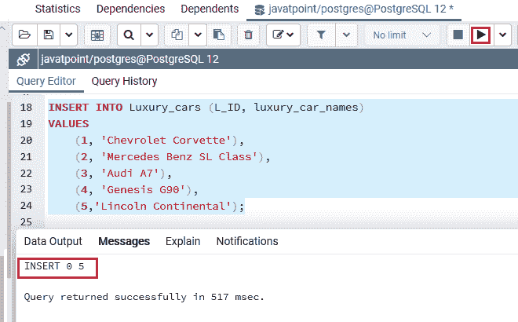

就像我们在 ***【豪华 _ 汽车】*** 表中插入值一样，我们也会在 insert 命令的帮助下将值插入到 ***【运动 _ 汽车】*** 表中:

```sql
INSERT INTO Sports_cars (S_ID, sports_car_names)
VALUES
 (1, 'BMW Z4'),
 (2, 'Nissan 370Z'),
 (3, 'Chevrolet Corvette'),
 (4, 'Mercedes Benz SL Class'),
(5,'Subaru BRZ');

```

**输出**

执行上述命令后，我们将获得以下消息:值已成功插入 ***【跑车】*** 表。

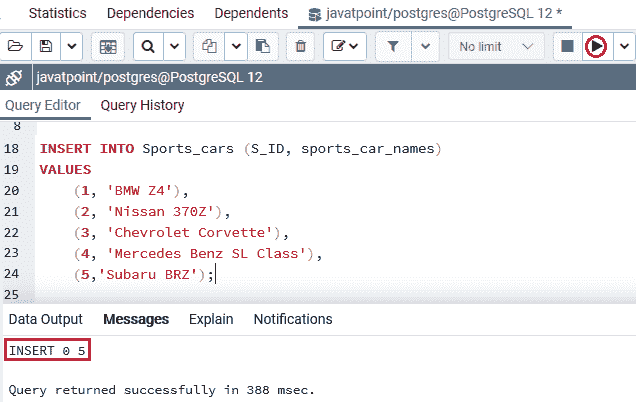

上表有一些类似的车，比如**雪佛兰科尔维特****奔驰 SL 级**。

现在我们将使用 **SELECT** 命令从 ***豪华 _ 汽车*** 表中获取以下数据:

```sql
Select * from Luxury_cars;

```

**输出**

执行上述命令后，我们将获得以下输出:

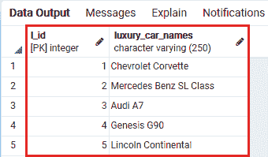

使用 SELECT 命令，我们将从 ***【跑车】*** 表中获得以下数据:

```sql
Select * from Sports_cars;

```

**输出**

执行上述命令后，我们将得到以下结果:

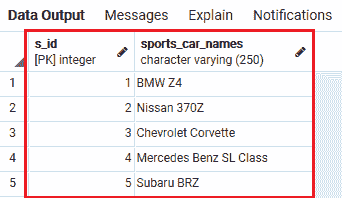

现在，让我们实时看看不同类型的 PostgreSQL 连接的工作情况:

## PostgreSQL 内部连接

PostgreSQL INNER JOIN 用于返回满足连接条件的各种表中的所有行。

**PostgreSQL 内部连接的语法**

```sql
SELECT columns  
FROM table1   
INNER JOIN table2  
ON table1.column = table2.column;  

```

下图显示了 PostgreSQL 内部连接的工作方式:

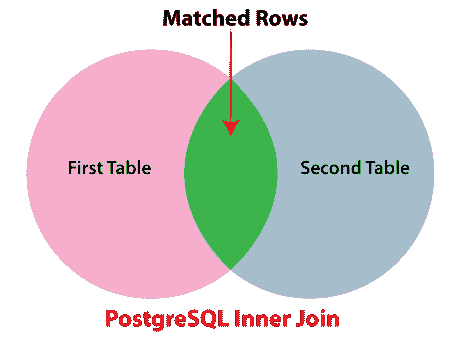

**例如**

我们将通过以上表格(**豪华 _ 汽车和运动 _ 汽车**)来了解 PostgreSQL 内部连接。

下面的命令将通过匹配**豪华 _ 汽车 _ 名称**和**运动 _ 汽车 _ 名称**列中的值，将**第一个表(*豪华 _ 汽车*** )与**第二个表(运动 _ 汽车)**连接起来:

```sql
SELECT L_ID, luxury_car_names, S_ID, sports_car_names
FROM Luxury_cars
INNER JOIN Sports_cars
ON luxury_car_names= sports_car_names;

```

**输出**

一旦我们执行了上面的命令，我们将得到下面的结果，在这里我们可以看到来自 ***豪华 _ 汽车*和*跑车*** 表的匹配行数据。

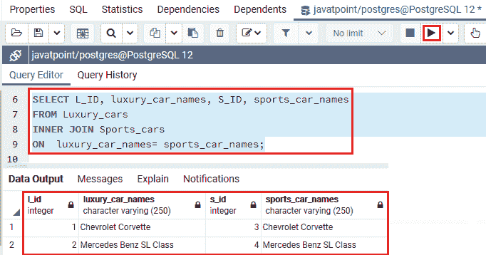

*   内部连接用于分析**表 A ( *豪华车*T3)中的每一行。**
*   它将**表 B ( *跑车*** )中每一行的**跑车名称**列中的记录等同于**豪华车名称**列中的记录。
*   如果这些记录相似，那么**内部连接**会创建一个包含两个表中的列的新行，并将该特定行增强到输出中。

## PostgreSQL 左连接

PostgreSQL LEFT JOIN 用于返回左表中的所有行，可以在 **ON 条件**中定义，并且只返回其他表中满足 JOIN 条件的那些行。

**PostgreSQL 左连接的语法**

```sql
SELECT columns  
FROM table1  
LEFT JOIN table2  
ON table1.column = table2.column;

```

下图显示了 PostgreSQL 左连接的工作方式:


**例如**

在下面的命令中，我们将使用左连接条件将 ***豪华车表*** 与**跑车表**连接起来。

在左联接子句中，**表 A 或第一个表**称为 ***左表*** ，**表 B 或第二个表**称为 ***右表*** 。

```sql
SELECT L_ID, luxury_car_names, S_ID, sports_car_names
FROM Luxury_cars
LEFT JOIN Sports_cars
ON luxury_car_names= sports_car_names;

```

**输出**

一旦我们实现了上面的命令，我们将得到下面的结果。

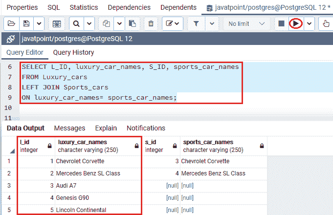

**后置 SQL 左连接的工作**

*   在上图截图中，左连接条件从**左表(豪华 _cars)** 中选择记录，并将**豪华 _ car _ name**列中的值与**运动 _ car _ name**列中的值等同于 ***运动 _cars*** 表中的值。
*   如果这些记录相似，则**左连接**创建一个新行，该行包含两个表的列，并将特定行添加到结果中，如我们在上面的输出中看到的**行 1 和行 2** 。
*   假设，如果值不相似，那么左连接也会生成一个新行，该行包含两个表中的列，并将其添加到结果中。
*   但是，它将右表( ***【跑车】*** )的列填充为空，因为我们可以在输出中看到**行 3、行 4 和行 5** 。

## 带 Where 子句的 PostgreSQL 左连接

我们也可以使用带 WHERE 条件的**左连接**。**在下面的示例**中，我们将从左表( ***【豪华 _ 汽车】*** )中选择行，右表中不包含类似的行( ***【运动 _ 汽车】*** ):

```sql
SELECT L_ID, luxury_car_names, S_ID, sports_car_names
FROM Luxury_cars
LEFT JOIN Sports_cars
ON luxury_car_names= sports_car_names
WHERE S_ID IS NULL;

```

**输出**

一旦我们执行了上面的命令，我们将得到下面的输出，显示那些 **S_ID** 为**空**的记录。

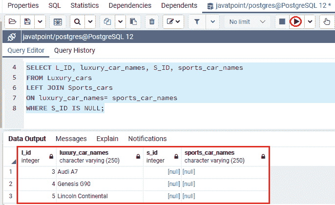

#### 注意:我们可以等效地使用左连接和左外连接，因为左连接和左外连接的工作方式是相似的。

下图解释了从**左表**返回行的**左连接**，它不包含右表中的类似行:

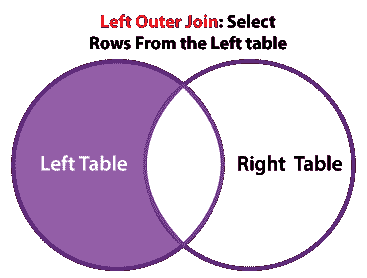

## PostgreSQL 右连接

**PostgreSQL RIGHT JOIN** 用于返回来自 **Right 表**的所有行，该表可以在 **ON 条件**中定义，并且只返回来自满足 JOIN 条件的另一个表的那些行。

**右连接**将从右表获取数据，因为它与**左连接**相反。

**PostgreSQL 右连接的语法**

```sql
SELECT columns  
FROM table1  
RIGHT JOIN table2  
ON table1.column = table2.column;  

```

下图显示了 PostgreSQL 右连接的工作原理:


**例如**

以下命令用于表示**右加入**的工作，我们将**豪华 _ 汽车**表与**运动 _ 汽车**表加入其中:

```sql
SELECT L_ID, luxury_car_names, S_ID, sports_car_names
FROM Luxury_cars
RIGHT JOIN Sports_cars
ON luxury_car_names= sports_car_names;

```

**输出**

执行上述命令后，我们将获得以下输出:

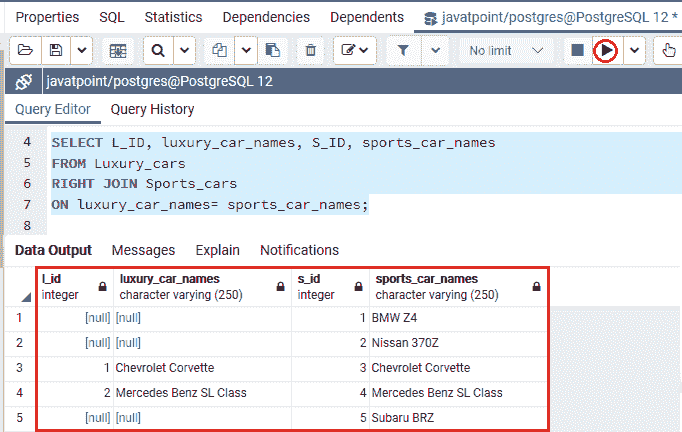

**PostgreSQL 右连接的工作**

*   在上图中， **RIGHT JOIN** 将 ***跑车*** 表中每一行的**sport _ car _ name**列中的每个值等同于 ***豪华车*** 表中所有行的**豪华车 _name** 列中的每个值。
*   如果这些值相似，则**右连接**会生成一个新行，该行包含两个表中的列(**豪华车和跑车**)。
*   假设，如果值不相似，那么右连接也会生成一个新行，该行包含两个表中的列，并将其增强到输出中。

### 带 Where 子句的 PostgreSQL 右连接

同样，我们也可以使用**右连接**和一个 WHERE 条件。**例如**，我们将使用 where 子句从右表( ***Sports_cars*** )中选择行，左表中不包含类似的行( ***豪华 _cars*** ):

```sql
SELECT L_ID, luxury_car_names, S_ID, sports_car_names
FROM Luxury_cars
RIGHT JOIN Sports_cars
ON luxury_car_names= sports_car_names
WHERE L_ID IS NULL;

```

**输出**

执行上述命令后，我们将得到如下输出，显示那些 **L_ID** 为**空**的记录。

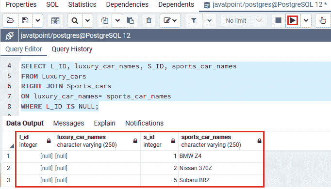

#### 注意:我们可以等效地使用右连接和右外连接，因为右连接和右外连接的工作原理是相似的。

下图解释了从**右表**返回行的**右连接**，该右连接不包含左表中的类似行:

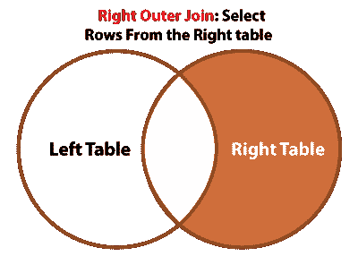

## 完全外部连接

当**左表**或**右表**记录匹配时，**全外连接**用于返回所有记录。

**PostgreSQL 完全外部连接的语法**

```sql
SELECT columns  
FROM table1  
FULL OUTER JOIN table2  
ON table1.column = table2.column;  

```

下图显示了 PostgreSQL 完全外部连接的工作原理:


**例如**

以下命令用于表示**全外连接**与**跑车**表连接**豪华车**表的工作。

```sql
SELECT L_ID, luxury_car_names, S_ID, sports_car_names
FROM Luxury_cars
FULL OUTER JOIN Sports_cars
ON luxury_car_names= sports_car_names;

```

**输出**

执行上述命令后，我们将得到以下结果:

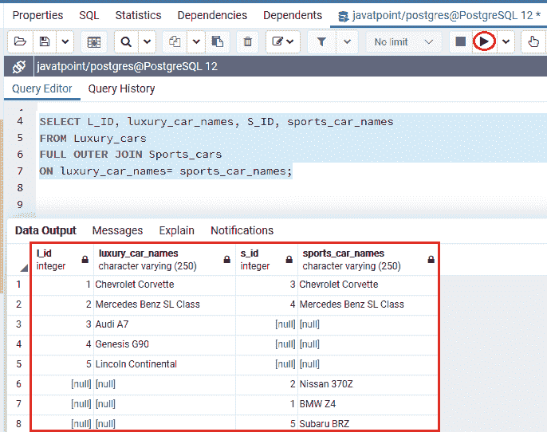

## 使用 where 子句的 PostgreSQL 完全外部联接

下图显示了从一个表中返回行的**完全外部连接**，它不包含另一个表中的匹配行:

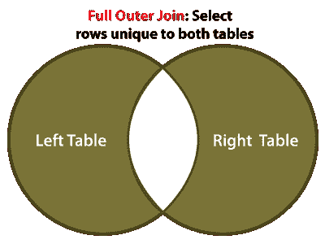

要返回一个表中没有匹配行的行，我们将使用**全外连接**和一个 **WHERE** 子句，如下所示:

```sql
SELECT L_ID, luxury_car_names, S_ID, sports_car_names
FROM Luxury_cars
FULL OUTER JOIN Sports_cars
ON luxury_car_names= sports_car_names
WHERE L_ID IS NULL OR S_ID IS NULL;

```

**输出**

一旦我们执行了上面的命令，我们将得到下面的结果:

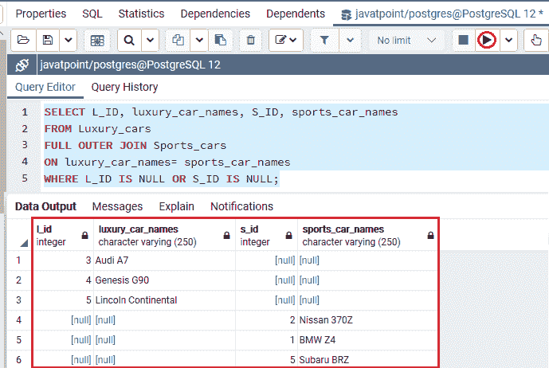

### 概观

在这一节中，我们学习了几种 **PostgreSQL 联接**的工作原理，它们组合了来自各种连接表的数据。

* * *