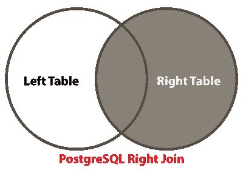
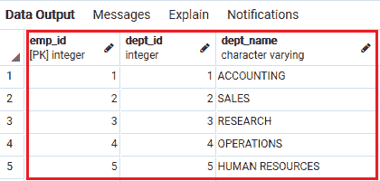
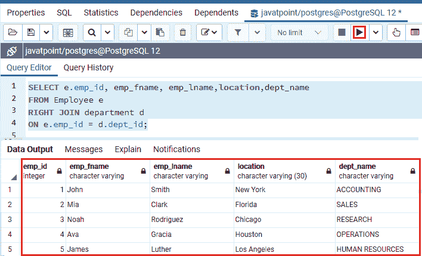
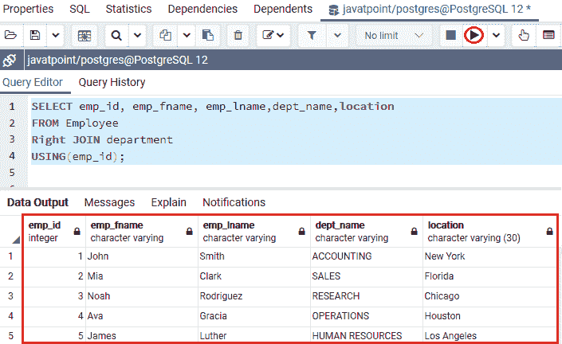
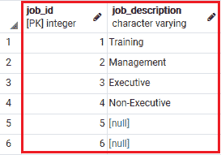
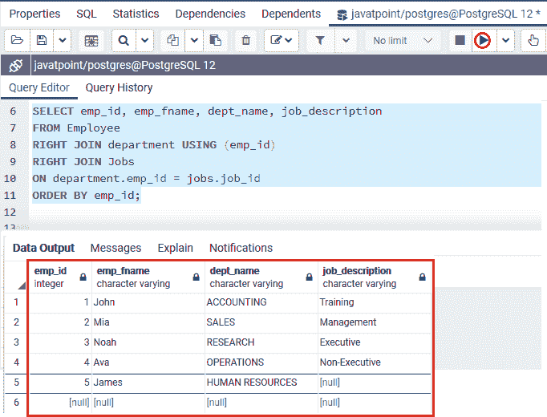
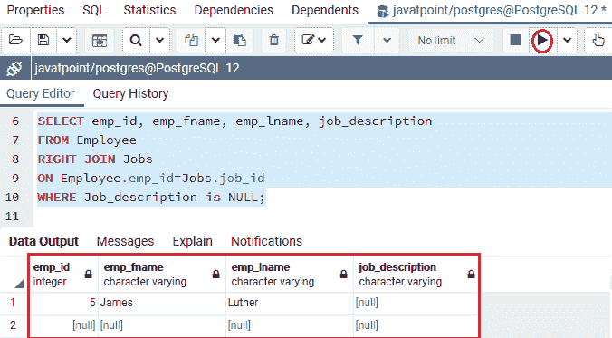

# PostgreSQL 右连接

> 原文：<https://www.javatpoint.com/postgresql-right-join>

在这一节中，我们将了解 **PostgreSQL Right join** 的工作原理，它用于从 Right 表中返回数据。我们还学习了如何使用**表别名、 [WHERE 子句](https://www.javatpoint.com/postgresql-where-clause)、USING 子句，以及借助 **PostgreSQL Right join 子句**连接多个表**。

### 什么是 PostgreSQL 右外连接或右连接子句？

**PostgreSQL Right JOIN** 或 **Right Outer Join** 用于返回右表中的所有行，以及在 on 条件中定义的满足 [join](https://www.javatpoint.com/postgresql-join) 条件的其他表中的行。如果在**左表**中没有找到相应的记录，将返回**空值**。

**右连接**也可以称为**右外连接**子句。所以**外**是可选关键字，用在**右连接**中。在 [PostgreSQL](https://www.javatpoint.com/postgresql-tutorial) 中，**右连接**与**左连接**条件平行，但会给出连接表的相反结果。

下图显示了 PostgreSQL 右连接，我们可以很容易地理解**右连接**返回来自**右表**的所有数据，并且仅返回来自**左表**的类似数据:



## PostgreSQL 右连接语法

右连接关键字与选择命令一起使用，必须写在 **FROM** 关键字之后。

```sql

SELECT columns  
FROM table1  
Right [OUTER] JOIN table2  
ON table1.column = table2.column;  

```

在上面的语法中，**表 1** 指的是**左表**，**表 2** 指的是**右表**，这意味着特定条件将根据定义的**连接条件**返回来自**表 2** 的所有记录和来自**表 1** 的匹配记录。

在**右或右外连接**条件的帮助下，我们将按照以下步骤连接**左右表**:

*   首先，我们将从两个表中定义**列列表**，在这里我们想要选择**选择**条件中的数据。
*   然后，我们将定义**右表**，即 **FROM** 子句中的**表 2** 。
*   最后，我们将描述左表，即**右 JOIN** 条件中的**表 1** ，并在 **ON** 关键字后写入 JOIN 条件。

#### 注意:在 PostgreSQL 右连接中，如果表包含相似的列名，那么 USING 和 On 子句会产生相似的输出。

## PostgreSQL 右连接示例

让我们看一个例子来理解 **PostgreSQL 右连接**是如何工作的:

## 使用 PostgreSQL 右连接来连接两个表

为此，我们将使用在 PostgreSQL 教程的 [PostgreSQL 内部连接](https://www.javatpoint.com/postgresql-inner-join)部分中创建的 ***员工和部门*** 表。

**表 1:员工**

要查看 ***【员工】*** 表的记录，我们将使用 [SELECT 命令](https://www.javatpoint.com/postgresql-select)，如下命令所示:

```sql

Select * from Employee;

```


**表 2:部门**

要查看 ***部门*** 表格中的记录，我们将使用 SELECT 命令，如以下命令所示:

```sql

Select * from department;

```

**输出**

执行上述命令后，我们将从 ***部门*** 表中获取数据:



以下查询用于从两个表中选择记录(**员工**和**部门**):

```sql

SELECT department.emp_id,dept_name,location,emp_fname, emp_lname
FROM Employee  
Right JOIN department   
ON department.emp_id = Employee.emp_id  
order by emp_id; 

```

**输出**

一旦我们实现了上面的命令，我们将得到下面的结果:


### PostgreSQL 右连接的工作方式

*   在上面的命令中， ***员工*** 是左表， ***部门*** 是右表。
*   PostgreSQL 右连接条件从右表中选择记录，右表是**部门**表。
*   然后将 ***部门*** 表中的 **emp_id、部门名称和位置**列的值相等，并将记录与左表中每一行的 **emp_id** 列进行匹配(**员工**)。
*   如果这些记录相似，那么**右连接**会创建一个新行，该行包含 **Select** 子句中的列，并将特定行添加到输出中。
*   否则，右连接仍然会创建一个新行，该行包含两个表中的列，并在结果中添加特定的行，它会用**空值**填充左表(**员工**)中的列。

#### 注意:我们可以说，右连接选择右表中的所有行，即使它们没有左表中相似的行。

## 使用 PostgreSQL 右连接的表别名

通常，我们想要连接的表会有类似名称的列，如**EMP _ id**列。

我们将使用**表别名**为连接的表分配短名称，以使命令更容易理解。

在下面的命令中，我们将使用表别名，它将返回与上面类似的结果:

```sql

SELECT e.emp_id, emp_fname, emp_lname,location,dept_name   
FROM Employee e 
INNER JOIN department d 
ON e.emp_id = d.dept_id;

```

**输出**

一旦我们实现了上面的命令，我们将得到下面的输出:



## 带 USING 子句的右连接

在本文中，我们将看到 PostgreSQL Right 联接如何与 USING 子句一起工作。

**例如**上表 ***员工和部门*** 包含一个类似的列，就是 emp _ id 因此，在这些情况下，我们使用 using 子句从表中获取值。

在下面的命令中，我们使用了**右连接**中的 **USING** 子句，该子句返回值 **emp_id、emp_fname、emp_lname、dept_name 和位置**，因为这两个表具有相似的列: **emp_id** 。

```sql

SELECT emp_id, emp_fname, emp_lname,dept_name,location
FROM Employee  
RIGHT JOIN department   
USING(emp_id);

```

**输出**

执行上述命令后，我们将得到以下结果:



## 使用 WHERE 子句的右连接

如果我们想要识别右表(**部门**)中在左表(**员工**)中没有任何匹配行的行，我们可以使用带有**右连接**的 WHERE 条件。

正如我们在下面的命令中看到的，我们从两个表**员工**和 ***部门*** t 中选择行，其中**部门名称**等于**“研究”**:

```sql

SELECT emp_id, emp_fname, emp_lname,dept_name,location
FROM Employee  
RIGHT JOIN department   
USING(emp_id) WHERE dept_name ='RESEARCH';

```

**输出**

成功执行上述命令后，它将给出以下输出:


## 使用 PostgreSQL 右连接来连接多个表

在上面的部分中，我们有两个表作为 ***员工和部门*** ，现在，如果我们想要加入两个以上的表并从那个特定的表中获取记录。在这种情况下，我们将使用右连接。

例如，这里我们将采用**作业**表，它是我们在 PostgreSQL 教程的 PostgreSQL 内部连接部分创建的。

要查看**作业**表的值，我们将使用如下的**选择**子句:

```sql

Select * from Jobs;

```

**表 3:作业**



在 **PostgreSQL Right Join** 的帮助下，我们将加入 ***员工、部门和工作*** 等三个表，如下命令所示:

```sql

SELECT emp_id, emp_fname, dept_name, job_description
FROM Employee 
RIGHT JOIN department USING (emp_id) 
RIGHT JOIN Jobs  
ON department.emp_id = jobs.job_id
ORDER BY emp_id;

```

**输出**

成功执行上述命令后，我们将给出以下结果:



## 通过使用 PostgreSQL Right JOIN 子句获取不匹配的记录

如果我们想从表中获取数据，而表中不包含其他表中任何类似的数据行，那么在这些情况下，我们将使用 PostgreSQL Right Join 子句。

正如我们在下面的例子中看到的，Right 联接子句用于标识一个**员工**，其**工作描述**为**空**:

```sql

SELECT emp_id, emp_fname, emp_lname, job_description 
FROM Employee
RIGHT JOIN Jobs
ON Employee.emp_id=Jobs.job_id 
WHERE Job_description is NULL;

```

**输出**

一旦我们实现了上面的命令，我们将得到以下结果:



## 概观

在 **PostgreSQL Right join** 部分，我们学习了以下主题:

*   我们将 PostgreSQL Right 连接条件用于**表别名、USING 子句、WHERE 子句，并获得不匹配的数据**。
*   我们使用 PostgreSQL Right 联接子句从两个表或两个以上的表中选择数据。

* * *