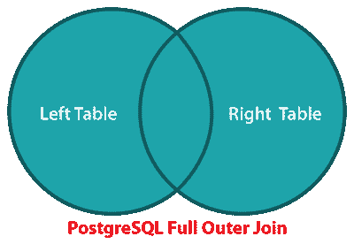
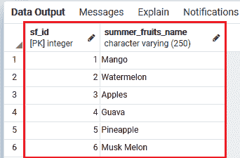
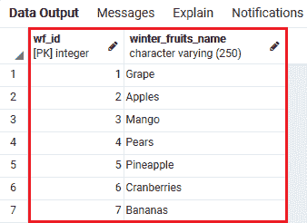
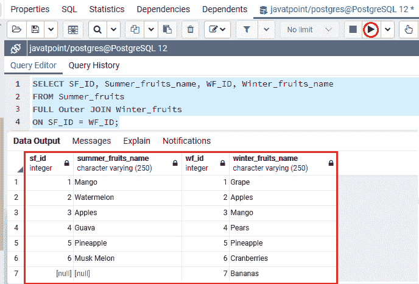
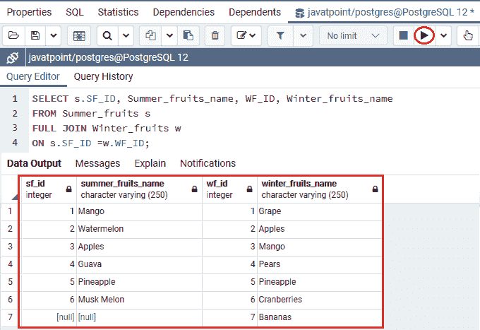
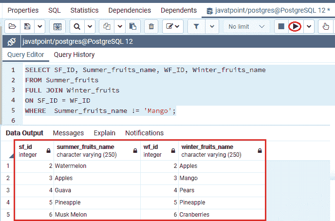

# 完全连接

> 原文：<https://www.javatpoint.com/postgresql-full-join>

在这一节中，我们将了解 **PostgreSQL Full join** 的工作原理，当**左表**或**右表**中有匹配记录时，该函数用于返回所有记录。借助 **PostgreSQL Full Outer join 子句**，我们还将学习如何使用**表别名、 [WHERE 子句](https://www.javatpoint.com/postgresql-where-clause)** 。

### 什么是 PostgreSQL 完全联接或完全外部联接子句？

当**左表**或**右表**记录匹配时，PostgreSQL **全连接**或**全外连接**用于返回所有记录。**完全外部联接**的主要目标是，它将组合 [PostgreSQL 左联接](https://www.javatpoint.com/postgresql-left-join)和 [PostgreSQL 右联接](https://www.javatpoint.com/postgresql-right-join)子句的结果，并从联接子句两侧的表中返回所有相似或不匹配的行。

下图显示了 **PostgreSQL 完全外连接**，我们可以很容易地理解**完全外连接**返回了来自**左表**和**右表**的所有数据:



## PostgreSQL 完全外部连接的语法

完全外部联接或完全联接的语法如下:

```sql

SELECT columns  
FROM table1  
FULL [OUTER] JOIN table2  
ON table1.column = table2.column;  

```

在上面的语法中，**完全外部连接**关键字与[选择命令](https://www.javatpoint.com/postgresql-select)一起使用，必须写在 **FROM** 关键字之后，**外部**关键字是可选的。

在**完全连接或完全外连接**条件的帮助下，我们将按照以下步骤组合**左右表**:

*   首先，我们将从两个表中定义**列列表**，在这里我们想要选择**选择**条件中的数据。
*   然后，我们将指定**右表**，即 **FROM** 子句中的**表 2** 。
*   最后，我们将描述左表，即**全外连接**子句中的**表 1** ，并在 **ON** 关键字后写入连接条件。

## PostgreSQL 完全联接的示例

让我们看一个例子来理解**后缀 SQL 完全外部连接**是如何工作的:

### 使用 PostgreSQL 完全外部联接来联接两个表

为此，我们将借助 create 命令创建两个名为***Summer _ 水果*** 和***Winter _ 水果*** 的表，并使用 insert 命令插入一些值。

首先，我们将使用 create 命令创建 ***【夏季水果】*** 和 ***冬季水果*** 表:

```sql

CREATE TABLE Summer_fruits (
SF_ID INT PRIMARY KEY,
Summer_fruits_name VARCHAR (250) NOT NULL);

```

以下命令用于创建 ***冬季 _ 水果*** 表:

```sql

CREATE TABLE Winter_fruits (
WF_ID INT PRIMARY KEY,
Winter_fruits_name VARCHAR (250) NOT NULL);

```

执行上述命令，已成功创建 ***【夏季水果】*** 和 ***冬季水果*** 表。

一旦生成了这两个表，我们就可以使用 insert 命令向其中插入一些值，如下所示:

```sql

INSERT INTO Summer_fruits (SF_ID, Summer_fruits_name)
VALUES VALUES(1,'Mango'),
(2,'Watermelon'),
(3,'Apples'), 
(4,'Guava'),
(5,'Pineapple'),
(6,'Musk Melon');

```

在下面的命令中，我们将值插入到***Winter _ 水果*** 表中:

```sql

INSERT INTO Winter_fruits (WF_ID, Winter_fruits_name)
VALUES(1,'Grape'),
(2,'Apples'), 
(3,'Mango'),
(4,'Pears'),
(5,'Pineapple'),
(6,'Cranberries'),
(7,'Bananas');

```

在 ***【夏季水果】和【冬季水果】*** 表中创建并插入值后，我们将在执行以下命令时获得以下输出:

**表 1:夏季 _ 水果**

```sql

Select * from Summer_fruits;

```

**输出**



**表 2:冬季 _ 水果**

```sql

Select * from Winter_fruits;

```

**输出**

执行上述命令后，我们将从***Winter _ 水果*** 表中获取数据:



以下查询用于从两个表中选择记录(**夏果**和**冬果**):

```sql

SELECT SF_ID, Summer_fruits_name, WF_ID, Winter_fruits_name
FROM Summer_fruits
FULL JOIN Winter_fruits

```

或者我们用**全外连接关键字**代替上面查询中的**全连接关键字**，我们会得到类似的输出:

```sql

ON SF_ID = WF_ID;
SELECT SF_ID, Summer_fruits_name, WF_ID, Winter_fruits_name
FROM Summer_fruits
Full Outer Join Winter_fruits
ON SF_ID = WF_ID;

```

**输出**

执行上述命令后，我们将得到以下结果:



**PostgreSQL 全外连接的工作**

*   用于获取**左表(夏果)**和**右表(冬果)**的记录。
*   如果**夏季水果**中的一行(即**表 1 或左表**与**冬季水果**中的一行(即**表 2 或右表**相匹配，则结果行将包含来自两个表的行的列。
*   如果连接的表中的行不相似，则**完全外部连接**为表的每一列放置**空值**。

## 使用 PostgreSQL 完全连接的表别名

我们将使用**表别名**为连接的表分配短名称，以使命令更容易理解，因为有时编写完整的表会导致我们执行繁琐的过程。

在下面的命令中，我们将使用表别名，它将返回类似的结果:

```sql

SELECT s.SF_ID, Summer_fruits_name, WF_ID, Winter_fruits_name
FROM Summer_fruits s
FULL JOIN Winter_fruits w
ON s.SF_ID =w.WF_ID;

```

**输出**

执行上述命令后，我们将获得以下输出:



## 使用 where 子句的 PostgreSQL 完全联接

我们也可以使用带有 WHERE 条件的**完全连接**。WHERE 子句允许我们返回过滤器结果。

在下面的例子中，我们将从两个表中选择行 ***【夏季水果】*** 和 ***冬季水果*** ，其中**夏季水果名称**不等于**芒果**:

```sql

SELECT SF_ID, Summer_fruits_name, WF_ID, Winter_fruits_name
FROM Summer_fruits
FULL JOIN Winter_fruits
ON SF_ID = WF_ID
WHERE  Summer_fruits_name != 'Mango';

```

**输出**

在执行上述命令时，我们将获得以下输出:



**概述**

在 **PostgreSQL 完全连接或完全外部连接**部分，我们学习了以下主题:

*   我们使用**完全连接**子句从两个表或两个以上的表中选择数据。
*   我们使用了带有**表别名的**完全连接**条件，以及 WHERE 子句**。

* * *