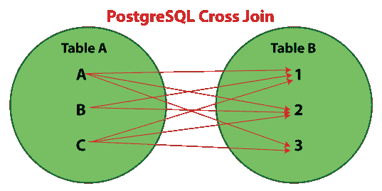
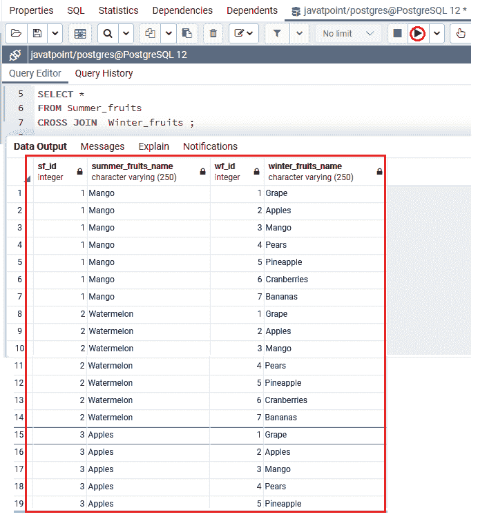
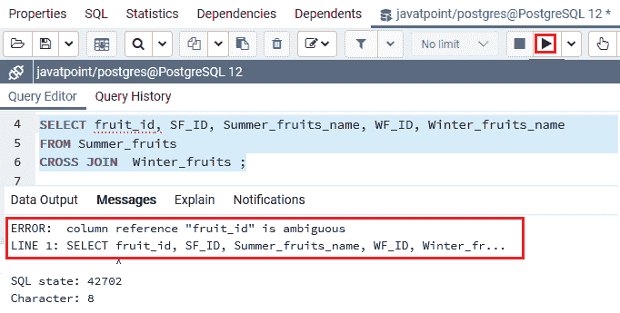
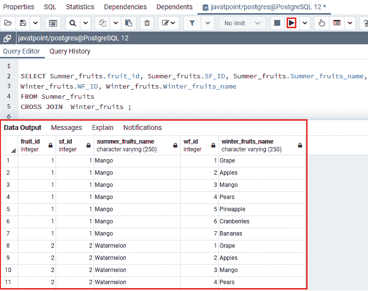
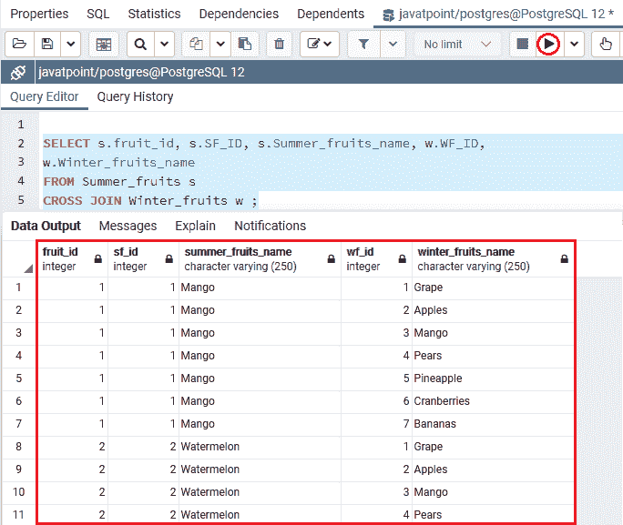
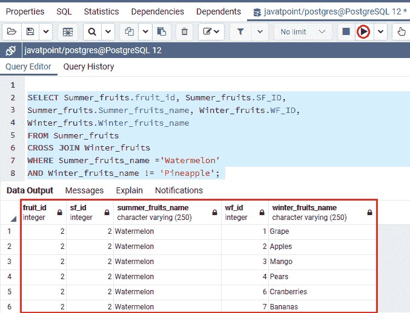
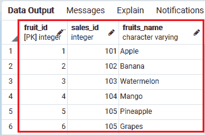
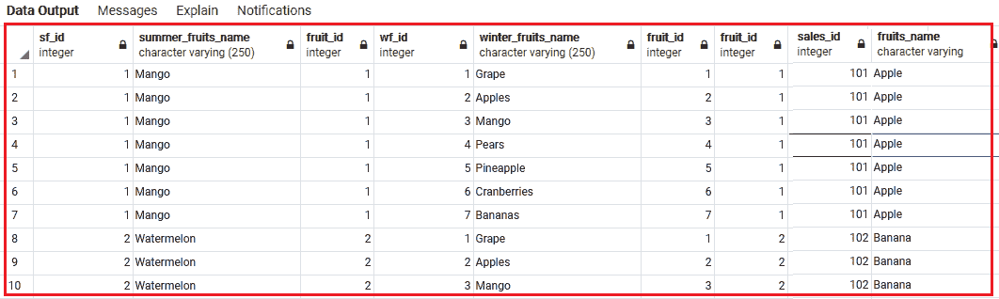

# PostgreSQL 交叉连接

> 原文：<https://www.javatpoint.com/postgresql-cross-join>

在本节中，我们将了解 **PostgreSQL 交叉连接**的工作原理，它允许我们在两个或多个表中创建行的笛卡尔乘积。我们还将学习如何使用**表别名、WHERE 子句，并在 **PostgreSQL 交叉连接子句**的帮助下连接多个表**。

### 什么是 PostgreSQL 交叉连接？

**PostgreSQL 交叉连接**用于组合多个表的所有可能性并返回输出，该输出包含所有选定表的每一行。**交叉连接**，又称为**笛卡尔连接**，它允许我们产生所有相关表格的笛卡尔乘积。

**笛卡尔乘积**可以描述为第一个表中的所有现有行乘以第二个表中的所有行。它与 [**内部连接**](https://www.javatpoint.com/postgresql-inner-join) 平行，该子句不存在[连接条件](https://www.javatpoint.com/postgresql-join)。

下面的文氏图显示了 **PostgreSQL 交叉连接，**我们很容易理解**交叉连接**返回了来自**表 1 和表 2** 的所有记录，每一行都是这两个表的行的分组。



## PostgreSQL 交叉连接语法

**交叉连接**关键字与[选择命令](https://www.javatpoint.com/postgresql-select)一起使用，必须写在 **FROM** 关键字之后。以下语法用于从两个关联的表中获取所有数据:

**语法 1**

```
SELECT column-lists  
FROM Table1  
CROSS JOIN Table2;  

```

**语法 2**

下面的语法与上面的语法相似，因为我们没有使用交叉连接关键字:

```
SELECT [column_list|*]
FROM Table1, Table2;

```

**语法 3**

在这里，我们可以使用一个 INNER JOIN 子句，条件是总是分析交叉连接的精确副本:

```
SELECT *
FROM Table1
INNER JOIN Table2 ON true;

```

在上面的语法中，我们有以下参数:

| 参数 | 描述 |
| **列列表** | 列列表用于指定我们想要返回的列或字段的名称。 |
| **表 1 和表 2** | 这些是我们从中获取记录的表名。 |

## PostgreSQL 交叉连接的示例

让我们看一个例子来理解 **PostgreSQL 交叉连接**是如何工作的:

### 使用 PostgreSQL 交叉连接来连接两个表

为此，我们将使用 [PostgreSQL 教程](https://www.javatpoint.com/postgresql-tutorial)的 PostgreSQL Full join 部分中创建的***Summer _ 水果和 Winter _ 水果*** 表。

**表 1:夏季 _ 水果**

要查看***Summer _ 水果*** 表的记录，我们将使用 **SELECT** 命令，如以下命令所示:

```
Select * from Summer_fruits;

```

**输出**

执行上述命令后，我们将从***Summer _ 水果*** 表中获取数据:


**表 2:冬季 _ 水果**

要查看***Winter _ 水果*** 表中的记录，我们将使用 SELECT 命令，如以下命令所示:

```
Select * from Winter_fruits;

```

**输出**

执行上述命令后，我们将从***Winter _ 水果*** 表中获取数据:


我们将执行以下命令从两个表中获取所有记录( ***【夏季水果】和【冬季水果】*** ):

```
SELECT *
FROM Summer_fruits 
CROSS JOIN Winter_fruits ;

```

**输出**

在执行上述命令时，我们将获得以下输出:



当执行 **CROSS-JOIN** 命令时，我们会看到它显示了 42 行，这意味着来自 ***夏果*** 表的**六**行乘以来自 ***冬果*** 表的**七**行。

#### 注意:建议使用单独的列名来代替 SELECT *命令，以避免重复的列输出两次。

### PostgreSQL CROSS JOIN 中的不确定列问题

有时，我们需要从两个以上的表中获取选定的列记录。这些表可以有一些匹配的列名。

让我们看一个**的例子**为了理解这种类型的情况，假设***Summer _ 水果和 Winter _ 水果*** 表包含一个类似的列，那就是:**水果 _id** 正如我们在下面的命令中看到的:

```
SELECT fruit_id, SF_ID, Summer_fruits_name, WF_ID, Winter_fruits_name
FROM Summer_fruits 
CROSS JOIN Winter_fruits;

```

**输出**

执行上述命令时，PostgreSQL CROSS JOIN 命令抛出一个错误**列名不明确**，暗示两个表中都存在列名。PostgreSQL 变得不清楚我们想要显示哪一列。



因此，为了解决上述错误，我们将在列名之前指定表名，如下命令所示:

```
SELECT Summer_fruits.fruit_id, Summer_fruits.SF_ID, Summer_fruits.Summer_fruits_name, 
Winter_fruits.WF_ID, Winter_fruits.Winter_fruits_name
FROM Summer_fruits 
CROSS JOIN Winter_fruits ;

```

**输出**

执行上述命令后，我们将得到以下结果:



## 使用 PostgreSQL 交叉连接的表别名

一般来说，我们想要连接的表会有类似于**水果 _id** 列的名称的列。

不使用完整的表名，我们可以使用**表别名**为连接的表分配短名称，使命令更容易理解。有时候，写一个**的全表名**是一个繁琐的过程。

因此，我们将使用**表别名，**，它将返回与上面类似的结果，如我们在下面的命令中所见:

```
SELECT s.fruit_id, s.SF_ID, s.Summer_fruits_name, w.WF_ID,
w.Winter_fruits_name
FROM Summer_fruits s
CROSS JOIN Winter_fruits w;

```

**输出**

一旦我们实现了上面的命令，我们将得到下面的输出:



## 使用 WHERE 子句的 PostgreSQL 交叉连接

如果我们想识别表 1 ( **夏果**)中没有表 2 ( **冬果**中匹配行的行，我们可以使用 [WHERE 条件](https://www.javatpoint.com/postgresql-where-clause)和**交叉连接**。

正如我们在下面的命令中看到的，我们正在从两个表**夏季 _ 水果和冬季 _ 水果**中选择行，其中**夏季 _ 水果名称**等于**西瓜****冬季 _ 水果名称**不等于**菠萝**。

```
SELECT Summer_fruits.fruit_id, Summer_fruits.SF_ID, 
Summer_fruits.Summer_fruits_name, Winter_fruits.WF_ID,
Winter_fruits.Winter_fruits_name
FROM Summer_fruits 
CROSS JOIN Winter_fruits  
WHERE Summer_fruits_name ='Watermelon' 
AND Winter_fruits_name != 'Pineapple';

```

**输出**

在执行上述命令时，我们将得到以下结果:



## 使用 PostgreSQL 交叉连接多个表

在上面的部分中，我们有两个表作为***Summer _ 水果和 Winter _ 水果*** ，现在，如果我们想要加入两个以上的表并从那个特定的表中获取记录。在这种情况下，我们将使用**交叉连接**。

例如，我们将使用 create 子句创建**果树 _ 销售**表，如下命令所示:

```
CREATE TABLE Fruit_sales (
Fruit_id int primary key, 
Sales_id int,
Fruits_name varchar not null
);

```

要查看**水果 _ 销售额**表的值，我们将使用如下的**选择**子句:

一旦 ***【水果 _ 销售】*** 表创建成功，我们将借助 insert 命令在其中插入一些值，如下命令所示:

```
INSERT INTO Fruit_sales (fruit_id, Sales_id, Fruits_name)
VALUES (1, 101,'Apple'),
(2, 102,'Banana'),
(3, 103,'Watermelon'),
(4, 104,'Mango'),
(5, 105,'Pineapple'),
(6, 105,'Grapes');

```

在**创建并插入**水果 _ 销售额**表中的**值后，我们将在执行以下命令时获得以下输出:

```
Select * from Fruit_sales;

```

**表 3:水果 _ 销量**



现在，我们将借助 **PostgreSQL Cross Join** 连接多个表，如***Summer _ 水果、Winter _ 水果、水果 _ sales*T3，如下图所示:**

```
SELECT * FROM Summer_fruits  
LEFT JOIN (Winter_fruits CROSS JOIN Fruit_sales)  
ON Summer_fruits.fruit_id= Fruit_sales.fruit_id  
ORDER BY Fruits_name;  

```

**输出**

在执行上述命令时，我们将获得以下输出:



### 概观

在 PostgreSQL 交叉连接部分，我们学习了以下主题:

*   我们使用 **PostgreSQL 交叉连接**子句从两个表中选择数据，并理解**模糊列问题**。
*   我们将 PostgreSQL 完全连接条件与**表别名和 WHERE 子句**一起使用，并从多个表中获取记录。

* * *