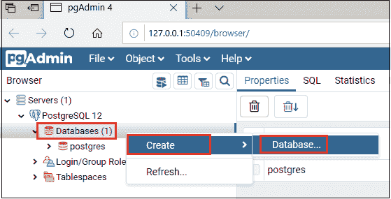
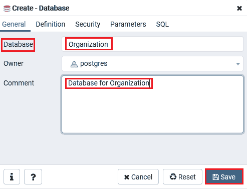
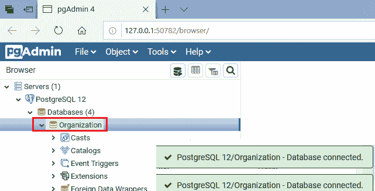
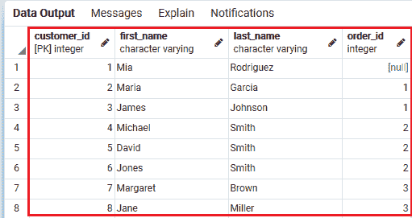
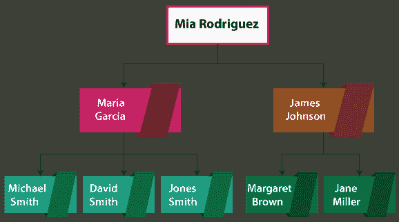
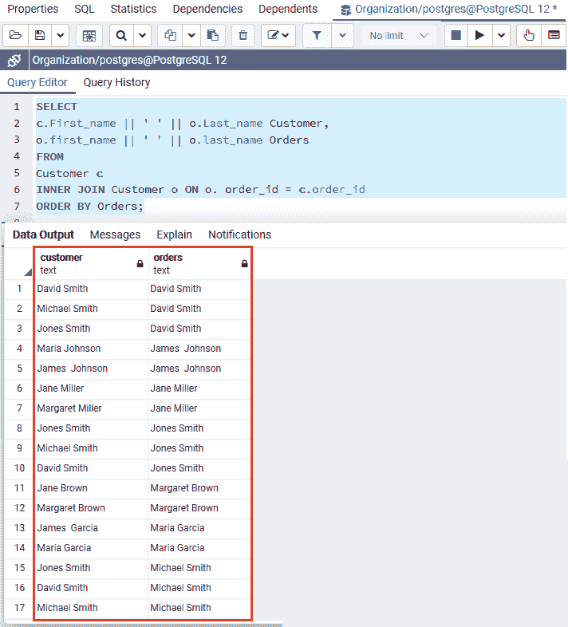
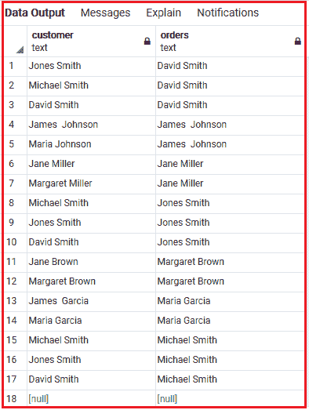

# PostgreSQL 自连接

> 原文：<https://www.javatpoint.com/postgresql-self-join>

在这一节中，我们将了解 **PostgreSQL Self joins** 的工作原理，它用于关联同一表中的行。我们还学习了如何**在 **PostgreSQL Self join 子句**的帮助下，从相似的表**中获取分层数据。

## 什么是 PostgreSQL 自连接？

在 [PostgreSQL](https://www.javatpoint.com/postgresql-tutorial) 中，我们有一种特殊类型的连接，称为**自连接**。**PostgreSQL Self Join**用于完全设置一个相似表的不同名称，我们也可以使用别名。

为了进行自连接，我们将使用不同的表别名定义一个相似的表两次，并在 **ON** 关键字后给出连接谓词。

在实时中，我们使用自连接**来比较同一表**内的行(因为 PostgreSQL 中不允许比较相似的表名)，并获取分层数据。

#### 注意:没有“自加入”这样的关键词；但是，我们可以在别名的帮助下使用 PostgreSQL 内部联接、左联接、右联接。

## PostgreSQL 自连接语法

在 PostgreSQL 中，我们有不同的自连接语法，如下所示:

**语法 1**

在下面的语法中，我们使用了一个**内部连接关键字，**，它将表与自身结合起来:

```sql

SELECT column_list
FROM table_name Table1
INNER JOIN table_name Table2 ON join_predicate;

```

在上面的语法中，**表名**是在 [PostgreSQL INNER JOIN 子句](https://www.javatpoint.com/postgresql-inner-join)的帮助下组合的。

**语法 2**

在下面的语法中，我们使用**左连接关键字**，它将表组合到自身:

```sql

SELECT column_list
FROM table_name Table1
LEFT JOIN table_name Table2 ON join_predicate;

```

在上面的语法中，**表名**是在 [PostgreSQL LEFT JOIN 子句](https://www.javatpoint.com/postgresql-left-join)的帮助下自行组合的。

**语法 3**

在下面的语法中，我们使用**右连接关键字**，它将表组合到自身:

```sql

SELECT column_list
FROM table_name Table1
RIGHT JOIN Table_name Table2 ON join_predicate;

```

在上面的语法中，**表名**本身是在 PostgreSQL RIGHT JOIN 子句的帮助下组合的。

## PostgreSQL 自连接示例

让我们看一个例子来理解 **PostgreSQL Self join** 是如何工作的:

## 从表中获取分层记录的示例

为此，我们将创建一个示例数据库，然后在 create 命令的帮助下创建一个名为 Customer 的表，并使用 insert 命令插入一些值。

首先，我们将创建 ***一个示例数据库*** ，就像我们在 PostgreSQL 教程的前面部分中创建的那样，或者参考下面的链接来理解，我们如何在 PostgreSQL 中创建数据库:

[https://www.javatpoint.com/postgresql-create-database](https://www.javatpoint.com/postgresql-create-database)

现在，我们将按照下面的过程，在 pgadmin4 中创建一个数据库:

*   我们将在本地系统中打开 pgAdmin，然后在对象树中，右键单击**数据库**，选择**创建**，然后选择**数据库**。

**数据库→创建→数据库**



*   之后将打开**创建数据库**窗口，我们需要提供一些创建数据库的必要细节(**数据库名称，注释**，然后点击**保存**按钮。



*   **组织**数据库已经创建成功，显示在对象树中，如下图所示:



成功创建**发源数据库**后，我们将使用 create 命令创建**客户**表，如下图所示:

```sql

CREATE TABLE Customer (
Customer_id INT PRIMARY KEY,
First_name VARCHAR NOT NULL,
Last_name VARCHAR NOT NULL,
Order_id INT,
FOREIGN KEY (Order_id) REFERENCES Customer (Customer_id) 
ON DELETE CASCADE
);

```

现在，我们将在 insert 的帮助下，将一些客户记录插入到**客户**表中，如下图所示:

```sql

INSERT INTO Customer(Customer_id,First_name, Last_name,
Order_id )VALUES
(1, 'Mia', 'Rodriguez', NULL),
(2, 'Maria', 'Garcia', 1),
(3, 'James ', 'Johnson', 1),
(4, 'Michael', 'Smith', 2),  
(5, 'David', 'Smith', 2), 
(6, 'Jones', 'Smith', 2),
(7, 'Margaret', 'Brown', 3),
(8, 'Jane', 'Miller', 3),
(9, 'Catherine', 'Martinez', 4),
(10, 'Ana', 'Clark', 4);

```

在 ***【客户】*** 表中创建并插入值后，我们将在执行以下命令时获得以下输出:

```sql

Select * from Customer;

```

**输出**



在**客户**表中，**订单 _id** 列引用了**客户 _id** 列。 **Order_id** 列中的值显示客户购买的订单。

如果在**订单 _id** 列中的值为**空**，则客户不购买任何东西。

正如我们在下图中看到的，整个层次结构如下所示:



在下面的例子中，我们将在**客户**表中获取谁通过自助加入购买的数据:

```sql

SELECT
c.First_name || ' ' || o.Last_name Customer,
o.first_name || ' ' || o.last_name Orders
FROM
Customer c
INNER JOIN Customer o ON o. order_id = c.order_id
ORDER BY Orders;

```

**输出**

执行上述命令后，我们将得到以下结果:



从上面的输出表中我们可以看到， ***【客户】*** 表被执行了两次，一次作为**客户**，另一次作为**订单**。

在上面的命令中，我们使用**表别名**，如 **c** 代表**客户**和的**代表**订单**。**

并且**连接谓词**借助于**客户 _id 和订单 _id** 列中的相似值来标识**客户/订单**对。

#### 注意:订单标识为空的客户(米娅·罗德里格斯)不会出现在结果中。

我们将使用 LEFT JOIN 代替 INNER JOIN 子句，使用以下命令在输出表中包含顶部**顺序**:

```sql

SELECT
c.First_name || ' ' || o.Last_name Customer,
o.first_name || ' ' || o.last_name Orders
FROM
Customer c
LEFT JOIN Customer o ON o. order_id = c.order_id
ORDER BY Orders;

```

**输出**

执行上述命令后，我们将获得以下输出:



**概述**

在 PostgreSQL 自连接部分，我们学习了以下主题:

*   **PostgreSQL 自连接**是特殊连接，我们也可以在同一个表中获取**层次数据**。
*   借助于**内部连接和左连接子句**，我们使用 **PostgreSQL Self join** 子句来组合表本身。

* * *