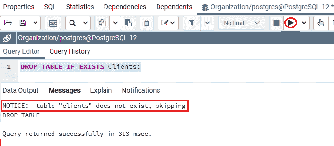
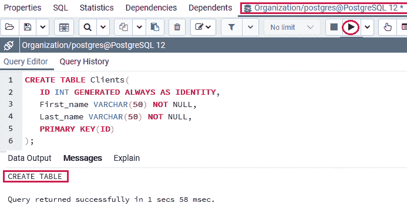
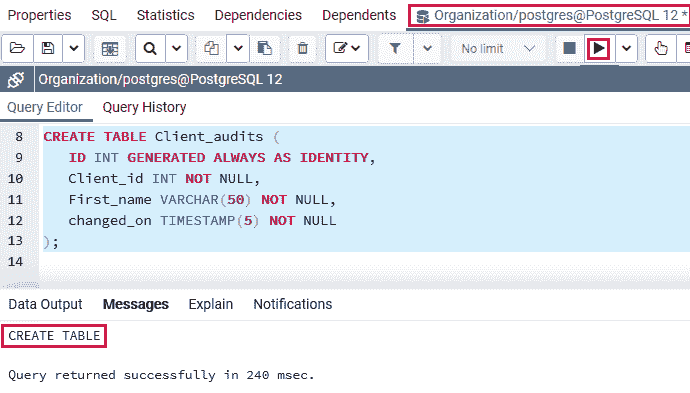
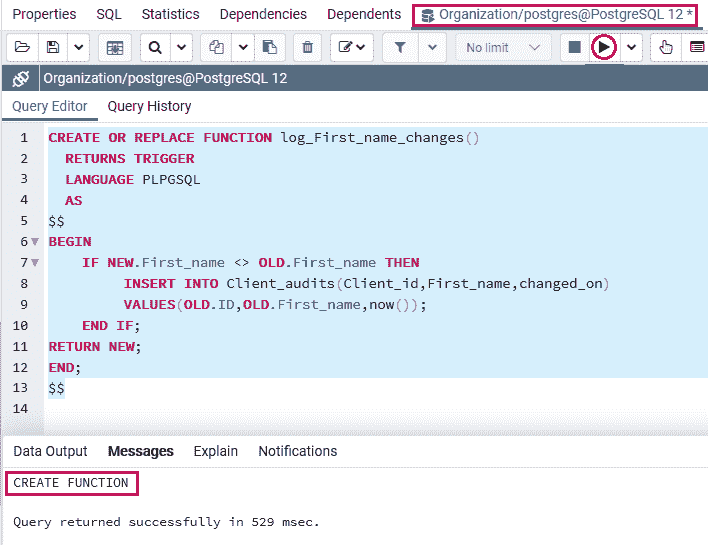
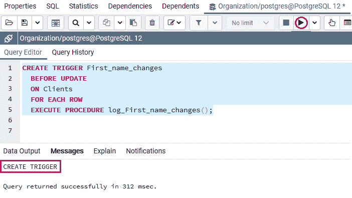
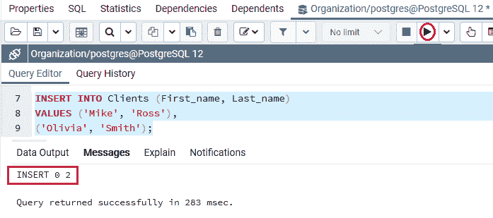
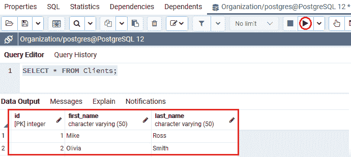
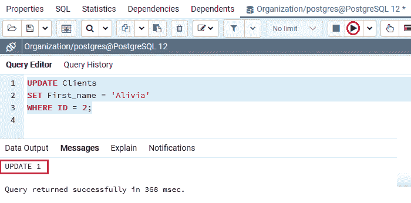
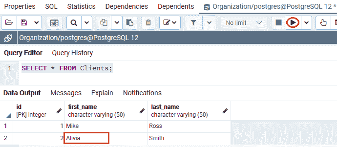
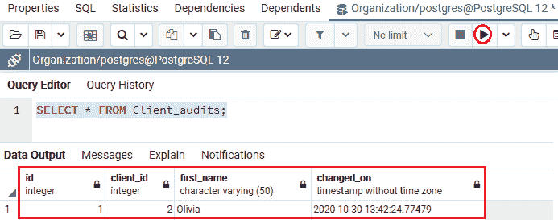

# 创建触发器

> 原文：<https://www.javatpoint.com/postgresql-create-trigger>

在本节中，我们将了解**触发器功能的工作原理、触发器功能的创建、PostgreSQL 创建触发器**以及**创建触发器命令**的**示例**。

### 什么是触发器功能？

触发函数与一致的用户定义函数并行。但是[触发器](https://www.javatpoint.com/postgresql-trigger)函数可以用类型触发器返回值，并且不取任何参数。

### 创建触发器函数的语法

创建触发器函数的语法如下:

```sql

CREATE FUNCTION trigger_function() 
   RETURNS TRIGGER 
   LANGUAGE PLPGSQL
AS $$
BEGIN
   -- trigger logic goes here?
END;
$$

```

#### 注意:我们可以通过 PostgreSQL 在任何支持的语言的帮助下生成一个触发器函数。

一个**触发函数**可以通过一个叫做**触发数据**的特殊结构接受关于其调用环境的数据，该结构保存一组局部变量。

**例如，在触发事件之前或之后，**旧的和新的**表示表格中该行的状态。**

[PostgreSQL](https://www.javatpoint.com/postgresql-tutorial) 还允许我们将其他局部变量放在 **TG_** 的前面，比如 **TG_WHEN** ，以及 **TG_TABLE_NAME。**

如果指定一个触发功能，可以修复各种触发事件，例如[插入](https://www.javatpoint.com/postgresql-insert)、[删除](https://www.javatpoint.com/postgresql-delete)、[更新](https://www.javatpoint.com/postgresql-update)。

### 如何创建新触发器

我们将按照以下流程在 PostgreSQL 中生成一个新触发器:

**步骤 1:** 首先，我们将借助 **CREATE FUNCTION** 命令创建一个触发函数。

**步骤 2:** 然后，我们将借助 **CREATE TRIGGER** 命令将触发功能固定到一个表中。

### 什么是 PostgreSQL CREATE TRIGGER 命令？

CREATE TRIGGER 命令用于创建新的触发器。

**PostgreSQL CREATE TRIGGER 命令的语法:**

PostgreSQL **CREATE TRIGGER** 命令的语法如下:

```sql

CREATE TRIGGER trigger_name 
 {BEFORE | AFTER} { event }
  ON table_name
  [FOR [EACH] { ROW | STATEMENT }]
  EXECUTE PROCEDURE trigger_function

```

在上面的语法中，我们使用了以下参数，如下表所示:

| 因素 | 描述 |
| 触发器名称 | 用于定义 **TRIGGER** 关键字后的触发器名称。 |
| 前&#124;后 | 这些参数在我们需要定义触发器执行时的时序时使用，当事件发生时可以指定为 **AFTER 或 BEFORE** 。 |
| 事件 | 事件参数用于定义请求触发的事件，可以是 **INSERT、UPDATE、DELETE 或 TRUNCATE。** |
| 表名 | table_name 参数用于定义与触发器链接的表名。并在 **ON** 关键字后指定。 |
| **【对于[每个]{ ROW &#124; STATEMENT }】** | 这些参数可以定义触发器的类型，分别是**行级触发器**和**语句级触发器。**

*   The **clause of each row is used to define row-level triggers.**
***   And [T0】 FOR every STATEMENT 【T1] clauses are used to specify statement-level triggers.**

 |
| **触发 _ 功能** | 用于定义 **EXECUTE PROCEDURE** 关键字后的触发函数名称。 |

#### 注意:语句级触发器用于实现每个事务，而行级触发器用于为每行执行。

**例如**，让我们假设一个表有 50 行和两个触发器，当 **DELETE** 事件发生时将执行这两个触发器。

如果**删除命令**删除 50 行，**行级触发**将执行 50 次，每删除一行执行一次。但是，无论删除多少行，都将执行一次**语句级触发器**。

### 后置 SQL 创建触发器示例

让我们看一个示例来理解 **PostgreSQL CREATE Trigger** 命令的工作原理。

我们正在使用 **CREATE** 命令的帮助创建一个新表作为 ***客户端*** ，并使用 INSERT 命令插入一些值。

要将 ***客户端*** 创建到**组织数据库**中，我们使用 **CREATE** 命令。

但是，在创建 ***客户端*** 表之前，如果**组织**数据库中已经存在类似的表，我们将使用 [**DROP TABLE** 命令](https://www.javatpoint.com/postgresql-drop-table)。

```sql

DROP TABLE IF EXISTS Clients;

```

**输出**

执行上述命令后，我们会得到如下窗口消息: ***【客户端】*** 表不存在。



***客户端*** 表包含各种列，如**客户端 _id、名字、姓氏**列，其中我们使用**客户端 _id** 作为**生成始终为身份约束**。

```sql

CREATE TABLE Clients(
   ID INT GENERATED ALWAYS AS IDENTITY,
   First_name VARCHAR(50) NOT NULL,
   Last_name VARCHAR(50) NOT NULL,
   PRIMARY KEY(ID)
);

```

**输出**

在执行上述命令时，我们将获得以下消息，该消息显示*客户端表已成功创建到**组织**数据库中。*

*

假设当客户端名称修改时，我们希望将修改记录在名为 **Client_audits** 的不同表中:

```sql

CREATE TABLE Client_audits (
   ID INT GENERATED ALWAYS AS IDENTITY,
   Client_id INT NOT NULL,
   First_name VARCHAR(50) NOT NULL,
   changed_on TIMESTAMP(5) NOT NULL
);

```

**输出**

执行上述命令后，我们会得到如下消息窗口，显示 ***Client_audits*** 表已创建成功进入 ***组织*** 表。



现在，我们将按照以下步骤为指定的表创建一个新函数:

### 步骤 1:创建新函数

首先，我们使用下面的命令创建一个名为 **log_First_name_changes** 的新函数:

```sql

CREATE OR REPLACE FUNCTION log_First_name_changes()
  RETURNS TRIGGER 
  LANGUAGE PLPGSQL
  AS
$$
BEGIN
	IF NEW.First_name <> OLD.First_name THEN
		 INSERT INTO Client_audits(Client_id,First_name,changed_on)
		 VALUES(OLD.ID,OLD.First_name,now());
	END IF;
RETURN NEW;
END;
$$

```

**输出**

执行上述命令后，我们将获得如下消息窗口，显示 **log_First_name_changes** 函数已成功创建到类似的数据库中。



该函数将旧的名字插入到**Client _ audit**表中，该表包含 **Client_id、名字**，如果是客户端的**名字**，则包含**更改时间**。

在上面的命令中，我们有以下内容:

*   **NEW** 表示**将被更新的新行，**而 **OLD** 表示更新前的行**。**
*   **名字**检索**新的姓氏；**另一方面， **OLD.first_name** 在更新之前检索**的名字。**

### 步骤 2:创建新触发器

创建新函数( **log_First_name_changes)** 成功后，我们将触发函数固定到**客户端**表中，该表的触发名称为 **First_name_changes** 。

触发功能用于在**名字**列的值更新之前自动记录修改，如下命令所示:

```sql

CREATE TRIGGER First_name_changes
 BEFORE UPDATE
 ON Clients
 FOR EACH ROW
 EXECUTE PROCEDURE log_First_name_changes();

```

**输出**

执行上述命令时，我们会得到如下消息，显示 **First_name_changes** 触发器已成功创建。



### 步骤 3:插入数据

在**新函数创建为*log _ First _ name _ changes()***和**新触发器**创建为***First _ name _ changes***成功后，我们将在 **INSERT** 命令的帮助下在 ***客户端*** 表中输入一些值。

```sql

INSERT INTO Clients (First_name, Last_name)
VALUES ('Mike', 'Ross'),
('Olivia', 'Smith');

```

**输出**

执行上述命令后，我们将获得以下消息窗口，显示这两个值已成功插入 ***【客户端】*** 表。



### 步骤 4:检索数据

创建并插入 ***客户端*** 表的值后，我们将使用 **SELECT** 命令从 ***客户端*** 表中检索数据:

```sql

SELECT * FROM Clients;

```

**输出**

成功执行上述命令后，我们将得到如下结果，显示 PostgreSQL 返回 ***客户端*** 表中的数据:



假设**奥利维亚·史密斯**将她的**名**修改为**阿莉维亚·史密斯**。

### 步骤 5:更新名字

所以在这里，我们在**更新**命令的帮助下，将奥利维亚的**名字**更新为新名字，如下图所示:

```sql

UPDATE Clients
SET First_name = 'Alivia'
WHERE ID = 2;

```

**输出**

在执行上述命令时，我们将获得以下窗口消息，显示指定的值已成功更新。



### 步骤 7:修改后验证数据

现在，我们将使用以下**选择**命令验证**奥利维亚**的**名**是否已成功更新:

```sql

SELECT * FROM Clients;

```

**输出**

成功执行上述命令后，我们将获得以下输出:奥利维亚的名字已更新为 **Alivia** 进入**T3【客户端】T5】表:**



### 步骤 8:验证内容

成功执行上述所有步骤后，最终，我们将借助以下**选择**命令验证 ***客户端 _ 审核*** 表的内容:

```sql

SELECT * FROM Client_audits;

```

**输出**

执行上述命令后，我们将得到如下输出，显示修改被触发器记录在***Client _ audit***表中。



## 概观

在 **PostgreSQL 创建触发器**部分，我们学习了以下主题:

*   我们已经**使用了 CREATE Function** 命令为特定的表创建了一个新的函数，其中**触发函数**与一致的用户定义函数平行。
*   **PostgreSQL 创建触发器命令**用于创建一个新的触发器，并附有一个示例。

* * **