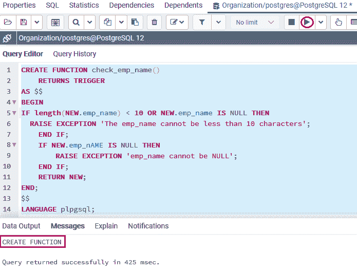
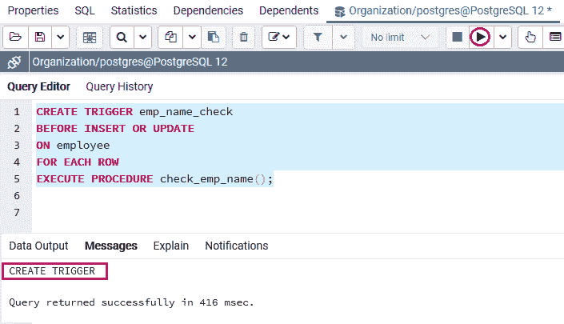
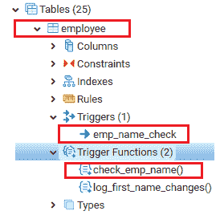
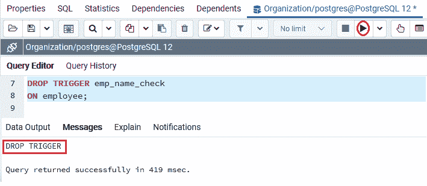

# PostgreSQL DROP TRIGGER

> 原文：<https://www.javatpoint.com/postgresql-drop-trigger>

在本节中，我们将了解 **PostgreSQL DROP TRIGGER** 命令的工作原理，并查看**从 PostgreSQL 中的指定表中删除**触发器的示例。

## 什么是 PostgreSQL Drop Trigger 命令？

在 PostgreSQL 中，我们可以使用 **Drop Trigger** 命令移除现有的[触发器](https://www.javatpoint.com/postgresql-trigger)。

### PostgreSQL Drop 触发器命令的语法

下图用于从特定表中删除触发器:

```sql

DROP TRIGGER [IF EXISTS] trigger_name 
ON table_name [ CASCADE | RESTRICT ];

```

在上面的语法中，我们使用了以下参数:

| 因素 | 描述 |
| 触发器名称 | 

*   Used to define the name of the trigger we need to remove, which is mentioned after the keyword **drop trigger** .

 |
| 如果存在 | 

*   The iExists parameter is only used to temporarily remove the trigger when If EXISTS.
*   If we try to remove a trigger whose **does not exist without specifying the **if exists** command, we will get an error in the result.**
*   If we use **if exists** to remove the non-existent trigger, PostgreSQL will issue a notice instead.

 |
| 表名 | 

*   **Table Name** parameter is used to define the table name to which the trigger belongs.
*   If the table is linked to a defined schema, we can use the schema qualified name of the table, such as **schema _ name.table _ name.**

 |
| 串联 | 

*   If we want to drop an object that is automatically triggered, we can use the **cascade** option.

 |
| 限制 | 

*   If any object depends on the trigger, or we want to reject or discard the trigger, we can use **to limit** option.
*   The **descending trigger** command uses the limit option by default.

 |

#### 注意:在 SQL 中，触发器名称不限于表，因此，我们可以使用下面的命令:

```sql

DROP TRIGGER trigger_name;

```

## PostgreSQL 删除触发器命令示例

让我们看一个简单的例子来理解 **PostgreSQL DROP Trigger** 命令的工作原理。

为此，我们采用了 [PostgreSQL 教程](https://www.javatpoint.com/postgresql-tutorial)前面部分中创建的 ***员工*** 表。

### 步骤 1:创建新函数

首先，我们将创建一个函数，该函数检查**员工的 emp_name** ，其中员工的**姓名**长度必须至少为 **10** ，并且不能为空。

```sql

CREATE FUNCTION check_emp_name()
    RETURNS TRIGGER
AS $$
BEGIN
IF length(NEW.emp_name) < 10 OR NEW.emp_name IS NULL THEN
  RAISE EXCEPTION 'The emp_name cannot be less than 10 characters';
    END IF;
    IF NEW.emp_nAME IS NULL THEN
        RAISE EXCEPTION 'emp_name cannot be NULL';
    END IF;
    RETURN NEW;
END;
$$
LANGUAGE plpgsql;

```

**输出**

在执行上述命令时，我们将获得以下消息: **check_emp_name()** 函数已成功创建到**组织**数据库中。



### 步骤 2:创建新触发器

创建 **check_emp_name()** 功能后，我们将**在 ***员工*** 表上创建一个新的触发器**来检查一个**员工的 emp_name。**

每当我们在 ***【员工】*** 表(取自**组织**数据库)中更新或插入一行时，将执行相同的触发器:

```sql

CREATE TRIGGER emp_name_check 
BEFORE INSERT OR UPDATE
ON employee
FOR EACH ROW 
EXECUTE PROCEDURE check_emp_name();

```

**输出**

执行上述命令后，我们将获得以下消息窗口，显示 ***员工*** 表的 **emp_name_check** 触发器已成功插入。



并且，我们还可以验证上面创建的函数 **(check_emp_name())** 和触发器 **(emp_name_check** )在 **f 组织**数据库的对象树中。



### 第三步:放下扳机

一旦**功能和触发器**成功生成，我们将借助 **DROP TRIGGER** 命令移除 **emp_name_check** 触发器，如下所示:

```sql

DROP TRIGGER emp_name_check
ON employee;

```

**输出**

执行上述命令后，我们将获得以下输出，显示特定触发器已从 ***【员工】*** 表中成功删除**。**



## 概观

在 **PostgreSQL Drop Trigger** 部分，我们学习了以下主题:

*   我们理解 **PostgreSQL drop trigger** 命令的用法，它用于移除特定表的触发器。

* * *