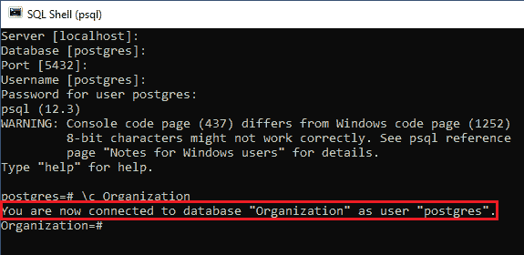
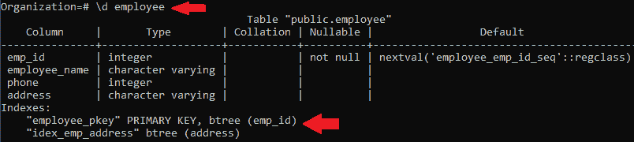
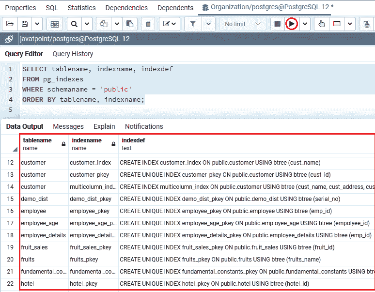
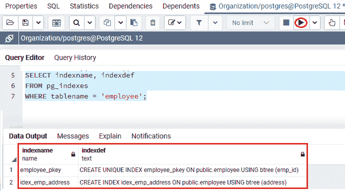
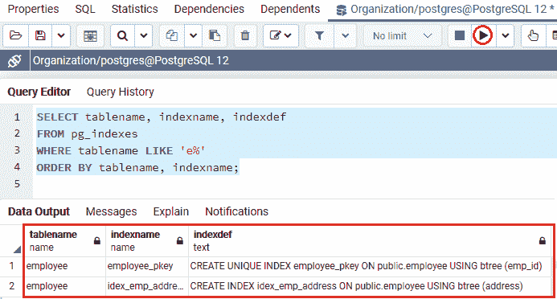

# PostgreSQL 列表索引

> 原文：<https://www.javatpoint.com/postgresql-list-indexes>

在本节中，我们将借助 **SQL Shell (PSQL)** 和 **pg_indexes 视图**从 **PostgreSQL 数据库**中了解**列表索引**的工作方式。以及使用 psql 和 pg_indexes 视图列出索引的**的**示例**。**

## 什么是 PostgreSQL 列表索引？

在 [PostgreSQL](https://www.javatpoint.com/postgresql-tutorial) 中，我们没有像 **SHOW INDEXES** 这样的命令来列出数据库或表的索引数据。

但是 PostgreSQL 允许以两种不同的方式访问索引列表，如下所示:

*   **SQL shell(psql):**如果我们使用 **psql** 来检索 PostgreSQL 数据库， **\d** 命令用于查看表的索引数据。
*   **pg _ indexes 视图:****pg _ indexes**视图让我们可以访问 PostgreSQL 数据库中每个索引的有用信息。

我们现在将了解使用和 **pg_indexes 视图**逐一将索引列表到 PostgreSQL 数据库或表中的过程。

## 使用 psql 命令列出索引

我们将按照以下流程在 **psql** 中列出一个表:

*   首先，我们将在本地系统中打开 **psql** ，我们将连接到我们想要创建函数的数据库。
*   我们将在 **javatpoint** 数据库中创建一个表，这是我们之前在 **PostgreSQL 教程**中创建的。
*   为了连接数据库，我们将输入以下命令:

```

\c Organization 

```

**输出**

执行上述命令后，我们将获得以下输出:



如果我们想要列出一个表的所有索引并连接到一个 **PostgreSQL 数据库**，我们可以使用下面的 psql 命令:

```

\d table_name

```

以上命令用于返回表的所有信息，包括表的结构、[索引](https://www.javatpoint.com/postgresql-indexes)、[触发器](https://www.javatpoint.com/postgresql-trigger)和[约束](https://www.javatpoint.com/postgresql-constraints)。

在以下示例中，以下命令用于获取关于**员工**表的完整信息:

```

\d employee

```

**输出**

执行上述命令后，我们将得到以下输出，它在 indexes 部分显示了表的索引。



## 使用 pg_indexes 视图列出索引

在 PostgreSQL 中， **pg_indexes** 视图允许我们获取 **PostgreSQL 数据库**中所有索引的重要数据。

**pg_indexes 视图**包含五列，如下所述:

| 列 | 说明 |
| 架构名 | **schemaname** 列用于存储模式的名称，包括索引和表。 |
| 表名 | **表名**列用于保存索引所属的表名。 |
| 索引 name | 索引的名称存储在**索引名称**列中。 |
| 表空间 | **表空间**列用于保存表空间的名称，其中涉及到索引。 |
| 索引定义 | **索引定义**列以**创建索引**命令的形式存储索引定义命令。 |

在下面的命令中，我们将使用上表中解释的所有**五列**来列出现有数据库中模式公共的所有索引:

```

SELECT tablename, indexname, indexdef
FROM pg_indexes
WHERE schemaname = 'public'
ORDER BY tablename, indexname;

```

**输出**

执行上述命令后，我们将获得以下输出，其中显示了在**组织**数据库中创建的表的完整列表。



下图用于显示表的所有索引:

```

SELECT indexname, indexdef
FROM pg_indexes
WHERE tablename = 'table_name';

```

在下面的示例中，我们试图检索 ***【员工】*** 表的所有索引列表，如下命令所示:

```

SELECT indexname, indexdef
FROM pg_indexes
WHERE tablename = 'employee';

```

**输出**

执行上述命令后，我们将获得以下输出，其中显示了 ***员工*** 表的所有索引。



如果需要获取名称以字母 **e** 开头的表的索引列表，可以使用下面的命令:

```

SELECT tablename, indexname, indexdef
FROM pg_indexes
WHERE tablename LIKE 'e%'
ORDER BY tablename, indexname;

```

**输出**

执行上述命令后，我们将获得以下输出，显示那些名称以字母 **e** 开头的表:



## 概观

在 **PostgreSQL 列表索引**部分，我们学习了以下主题:

*   我们已经使用 **PostgreSQL List indexes** 命令列出了 PostgreSQL 数据库中的所有索引。
*   我们已经了解了**用 **SQL shell(psql)和 pg_indexes 视图等不同方法列出索引**的过程。**

* * *