# PostgreSQL 唯一索引

> 原文：<https://www.javatpoint.com/postgresql-unique-index>

在本节中，我们将了解**唯一索引**的工作原理，该索引用于确定各列中数据的个性。

**PostgreSQL 唯一索引**的**示例**和参见使用**单列和多列** PostgreSQL 唯一索引的示例。

## 什么是 PostgreSQL 唯一索引？

在 [PostgreSQL](https://www.javatpoint.com/postgresql-tutorial) 中，UNIQUE 索引用于确保数据值在一列或多列中的唯一性。

换句话说，我们可以说生成**唯一索引**是为了获得数据完整性和提高性能。它不允许我们在表中插入重复的值。

如果我们为**一列**指定了 UNIQUE 索引，那么该列就不能存储具有相似值的各种行。

如果我们为多个列指定**的**唯一索引**，则这些列中的组合值不能在各行中复制。**

而且，如果我们为特定的表指定一个**唯一约束或一个主键**，PostgreSQL 会自动生成一个类似的 UNIQUE 索引。

正如我们已经知道的，PostgreSQL 将空值视为不同的值。因此，它可以在具有唯一索引的列中包含多个空值。

### PostgreSQL 创建唯一索引命令的语法

创建唯一索引命令的语法如下:

```

CREATE UNIQUE INDEX index_name  
on table_name (column_name);

```

### PostgreSQL 唯一索引示例

让我们看一个示例来理解**PostgreSQL CREATE Unique Index**命令的工作原理。

我们将在 **CREATE** 命令的帮助下创建一个新表作为 ***消费者*** ，并使用 [INSERT 命令](https://www.javatpoint.com/postgresql-insert)插入一些值。

要将 ***消费者*表**创建到**组织数据库**中，我们使用 **CREATE** 命令。

但是，在创建 ***【消费者】*** 表之前，如果**组织**数据库中已经存在类似的表，我们将使用 [**DROP TABLE** 命令](https://www.javatpoint.com/postgresql-drop-table)。

```

DROP TABLE IF EXISTS Consumer;

```

**输出**

执行上述命令后，我们会得到如下窗口消息: ***【消费者】*** 表不存在。

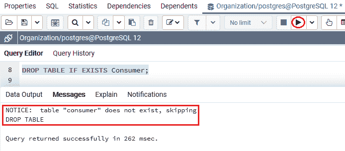

***【消费者】*** 表包含各种列，如**消费者 _id、名字、姓氏**、**手机 _ 号码**列，其中**消费者 _id** 为**主键**列。对于 **Mobile_number** 列，我们使用了**唯一约束**。

因此，PostgreSQL 将创建两个**唯一索引**，每列一个。

```

CREATE TABLE Consumer (
    consumer_id SERIAL PRIMARY KEY,
    first_name VARCHAR(255) NOT NULL,
    last_name VARCHAR(255) NOT NULL,
    Mobile_number VARCHAR(20) UNIQUE
);

```

**输出**

执行上述命令时，我们将获得以下消息: ***【消费者】*** 表已成功创建到**组织**数据库中。

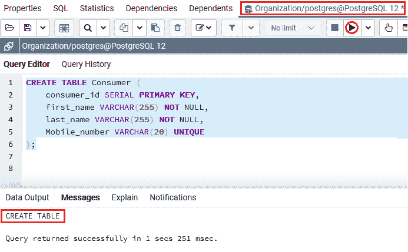

如果我们想要显示*表的索引，我们可以使用下面的命令:*

 *```

SELECT tablename, indexname, indexdef 
FROM pg_indexes 
WHERE tablename = 'consumer';

```

**输出**

执行上述命令后，我们将获得以下输出，该输出显示了 ***【消费者】*** 表中的所有索引详细信息。

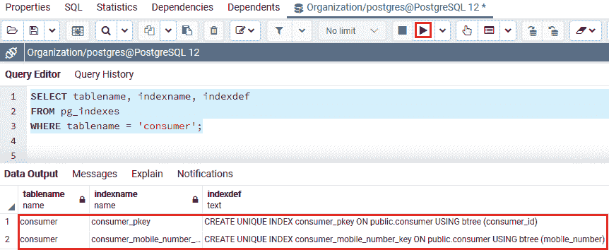

在 PostgreSQL 唯一索引部分，我们还将看到一个单列和多列索引的示例:

### 使用单列 PostgreSQL 唯一索引的示例

在下面的示例中，我们试图使用 [ALTER table 命令](https://www.javatpoint.com/postgresql-alter-table)向 ***【消费者】*** 表添加一个新列作为 **Email** 列，如下命令所示:

```

ALTER TABLE Consumer
ADD email VARCHAR(255);

```

**输出**

执行上述命令时，我们将获得以下消息:电子邮件列已成功添加到 ***【消费者】*** 表**中。**

**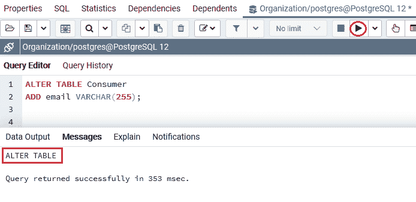

我们将为电子邮件列指定一个**唯一索引**，以确保**电子邮件**对于所有消费者都是不同的，如下命令所示:

```

CREATE UNIQUE INDEX idex_consumer_email
ON Consumer(email);

```

**输出**

执行上述命令后，我们将获得以下消息: **idex_consumer_email** 索引已成功创建。

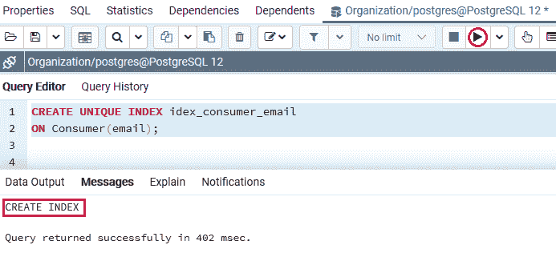

成功创建特定索引后，我们将按照以下步骤检查以下内容:

**步骤 1:插入新行**

首先，我们将在 **INSERT** 命令的帮助下，在 ***【消费者】*** 表中插入一个新行，如下命令所示:

```

INSERT INTO Consumer(first_name, last_name, mobile_number, email)
VALUES ('Mike','Ross', '(305)-444-5432','mike@javatpoint.com');

```

**输出**

执行上述命令后，我们将获得以下消息窗口，显示值已成功插入 ***【消费者】*** 表。

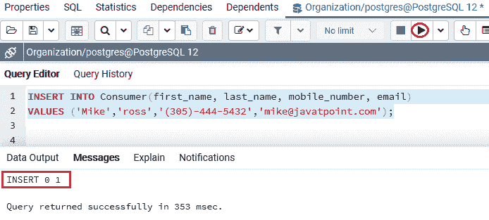

**步骤 2:插入另一个新行**

现在，我们将尝试插入另一行，其电子邮件 id 与 **[【电子邮件保护】](/cdn-cgi/l/email-protection) :** 相同

```

INSERT INTO Consumer(first_name, last_name, mobile_number, email)
VALUES ('Mike','Taylor','(305)-333-9876','mike@javatpoint.com');

```

**输出**

执行上述命令时，PostgreSQL 会因为**邮件 id** 的副本而引发错误，这意味着**重复的键值违反了唯一约束“idex _ consumer _ email”**，因为**密钥(email)=([【email protected】](/cdn-cgi/l/email-protection))已经存在。**

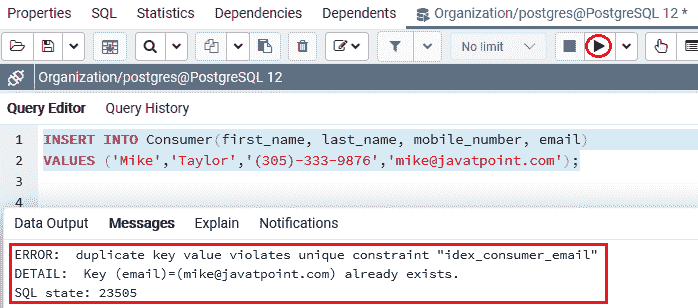

### 使用多列 PostgreSQL 唯一索引的示例

在下面的示例中，我们将在 ALTER table 命令的帮助下向 ***【消费者】*** 表中添加两个新列**地址和 work_address** 列，如下命令所示:

```

ALTER TABLE Consumer
ADD address VARCHAR(255),
ADD Work_address VARCHAR(200);

```

**输出**

执行上述命令后，我们会得到如下消息:**地址和 work_address** 。该栏目已成功添加到 ***消费者*** 表中。

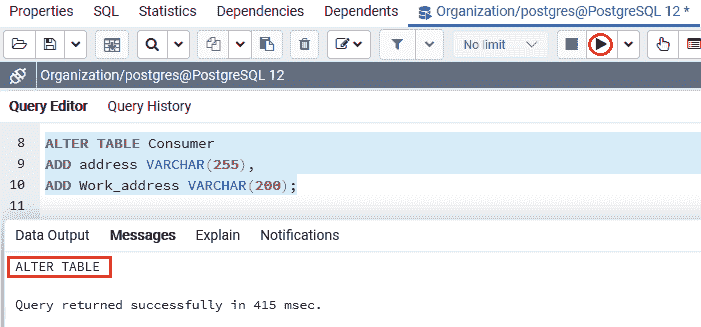

#### 注意:几个消费者可以有相似的工作地址，但不能有相似的地址，这里的地址是指家庭地址。

因此，在这种情况下，我们可以在**地址和 work_address** 列上指定一个 UNIQUE 索引，如下命令所示:

```

CREATE UNIQUE INDEX idex_consumer_address
ON Consumer(address, work_address);

```

**输出**

执行上述命令后，我们会得到如下消息:**idex _ consumer _ address****唯一索引**已经创建成功。

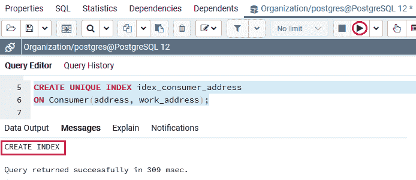

现在，我们将按照以下步骤测试索引的工作情况:

**步骤 1:插入新行**

首先，我们将在 **INSERT** 命令的帮助下，在 ***【消费者】*** 表中插入一个新行，如下命令所示:

```

INSERT INTO Consumer(first_name, last_name, address, work_address)
VALUES ('Olivia','Smith','Boston','Brookline');

```

**输出**

在执行上述命令时，我们将获得以下消息窗口，显示值已成功插入到 ***【消费者】*** 表中。


**步骤 2:插入另一个新行**

现在，我们将尝试插入另一行，该行具有相同的 **work_address** 和不同的 **address** ，如下命令所示:

```

INSERT INTO Consumer(first_name, last_name, address, work_address)
VALUES ('Olivia','Smith','Los Angeles','Brookline');

```

**输出**

执行上述命令后，我们将获得下面的消息窗口:由于**地址和 work_address** 列中的值的组合是唯一的，因此特定的值已经成功插入。

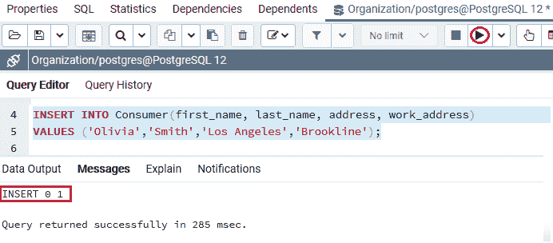

**步骤 3:再次插入另一个新行**

在这一步中，我们将插入另一个新行，该行对于已经存在于**消费者**表中的**地址**和**工作 _ 地址**列具有相似的值，如下命令所示:

```

INSERT INTO Consumer(first_name, last_name, address, work_address)
VALUES ('William','Smith','Los Angeles','Brookline');

```

**输出**

在执行上述命令时，PostgreSQL 将会引发一个错误，因为**地址和 work_address，**的副本意味着**重复的键值违反了唯一约束“idex _ consumer _ address”**，因为**键(地址，work_address)=(洛杉机，布鲁克林)已经存在。**

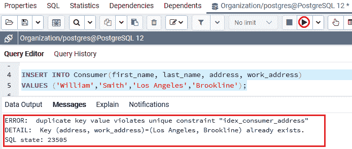

## 概观

在 **PostgreSQL 唯一索引**部分，我们学习了以下主题:

*   **PostgreSQL 唯一索引**用于确保一列或多列中数据值的唯一性。
*   **PostgreSQL 创建唯一索引命令**用于创建唯一索引，并附有一个示例。
*   我们也看到了使用**单列和多列** PostgreSQL UNIQUE 索引的例子。

* * ****