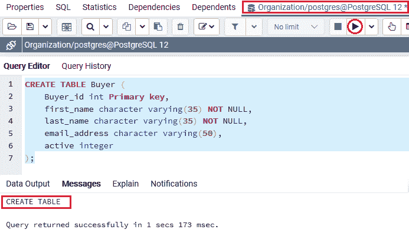
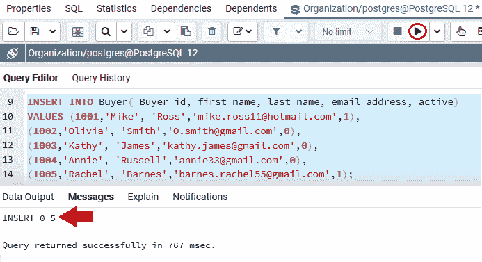
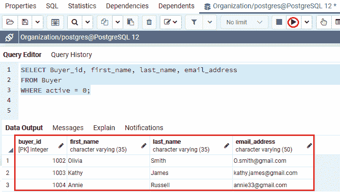
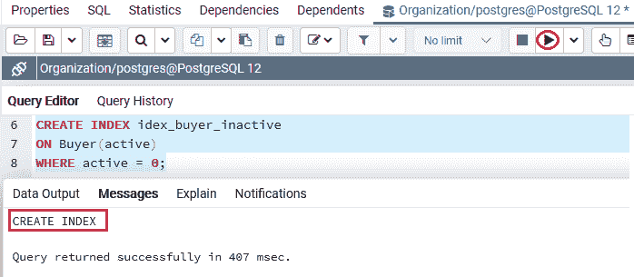
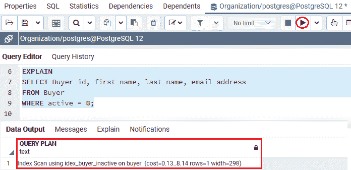

# PostgreSQL 部分索引

> 原文：<https://www.javatpoint.com/postgresql-partial-index>

在本节中，我们将了解 **PostgreSQL 分部索引**的工作原理，该索引用于通过减小索引大小来提高命令的性能。

## 什么是 PostgreSQL 部分索引？

到目前为止，我们已经理解了如何将不同列的值添加到索引中。**部分索引**是下一个命令，在 PostgreSQL 索引中使用。

它允许我们定义一个表的行，这些行可以被索引。因此，我们将使用部分索引来加快查询速度，同时减少索引的大小。

换句话说，我们可以说 **PostgreSQL 部分索引**是一个索引，它是在表的一个子部分上构造的。**部分索引**的谓词是条件表达式定义良好的子集。

并且只访问那些满足谓词的表行的索引。

假设我们使用了具有常量值的 WHERE 条件，那么在这种情况下，我们可以选择 **PostgreSQL 部分索引**，因为它非常有益。

#### 注意:如果列名包含常量值，那么我们可以使用下图:

```sql

SELECT * 
FROM table_name
WHERE column_name = constant_value;

```

### PostgreSQL 部分索引的语法

指定部分索引的语法如下:

```sql

CREATE INDEX index_name
ON table_name(column_list)
WHERE condition;

```

在上图中， [WHERE 子句](https://www.javatpoint.com/postgresql-where-clause)用于定义那些添加到索引中的行。

## PostgreSQL 部分索引示例

让我们看一个示例来理解 **PostgreSQL 部分索引**的工作原理。

我们将在 **CREATE** 命令的帮助下创建一个新表作为 ***买家*** ，并使用 [INSERT 命令](https://www.javatpoint.com/postgresql-insert)插入一些值。

要将 ***客户端*** 创建到**组织数据库**中，我们使用 **CREATE** 命令:

```sql

CREATE TABLE Buyer (
    Buyer_id int Primary key,
    first_name character varying(35) NOT NULL,
    last_name character varying(35) NOT NULL,
    email_address character varying(50),
   active integer
);

```

**输出**

执行上述命令后，我们会得到如下消息窗口，显示 ***【买家】*** 表已创建成功进入 ***组织*** 表。



成功创建 ***【买家】*** 表后，我们将在 **INSERT** 命令的帮助下输入一些值。

```sql

INSERT INTO Buyer( Buyer_id, first_name, last_name, email_address, active)
VALUES (1001,'Mike', 'Ross','mike.ross11@hotmail.com',1),
(1002,'Olivia', 'Smith','O.smith@gmail.com',0),
(1003,'Kathy', 'James','kathy.james@gmail.com',0),
(1004,'Annie', 'Russell','annie33@gmail.com',0),
(1005,'Rachel', 'Barnes','barnes.rachel55@gmail.com',1);

```

**输出**

执行上述命令后，我们将获得以下消息窗口，显示特定值已成功插入 ***【买家】*** 表。



通常，如果我们对不活跃的买家感兴趣，并经常做一些跟进，让他们回来购买更多的商品。

在下面的命令中，我们试图识别所有不活跃的买家:

```sql

SELECT Buyer_id, first_name, last_name, email_address
FROM Buyer
WHERE active = 0;

```

**输出**

成功执行上述命令后，我们会得到如下结果，显示**所有不活跃的**买家信息****:



在下面的命令中，我们使用 **EXPLAIN 关键字**来执行上面的命令，因为查询计划员需要扫描 ***【买家】*** 表:

```sql

EXPLAIN
SELECT Buyer_id, first_name, last_name, email_address
FROM Buyer
WHERE active = 0;

```

**输出**

执行上述命令后，我们将获得以下输出，显示**买方表的查询计划**。


在这里，我们还可以通过为**活动的**列创建索引来增强该命令，如下命令所示:

```sql

CREATE INDEX idex_buyer_active
ON Buyer(active);

```

**输出**

执行上述命令时，我们将获得以下消息:索引 **idex_buyer_active** 已成功创建


上面创建的索引满足了它的目的，但它也包含了几行，这些行从未被搜索过，特别是所有的活跃买家。

在下面的命令中，我们指定了索引，它只包括不活跃的购买者:

```sql

CREATE INDEX idex_buyer_inactive
ON Buyer(active)
WHERE active = 0;

```

**输出**

执行上述命令后，我们将获得以下消息: **idex_buyer_inactive** 索引已成功创建。



因此，当命令中出现 **WHERE 子句**时， [PostgreSQL](https://www.javatpoint.com/postgresql-tutorial) 将使用部分索引，如下命令所示:

```sql

EXPLAIN
SELECT Buyer_id, first_name, last_name, email_address
FROM Buyer
WHERE active = 0;

```

**输出**

在执行上述命令时，我们将获得以下消息，该消息显示了当 PostgreSQL 优化器使用 **idex_buyer_inactive** 索引时买方表的查询计划。



### 概观

在 **PostgreSQL 部分索引**部分，我们已经了解了 PostgreSQL 部分索引的工作原理，以及如何定义添加到索引中的行。

* * *