# PostgreSQL 约束

> 原文：<https://www.javatpoint.com/postgresql-constraints>

约束用于描述表中数据列的规则。如果约束和数据操作之间存在任何破坏，该操作将立即终止。这些约束保证了数据库中数据的可靠性和正确性。

在本节中，我们将讨论所有的 **PostgreSQL 约束**。

约束可进一步分为**列级或表级**，其中**表级**约束用于**整表**，而**列级**约束仅用于**一列**。

### 我们在哪里使用约束？

这些约束最常用于以下领域:

*   一旦它被创建，它就可以被添加到一个表中，我们也可以暂时禁用它。
*   对于单个列，我们可以使用列约束。
*   当我们借助**创建表**命令创建表时，我们也可以声明约束
*   SQL 可以丢弃任何中断定义良好的标准的值。
*   所有与约束相关的信息都保存在数据字典中。
*   对于一列或多列，我们可以使用表约束。
*   所有约束都被分配了一个名称。

## 后置 SQL 约束的类型

让我们看看 [PostgreSQL](https://www.javatpoint.com/postgresql-tutorial) 中最常用的约束:

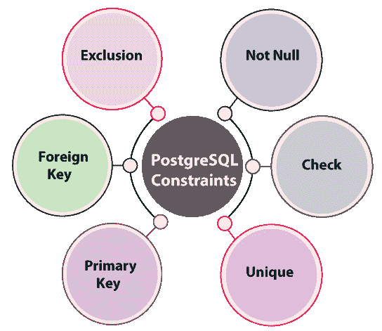

| 限制 | 描述 |
| **[不为空](postgresql-not-null-constraint)** | 这种类型的约束用于确保列不能有空值。并且不能进一步定义任何名称来生成非空约束。 |
| **[勾选](postgresql-check-constraint)** | 它用于确保表的列或字段中的所有值都满足特定情况，例如它必须匹配布尔表达式。检查约束可以由单独的名称定义。 |
| **[独特](postgresql-unique-constraint)** | 唯一约束用于确保表的一列中的所有值都是排他的。 |
| **[主键](postgresql-primary-key)** | 主键是唯一指定数据库表中的每一行或每一条记录，并确保特定表中没有重复的记录。 |
| **[外键](postgresql-foreign-key)** | 在 PostgreSQL 中，外键用于定义一个表的列或字段中的值等于另一个表的主键的实际值。 |
| **排除** | 此约束用于确保在定义的运算符的帮助下，任何两行都链接到精确的列或语句上，并且这些运算符评估中的一个应该返回 **Null 或 False。** |

## 非空约束

在非空约束中，默认情况下，一列可以保存**空值**。如果我们不希望一个列有空值，那么我们需要解释对这个列的约束，说明空值现在对于那个特定的列是不可接受的。它总是被创建为一个**列约束**，并且它表示未知数据，但这并不意味着数据为空。

**例如**

在下面的例子中，我们正在创建一个名为**客户**的新表，该表有五列，如**客户标识、客户名称、客户地址、客户年龄和客户工资**。

```

CREATE TABLE Customer(
Cust_Id INT PRIMARY KEY NOT NULL,
Cust_Name TEXT NOT NULL, 
Cust_Address CHAR(50),
Cust_Age INT NOT NULL,
Cust_Salary REAL
);

```

### PgAdmin4 中的 SQL 查询

在下面的截图中，我们可以在 pgAdmin4 中看到上面的查询:

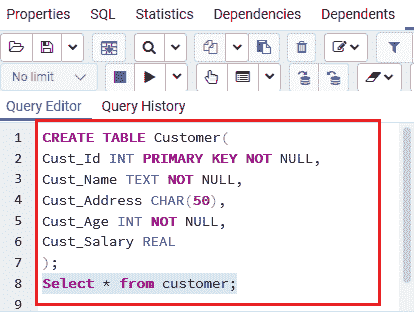

### 说明

上面的例子显示了已经创建的表**客户**，其中**客户标识、客户名称和客户年龄**列被指定不接受**空值**值。

### 表格结构

执行**选择命令**后，我们可以看到**客户**表的表结构。

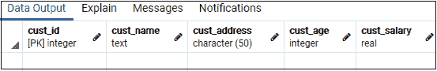

## 检查约束

在 PostgreSQL 中，Check 约束可以由单独的名称定义。它用于控制要插入的列的值。它允许我们验证值被存储到记录中的条件。如果语句为 false，则数据会破坏约束，并且不会保存到表中。

**例如**

在下面的示例中，我们正在创建一个名为 **Customer2** 的新表，该表包含**五列**。

```

CREATE TABLE Customer2(
Cust_Id INT PRIMARY KEY NOT NULL,
Cust_Name TEXT NOT NULL, 
Cust_Address CHAR(30),
Cust_Age INT NOT NULL,
Cust_Salary REAL check (Cust_Salary>0)
);

```

### PgAdmin4 中的 SQL 查询

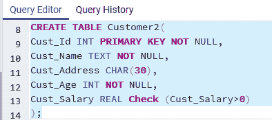

### 说明

在上面的例子中，我们在表**客户 2** 中添加了一个带有**客户薪资**列的 **CHECK** ，其中**客户薪资**列不能包含任何小于或等于**零(0)** 的值。

### 表格结构

执行**选择命令**后，我们可以看到**客户 2** 表的表结构。

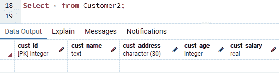

## 唯一约束

**唯一约束**用于维护我们存储到表的字段或列中的值的个性。它与一组列约束或列约束和表约束兼容。

当我们使用**唯一约束**时，一个或多个列上的索引会自动生成。如果我们将两个不同的空值添加到不同行的一列中，但它不会中断 **UNIQUE** 约束的规范。

**例如**

在下面的示例中，我们正在创建一个名为 **Customer3** 的新表，它具有与我们在上面的表中创建的相似的五列。

```

CREATE TABLE Customer3(
Cust_Id INT PRIMARY KEY NOT NULL,
Cust_Name TEXT NOT NULL, 
Cust_Address CHAR(30),
Cust_Age INT NOT NULL Unique,
Cust_Salary REAL default 20000.00
);

```

### PgAdmin4 中的 SQL 查询

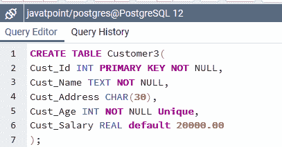

### 说明

上面的例子中， **Cust_Age** 列被设置为**UNIQUE；**因此，我们可以避免两个或两个以上的人有相同的年龄。

### 表格结构

执行**选择命令**后，我们可以看到**客户 3** 表的表结构。

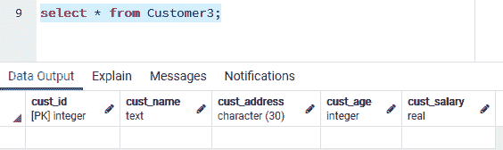

## 主键约束

它是表中的一个字段，单独标识数据库表中的每一行或记录，并且包含唯一的值。主键不包含任何空值。为此，我们也可以说**主键**是一个表的**唯一**和**非空约束**的集合。

它用于区别地识别数据库表中的每条记录。这里我们可以包含更多的唯一列，但是我们在数据库表中只有一个主键，并且包含单个或多个字段。这是创建数据库表时最关键的一个键，它可以是一个唯一的标识。它可以表示一列或一组列。

主键的工作类似于**唯一的**约束。尽管如此，它们之间的显著区别是一个表只能有一个**主键**；但是，该表可以有一个或多个**唯一的**和**非空的**约束。

**例**

在下面的示例中，我们正在创建一个名为**员工**的新表，该表包含**四列**，如 **Emp_Id、Emp_ Name、Emp_Address 和 Emp_Age** 。

```

CREATE TABLE Employee(
Emp_Id INT PRIMARY KEY NOT NULL,
Emp_Name TEXT NOT NULL, 
Emp_Address CHAR(30),
Emp_Age INT NOT NULL
);

```

### PgAdmin4 中的 SQL 查询

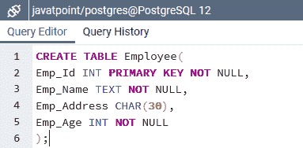

### 说明

上面的例子**雇员**表是用一个**主键作为 Emp_Id** 列创建的，该列唯一地表示了**雇员 id** 。

### 表格结构

执行**选择命令**后，我们可以看到**员工**表的表结构。

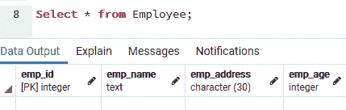

## 外键约束

它是一组列，这些列的值依赖于另一个表的主键优势。它用于使一列或一组列中的值必须显示在另一个表的同一列或列组合中。

在 PostgreSQL 中，外键的值与另一个表中主键的实际值平行；这就是为什么它也被称为**参照完整性约束**。

**例如**

在下面的示例中，我们正在创建一个名为 **Employee1** 的新表，该表包含与上一个表相似的四列。

```

CREATE TABLE Employee1(
Emp_Id INT PRIMARY KEY NOT NULL,
Emp_Name TEXT NOT NULL, 
Emp_Address CHAR(30),
Emp_Age INT NOT NULL
);

```

在这个特殊的例子中，我们将再创建一个名为 **cust** 的表，它包含三个**列**。并且，这里我们创建一个**外键**作为 **Cust_Id** 列，它引用**员工 1** 表的 **Emp_ID** 字段。

```

CREATE TABLE cust(
Emp_Id INT PRIMARY KEY NOT NULL,
Cust CHAR(50) NOT NULL,
Cust_Id INT references Employee1(Emp_Id)
);

```

### PgAdmin4 中的 SQL 查询

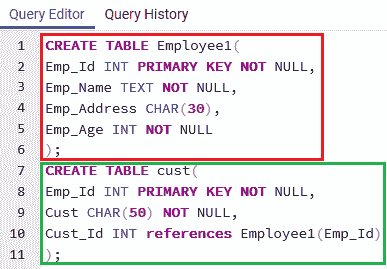

### 表格结构

这里可以看到 **Cust** 表的表结构，是对**员工 1** 表的引用。

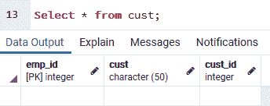

## 排除约束

它用于确保使用定义的运算符在指定的列或语句上链接任意两行。在任何情况下，这些运算符中的一个将返回 null 或 false。

**例如**

在下面的例子中，我们正在创建一个名为**员工**的新表，它包含五列。这里，我们也将使用**排除**约束。

```

CREATE TABLE Employee3(
Emp_Id INT PRIMARY KEY  NOT NULL,
Emp_Name  TEXT,
Emp_Address CHAR(50),
Emp_Age INT,
Emp_SALARY REAL,
EXCLUDE USING gist (Emp_Name WITH =,Emp_Age WITH <>)
);

```

现在，对于**排除**约束，我们将使用**使用要点**，这是索引，用于创建和实现。

#### 注意:如果我们使用排除约束，我们必须运行创建扩展

**btree_gist** 命令，在数据库中一次。之后，它将连接定义基本标量数据类型约束的 **btree_gist 扩展**。

```

CREATE EXTENSION btree_gist;

```

现在，我们将在 **Employee3** 表中插入一些记录，并且我们还强加了类似的年龄。

前两个**插入命令**将成功执行。

```

INSERT INTO Employee3 VALUES(101, 'john','Newyork',22, 30000.00 );
INSERT INTO Employee3 VALUES(102, 'john','Florida',22, 30000.00 );

```

记录被添加到**员工 3** 表中，如下图所示:

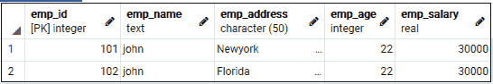

但是对于**第三次插入**命令，我们可能会遇到以下错误:

```

INSERT INTO Employee3 VALUES(103, 'john', 'Newyork', 32, 30000.00 );
ERROR: conflicting key value violates exclusion constraint "employee2_emp_name_emp_age_excl" DETAIL: Key (emp_name, emp_age)=(john, 32) conflicts with existing key (emp_name, emp_age)=(john, 22).

```

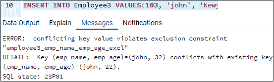

### PgAdmin4 中的 SQL 查询

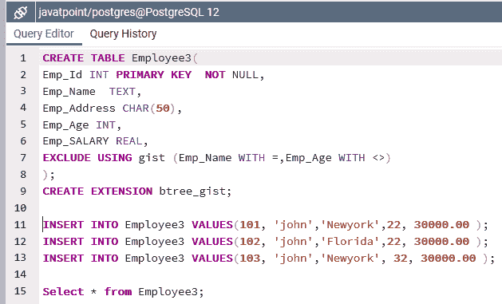

### 删除约束

如果我们想删除一个约束，那么我们应该记住约束的名称，因为我们更容易直接按名称删除约束。否则，我们将要求识别系统生成的名称。

在 **psql** 中，可以使用以下命令找出名称。

```

\d table name

```

**删除约束**的语法如下:

```

ALTER TABLE table_name DROP CONSTRAINT some_name;

```

* * *