# PostgreSQL 外键

> 原文：<https://www.javatpoint.com/postgresql-foreign-key>

在本节中，我们将了解 **PostgreSQL 外键、******PostgreSQL 外键、**示例**如何使用外键约束将 PostgreSQL 外键添加到表中。

## 什么是 PostgreSQL 外键/外键约束？

一个**外键**是一组列，其值依赖于[主键](postgresql-primary-key)从另一个表中获益。它用于将一列或一组列中的值显示在另一个表的同一列或列组合中。

**外键**也称为**引用键**，它匹配另一个表的主键字段，这意味着一个表中的外键字段引用另一个表的主键字段。

在 [PostgreSQL](https://www.javatpoint.com/postgresql-tutorial) 中，**外键的**值与另一个表中主键的实际值平行；这就是为什么它也被称为**参照完整性约束**。

**PostgreSQL 外键约束**指定了**子表**中一组列或一列中的值，相当于**父表**中一组列或一列中的值。

换句话说，我们可以说外键使得与表生成**父子关系**成为可能。

在父子关系中，**父表**保留**初始列值**，而**子表的列值**引用父列值。

#### 注意:一个 PostgreSQL 表可以有各种外键，这取决于它与其他表的连接。PostgreSQL 允许我们使用外键约束来描述外键。

## 如何在 PostgreSQL 中创建外键

在 PostgreSQL 中，我们可以借助以下命令创建一个外键:

*   **创建表格命令**
*   **更改表格命令**

#### 注意:在 PostgreSQL 中，ALTER TABLE 命令用于添加或删除主键。

现在，我们正在详细讨论每一个。

### 使用创建表命令创建外键

在 CREATE TABLE 命令的帮助下，我们可以在 PostgreSQL 中创建一个外键。

**创建外键的语法**

下图用于使用 PostgreSQL 中的 [**创建表**命令定义外键:](https://www.javatpoint.com/postgresql-create-table)

```

[CONSTRAINT constraint_name]  
FOREIGN KEY [foreign_key_name] (column_name, ...)  
REFERENCES parent_table_name (column_name,...)  
[ON DELETE referenceOption]  
[ON UPDATE referenceOption]

```

在上面的语法中，我们使用了下表中讨论的以下参数:

**参数说明**

| 参数名 | 描述 |
| **约束 _ 名称** | 

*   **Constraint Name** parameter is used to define **foreign key constraint**
*   If we don't specify a constraint name, PostgreSQL will automatically create the constraint name.

 |
| **列名** | 

*   Used to specify the column name of the foreign key we want to create.
*   It should be written in brackets after the keyword of **foreign key** .

 |
| **父表** | 

*   **The parent table** parameter defines the name of the parent table, followed by the column name that references the foreign key column.

 |
| **参考 _ 选项** | 

*   Used to define the delete and update actions on
**上的更新动作*   It also uses the clause (delete on and update on) between **parent table and** child table to verify whether the foreign key maintains referential integrity.**

 |

在 PostgreSQL 中，我们有**五个**不同的引用选项，如下所示:

*   **设置默认值**
*   **置空**
*   **CASCADE**
*   **无动作**
*   **限制**

让我们在下表中逐一查看五个不同参考选项的简要介绍:

| 参考选项 | 说明 |
| **设置默认值** | 

*   一种数据库系统解析器识别**设置默认值**

 **InnoDB 和 NDB** 

 |
| **置空** | 

*   **Set the null value** as the reference option. After we select from **parent table**
*   Used when deleting or modifying any rows in. The value of the foreign key column in the child table is set to **null value** .

 |
| **CASCADE** | 

*   If we want to delete or modify any row from the parent table of **and** , then we will use **to cascade**
*   The value of the corresponding row in the sub **table will be deleted or updated repeatedly.**

 |
| **限制** | 

*   **Restriction action** is used when we remove or modify any row from the parent table, which has similar rows in the reference ( **child table** ).

 |
| **无动作** | 

*   **No action** Reference action and **restriction**
*   Similar, but there is one difference, that is, after we try to update the specific table, we verify the referential integrity of .

 |

### 使用创建命令的 PostgreSQL 外键示例

为了理解 **PostgreSQL 外键的工作方式，**我们将看到下面的例子，它描述了外键在 PostgreSQL 中是如何使用的。

在下面的命令中，我们将使用 **CREATE** 命令的帮助和**使用 [**INSERT** 命令](https://www.javatpoint.com/postgresql-insert)插入**一些值来创建两个表作为**员工**和**部门**。

要将**员工**创建到 **Javatpoint 数据库**中，我们将使用 **CREATE** 命令。

在创建**员工**表之前，如果 **Javatpoint** 数据库中存在类似的表，我们将使用 [**DROP TABLE** 命令](https://www.javatpoint.com/postgresql-drop-table)。

```

DROP TABLE IF EXISTS Employee;

```

**输出**

执行上述命令后，我们会得到如下窗口消息，显示 ***员工*** 表已成功下架。

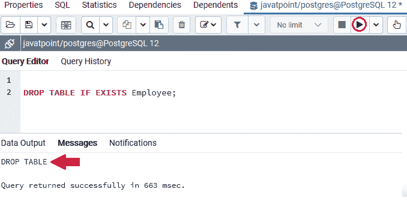

一旦先前创建的 ***【员工】*** 表被删除，我们将创建一个新的 ***【员工】*** 表，该表包含**员工 _id、员工 _ 姓名**列等各种列。

在这种情况下，**员工 _id** 列是**生成的始终作为身份约束**。

```

CREATE TABLE Employee(
   Employee_id INT GENERATED ALWAYS AS IDENTITY,
   Employee_name VARCHAR(50) NOT NULL,
   PRIMARY KEY(Employee_id)
);

```

**输出**

在执行上述命令时，我们将获得以下消息:*员工表已成功创建到 **Javatpoint** 数据库中。*

*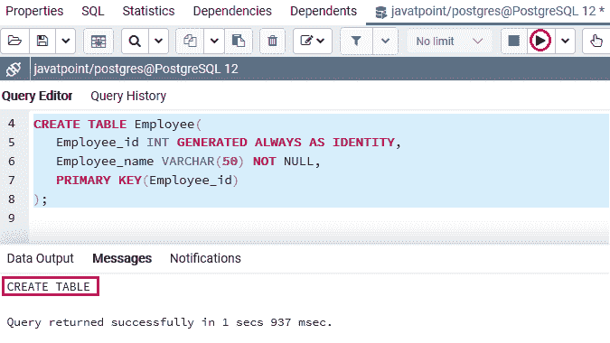

在创建了**员工**表之后，我们将在 **CREATE** 命令的帮助下，创建**我们的第二个表**，它被命名为 ***部门*** 表，进入 **Javatpoint 数据库**。

在创建**部门**表之前，我们将使用 **DROP TABLE** 命令来确保在 **Javatpoint** 数据库中不存在类似的表。

```

DROP TABLE IF EXISTS Department;

```

**输出**

执行上述命令后，我们会得到如下窗口消息: ***部门*** 已成功从 **Javatpoint** 数据库中删除。

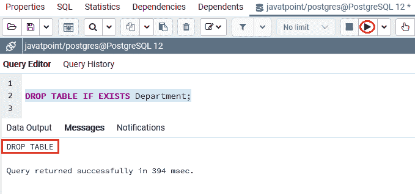

一旦 ***部门*** 表被删除，我们将创建一个新的 ***部门*** 表，其中包含**部门 _id、部门 _ 名称等各种列。**

```

CREATE TABLE Department(
Department_id INT GENERATED ALWAYS AS IDENTITY,
Employee_id INT,
Department_name VARCHAR(200) NOT NULL,
PRIMARY KEY(Department_id),
CONSTRAINT fk_Employee
FOREIGN KEY(Employee_id) 
REFERENCES Employee(Employee_id)
);

```

**输出**

在执行上述命令时，我们将获得以下消息: ***部门*** 表已成功创建到 **Javatpoint** 数据库中。

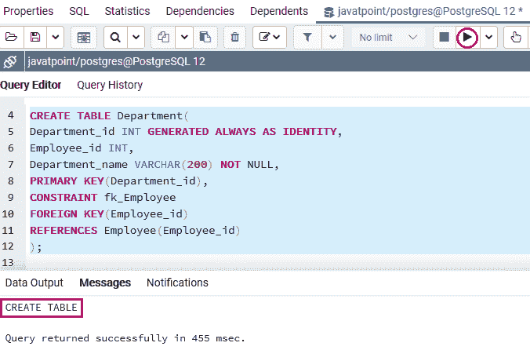

在上面的例子中， ***员工*** 表是**父表，**和 ***部门*** 表是**子表**。每个**员工**有零个或多个**部门，**每个**部门**属于零个或一个**员工。**

***部门*** 表中的 **Employee_id** 列是**外键列**，引用了 ***Employee*** 表中同名的主键列。

在下面的语句中， ***部门*** 表中的外键约束 **fk_Employee** 将 **Employee_id** 指定为外键:

```

CONSTRAINT fk_Employee
FOREIGN KEY(Employee_id) 
REFERENCES Employee(Employee_id)

```

**无动作**是默认选项，因为**外键约束**没有**打开删除**和**打开更新动作**。

### 无动作

我们将使用 **INSERT** 命令对 **NO ACTION** 选项的帮助，在( ***员工和部门*** )表中插入一些记录。

```

INSERT INTO Employee(Employee_name)
VALUES('John Smith'),
('Michael Brown');

```

**输出**

执行上述命令后，我们会得到如下消息窗口，显示**两个值**已经成功插入到**T3【员工】T4**表中。

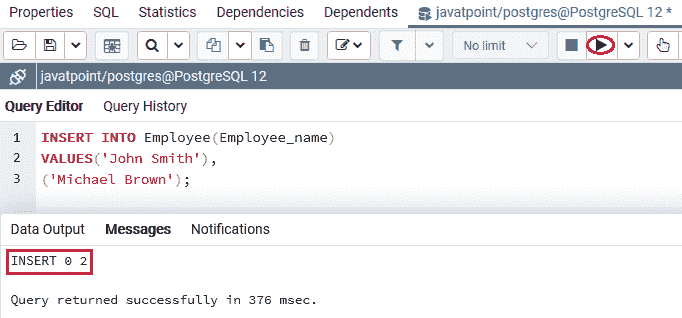

在**员工**表中插入数值后，我们将使用**插入**命令将一些记录输入到 ***部门*** 表中，如下命令所示:

```

INSERT INTO Department(Employee_id, Department_name)
VALUES(1,'Accounting'),
(1,'Accounting'),
(2,'Human Resource'),
(2, 'Human Resource-1');

```

**输出**

执行以上命令后，我们会得到如下消息窗口，显示**四行**已经插入到 ***部门*** 表中。

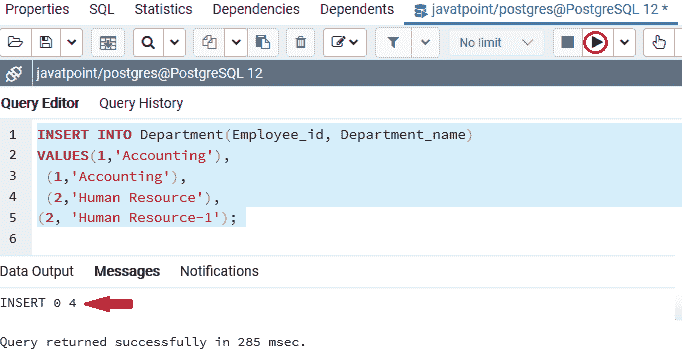

在下面的命令中，我们使用 **DELETE** 命令从 ***员工*** 表中删除**员工 id 1** 。

```

DELETE FROM Employee
WHERE Employee_id = 1;

```

**输出**

执行上述命令后，PostgreSQL 发出以下错误，因为 **ON DELETE NO ACTION:**

```

Error: update or delete on table "employee" violates foreign key constraint "fk_employee" on table "department".
DETAIL: Key (employee_id)=(1) is still referenced from table "department".
SQL state: 23503

```

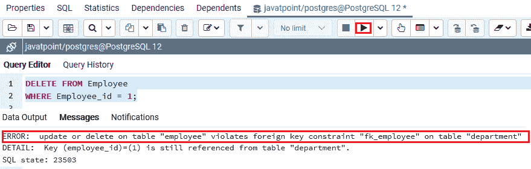

换句话说，我们可以说 PostgreSQL 发布了一个约束违规，因为**员工 id=1** 的引用行仍然存在于 ***部门*** 表中。

### 限制

**限制**动作类似于**无动作**。唯一的区别是当我们使用**初始延迟或初始立即**模式将**外键约束**指定为**可延迟**时。

### 设置零

了解**无动作和限制**选项的工作后，我们将了解**用外键设置空**动作的工作。

在下面的命令中，我们将创建两个名为*和 ***扇区的新表。****

 *但是，首先，如果在 **Javatpoint** 数据库中已经存在类似的表，我们将使用 **DROP TABLE** 命令。

然后，我们将使用外键**创建那些**表，这些表在 **ON DELETE** 子句中具有**置空**动作:

**放下桌子**

```

DROP TABLE IF EXISTS Staff;

```

**输出**

执行上述命令后，我们会得到如下窗口消息: ***五线谱*** 表不存在。

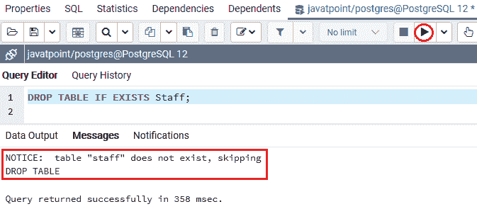

现在，我们将在 **DROP table** 命令的帮助下放下 ***扇区*** 表。

```

DROP TABLE IF EXISTS Sector;

```

**输出**

执行上述命令后，我们会得到如下消息窗口: ***扇区*** 表已经不存在了。

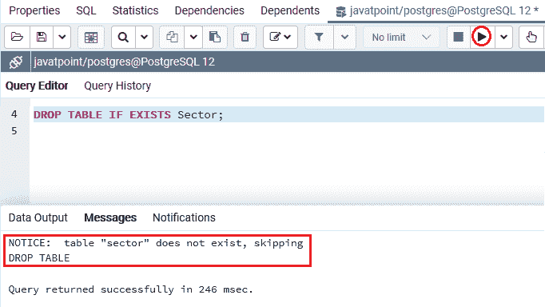

**使用 ON DELETE 子句中的 SET NULL 选项创建表**

```

CREATE TABLE Staff(
   Staff_id INT GENERATED ALWAYS AS IDENTITY,
   Staff_name VARCHAR(50) NOT NULL,
   PRIMARY KEY(Staff_id)
);

```

**输出**

执行上述命令后，已经创建了 ***【人员】*** 表，如下图所示:

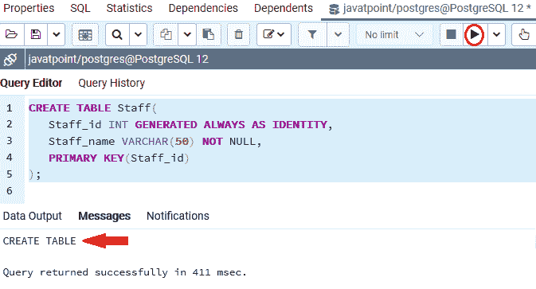

一旦 ***五线谱*** 表创建成功，我们将使用 **CREATE** 命令创建 ***扇形*** 表，并使用**在 **ON DELETE** 子句中设置 NULL** 动作:

```

CREATE TABLE Sector(
Sector_id INT GENERATED ALWAYS AS IDENTITY,
Staff_id INT,
Sector_name VARCHAR(200) NOT NULL,
PRIMARY KEY(Sector_id),
CONSTRAINT fk_Staff
FOREIGN KEY(Staff_id) 
REFERENCES Staff(Staff_id)
ON DELETE SET NULL
);

```

**输出**

执行上述命令后，我们将获得如下消息窗口，显示*扇区表已成功创建到 **Javatpoint** 数据库中。*

*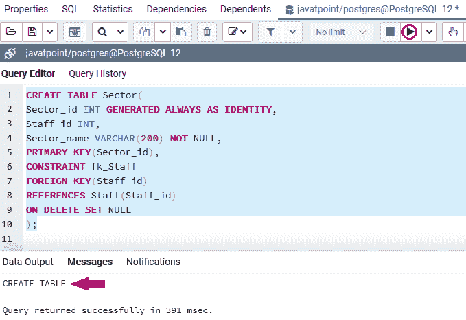

一旦我们成功创建了 ***五线谱*** 和 ***扇形*** 表，我们将使用 **INSERT** 命令向其中插入一些值。

```

INSERT INTO Staff(Staff_name)
VALUES('Sophia Smith'),
('Jessica Williams'),
('Victoria Lopez');

```

**输出**

执行上述命令后，我们会得到下面的消息窗口，显示**三个值**已经成功插入到 ***五线谱*** 表中。

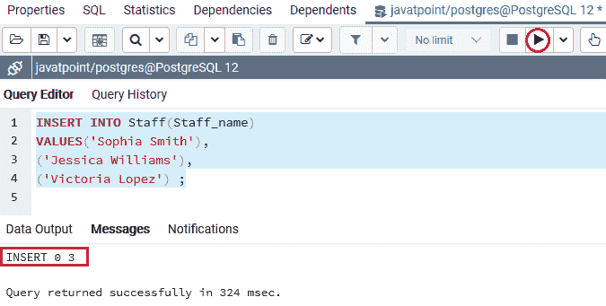

在 ***五线谱*** 表中插入数值后，在 INSERT 命令的帮助下，我们会在 ***扇区*** 表中输入一些记录，如下图所示:

```

INSERT INTO Sector(Staff_id, Sector_name)
VALUES(1,'Nursing'),
(1,'Nursing'),
(2,'Medication'),
(2, 'Medication'),
(3,'Accounting');

```

**输出**

在执行上述命令时，我们将获得下面的消息窗口，该窗口显示**五个**行已经插入到 ***扇区*** 表中。

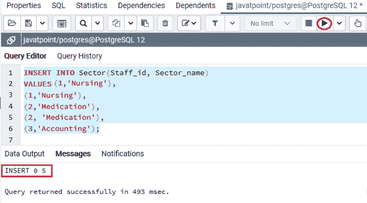

在成功地将行插入到两个表中之后，我们将看到**设置空值**是如何工作的。

为此，我们使用 **DELETE** 命令从 ***五线谱*** 表格中删除**五线谱 _id=2** ，如下所示:

```

DELETE FROM Staff
WHERE Staff_id = 2;

```

**输出**

执行上述命令后，我们将获得以下消息窗口，显示特定的 **Staff_id** 已被成功删除。

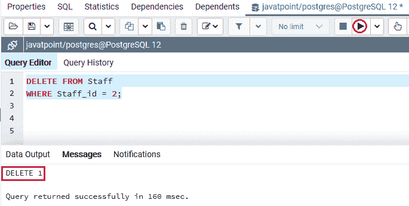

**子(扇区)表**中的参考行被设置为**空值**，因为**的“删除”操作设置为空值**。

在下面的命令中，我们将使用 **SELECT** 命令查看 ***扇区*** 表中的数据:

```

SELECT * FROM Sector;

```

**输出**

执行上述 **SELECT** 命令后，我们将得到如下输出，显示由于 **ON UPDATE SET NULL** 动作，在**T5【扇区】** 表中带有 **Staff_id=2** 的行自动设置为 **NULL** 。

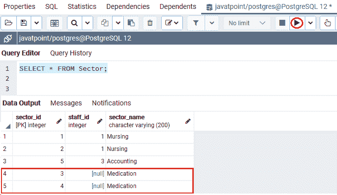

### 设置默认值

**ON DELETE SET DEFAULT** 用于从**父表**中删除被引用行时，将标准值设置到**子表**中引用行的外键列。

### 串联

当**父表(员工)**中的被引用行被删除时，【删除级联】上的**选项会自动删除**子表(部门)**中的所有引用行。**

#### 注意:在 PostgreSQL 外键中，我们将最常用 ON DELETE CASCADE 选项。

让我们看一个例子来理解 **CASCADE** 选项如何与**外键一起工作。**

在下面的命令中，我们将重新创建 ***员工和*** 部门表。

在以下示例中，我们将删除示例表 ***(员工和部门)*** ，并使用外键重新创建它们，外键使用 **ON DELETE** 子句中的 **CASCADE** 动作:

**放下桌子**

```

DROP TABLE IF EXISTS Employee;

```

**输出**

执行上述命令后，我们会得到如下消息窗口: ***员工*** 表已被成功删除。

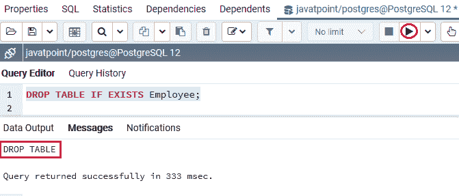

一旦 ***员工*** 表被删除，我们将在 **DROP** 表命令的帮助下删除 ***部门*** 表。

```

DROP TABLE IF EXISTS Department;

```

**输出**

执行上述命令后，我们会得到如下消息窗口: ***部门*** 表已被成功删除。

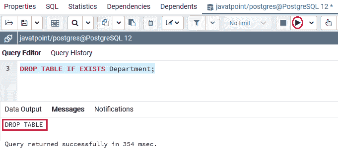

### 重新创建表格

一旦两个表都被成功删除，我们将使用外键重新创建这些表，外键使用 **ON DELETE** 子句中的 **CASCADE** 动作。但是， **fk_emloyee** 的删除动作变为 **CASCADE** :

现在，我们将使用 CREATE table 命令重新创建 ***员工*** 表，如下命令所示:

```

CREATE TABLE Employee(
   Employee_id INT GENERATED ALWAYS AS IDENTITY,
   Employee_name VARCHAR(50) NOT NULL,
   PRIMARY KEY(Employee_id)
);

```

**输出**

执行上述命令后，我们将获得以下消息:*员工表已成功重新创建到 **Javatpoint** 数据库中。*

*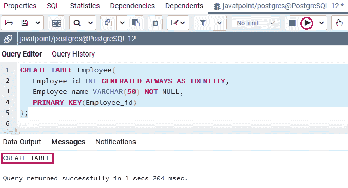

在创建了 ***雇员*** 表之后，我们将在 **CREATE** 命令的帮助下创建我们的第二个表，即 ***部门*** 表，并将其放入 **Javatpoint 数据库**中。

```

CREATE TABLE Department(
Department_id INT GENERATED ALWAYS AS IDENTITY,
Employee_id INT,
Department_name VARCHAR(200) NOT NULL,
PRIMARY KEY(Department_id),
CONSTRAINT fk_Employee
FOREIGN KEY(Employee_id) 
REFERENCES Employee(Employee_id)
ON DELETE CASCADE
);

```

**输出**

执行上述命令时，我们将获得以下消息: ***部门*** 表已成功重新创建到 **Javatpoint** 数据库中。

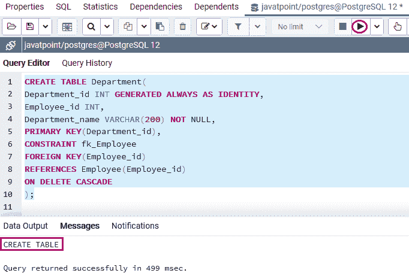

在重新创建了 ***【员工】*** 和 ***部门*** 表之后，我们将使用 **INSERT** 命令在两个表中插入少量记录。

```

INSERT INTO Employee(Employee_name)
VALUES('John Smith'),
('Michael Brown');

```

**输出**

我们会得到如下消息窗口，显示执行上述命令后**两个值**已经成功插入到 ***员工*** 表中。

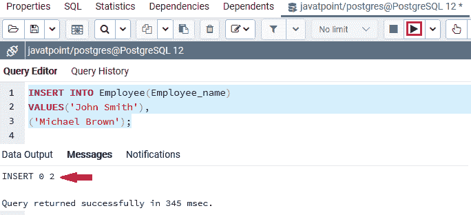

在**员工**表中插入数值后，我们将使用**插入**命令将一些记录输入到 ***部门*** 表中，如下命令所示:

```

INSERT INTO Department(Employee_id, Department_name)
VALUES(1,'Accounting'),
(1,'Accounting'),
(2,'Human Resource'),
(2, 'Human Resource');

```

**输出**

执行以上命令后，我们会得到如下消息窗口，显示**四行**已经插入到 ***部门*** 表中。

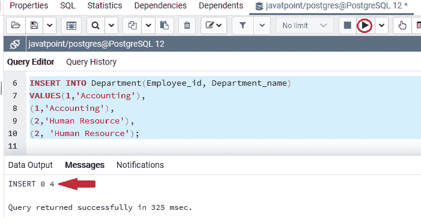

在**重新创建并重新插入**值到两个表中后，我们将使用**删除**命令。

在下面的例子中，我们将从 ***员工*** 表中删除**员工 _id=2** 。

```

DELETE FROM Employee
WHERE Employee_id = 2;

```

**输出**

在执行上述命令时，我们将获得下面的消息窗口，该窗口显示特定的 **employee_id** 值已从 ***Employee*** 表中成功删除。

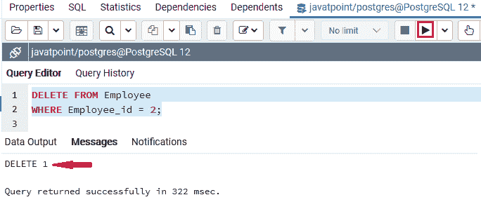

*表中的所有引用行都会自动删除，因为我们已经使用了*表中的 **ON DELETE CASCADE** 动作。**

 **换句话说，我们可以说如果从*表中删除员工记录，那么 ***部门*** 表中的相关记录已经被自动删除。*

 *为了检查上面的 **ON DELETE CASCADE** 动作工作是否正常，我们将使用 SELECT 命令，如下面的语句所示:

```

SELECT * FROM Department;

```

**输出**

执行上述命令后，我们将获得以下输出:

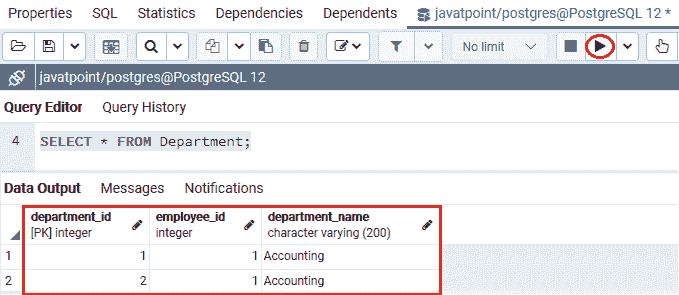

如果我们将带有 **ON DELETE CASCADE** 选项的外键约束添加到现有表中，我们将需要遵循以下步骤:

**第一步**

首先，我们将使用下图删除现有的外键约束:

```

ALTER TABLE child_table
DROP CONSTRAINT constraint_fkey;

```

**第二步**

之后，我们将借助以下语法添加一个带有 **ON DELETE CASCADE** 动作的新外键约束:

```

ALTER TABLE child_table
ADD CONSTRAINT constraint_fk
FOREIGN KEY (fk_columns)
REFERENCES parent_table(parent_key_columns)
ON DELETE CASCADE;

```

### 使用 ALTER TABLE 命令创建外键

我们可以在 PostgreSQL 中通过 **ALTER TABLE** 命令的帮助生成一个外键。

[**【更改表格】**命令](https://www.javatpoint.com/postgresql-alter-table)用于对现有表格进行更改。偶尔，我们也可以向当前表列添加一个外键。

**使用 ALTER table 语句创建外键的语法**

在现有表中添加外键的 **ALTER TABLE** 语句的下图:

```

ALTER TABLE child_table 
ADD CONSTRAINT [constraint_name] 
FOREIGN KEY (fk_columns) 
REFERENCES parent_table (parent_key_columns);

```

#### 注意:如果我们想使用 ALTER TABLE 命令添加外键，建议在外键引用的不同列上创建索引。

### 使用 ALTER TABLE 命令的 PostgreSQL 外键示例

为了理解 **PostgreSQL 外键的工作原理，**我们将看到下面的例子，它描述了如何在 PostgreSQL 中通过 ALTER table 命令添加外键。

在下面的例子中，我们在 **Javatpoint** 数据库中创建了两个名为 ***Clients*** 和 ***Company*** 的新表，该表描述中不包含**外键列**。

要创建 ***客户和公司*** 表，我们将使用 **CREATE** 表命令，如下语句所示:

```

CREATE TABLE Clients (  
Client_ID INT NOT NULL,  
Client_Name varchar(55) NOT NULL,  
Client_location varchar(55) NOT NULL,  
PRIMARY KEY (Client_ID)  
);  

```

**输出**

执行以上命令后，我们会得到下面的消息窗口； ***客户端*** 表已成功创建到 ***Javatpoint*** 数据库中。

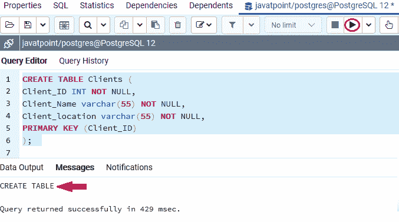

一旦 ***客户端*** 表已经生成，我们将使用 **CREATE TABLE** 命令创建**子表(公司)**:

```

CREATE TABLE Company (  
  Company_id INT,  
  Client_Id INT,  
  Company_details varchar(50) NOT NULL,  
  Company_type varchar(50) NOT NULL  
); 

```

**输出**

执行上述命令后，我们将获得如下消息窗口，显示**公司**表已成功创建到类似的数据库中。

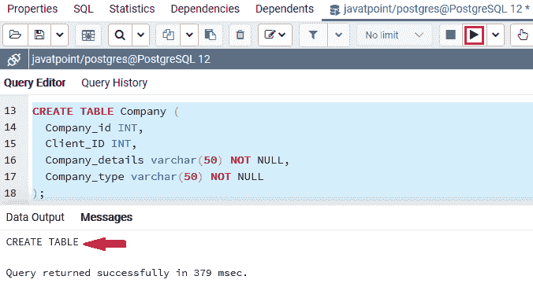

成功创建**父(客户端**)表和**子(公司)**表后，如果我们向现有表添加外键，我们可以执行下面的 ALTER TABLE 命令:

```

ALTER TABLE Company ADD CONSTRAINT fk_Clients  
FOREIGN KEY ( Company_Id )REFERENCES Clients(Client_ID) 
ON DELETE CASCADE 
ON UPDATE RESTRICT;  

```

**输出**

执行上面的命令后，我们将看到下面的消息窗口，显示特定的表已经被成功地更改为类似的数据库。

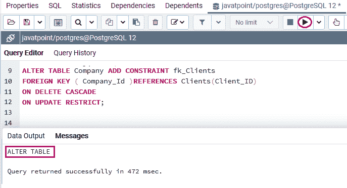

## 如何删除 PostgreSQL 外键

在 PostgreSQL 中，我们可以在 ALTER TABLE 命令的帮助下从现有表中移除外键。

**使用 alter table 命令删除外键的语法**

下图是在 PostgreSQL 中使用 ALTER TABLE 命令的帮助来删除外键:

```

ALTER TABLE table_name 
DROP CONSTRAINT constraint_fkey;

```

在上面的语法中，我们使用了下表中讨论的以下参数:

| 参数 | 描述 |
| **表 _ 名称** | table name 参数用于指定我们要从中移除外键的表的名称。 |
| **约束 _Fkey** | 它用于定义外键的名称，该名称是在创建表时添加的。 |

### 使用 ALTER TABLE 命令删除 PostgreSQL 外键的示例

让我们看一个从定义的表中移除外键的示例。

为此，我们正在获取上面新创建的 ***员工*** 表，并在 **ALTER TABLE** 命令的帮助下移除外键，如下语句所示:

```

ALTER TABLE Department
DROP CONSTRAINT fk_employee;  

```

**输出**

执行上述命令后，我们将看到下面的消息窗口，显示外键已成功从特定表中删除。

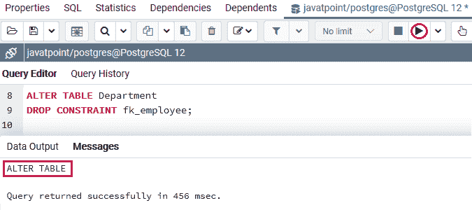

### 概观

在 **PostgreSQL 外键**部分，我们学习了以下主题:

*   我们已经使用**创建表格**命令为特定表格创建了一个**外键**。
*   我们已经理解了使用**创建表**改变外键的概念
*   我们还看到了**参照动作选项的例子:设置空、无动作、级联、限制和设置默认值。**
*   我们已经使用**改变表格**命令从特定表格中删除**外键**。

* * ********