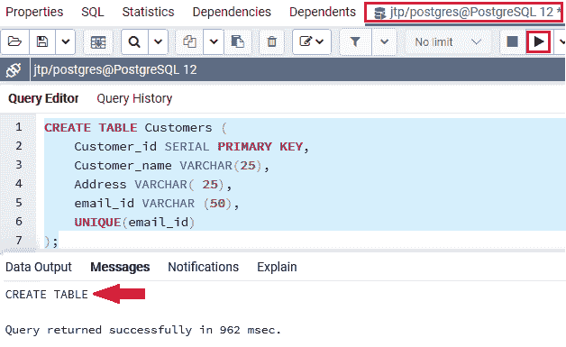
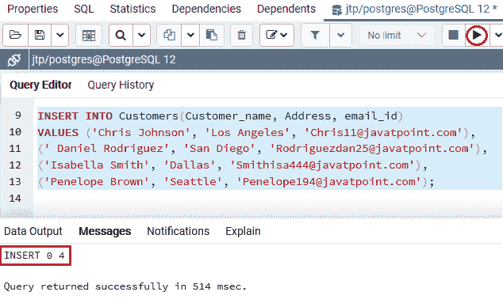
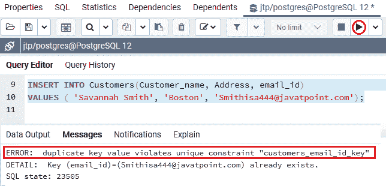
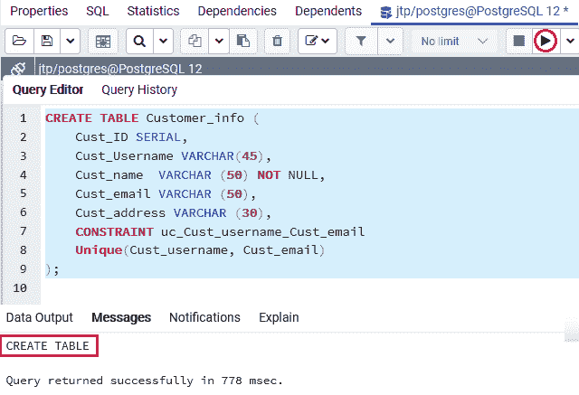
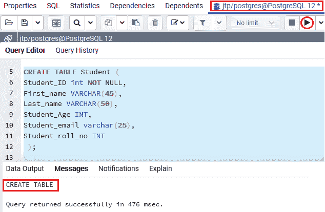
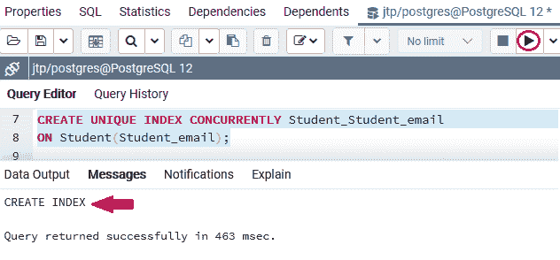
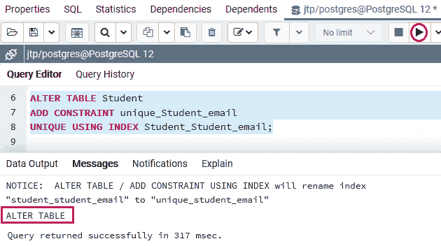
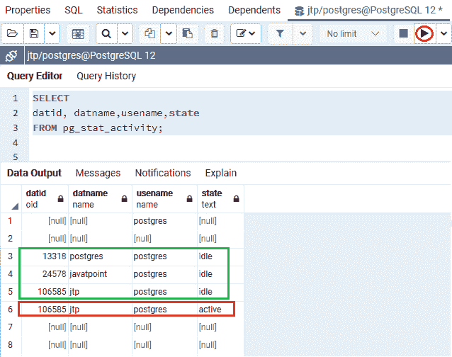
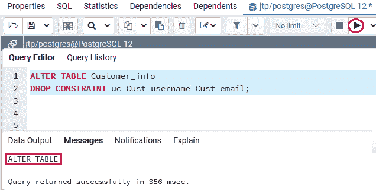

# 后置 SQL 唯一约束

> 原文：<https://www.javatpoint.com/postgresql-unique-constraint>

在本节中，我们将了解 **PostgreSQL UNIQUE 约束**的工作原理，该约束用于确保表的一列中的所有值都是排他的。

**示例 **PostgreSQL Unique 约束的**、**如何在**多个列上创建唯一约束，使用唯一索引**添加唯一[约束](https://www.javatpoint.com/postgresql-constraints)，并查看如何为特定表**删除唯一约束**。

## 什么是 PostgreSQL 唯一键约束？

在 [PostgreSQL](https://www.javatpoint.com/postgresql-tutorial) 中，**唯一约束**用于维护我们存储到表的字段或列中的值的个性。它与一组列约束或列约束和表约束兼容。

当我们使用**唯一约束**时，一个或多个列上的索引会自动生成。如果我们将两个不同的 null 值添加到不同行的列中，它不会中断 UNIQUE 约束的规范。

有时，如果我们想确保存储在一列或多列中的值在整个表中是唯一的，那么一列不能存储**重复的值**。

**例如**

*   客户的**电话号码**应该是 ***客户*** 中的**独有栏目**
*   **卷号**和**电子邮件地址**应该是【学生】 中的**唯一列**

当我们使用 **UNIQUE 约束**时，每次我们插入一个新行，它都会检查该值是否已经在表中，如果该值已经存在，则拒绝修改并引发错误。并且在更新当前数据时将遵循类似的步骤。

### 为什么我们需要在 PostgreSQL 中使用唯一约束

*   唯一约束可以在表中包含空值。
*   为了避免两个记录将相同的值存储到列中，唯一约束非常有用。
*   它还使用外键来维护表的唯一性。
*   在 PostgreSQL 中，唯一约束只包含不同的值，这些值保持了数据库的可靠性和完整性，以便以有组织的方式检索信息。

### 唯一约束与主键

唯一约束与[主键](postgresql-primary-key)的主要区别如下:

| 唯一约束 | 主关键字 |
| 如果值的组合是唯一的，与**唯一约束**相关的一些字段可以具有空值。 | 与主键相关的字段都不能包含空值。 |

## 如何在 PostgreSQL 中创建唯一约束

借助以下命令，我们可以创建一个 **PostgreSQL 唯一约束**:

*   **创建表格命令**
*   **更改表格命令**

现在，我们正在详细讨论这两个命令。

### 使用“创建表”命令创建唯一约束

在 PostgreSQL 中，我们可以使用 [CREATE TABLE 命令的](https://www.javatpoint.com/postgresql-create-table)帮助生成一个**唯一约束**。

**创建唯一约束的语法**

下图用于显示我们如何使用“创建表格”命令创建**唯一约束**:

第一种语法用于为表中的一列创建**唯一约束:**

```sql

CREATE TABLE table_name(  
col1 datatype,  
col2 datatype UNIQUE,  
 ...  
);  

```

**或**

我们可以使用第二个示例为表中的多个列创建**唯一约束:**

```sql

CREATE TABLE table_name(  
col1 col_definition,  
col2 col_definition,  
...  
[CONSTRAINT constraint_name]  
UNIQUE(column_name(s))  
);  

```

#### 注意:如果我们没有定义唯一的约束名称，PostgreSQL 会自动为特定的列创建一个名称。因此，建议在生成表时使用约束名称。

**参数描述**

在上面的语法中，我们使用了下表中讨论的以下参数:

| 参数名称 | 描述 |
| **表名** | 这是我们要创建的表的名称。 |
| **第 1 栏，第 2 栏** | 这些是我们在表中创建的列。 |
| **约束 _ 名称** | 约束名称参数用于指定唯一约束的名称。 |
| **列名** | 这些列将成为唯一约束。 |

### 使用创建命令的 PostgreSQL 唯一约束示例

为了理解 **PostgreSQL 唯一约束的工作原理，**我们将看到下面的例子。

在下面的示例中，我们创建了一个名为 ***【客户】*** 的新表，该表包含**多个列**，如 **Customer_ID、Customer_name、Address、**和 **email_ID** 。

而 **email_id** 是唯一列，对 ***客户*** 表中的 **email id** 进行唯一分类。

```sql

CREATE TABLE Customers (
	Customer_id SERIAL PRIMARY KEY,
	Customer_name VARCHAR (25),
Address VARCHAR(25),
	email_id VARCHAR (50), 
UNIQUE (email_id)
);

```

**或**

我们可以使用以下命令创建 ***【客户】*** 表:

```sql

CREATE TABLE Customers (
	Customer_id SERIAL PRIMARY KEY,
	Customer_name VARCHAR (25),
Address VARCHAR(25),
	email_id VARCHAR (50) UNIQUE
);

```

**输出**

执行上述命令后，我们会得到如下消息窗口，显示 ***【客户】*** 表已成功创建到 **jtp** 数据库中。



在成功创建新表为 ***【客户】*** 后，我们将在 **INSERT** 命令的帮助下输入一些值。

```sql

INSERT INTO Customers(Customer_name, Address, email_id)   
VALUES ('Chris Johnson', 'Los Angeles', 'Chris11@javatpoint.com'),   
(' Daniel Rodriguez', 'San Diego', 'Rodriguezdan25@javatpoint.com'),
('Isabella Smith', 'Dallas', 'Smithisa444@javatpoint.com'),
('Penelope Brown', 'Seattle', 'Penelope194@javatpoint.com');  

```

**输出**

在执行上述命令时，我们会得到如下消息窗口，显示**四个值**已经成功插入到 ***客户*** 表中。



现在，我们将在 ***客户*** 表中插入另一行重复的 **email_id** ，如下图所示:

```sql

INSERT INTO Customers(Customer_name, Address, email_id)   
VALUES ( 'Savannah Smith', 'Boston', 'Smithisa444@javatpoint.com');

```

**输出**

在实现了上面的 insert 命令之后，PostgreSQL 发出了一条错误消息，如下所示:

**错误:重复键值违反唯一约束“customers _ email _ id _ Key”DETAIL:Key(email _ id)=([【email protected】](/cdn-cgi/l/email-protection))已经存在。**



### 在多列上生成唯一约束

让我们看一个示例来理解 **PostgreSQL 对多个列的唯一约束的工作方式。**

假设我们要在**多列**上指定主键；在这种情况下，我们可以看到下面的**创建命令**的例子，它帮助我们生成一个新的表作为 ***客户信息。***

**和**列**中的 Cust_username 和 Cust_email** 的值的组合在整个表中将是唯一的。 **Cust_username** 和 **Cust_email** 栏的值不需要唯一。

```sql

CREATE TABLE Customer_info (  
    Cust_ID SERIAL,   
    Cust_Username VARCHAR(45),  
    Cust_name  VARCHAR (50) NOT NULL,   
    Cust_email VARCHAR (50),  
    Cust_address VARCHAR (30),
    CONSTRAINT uc_Cust_username_Cust_email 
Unique(Cust_username, Cust_email)  
);  

```

**输出**

执行上述命令后，我们将得到如下消息窗口，显示 ***Customer_info*** 表已成功创建到 **Jtp** 数据库中。



### 使用 ALTER TABLE 命令创建唯一约束，并使用唯一索引添加唯一约束

在 **ALTER TABLE** 命令的帮助下，我们可以在 PostgreSQL 中生成一个**唯一约束**，我们还可以使用 **PostgreSQL 唯一索引添加唯一约束。**

**创建唯一约束的语法**

下图用于使用 PostgreSQL 中的 [ALTER TABLE 命令创建**唯一约束**:](https://www.javatpoint.com/postgresql-alter-table)

```sql

ALTER TABLE table_name
ADD CONSTRAINT [ constraint_name ]
UNIQUE(column_list);  

```

在上面的语法中，我们使用了下表中讨论的以下参数:

| 参数名称 | 描述 |
| **表名** | 这是一个表的名称，我们将修改它。 |
| **列 _ 列表** | 这些是我们在表中创建的列。 |
| **约束 _ 名称** | 它用于定义唯一的约束名称。 |

### 使用 ALTER TABLE 命令和使用唯一索引添加唯一约束的 PostgreSQL 唯一约束示例

在下面的例子中，我们将理解使用 **ALTER TABLE 命令**的 **PostgreSQL 唯一约束**，并按照以下步骤使用**唯一索引添加**唯一约束**。**

**步骤 1:创建新表格**

首先，我们将创建一个名为 ***学生*** 的新表，该表不包含**表描述中的**唯一列**。**

```sql

CREATE TABLE Student (  
Student_ID INT NOT NULL,   
First_name VARCHAR(45),
Last_name VARCHAR(50),   
Student_Age INT,   
Student_email VARCHAR(25) ,
Student_roll_no INT
 );  

```

**输出**

执行上述命令后，我们会得到如下消息窗口，显示 ***【学生】*** 表已创建成功进入 ***Jtp*** 数据库。



**步骤 2:创建唯一索引**

创建 ***学生*** 表后，我们将基于**学生 _ 电子邮件**列创建一个新索引。

要获得有关 PostgreSQL 唯一索引的更多信息，请参考以下链接:

[https://www.javatpoint.com/postgresql-unique-index](https://www.javatpoint.com/postgresql-unique-index)

```sql

CREATE UNIQUE INDEX CONCURRENTLY Student_Student_email
ON Student(Student_email);

```

**输出**

执行上述命令后，我们将获得下面的消息窗口，显示特定的**索引**已成功创建。



**步骤 3:将唯一约束添加到指定的表中**

成功创建 **Student_Student_email** 索引后，我们将使用 ALTER TABLE 命令的帮助向 ***Student*** 表添加一个唯一的约束，如下语句所示:

```sql

ALTER TABLE Student
ADD CONSTRAINT unique_Student_email
UNIQUE USING INDEX Student_Student_email;

```

**输出**

执行上述命令后，我们将获得以下消息窗口: ***【学生】*** 表已成功修改。



在上面的截图中，我们可以看到 PostgreSQL 提出了一个通知，说**ALTER TABLE/ADD CONSTRAINT USING INDEX 将索引“student_student_email”重命名为“unique_student_email”。**

**注:**

*   **ALTER TABLE** 命令获得表的排他锁。如果我们有任何未完成的事务，它将等待所有事务完成后再更改表。
*   要查看现有的未完成交易，我们应该借助以下命令检查 **pg_stat_activity** 表:

```sql

SELECT 
datid, datname, usename, state
FROM pg_stat_activity;

```

**输出**

执行上述命令后，我们将得到下面的输出，在这里我们可以找到事务中值为**空闲和活动的**的**状态列**。而**空闲状态**定义这些是**未完成交易**。



## 如何删除 PostgreSQL 唯一约束

在 PostgreSQL 中，我们可以借助 **ALTER TABLE** 命令移除唯一约束。

**删除唯一约束的语法**

下图用于使用 PostgreSQL 中的 ALTER TABLE 命令移除唯一约束:

```sql

ALTER TABLE table_name  
DROP CONSTRAINT constraint_name;  

```

在上面的语法中，我们使用了下表中讨论的以下参数:

| 参数 | 描述 |
| **表 _ 名称** | 表名参数用于指定需要修改的表名。 |
| **约束 _ 名称** | 约束名称参数用于定义我们要移除的唯一约束名称。 |

**使用 ALTER TABLE 命令删除 PostgreSQL 唯一约束的示例**

让我们看一个从特定表中移除**唯一约束**的示例。

为此，我们在 **ALTER TABLE** 命令的帮助下，使用 ***Customer_info*** 表来移除唯一约束，如下语句所示:

```sql

ALTER TABLE Customer_info
DROP CONSTRAINT uc_Cust_username_Cust_email;  

```

**输出**

成功执行上述命令后，我们将获得如下消息窗口，显示**唯一约束(UC _ Cust _ username _ Cust _ email)**已从 ***客户信息*** 表中删除。



### 概观

在 **PostgreSQL 唯一约束**部分，我们学习了以下主题:

*   我们使用**创建表格**命令为特定表格创建**唯一约束**。
*   我们已经理解了使用**创建表**改变 PostgreSQL 唯一约束的概念
*   我们使用 **PostgreSQL 唯一索引**将唯一约束添加到现有表中。
*   我们已经使用 **ALTER TABLE** 命令从特定表中删除了**唯一约束**。

* * *