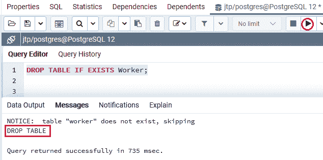
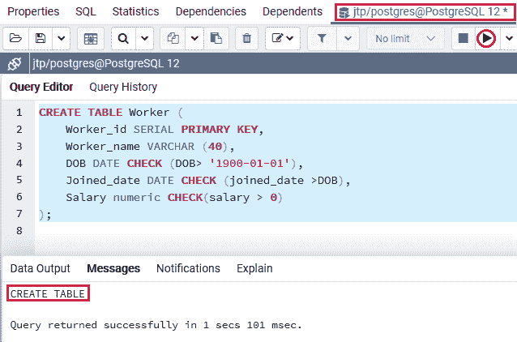
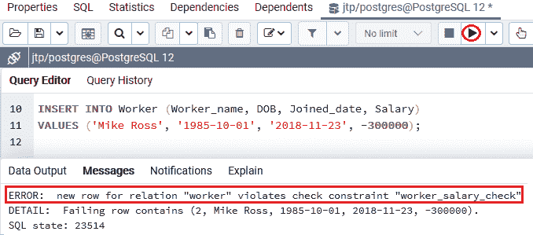
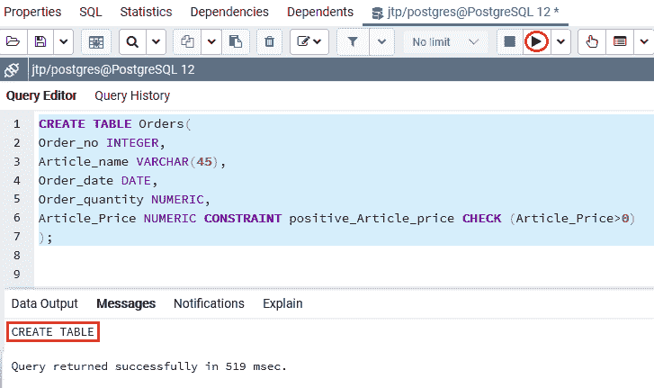
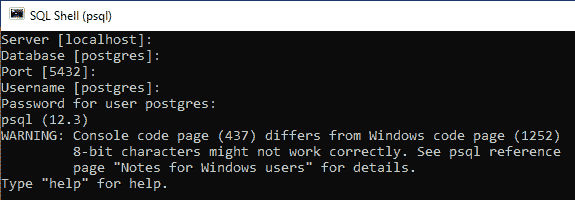
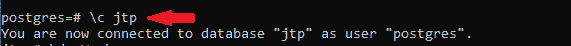
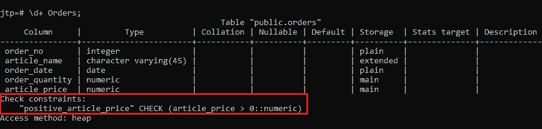
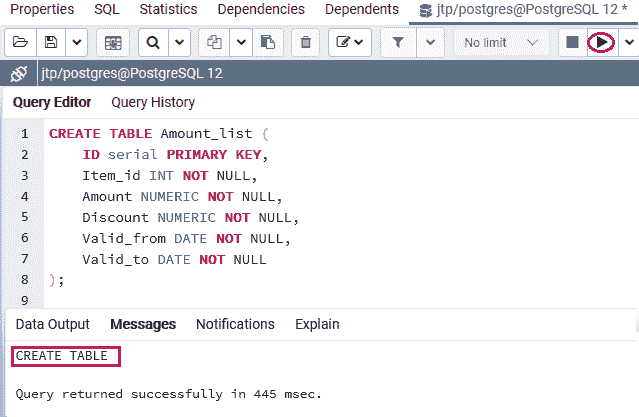
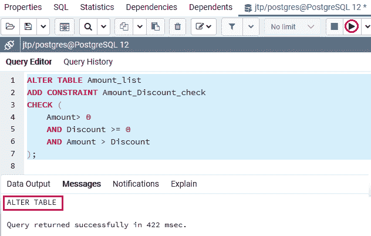

# PostgreSQL CHECK 约束

> 原文：<https://www.javatpoint.com/postgresql-check-constraint>

在本节中，我们将了解 **PostgreSQL Check 约束的工作原理，**用于确保表的一列或一个字段中的所有值都满足特定情况。

**PostgreSQL 检查约束的**示例**，**如何为新表和现有表创建检查约束。

## 什么是 PostgreSQL CHECK 约束？

在 [PostgreSQL](https://www.javatpoint.com/postgresql-tutorial) 中，可以用单独的名称定义 Check 约束。它用于控制要插入的列的值。

它允许我们验证值被存储到记录中的条件。如果该语句为假，则数据会破坏不保存在表中的[约束](https://www.javatpoint.com/postgresql-constraints)。

换句话说，我们可以说 **PostgreSQL CHECK 约束**用于确保表的一列或一个字段中的所有值都满足某些条件。

**例如，**检查约束必须与**布尔表达式**匹配，才能在将值插入或更新到列之前计算值。

如果值保持检查约束，PostgreSQL 将更新这些值或将这些值插入到列中。否则，PostgreSQL 将放弃修改并引发约束冲突错误。

**使用创建表语句创建检查约束的语法**

下图显示了如何使用 [**创建表格**命令](https://www.javatpoint.com/postgresql-create-table)创建**检查约束**:

```

CREATE TABLE table_name(  
col1 datatype,  
col2 datatype, 
CONSTRAINT constraint_name
CHECK(condition);
);  

```

**参数描述**

在上面的语法中，我们使用了下表中讨论的以下参数:

| 参数名称 | 描述 |
| **表名** | 这是我们要创建的表的名称。 |
| **第 1 栏，第 2 栏** | 这些是我们在表中创建的列。 |
| **约束 _ 名称** | 约束名称参数用于指定检查约束的名称。 |
| **列名** | 这些列将成为检查约束。 |

## PostgreSQL 检查约束的示例

为了理解 **PostgreSQ CHECK 约束的工作原理，**我们将看到下面的例子。

当我们使用 CREATE TABLE 命令指定表的结构时，我们通常可以使用 **CHECK 约束。**

在下面的示例中，我们创建了一个名为 ***Worker*** 的新表，该表包含**多个列**，如 **Worker_ID、Worker_name、DOB、Joining_date 和薪资**。

但是，在创建 **Worker** 表之前，我们将使用 [**DROP TABLE** 命令](https://www.javatpoint.com/postgresql-drop-table)来检查相似的表是否已经存在于 **Jtp** 数据库中。

```

DROP TABLE IF EXISTS Worker;

```

**输出**

执行上述命令后，我们会得到如下窗口消息: ***Worker*** 表不存在。



现在，我们将使用 create 命令创建 ***Worker*** 表，如下语句所示:

```

CREATE TABLE Worker (
Worker_id SERIAL PRIMARY KEY,
Worker_name VARCHAR (40),
DOB DATE CHECK (DOB> '1900-01-01'),
	Joined_date DATE CHECK (joined_date >DOB),
	Salary numeric CHECK(salary > 0)
);

```

**输出**

在执行上述命令时，我们将获得下面的消息窗口，该窗口显示 ***Worker*** 表已成功创建到 **jtp** 数据库中。



在上面的 ***Worker*** 表中，我们使用了以下三个 CHECK 约束:

| 检查约束 | 描述 |
| **第一个约束** | 工人的出生日期必须大于 1900 年 1 月 1 日。如果我们试图在 1900 年 1 月 1 日之前插入出生日期，我们将收到一条错误消息。 |
| **第二约束** | 加入日期必须大于出生日期。这种特殊的检查将防止修改不正确的日期的语义含义。 |
| **第三个约束** | 工资必须大于零。 |

成功创建 ***Worker*** 后，我们将在 **INSERT** 命令的帮助下向其中输入一些值。

```

INSERT INTO Worker (Worker_name, DOB, Joined_date, Salary)
VALUES ('Mike Ross', '1985-10-01', '2018-11-23', - 300000);

```

**输出**

在执行了上面的命令之后，PostgreSQL 发出了下面的错误，因为我们在**工资**列中插入了一个**负工资值(-300000)** 。

**错误:关系“worker”的新行违反了检查约束“worker _ salary _ check”DETAIL:失败行包含(2，Mike Ross，1985-10-01，2018-11-23，-300000)。**



并且由于**工资列**上的**检查约束**只取**正值**，因此**插入命令**失败。

默认情况下，PostgreSQL 借助以下模式为 **CHECK 约束**提供一个名称:

```

{table}_{column}_check

```

让我们看一个例子，其中**工资列**上的**约束**具有以下约束名称:

```

Worker_salary_check

```

### PostgreSQL CHECK 约束在一个单独的名称中

如果我们想为 CHECK 约束分配一个单独的名称**，我们可以在**约束表达式**之后定义它，如下图所示:**

 **```

column_name data_type CONSTRAINT constraint_name CHECK(...)

```

让我们看一个示例来理解如何在 PostgreSQL Check 约束中使用**单独的名称**:

为此，我们将使用 create 命令创建一个新表作为*，如下所示:*

 *```

CREATE TABLE Orders(
Order_no INTEGER,
Article_name VARCHAR(45),
Order_date DATE,
Order_quantity NUMERIC,
Article_Price NUMERIC CONSTRAINT positive_Article_price CHECK (Article_Price>0)
);

```

**输出**

执行上述命令时，我们会得到如下窗口消息，显示 ***订单*** 表已创建成功。



如果要查看**约束数据字典**，可以按照以下步骤操作:

**第一步**

打开 **SQL shell (psql)** ，里面出现了**必要的细节**。之后，我们将使用我们在 PostgreSQL 安装过程中创建的**密码**登录到 Postgres 数据库服务器。

提供密码后，我们连接到 **Postgres 服务器，**，如下图截图所示:



**第二步**

现在，我们将连接到特定的数据库服务器 **jtp** ，它是我们在下面命令的帮助下创建的:

```

\c jtp

```



**第三步**

之后，我们将执行下面的语法**来列出特定表的所有约束(主键、检查、唯一)**。

```

\d+ tablename

```

最后，我们使用上面的命令来查看用于*表的约束:*

 *```

\d+ Orders

```

**输出**

执行上述命令后，我们将得到以下结果:



#### 注意:在上面的*订单*表中，Article_price 列不能包含任何小于或等于零(0)的值。

这里包含了一个**约束名**，这样**关键字 CONSTRAINT** 后面就是命名的 constraint **正 _Article_price** 后面就是表达式。

### 使用 ALTER TABLE 命令为现有表定义 PostgreSQL CHECK 约束

在 PostgreSQL 中，我们可以使用 [**ALTER TABLE** 命令的](https://www.javatpoint.com/postgresql-alter-table)帮助为现有表添加 PostgreSQL 检查约束。

假设我们在数据库中有一个现有的表，命名为 ***Amount_list。*T3】**

```

CREATE TABLE Amount_list (
	ID serial PRIMARY KEY,
	Item_id INT NOT NULL,
	Amount NUMERIC NOT NULL,
	Discount NUMERIC NOT NULL,
	Valid_from DATE NOT NULL,
	Valid_to DATE NOT NULL
);

```

**输出**

执行上述命令后，我们会得到如下消息窗口，显示 ***金额 _ 列表*** 表已创建成功。



要将 **CHECK 约束**添加到 ***金额 _ 列表*** 表中，我们可以使用 ALTER TABLE 命令，其中**金额和折扣**大于零，而**折扣**小于该金额。

#### 注意:我们也可以使用布尔表达式，它包括 AND 运算符。

```

ALTER TABLE Amount_list 
ADD CONSTRAINT Amount_Discount_check 
CHECK (
	Amount> 0
	AND Discount >= 0
	AND Amount > Discount
);

```

**输出**

执行上述命令后，我们会得到如下消息窗口，显示 ***金额 _ 列表*** 表已创建成功。



并且**有效 _ 至**列值必须等于或大于**有效 _ 自列值，**如以下命令所示:

```

ALTER TABLE Amount_list 
ADD CONSTRAINT valid_range_check 
CHECK (Valid_to >= Valid_from);

```

**输出**

在执行上述命令时，我们将检索以下消息窗口，该窗口显示指定的表已被成功修改。


**注**

*   如果我们放置额外的逻辑来限制值，PostgreSQL Check 约束非常有用。
*   我们还可以在 CHECK 约束的帮助下确保数据对数据库是有效的。

### 概观

在 **PostgreSQL 检查约束**部分，我们学习了以下主题:

*   我们已经了解到 **PostgreSQL CHECK 约束**用于基于布尔表达式检查列的值。
*   我们已经使用**创建表格**命令为特定表格创建了**检查约束**。
*   我们也可以使用**修改表**来修改 PostgreSQL 检查约束
*   在 ALTER TABLE 命令的帮助下，我们向现有的表中添加了一个 **CHECK CONSTRAINT** 。
*   我们也理解了使用**单独名称**的**后缀检查约束**的概念。

* * *****