# PostgreSQL 函数

> 原文：<https://www.javatpoint.com/postgresql-functions>

在本节中，我们将了解 **PostgreSQL 函数的工作原理，创建函数**命令，并使用 PostgreSQL 的不同工具如 **pgadmin4** 和 **SQL shell (PSQL)查看 **PostgreSQL CREATE FUNCTION 命令**的实时示例。**

并查看调用**用户定义函数**的示例，如**位置符号命名符号，即混合符号。**

## 什么是 PostgreSQL 函数？

一个 [PostgreSQL](https://www.javatpoint.com/postgresql-tutorial) 函数或一个**存储过程**是一组 SQL 和过程命令，如**声明、赋值、循环、控制流**等。存储在数据库服务器上，可以使用 **SQL 接口**参与。又被称为 **PostgreSQL 存储过程**。

我们可以用几种语言创建 PostgreSQL 函数，比如 [SQL](https://www.javatpoint.com/sql-tutorial) 、 [PL/pgSQL](https://www.javatpoint.com/pl-sql-tutorial) 、 [C](https://www.javatpoint.com/c-programming-language-tutorial) 、 [Python](https://www.javatpoint.com/python-tutorial) 等。

它使我们能够执行操作，这些操作通常需要各种命令和数据库中的一个函数的往返。

## 什么是 PostgreSQL CREATE Function 命令？

在 PostgreSQL 中，如果我们想要指定一个新的用户定义函数，我们可以使用 **CREATE FUNCTION** 命令。

### PostgreSQL CREATE Function 命令的语法

**PostgreSQL CREATE Function 命令**的语法如下:

```
CREATE [OR REPLACE] FUNCTION function_name (arguments)   
RETURNS return_datatype 
LANGUAGE plpgsql
AS $variable_name$  
DECLARE  
declaration;  
[...] -- variable declaration 
 BEGIN  
< function_body >  
[...]  -- logic
RETURN { variable_name | value }  
END; 
$$

```

在上面的语法中，我们使用了以下参数，如下表所示:

| 因素 | 描述 |
| **功能 _ 名称** | 

*   **Function Name** parameter is used to define the function name.
*   The function name is written after the keyword **create function** .

 |
| **【或替换】** | 

*   If we want to change the current function, we can use the keyword **or [replace]** .
*   And is an optional parameter.

 |
| **功能** | 

*   After using **or [replace]** keywords, we can define the parameter list of **function** , which is contained in brackets after **function name.**
*   A function can contain zero or several parameters.

 |
| **返回** | 

*   We can define the data type after the keyword **return** , which we will return from the function.
*   Can be a reference of base type, composite type, domain type or table column type.

 |
| **语言 plpgsql** | 

*   The name of the Procedural language used to define the execution function.
*   Not just **PLPGSQL, [T1】 PostgreSQL supports various process languages.**

 |
| **功能 _ 身体** | 

*   **The function body** contains the executable part of logic.

 |

## PostgreSQL 创建函数命令示例

让我们看一个不同的例子来理解 **PostgreSQL CREATE Function** 命令的工作原理。

我们从在 PostgreSQL 教程中创建的 **Javatpoint** 数据库中获取 ***汽车*** 表格。

### 创建新功能

在下面的命令中，我们正在创建一个新的函数，该函数计算其**汽车 _ 价格**在**价格 _ 从和价格 _ 到**参数之间的**汽车:**

```
Create function get_car_Price(Price_from int, Price_to int)
returns int
language plpgsql
as
$$
Declare
 Car_count integer;
Begin
   select count(*) 
   into Car_count
   from Car
   where Car_price between Price_from and Price_to;
   return Car_count;
End;
$$;

```

**get_car_Price** 功能分为两个主要部分，分别是**表头和功能体**。

我们在**标题**部分使用了以下参数:

*   首先，我们将函数名指定为 **get_car_Price()，它是在**创建函数**之后编写的**
*   之后， **get_car_Price()** 函数包含两个参数 **Price_from** 和 **Price_to，**具有整数数据类型。
*   然后， **get_car_Price()** 函数检索一个由返回 int 条件定义的整数。
*   最后，我们使用了函数语言 **plpgsql** 。

我们在**功能体**部分使用了以下参数:

*   我们在函数部分使用了**美元引用字符串**常量说明，以**$**开头，以**$**结尾。
*   在**$**符号之间，我们可以放置一个块，覆盖**声明**和功能的**逻辑。**
*   在声明块中，我们声明了一个名为 **Car_count，**的变量，该变量存储从**T3】CarT5】中选择的汽车**
*   在区块部分的主体中，我们使用了**选择进入**命令来选择值在**价格 _ 从和价格 _ 到**之间的汽车价格，并将输出提供给**汽车计数**
*   在块的末尾，我们使用了 **RETURN** 命令来获取

## 在 PostgreSQL 中创建函数

在 PostgreSQL 中，我们可以通过两种方式创建函数:

*   **使用 pgAdmin 创建 PostgreSQL 函数**
*   **使用 SQL Shell 创建 PostgreSQL 函数**

### 使用 pgAdmin 创建函数

我们将按照以下流程在 **pgAdmin:** 中创建一个函数

**第一步**

首先，我们将在本地系统中打开最新版本 **pgAdmin** ，我们将进入对象树并连接到 **Javatpoint** 示例数据库，我们要在其中创建一个函数。

**第二步**

之后，我们将通过点击**打开查询工具，然后点击工具部分**，如下图所示:

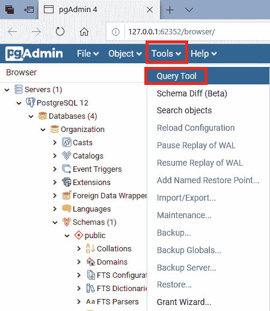

**第三步**

要创建 **get_car_Price1()** 功能，我们将在**查询工具**中使用上述代码，并单击**执行**按钮。

执行上述命令后，我们将获得如下消息窗口，显示函数 **get_car_Price1()** 已被**成功创建**到类似的数据库中。

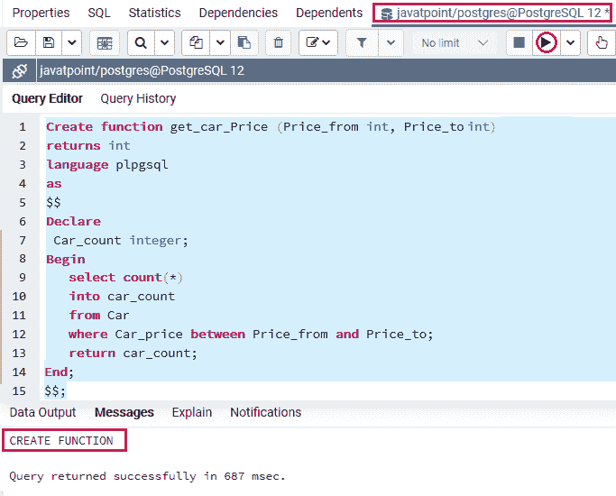

并且，我们可以在**函数**列表中识别函数 **get_car_Price()** ，如下图截图所示:

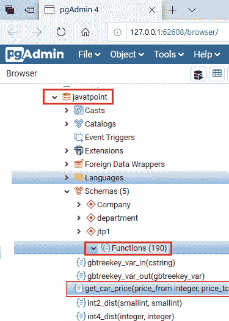

#### 注意:如果我们不能识别函数名，我们可以右键单击函数节点并选择刷新...恢复功能列表的菜单项:

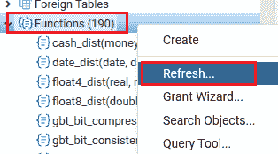

### 使用 SQL Shell(psql)创建函数

我们将按照以下流程在 **psql** 中创建一个表:

**第一步**

*   首先，我们将在本地系统中打开 **psql** ，我们将连接到我们想要创建函数的数据库。
*   我们将在 **javatpoint** 数据库中创建一个表，这是我们之前在 PostgreSQL 教程中创建的。

**第二步**

*   为了连接数据库，我们将输入以下命令:

```
\c javatpoint

```

**输出**

执行上述命令后，我们将获得以下输出:

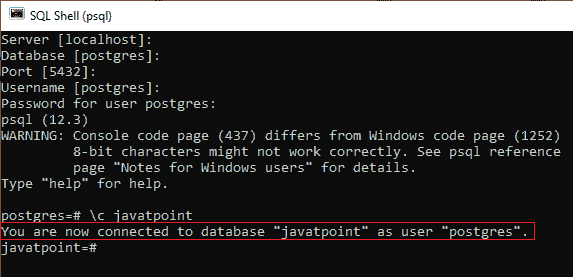

#### 注意:如果我们输入与上面类似的命令来创建一个函数，在 psql 中，它将发出下面的错误，即:函数 get_car_price 已经存在，具有相同的参数类型。


因此，为了解决这个错误，我们在下一步创建了一个新的函数 **get_car_Price1** ()。

**第三步**

我们将输入以下命令，在 **javatpoint** 数据库中创建一个函数**作为** **get_car_Price1** ()函数。

```
javatpoint=# Create function get_car_Price1(Price_from int, Price_to int)
javatpoint-# returns int
javatpoint-# language plpgsql
javatpoint-# as
javatpoint-# $$
javatpoint$# Declare
javatpoint$#  Car_count integer;
javatpoint$# Begin
javatpoint$#    select count(*)
javatpoint$#    into Car_count
javatpoint$#    from Car
javatpoint$#    where car_price between Price_from and Price_to;
javatpoint$#    return Price_count;
javatpoint$# End;
javatpoint$# $$;

```

**输出**

在执行上述命令时，我们将获得以下输出，显示 **get_car_Price_count1()** 函数已成功创建。

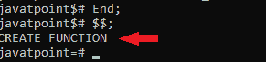

**第四步**

我们可以使用下面的命令列出现有数据库中所有用户定义的函数。

```
javatpoint=# \df

```

**输出**

执行上述命令后，我们将获得以下输出:

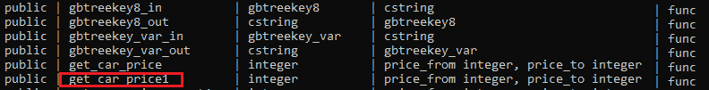

## 如何调用用户定义的函数

在 PostgreSQL 中，我们可以通过三种方式调用用户定义的函数，如下所示:

*   **位置符号**
*   **命名符号**
*   **混合符号**

### 使用位置符号调用函数

如果我们想以类似于参数的顺序描述参数，我们可以借助**位置符号的**帮助调用一个函数。

让我们看一个示例来理解**位置符号**如何调用特定的函数。

下例中 **get_car_price()** 参数为 **26000** 和 **70000** ，相当于 **Price_from** 和 **Price_to** 参数。

```
Select get_car_Price(26000,70000);

```

**输出**

在执行上述命令时，我们将获得以下输出，该命令将检索其 **car_price** 在 **26000 到 70000 之间的那四行。**

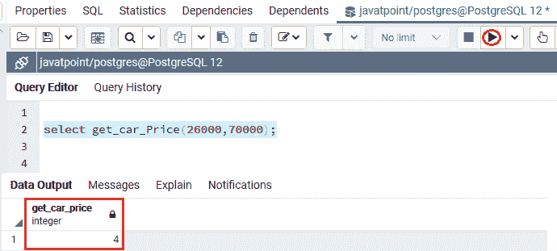

当函数几乎没有任何参数时，我们可以借助**位置符号**来调用函数。

如果函数包含几个参数，我们可以使用**命名符号**来调用特定的函数，因为使用**命名符号**会使函数调用更容易理解。

### 使用命名符号调用函数

在下面的例子中，我们显示了使用命名符号调用 **get_car_Price()** 函数的工作过程:

```
select get_car_Price(
 Price_from => 26000, 
    Price_to => 70000
);

```

**输出**

执行上面的命令，我们会得到如下输出，基于上面 **car_price** 的范围显示四行。

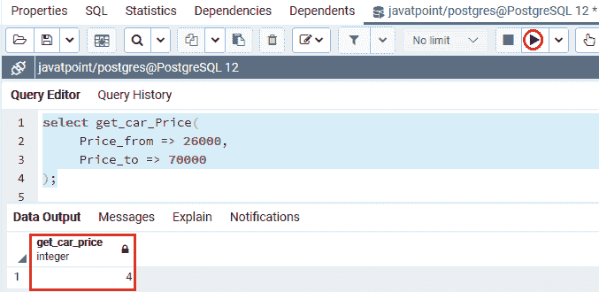

在前面提到的符号中，我们使用了 **= >** 来区分参数的**名称和值**。

PostgreSQL 允许在:= 上创建的旧语法用于**向后兼容**，如我们在以下命令中所见:

```
select get_car_Price(
 Price_from := 26000, 
     Price_to := 70000
);

```

**输出**

执行上述命令后，我们将获得与上述命令结果相似的输出，其中我们使用“**=>”**而不是**:=“**”。

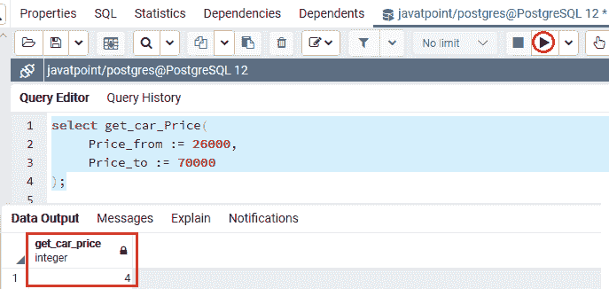

### 使用混合表示法调用函数

它是**位置符号和命名的**符号的分组。

让我们看一个示例来理解**使用混合符号调用函数的工作原理。**

在**混合符号**中，我们不能在**位置参数**之前使用**命名的参数**。

**例如:**

在下面的命令中，我们将使用**价格 _ 从**参数的**命名概念**作为**价格 _ 从= > 26000，**而对于**价格 _ 到**参数，我们已经使用了**位置概念**作为 **70000** ，正如我们可以在下面的命令中看到的:

```
select get_car_Price(Price_from=>26000,70000);

```

**输出**

执行上述命令后，PostgreSQL 会引发一个错误，表示**位置参数不能跟随命名参数**。

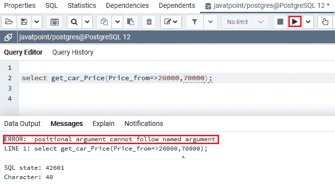

为了解决上述错误，我们在 get_car_price() 函数中使用**位置和命名符号**，其中 **26000** 用于表示**位置符号；**另一方面， **Price_to= > 70000** 用来表示**命名符号**:

```
select get_car_Price(26000,Price_to=>70000);

```

**输出**

执行完上面的命令，我们会得到下面的输出，返回那些 **car_price** 在 26000 到 70000 之间的车。

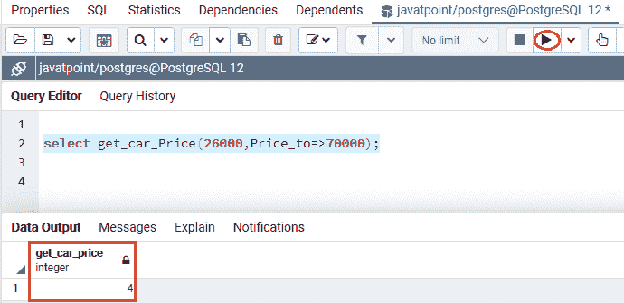

## 概观

在 **PostgreSQL 函数**部分，我们学习了以下主题:

*   我们已经使用 **CREATE Function** 命令为特定的表创建了一个用户定义的函数。
*   借助不同的符号，如**位置、命名和混合，我们已经理解了**调用用户定义函数**的过程。**

* * *