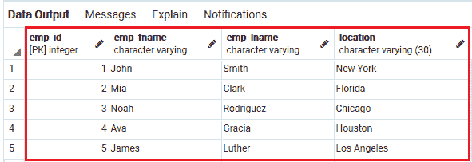
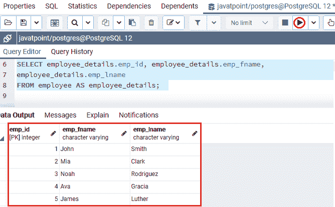
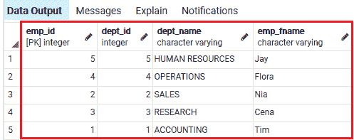
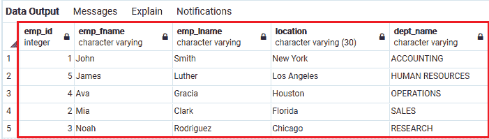
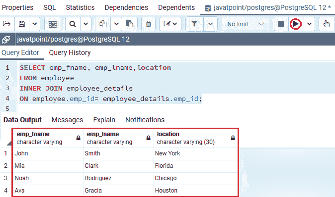
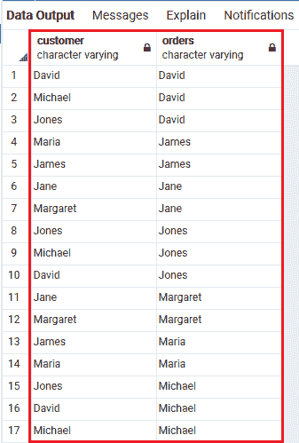

# PostgreSQL 别名

> 原文：<https://www.javatpoint.com/postgresql-alias>

在本节中，我们将了解 **PostgreSQL Aliasing 和 PostgreSQL Table aliasing** 的工作原理，后者用于在特定命令中为表赋予临时名称。

## 什么是 PostgreSQL 别名？

[PostgreSQL](https://www.javatpoint.com/postgresql-tutorial) 别名用于给特定语句中 [SELECT 命令](https://www.javatpoint.com/postgresql-select)的选择列表中的表或表达式起一个**的简称**。

## PostgreSQL 别名的优势

PostgreSQL 别名的优点如下:

*   PostgreSQL 别名使列名或表名更容易理解。
*   当一个查询中要使用多个表时，这是首选。
*   它提供了一个方便灵活的特性，使我们能够快速完成复杂的任务。
*   当我们在语句中使用函数时，PostgreSQL 别名非常有用。
*   在 PostgreSQL Aliasing 中，我们可以组合两个或多个列。
*   当列名很重要或不可读时，PostgreSQL 别名非常有用。

### PostgreSQL 别名可以通过两种方式定义:

*   **PostgreSQL 表别名**
*   **PostgreSQL 列别名**

在本节中，我们将了解 **PostgreSQL 表别名**及其一些示例。

## 什么是 PostgreSQL 表别名？

**表别名**用于缩写我们的命令，以便于阅读，或者当我们实现 **[自连接](https://www.javatpoint.com/postgresql-self-join)** 时，它会在 **FROM** 子句中多次列出类似的表。

表别名作为表示表名的昵称，使表名更易读、更简短。

在整个命令的执行过程中，它暂时存在于**。当表名不便于用户实时使用时，表别名非常有用。**

 **## PostgreSQL 表别名的语法

**PostgreSQL 表别名**的语法如下:

```
SELECT column1, column2....,columnN
FROM table_name AS alias_name
WHERE [condition];

```

**或**

在下面的语法中，我们忽略 **AS** 关键字，因为它是可选的，并且**表名**被赋予一个别名**别名**。

```
SELECT column_name
FROM table_name alias_name;
WHERE [condition];

```

在上述语法中，我们有以下参数:

| 因素 | 描述 |
| 表名 | **表名**参数用来定义原名称，我们要在这里执行别名。 |
| 列名 | **列名**用于定义特定表格的列名。 |
| 别名 | **别名**用于描述临时名称，该名称被赋予列。 |
| 如同 | **AS** 是大多数开发人员在别名列名时使用的可选关键字，但在执行表别名时不使用。 |

## PostgreSQL 表别名的示例

让我们看一些例子来更好地理解 PostgreSQL 表别名。

*   **在连接子句中执行表别名**

通常，我们使用 join 子句从一个或多个表中获取记录，这些表包含类似的列名。

如果我们使用类似的列名，我们会得到一个错误，该列名来自一个或多个表，但没有完全限定它们。

要忽略此错误，我们需要借助以下语法来限定这些列:

```
table_name.column_name

```

表别名用于一个或多个表，并将它们与 [**JOIN** 子句的](https://www.javatpoint.com/postgresql-join)帮助相链接。这里，我们使用**表别名**作为**FROM 子句**中指定的表名，并使用 [**INNER JOIN** 子句](https://www.javatpoint.com/postgresql-inner-join)使命令更具可读性。

在下面的例子中，我们有一个名为 **Employee 的表，其中**包含以下数据:



此语句将使用表别名返回记录:

```
SELECT employee_details.emp_id, employee_details.emp_fname, 
employee_details.emp_lname
FROM employee AS employee_details; 

```

**输出**

在执行上述命令时，我们将得到以下结果:



让我们假设我们的数据库中还有一个名为 ***部门*** 的表，该表有以下数据，如下图截图所示:



正如我们可以观察到的，两个表都包含一个相似的列 **emp_fname** 。

```
SELECT e.emp_id, emp_fname, emp_lname,location,dept_name  
FROM Employee  e  
INNER JOIN department  d   
ON e.emp_id= d.dept_id;

```

**输出**

在执行上述命令时，我们将获得以下输出，显示以下错误:**如果我们在没有表别名的情况下使用一个子句中的列“emp_fname”是不明确的**。


因此，如果我们想避免上述错误，我们将使用表别名。

在下面的命令中，我们将使用 PostgreSQL Inner Join 子句来组合 ***员工和部门表；*** 并对其执行表格走样。

```
SELECT e.emp_id, e.emp_fname, emp_lname,
location, dept_name  
FROM Employee  e  
INNER JOIN department  d   
ON e.emp_id= d.dept_id
ORDER BY location desc;    

```

**输出**

执行上述命令后，我们将获得以下输出:



如果我们不想在命令中使用别名概念，那么 PostgreSQL 会使用表名来查找列名，这使得语句更长，可读性更差，如下面的示例所示

```
SELECT emp_fname, emp_lname,location 
FROM employee    
INNER JOIN employee_details 
ON employee.emp_id= employee_details.emp_id;

```

**输出**

执行上述语句后，我们将获得以下输出:



*   **对冗长的表名执行表别名的示例**

为了使我们的命令更易读，并节省一些输入时间来编写一个冗长的表名，我们可以使用表别名。

例如，不在命令中使用下面的表达式，

```
Long_table_name.column_name

```

我们可以给表**长 _ 表 _ 名**取一个别名如下:

```
Long_table_name AS alias

```

并借助表别名引用表**中的**列 _ 名称**长 _ 表 _ 名称**:

```
alias.column_name

```

*   **在 PostgreSQL 自连接子句中执行表别名**

假设我们想在**自连接子句中使用表别名。**自联接子句用于将一个表组合到它自己，它在一个语句中多次引用一个相似的表。

在下面的例子中，我们将展示如何在一个类似的命令中借助表别名引用**客户**表两次:

```
SELECT
c.first_name Customer,
o.first_name Orders
FROM Customer c
INNER JOIN Customer o ON o.order_id = c.order_id
ORDER BY Orders;

```

**输出**

执行上述命令后，我们将获得以下结果:



**概述**

在 PostgreSQL 表别名部分，我们学习了以下主题:

*   我们将使用来提供一个 **PostgreSQL 表别名**，以便在执行命令时临时给表取一个新名称。
*   我们将在 PostgreSQL Join 子句中实现表别名。

* * ***