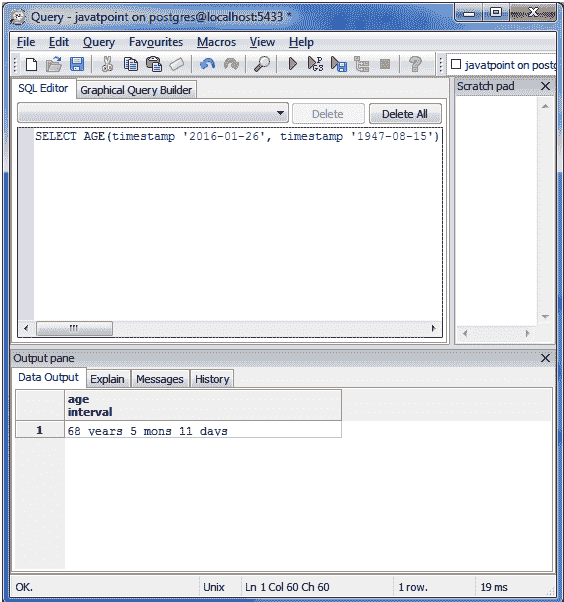
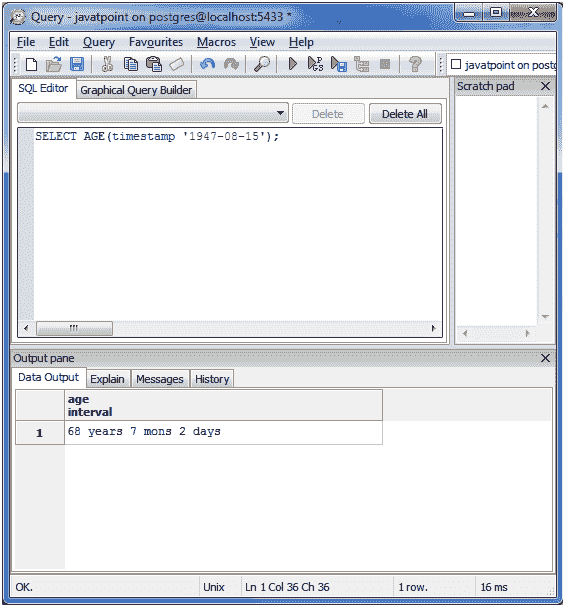
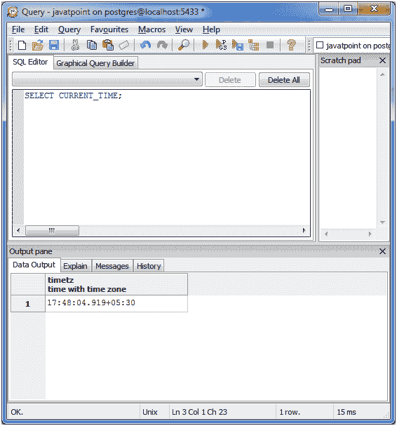
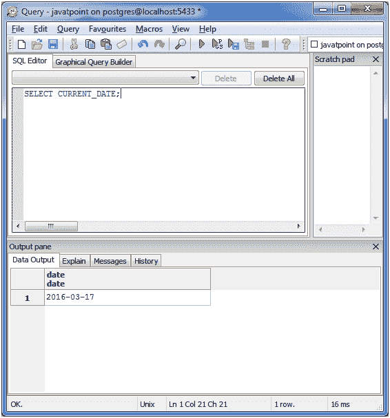
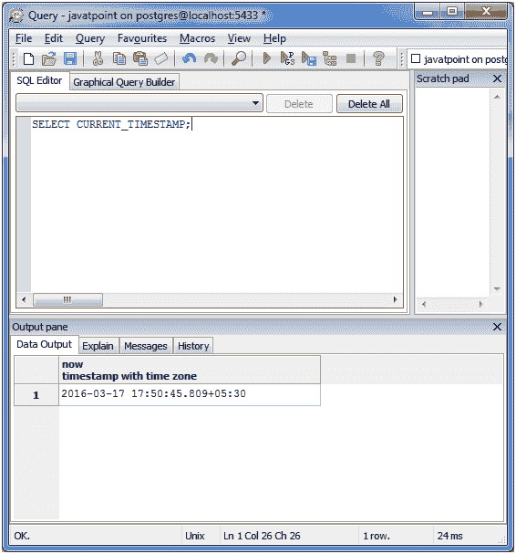
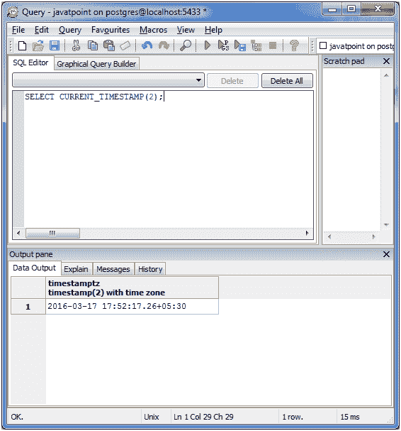
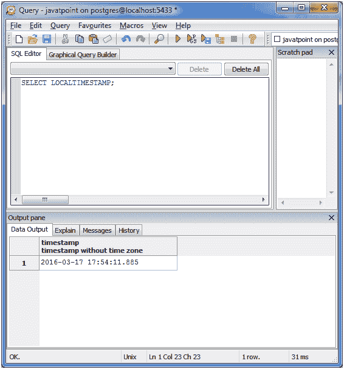

# 日期和时间函数

> 原文：<https://www.javatpoint.com/postgresql-date-time>

所有重要日期和时间相关功能的列表:

| 功能 | 描述 |
| 年龄() | 减去参数 |
| 当前日期/时间() | 它指定当前日期和时间。 |
| 日期 _ 零件() | 获取子字段(相当于提取) |
| EXTRACT() | 获取子字段。 |
| ISFINITE() | 测试有限的日期、时间和间隔(不是+/-无穷大) |
| 证明合法 | 调整间隔 |

* * *

## 年龄(时间戳，时间戳)&年龄(时间戳):

| 功能 | 描述 |
| 年龄(时间戳，时间戳) | 当与第二个参数的时间戳形式一起调用时，age()减去参数，产生一个“符号”结果，该结果使用年和月，类型为 interval。 |
| 年龄(时间戳) | 当仅使用时间戳作为参数调用时，age()从 current_date(午夜)中减去。 |

让我们举一个例子来检查 AGE(时间戳，时间戳)查询。

**见本例:**

按 Ctrl+E 打开查询页面。

**执行该查询:**

SELECT AGE(时间戳‘2016-01-26’，时间戳‘1947-08-15’)；

* * *

## 年龄(时间戳)函数的例子是:

它用来产生当前的年龄。

**执行以下查询:**

选择年龄(时间戳‘1947-08-15’)；

* * *

## 当前日期/时间()

下面是返回与当前日期和时间相关的值的函数列表。

| 功能 | 描述 |
| 当前日期 | 传递当前日期。 |
| 当前时间 | 按时区传递值。 |
| 当前时间戳 | 按时区传递值。 |
| 当前时间(精度) | 可选地接受一个精度参数，这将导致结果舍入到秒字段中的小数位数。 |
| 当前时间戳(精度) | 可选地接受一个精度参数，这将导致结果舍入到秒字段中的小数位数。 |
| LOCALTIME(本地时间) | 提供无时区的价值。 |
| local 时间戳 | 提供无时区的价值。 |
| 本地时间(precision) | 可选地接受一个精度参数，这将导致结果舍入到秒字段中的小数位数。 |
| 本地时间戳(精度) | 可选地接受一个精度参数，这将导致结果舍入到秒字段中的小数位数。 |

**现在，可以检查以下命令:**

**当前时间:**

选择当前时间；

**当前日期:**

选择当前日期；

**当前时间戳(日期和时间均为)**

选择当前时间戳；

**精度更高的当前时间戳:**

选择当前时间戳(2)；

**本地时间戳:**

选择本地时间戳；

* * *