# Psql 命令

> 原文：<https://www.javatpoint.com/psql-commands>

在本节中，我们将看到最常用的 **psql 命令**列表，这些命令帮助我们更快、更有效地从 PostgreSQL 数据库服务器查询数据。

在**[【SQL】](https://www.javatpoint.com/sql-tutorial)shell(psql)**中，我们有 n 个命令，但这里我们将讨论一些最常用的命令。

**连接 PostgreSQL 数据库**如果我们想要连接特定用户下的 PostgreSQL 数据库，我们将遵循以下流程:

首先，我们将打开**命令提示符**进入我们的本地系统，复制我们安装 PostgreSQL 的路径。

然后我们将使用下面的命令:

```

psql -d database -U user -W

```

一旦我们写下上述命令并按下**回车键**，则[邮政编码查询](https://www.javatpoint.com/postgresql-tutorial)将请求用户的密码。

**例如**

要连接到 **Postgres** 用户下的 **javatpoint** 数据库，我们使用以下命令:

```

C:\Program Files\PostgreSQL\12\bin>psql -d javatpoint -U postgres -W
Password:
Javatpoint=#

```

**输出**

如下图所示:

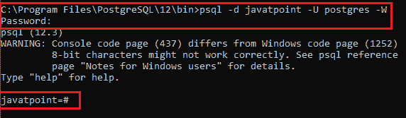

如果我们想连接到存在于另一台主机上的数据库，我们可以在上面的命令中添加 **-h** 选项:

```

psql -h host -d database -U user -W

```

在这种情况下，我们需要使用 **SSL 模式**进行连接，定义如下命令所示:

```

psql -U user -h host "dbname=db sslmode=require"

```

*   **切换到新数据库的连接**

一旦我们连接到一个数据库，我们就可以在用户指定的下切换到一个新的数据库。

```

\c database_name 

```

以上语句将连接到 **postgres** 用户下的 **javatpoint** 数据库:

```

postgres=# \c javatpoint

```

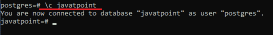

*   **列出可用的数据库**

要列出当前 PostgreSQL 数据库服务器中的所有数据库，我们将使用以下命令:

```

\l

```

**例如**

如果我们执行上面的命令，我们将获得下面的输出，以查看 PostgreSQL 中存在的现有数据库。

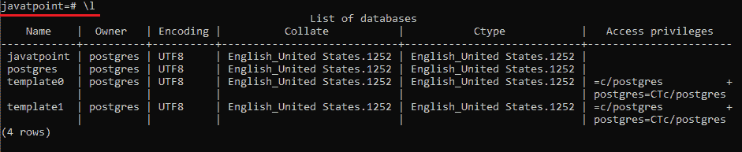

*   **列出可用表格**

要列出当前数据库中的所有表，我们将使用以下命令:

```

\dt

```

**例如**

如果我们执行上面的命令，我们将得到下面的输出，在这里我们可以看到 PostgreSQL 中存在的现有数据库。

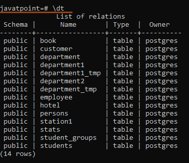

#### 注意:上面的命令只指定那些当前链接到数据库的表。

*   **描述一个表格**

下面的命令用于描述一个表，如类型、列、列的修饰符等。

```

\d table_name

```

**例如**假设我们有一个名为 **Station1** 的现有表，我们想借助上面的命令来描述它:

```

\d Station1

```

**输出**

执行上述命令后，我们将获得以下输出:

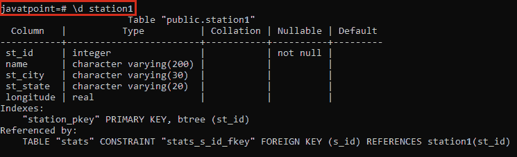

*   **列出可用功能**

我们可以使用以下命令查看现有数据库中可用的函数列表。

```

\df

```

**输出**

如果我们执行上面的命令，我们将得到下面的输出窗口:

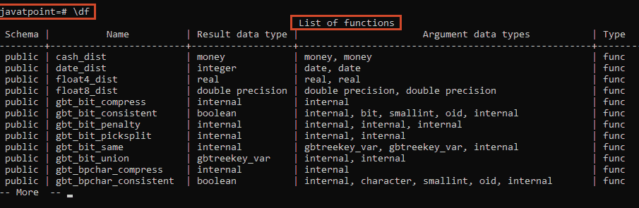

*   **列出可用模式**

下面的命令用于查看当前连接的数据库的所有模式的可用列表。

```

\dn

```

**输出**

执行上述命令后，我们将获得下面的输出窗口:

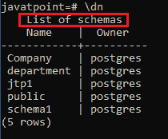

*   **列出用户及其角色**

在 psql 中，我们将使用以下命令列出所有用户及其分配的角色。

```

\du

```

**输出**

执行上述命令后，我们将获得下面的输出窗口:

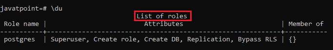

*   **列出可用视图**

我们将使用以下命令获取现有数据库中可用视图的列表。

```

\dv

```

**输出**

一旦我们实现了上面的命令，我们将得到下面的输出:

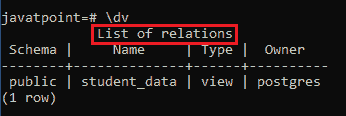

*   **执行之前的命令**

我们将使用下面命令中的 **version()函数**来恢复 PostgreSQL 服务器的现有版本。

```

SELECT version();

```

**输出**

一旦我们执行了上面的命令，我们将得到下面的输出:

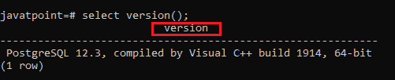

我们可以使用下面的命令来实现前面的命令，因为下面的命令将帮助我们在再次键入前面的命令时节省时间。

```

\g

```

**输出**

正如我们在下面的输出中看到的，与前面的命令相比，我们将得到相同的结果:

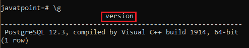

#### 注意:在 psql 中，我们可以再次执行前面的命令，也就是 SELECT 命令。

*   **从文件中执行 psql 命令**

在这种情况下，如果我们想从一个文件中实现 psql 命令，我们可以使用以下命令:

```

\i filename

```

*   **获取 psql 命令的帮助**

我们将使用以下命令来了解所有可用的 psql 命令。

```

\?

```

**输出**

执行上述命令后，我们将获得下面的输出窗口:

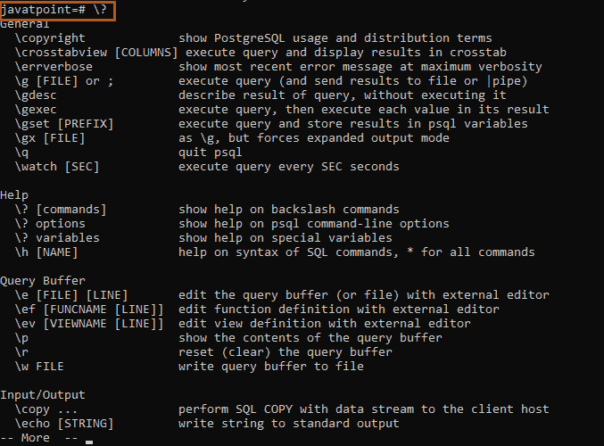

而且，我们可以使用下面的语句来获取特定 PostgreSQL 命令的帮助。

```

\h

```

**输出**

执行上述命令后，我们将获得下面的输出窗口:

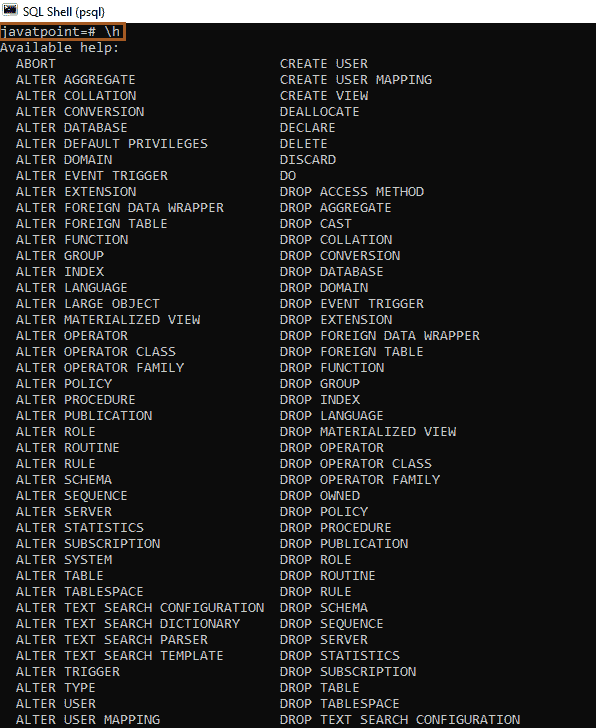

**例如**如果我们想了解 [ALTER TABLE](postgresql-alter-table) 命令的详细信息，我们将键入以下命令:

```

\h ALTER TABLE

```

**输出**

一旦我们执行了上面的命令，我们将得到下面的结果:

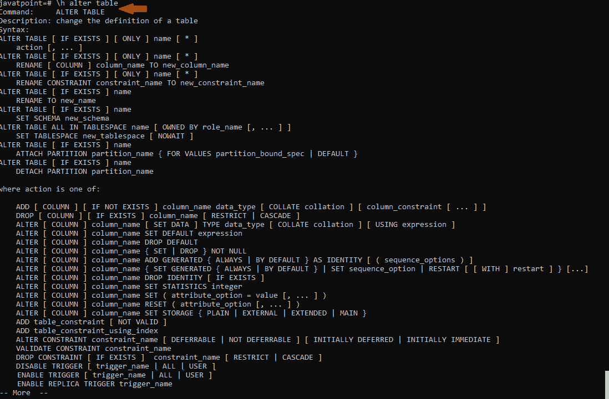

### 打开查询执行时间

我们将使用以下命令来打开查询执行时间。

```

\timing

```

**输出**

一旦我们执行了上面的命令，我们将得到下面的结果:

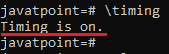

如果我们想查看 Station1 表中的计数，我们将使用下面的命令:

```

Select count(*) from station1; 

```

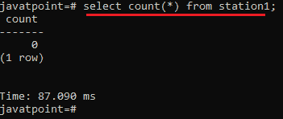

要关闭它，我们可以使用与上面相同的命令:

```

\timing

```

**输出**

从下面的输出中我们可以看到**计时关闭**。

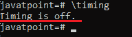

*   **编辑器中的编辑命令**

如果我们想在任何编辑器中编写该命令，我们将使用以下命令:

```

\e

```

**输出**

执行上述命令后，psql 将打开由我们的**编辑器环境**变量指定的**文本编辑器**，在这里我们可以编写任何命令，如下图所示:

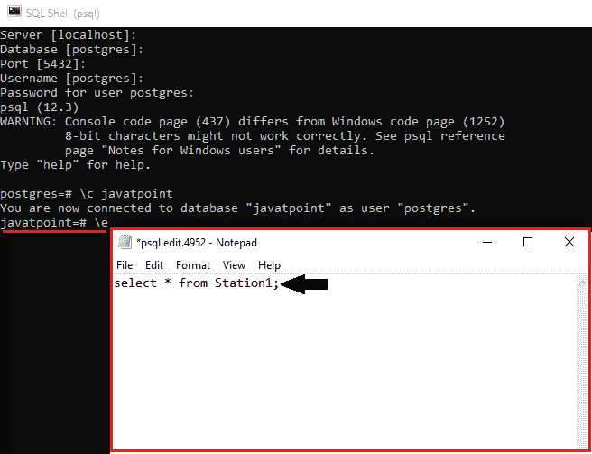

在编辑器中输入以下命令后，首先，我们将保存它，然后关闭编辑器。

```

Select * from Station1; 

```

关闭编辑器后，psql 将执行命令并返回输出，如下图所示:

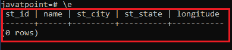

*   **退出 psql**

我们将使用下面的命令退出 psql，然后按任意键退出 psql。

```

\q

```

**输出**

一旦我们执行了上面的命令，我们将得到下面的输出:

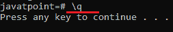

* * *